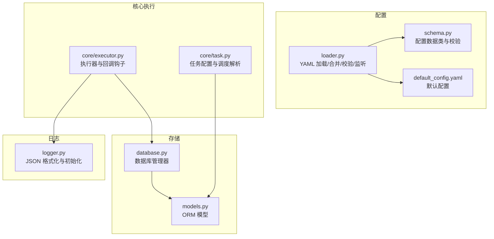
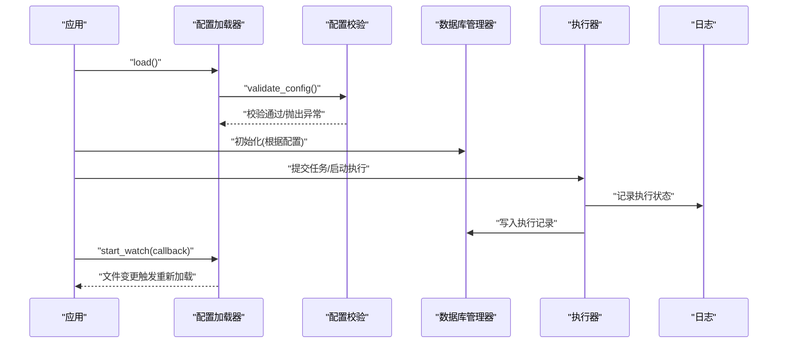
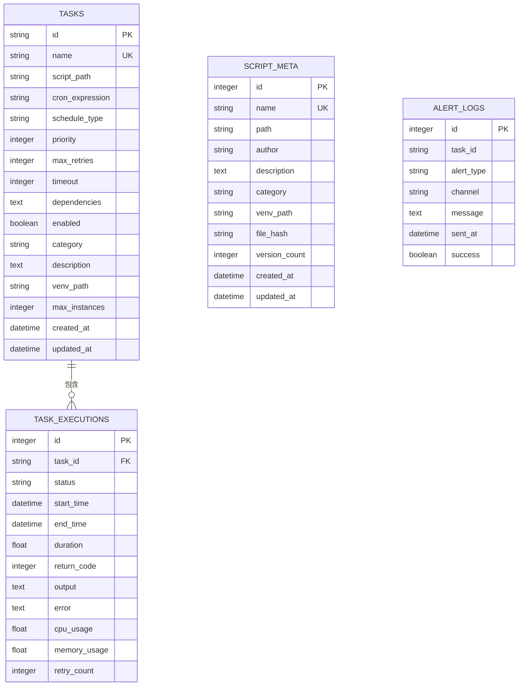
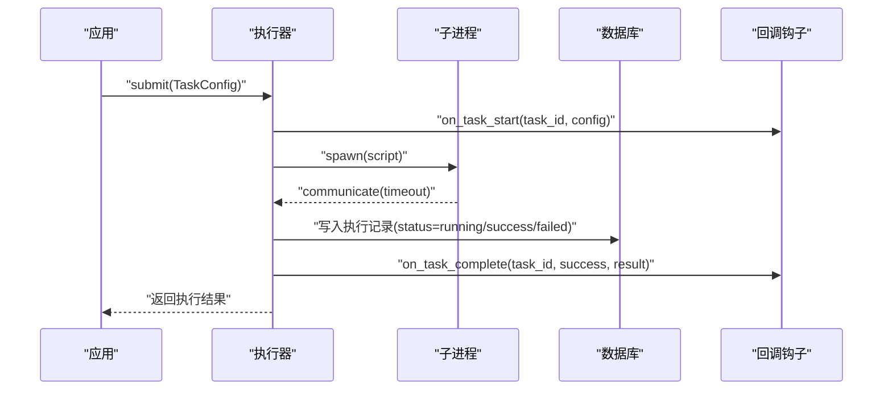
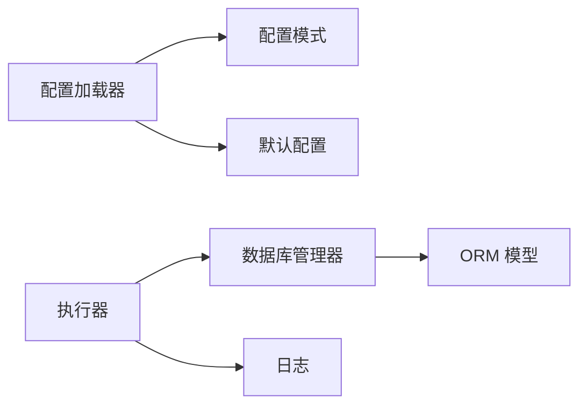

# API 参考

<cite>
**本文引用的文件**
- [src/pycronguard/__init__.py](file://src/pycronguard/__init__.py)
- [config/default_config.yaml](file://config/default_config.yaml)
- [src/pycronguard/config/schema.py](file://src/pycronguard/config/schema.py)
- [src/pycronguard/config/loader.py](file://src/pycronguard/config/loader.py)
- [src/pycronguard/storage/models.py](file://src/pycronguard/storage/models.py)
- [src/pycronguard/storage/database.py](file://src/pycronguard/storage/database.py)
- [src/pycronguard/logging/logger.py](file://src/pycronguard/logging/logger.py)
- [src/pycronguard/core/task.py](file://src/pycronguard/core/task.py)
- [src/pycronguard/core/executor.py](file://src/pycronguard/core/executor.py)
</cite>

## 目录
1. [简介](#简介)
2. [项目结构](#项目结构)
3. [核心组件](#核心组件)
4. [架构总览](#架构总览)
5. [详细组件分析](#详细组件分析)
6. [依赖分析](#依赖分析)
7. [性能考量](#性能考量)
8. [故障排查指南](#故障排查指南)
9. [结论](#结论)
10. [附录](#附录)

## 简介
本文件为 PyCronGuard 提供完整的 API 参考文档，覆盖配置 API、存储 API 与监控 API 的公共接口说明；同时给出配置模式的数据类定义、数据模型结构、异常类型与错误码、使用示例与最佳实践、版本兼容性与迁移建议，以及扩展与自定义 API 的指导原则。

## 项目结构
- 配置子系统：提供 YAML 配置加载、合并默认值、校验与文件监听能力。
- 存储子系统：基于 SQLAlchemy 的 ORM 模型与数据库管理器，提供 CRUD 接口。
- 日志子系统：提供 JSON 格式日志输出与日志初始化工具。
- 核心执行子系统：提供任务优先队列、并发控制、依赖检查、超时与取消、回调钩子等执行能力。
- 监控与恢复：预留扩展点，当前为空模块，便于后续接入。

图表来源
- [src/pycronguard/config/loader.py:83-204](file://src/pycronguard/config/loader.py#L83-L204)
- [src/pycronguard/config/schema.py:12-151](file://src/pycronguard/config/schema.py#L12-L151)
- [config/default_config.yaml:1-57](file://config/default_config.yaml#L1-L57)
- [src/pycronguard/storage/database.py:29-271](file://src/pycronguard/storage/database.py#L29-L271)
- [src/pycronguard/storage/models.py:15-131](file://src/pycronguard/storage/models.py#L15-L131)
- [src/pycronguard/logging/logger.py:18-159](file://src/pycronguard/logging/logger.py#L18-L159)
- [src/pycronguard/core/task.py:23-281](file://src/pycronguard/core/task.py#L23-L281)
- [src/pycronguard/core/executor.py:50-463](file://src/pycronguard/core/executor.py#L50-L463)

章节来源
- [src/pycronguard/config/loader.py:83-204](file://src/pycronguard/config/loader.py#L83-L204)
- [src/pycronguard/config/schema.py:12-151](file://src/pycronguard/config/schema.py#L12-L151)
- [config/default_config.yaml:1-57](file://config/default_config.yaml#L1-L57)
- [src/pycronguard/storage/database.py:29-271](file://src/pycronguard/storage/database.py#L29-L271)
- [src/pycronguard/storage/models.py:15-131](file://src/pycronguard/storage/models.py#L15-L131)
- [src/pycronguard/logging/logger.py:18-159](file://src/pycronguard/logging/logger.py#L18-L159)
- [src/pycronguard/core/task.py:23-281](file://src/pycronguard/core/task.py#L23-L281)
- [src/pycronguard/core/executor.py:50-463](file://src/pycronguard/core/executor.py#L50-L463)

## 核心组件
- 配置 API：负责从 YAML 加载配置、合并默认值、路径展开、校验与文件监听。
- 存储 API：封装 SQLAlchemy 会话、事务与各模型的 CRUD 方法。
- 监控 API：通过执行器回调钩子暴露任务开始/完成事件，便于外部接入监控。
- 日志 API：提供 JSON 格式化与日志初始化，支持按天轮转与保留策略。

章节来源
- [src/pycronguard/config/loader.py:83-204](file://src/pycronguard/config/loader.py#L83-L204)
- [src/pycronguard/storage/database.py:29-271](file://src/pycronguard/storage/database.py#L29-L271)
- [src/pycronguard/core/executor.py:50-185](file://src/pycronguard/core/executor.py#L50-L185)
- [src/pycronguard/logging/logger.py:90-159](file://src/pycronguard/logging/logger.py#L90-L159)

## 架构总览
下图展示配置、存储、日志与执行器之间的交互关系与数据流。

图表来源
- [src/pycronguard/config/loader.py:100-141](file://src/pycronguard/config/loader.py#L100-L141)
- [src/pycronguard/config/schema.py:107-151](file://src/pycronguard/config/schema.py#L107-L151)
- [src/pycronguard/storage/database.py:29-68](file://src/pycronguard/storage/database.py#L29-L68)
- [src/pycronguard/core/executor.py:265-411](file://src/pycronguard/core/executor.py#L265-L411)
- [src/pycronguard/logging/logger.py:90-159](file://src/pycronguard/logging/logger.py#L90-L159)

## 详细组件分析

### 配置 API
- 功能概述
  - 从 YAML 文件加载配置，与默认配置进行递归合并。
  - 将字典转换为强类型的配置对象，包含嵌套数据类。
  - 展开路径中的波浪号，确保路径可用。
  - 执行基础校验，对非法值抛出异常。
  - 支持文件变更监听，回调通知应用重新加载配置。
- 公共接口
  - ConfigLoader.load()：返回已合并与校验后的 AppConfig 实例。
  - ConfigLoader.start_watch(callback)：启动文件监听，变更时回调传入新配置。
  - ConfigLoader.stop_watch()：停止监听。
- 配置模式数据类（字段类型、默认值与校验规则）
  - AppConfig：顶层配置容器，包含 scheduler、storage、log、alert、recovery、script、pid_file。
  - SchedulerConfig：max_workers、max_instances、timezone。
  - StorageConfig：db_path。
  - LogConfig：log_dir、level、max_days、json_format。
  - AlertConfig：email（AlertEmailConfig）、failure_immediate、consecutive_failure_threshold、cooldown_seconds。
  - AlertEmailConfig：enabled、smtp_host、smtp_port、use_tls、username、password、sender、recipients。
  - RecoveryConfig：max_retries、retry_delay、backoff_factor、health_check_interval、cpu_threshold、memory_threshold、disk_threshold、task_timeout。
  - ScriptConfig：script_dir、version_dir、max_versions。
  - 校验规则要点
    - 数值范围：workers/instances≥1；log.max_days≥1；recovery.*非负且阈值在[0,100]；thresholds≥1；cooldown≥0；max_versions≥1。
    - 日志级别必须为“DEBUG/INFO/WARNING/ERROR/CRITICAL”之一。
    - 启用邮件告警时，需提供 SMTP 主机与收件人列表。
- 异常与错误码
  - 校验阶段抛出 ValueError，错误信息描述具体违规项。
  - 文件监听中若加载失败，记录警告但不中断运行。
- 使用示例与最佳实践
  - 在应用启动时调用 load() 获取配置，并在需要时调用 start_watch(callback) 实现热更新。
  - 对于路径字段，建议使用相对用户目录的波浪号形式，由加载器自动展开。
  - 邮件告警启用时务必提供完整凭据与收件人列表。
- 版本兼容性与迁移
  - 新增字段时保持默认值向后兼容；移除字段应提供迁移提示并在未来版本移除。
  - 若出现校验失败，依据错误信息修正配置。

章节来源
- [src/pycronguard/config/loader.py:83-204](file://src/pycronguard/config/loader.py#L83-L204)
- [src/pycronguard/config/schema.py:86-151](file://src/pycronguard/config/schema.py#L86-L151)
- [config/default_config.yaml:1-57](file://config/default_config.yaml#L1-L57)

### 存储 API
- 功能概述
  - 初始化 SQLite 数据库并创建表。
  - 提供带事务语义的会话上下文管理。
  - 针对 TaskRecord、TaskExecution、ScriptMeta、AlertLog 提供 CRUD 方法。
- 公共接口
  - DatabaseManager.get_session()：上下文管理器，自动提交或回滚。
  - 任务相关：add_task、get_task、get_task_by_name、list_tasks、update_task、delete_task。
  - 执行记录：add_execution、get_latest_execution、list_executions。
  - 脚本元数据：add_script_meta、get_script_meta、list_script_metas、update_script_meta、delete_script_meta。
  - 告警日志：add_alert_log、list_alert_logs。
- 数据模型结构
  - 任务表 tasks：主键 id（UUID 字符串），唯一 name，脚本路径、表达式、类型、优先级、重试、超时、依赖、启用标志、分类、描述、虚拟环境、最大并发实例、创建/更新时间。
  - 执行表 task_executions：主键 id（自增整数），外键 task_id，状态、起止时间、耗时、返回码、输出、错误、CPU/内存使用、重试计数。
  - 脚本元数据表 script_meta：主键 id（自增整数），唯一 name，路径、作者、描述、分类、虚拟环境、文件哈希、版本计数、创建/更新时间。
  - 告警日志表 alert_logs：主键 id（自增整数），可空 task_id，告警类型（failure/consecutive_failure/performance）、通道（email）、消息、发送时间、成功标记。
- 索引与约束
  - tasks.name 唯一；tasks.id 主键；task_executions.task_id 外键关联 tasks.id；alert_logs.task_id 可空。
- 异常与错误码
  - 会话异常自动回滚并上抛；查询不到记录时返回 None。
- 使用示例与最佳实践
  - 使用 get_session() 上下文保证事务一致性；批量操作建议合并为一次事务。
  - 查询最近执行记录时限制数量，避免一次性读取过多。
- 版本兼容性与迁移
  - 新增列时注意默认值与非空约束；删除列需迁移数据或提供迁移脚本。

图表来源
- [src/pycronguard/storage/models.py:19-131](file://src/pycronguard/storage/models.py#L19-L131)

章节来源
- [src/pycronguard/storage/database.py:29-271](file://src/pycronguard/storage/database.py#L29-L271)
- [src/pycronguard/storage/models.py:19-131](file://src/pycronguard/storage/models.py#L19-L131)

### 监控 API
- 功能概述
  - 通过执行器的回调钩子暴露任务生命周期事件：开始与完成。
  - 外部模块可注册回调以接入监控系统。
- 公共接口
  - TaskExecutor.on_task_start：任务开始前回调，参数为 task_id 与 TaskConfig。
  - TaskExecutor.on_task_complete：任务完成后回调，参数为 task_id、成功标志与结果。
  - TaskExecutor.submit()：提交任务至优先队列，内部进行并发与依赖检查。
  - TaskExecutor.get_running_tasks()：获取正在运行的任务快照。
  - TaskExecutor.cancel_task(task_id)：取消运行中的任务（终止子进程）。
  - TaskExecutor.shutdown(wait)：关闭执行器。
- 使用示例与最佳实践
  - 在回调中记录指标、上报状态、触发告警。
  - 对高优先级任务设置较低超时与合理重试策略。
  - 依赖链较长时，建议在数据库中预置依赖任务的成功执行记录以满足依赖检查。
- 异常与错误码
  - 任务超时：记录超时并尝试终止子进程。
  - 子进程异常：捕获异常并记录失败执行记录。
  - 取消任务：若进程已结束则返回未找到状态。

图表来源
- [src/pycronguard/core/executor.py:83-185](file://src/pycronguard/core/executor.py#L83-L185)
- [src/pycronguard/core/executor.py:265-411](file://src/pycronguard/core/executor.py#L265-L411)

章节来源
- [src/pycronguard/core/executor.py:50-185](file://src/pycronguard/core/executor.py#L50-L185)

### 日志 API
- 功能概述
  - 提供 JSON 格式化器，将日志记录序列化为 JSON 字符串。
  - 初始化根日志器：按天轮转、保留指定天数、控制台输出。
- 公共接口
  - JsonFormatter.format(record)：格式化单条日志记录。
  - setup_logging(log_dir, level, max_days, json_format)：配置根日志器。
  - get_logger(name)：获取命名日志器。
- 使用示例与最佳实践
  - 生产环境建议开启 JSON 输出以便集中采集。
  - 控制台与文件双通道输出，避免重复添加处理器。
- 异常与错误码
  - 格式化异常会被捕获并记录到日志中，不影响主流程。

章节来源
- [src/pycronguard/logging/logger.py:18-159](file://src/pycronguard/logging/logger.py#L18-L159)

## 依赖分析
- 组件耦合
  - 执行器依赖数据库管理器进行依赖检查与执行记录写入。
  - 配置加载器依赖配置模式与默认配置文件。
  - 存储层依赖 SQLAlchemy ORM 与 SQLite 引擎。
- 外部依赖
  - YAML 解析与文件监听（watchdog）用于配置热更新。
  - SQLAlchemy 2.x 用于 ORM 映射与会话管理。
  - 标准库 subprocess、threading、concurrent.futures 用于执行与并发控制。

图表来源
- [src/pycronguard/config/loader.py:20-31](file://src/pycronguard/config/loader.py#L20-L31)
- [src/pycronguard/core/executor.py:23-25](file://src/pycronguard/core/executor.py#L23-L25)
- [src/pycronguard/storage/database.py:18-24](file://src/pycronguard/storage/database.py#L18-L24)

章节来源
- [src/pycronguard/config/loader.py:20-31](file://src/pycronguard/config/loader.py#L20-L31)
- [src/pycronguard/core/executor.py:23-25](file://src/pycronguard/core/executor.py#L23-L25)
- [src/pycronguard/storage/database.py:18-24](file://src/pycronguard/storage/database.py#L18-L24)

## 性能考量
- 并发与队列
  - 使用线程池与信号量控制并发度，优先队列按优先级调度。
  - 建议根据 CPU 核心数与 I/O 特性调整 max_workers。
- I/O 与数据库
  - 事务内批量写入，减少锁竞争；查询限制返回数量。
  - 执行记录截断输出与错误文本长度，避免过大日志。
- 超时与取消
  - 为每个任务设置合理超时；超时后终止子进程并记录失败。
- 日志
  - JSON 输出利于异步采集；按天轮转避免单文件过大。

## 故障排查指南
- 配置问题
  - 校验失败：检查数值范围、日志级别、阈值区间与邮件告警必需字段。
  - 路径无效：确认波浪号展开后的实际路径存在且可访问。
- 存储问题
  - 表不存在：首次初始化会自动建表；若权限不足请检查目录权限。
  - 查询无结果：确认主键/唯一键是否正确；检查过滤条件。
- 执行问题
  - 任务未执行：检查并发上限、依赖是否满足、调度表达式是否有效。
  - 任务超时：提高超时阈值或优化脚本性能。
  - 取消失败：确认任务确实在运行且子进程存在。
- 日志问题
  - JSON 输出异常：检查自定义附加字段是否可序列化。
  - 文件轮转失败：确认日志目录权限与磁盘空间。

章节来源
- [src/pycronguard/config/schema.py:107-151](file://src/pycronguard/config/schema.py#L107-L151)
- [src/pycronguard/storage/database.py:29-68](file://src/pycronguard/storage/database.py#L29-L68)
- [src/pycronguard/core/executor.py:146-185](file://src/pycronguard/core/executor.py#L146-L185)
- [src/pycronguard/logging/logger.py:90-159](file://src/pycronguard/logging/logger.py#L90-L159)

## 结论
本参考文档梳理了 PyCronGuard 的配置、存储与监控 API，明确了数据类定义、模型结构、异常处理与最佳实践。通过合理的并发控制、数据库事务与日志策略，可在生产环境中稳定运行。建议在扩展新功能时遵循现有数据类与接口风格，确保一致的配置与存储契约。

## 附录

### 配置模式数据类定义（字段类型、默认值与校验）
- AppConfig
  - scheduler: SchedulerConfig，默认值来自 SchedulerConfig。
  - storage: StorageConfig，默认值来自 StorageConfig。
  - log: LogConfig，默认值来自 LogConfig。
  - alert: AlertConfig，默认值来自 AlertConfig。
  - recovery: RecoveryConfig，默认值来自 RecoveryConfig。
  - script: ScriptConfig，默认值来自 ScriptConfig。
  - pid_file: 字符串，默认值见默认配置。
- SchedulerConfig
  - max_workers: 整数，默认 4；校验 ≥1。
  - max_instances: 整数，默认 1；校验 ≥1。
  - timezone: 字符串，默认“Asia/Shanghai”。
- StorageConfig
  - db_path: 字符串，默认“~/.pycronguard/data.db”。
- LogConfig
  - log_dir: 字符串，默认“~/.pycronguard/logs”。
  - level: 字符串，默认“INFO”，允许值集合：{"DEBUG","INFO","WARNING","ERROR","CRITICAL"}。
  - max_days: 整数，默认 30；校验 ≥1。
  - json_format: 布尔，默认 True。
- AlertConfig
  - email: AlertEmailConfig，默认值来自 AlertEmailConfig。
  - failure_immediate: 布尔，默认 True。
  - consecutive_failure_threshold: 整数，默认 3；校验 ≥1。
  - cooldown_seconds: 整数，默认 300；校验 ≥0。
- AlertEmailConfig
  - enabled: 布尔，默认 False。
  - smtp_host: 字符串，默认空；启用时必填。
  - smtp_port: 整数，默认 587。
  - use_tls: 布尔，默认 True。
  - username: 字符串，默认空。
  - password: 字符串，默认空。
  - sender: 字符串，默认空。
  - recipients: 列表字符串，默认空列表；启用时必填。
- RecoveryConfig
  - max_retries: 整数，默认 3；校验 ≥0。
  - retry_delay: 浮点，默认 10.0；校验 ≥0。
  - backoff_factor: 浮点，默认 2.0；校验 ≥1.0。
  - health_check_interval: 整数，默认 60。
  - cpu_threshold: 浮点，默认 90.0；校验 ∈[0,100]。
  - memory_threshold: 浮点，默认 90.0；校验 ∈[0,100]。
  - disk_threshold: 浮点，默认 90.0；校验 ∈[0,100]。
  - task_timeout: 整数，默认 3600；校验 ≥1。
- ScriptConfig
  - script_dir: 字符串，默认“~/.pycronguard/scripts”。
  - version_dir: 字符串，默认“~/.pycronguard/script_versions”。
  - max_versions: 整数，默认 10；校验 ≥1。

章节来源
- [src/pycronguard/config/schema.py:12-151](file://src/pycronguard/config/schema.py#L12-L151)
- [config/default_config.yaml:1-57](file://config/default_config.yaml#L1-L57)

### 数据模型字段与约束
- tasks
  - id: 主键（UUID 字符串），默认生成。
  - name: 唯一（UK），非空。
  - script_path: 非空。
  - cron_expression: 可空。
  - schedule_type: 可空，注释说明取值范围。
  - priority: 默认 5。
  - max_retries: 默认 3。
  - timeout: 默认 3600。
  - dependencies: 可空，JSON 序列化数组。
  - enabled: 默认 True。
  - category/description/venv_path: 可空。
  - max_instances: 默认 1。
  - created_at/updated_at: 自动维护。
- task_executions
  - id: 主键（自增整数）。
  - task_id: 外键（FK）指向 tasks.id，非空。
  - status: 默认 pending，枚举值：pending/running/success/failed。
  - start_time/end_time: 可空。
  - duration: 可空（秒）。
  - return_code: 可空。
  - output/error: 可空，文本字段。
  - cpu_usage/memory_usage: 可空。
  - retry_count: 默认 0。
- script_meta
  - id: 主键（自增整数）。
  - name: 唯一（UK），非空。
  - path: 非空。
  - author/description/category/venv_path: 可空。
  - file_hash: 可空。
  - version_count: 默认 0。
  - created_at/updated_at: 自动维护。
- alert_logs
  - id: 主键（自增整数）。
  - task_id: 可空。
  - alert_type: 非空，注释说明取值范围。
  - channel: 非空，注释说明取值范围。
  - message: 可空。
  - sent_at: 默认服务器时间。
  - success: 默认 True。

章节来源
- [src/pycronguard/storage/models.py:19-131](file://src/pycronguard/storage/models.py#L19-L131)

### 异常类型与错误码
- 配置校验
  - 类型：ValueError
  - 触发场景：数值越界、日志级别非法、阈值越界、启用邮件告警缺少必要字段。
- 执行器
  - 任务超时：记录超时并终止子进程。
  - 子进程异常：捕获异常并记录失败执行记录。
  - 取消失败：进程已结束或未找到。
- 存储
  - 会话异常：自动回滚并上抛；查询不到记录返回 None。

章节来源
- [src/pycronguard/config/schema.py:107-151](file://src/pycronguard/config/schema.py#L107-L151)
- [src/pycronguard/core/executor.py:329-411](file://src/pycronguard/core/executor.py#L329-L411)
- [src/pycronguard/storage/database.py:52-68](file://src/pycronguard/storage/database.py#L52-L68)

### API 使用示例与最佳实践
- 配置
  - 加载与校验：调用 load() 获取 AppConfig；如需热更新，调用 start_watch(callback)。
  - 路径展开：使用波浪号表示用户目录，由加载器自动展开。
- 存储
  - 事务：使用 get_session() 上下文；批量写入减少事务次数。
  - 查询：限制返回数量，避免全表扫描。
- 执行
  - 回调：注册 on_task_start/on_task_complete 记录指标与告警。
  - 取消：cancel_task(task_id) 仅对正在运行的任务有效。
- 日志
  - JSON 输出：setup_logging(json_format=True)。
  - 轮转：按天轮转，保留 max_days 天。

章节来源
- [src/pycronguard/config/loader.py:100-141](file://src/pycronguard/config/loader.py#L100-L141)
- [src/pycronguard/storage/database.py:52-68](file://src/pycronguard/storage/database.py#L52-L68)
- [src/pycronguard/core/executor.py:146-185](file://src/pycronguard/core/executor.py#L146-L185)
- [src/pycronguard/logging/logger.py:90-159](file://src/pycronguard/logging/logger.py#L90-L159)

### 版本兼容性与迁移指南
- 版本号：参见包元数据。
- 迁移建议
  - 新增配置字段：提供默认值，保持向后兼容。
  - 移除配置字段：先在旧版本记录迁移提示，未来版本移除。
  - 数据库变更：新增列需提供迁移脚本；删除列需迁移数据或提供清理逻辑。
- 安全考虑
  - 邮件告警凭据：避免硬编码，建议通过环境变量或密钥管理服务注入。
  - 脚本路径与虚拟环境：严格校验与权限控制，防止路径穿越。

章节来源
- [src/pycronguard/__init__.py:1-4](file://src/pycronguard/__init__.py#L1-L4)

### 扩展与自定义 API 指导
- 配置扩展
  - 新增子系统配置：定义新的数据类并在 AppConfig 中聚合；提供默认值与校验规则。
  - 文件监听：沿用 ConfigLoader 的监听机制，确保回调中重新合并与校验配置。
- 存储扩展
  - 新增模型：继承 Base，定义表名与字段，创建外键与索引；在 DatabaseManager 中补充 CRUD 方法。
  - 迁移：提供 Alembic 或自定义迁移脚本，确保数据完整性。
- 执行扩展
  - 回调钩子：利用 on_task_start/on_task_complete 注入监控、告警与审计。
  - 依赖检查：通过 DatabaseManager.get_latest_execution 实现跨任务依赖。
- 日志扩展
  - 自定义格式化器：继承 Formatter 或使用现有 JsonFormatter。
  - 多处理器：按需添加额外处理器（如 HTTP/UDP）。

章节来源
- [src/pycronguard/config/schema.py:86-151](file://src/pycronguard/config/schema.py#L86-L151)
- [src/pycronguard/storage/database.py:29-271](file://src/pycronguard/storage/database.py#L29-L271)
- [src/pycronguard/core/executor.py:74-76](file://src/pycronguard/core/executor.py#L74-L76)