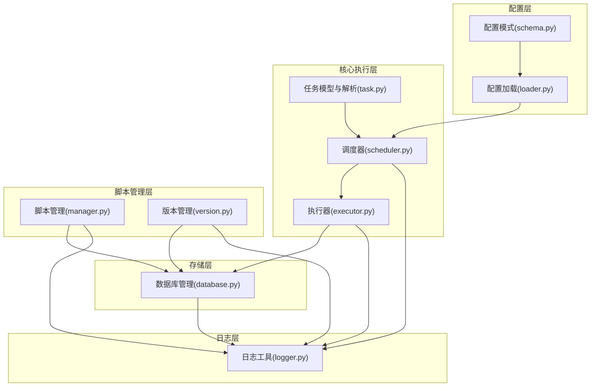
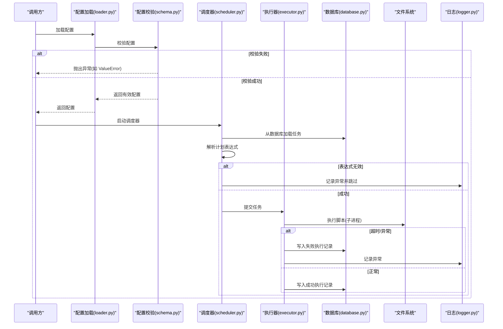
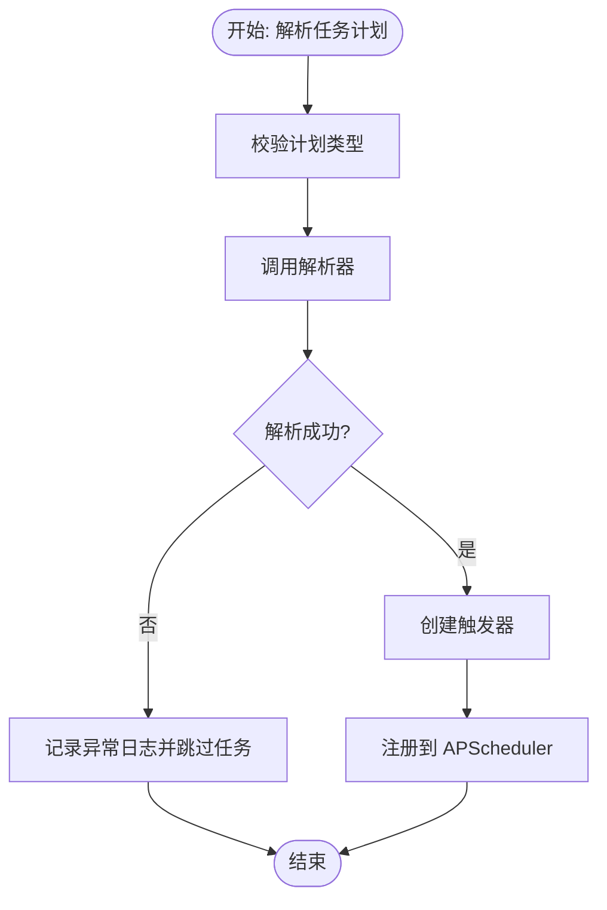
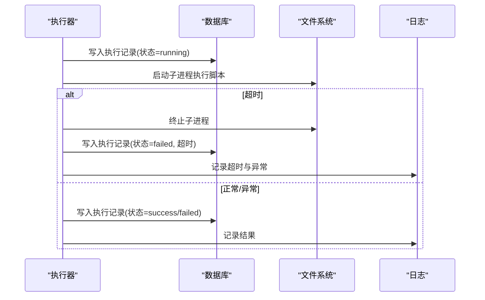
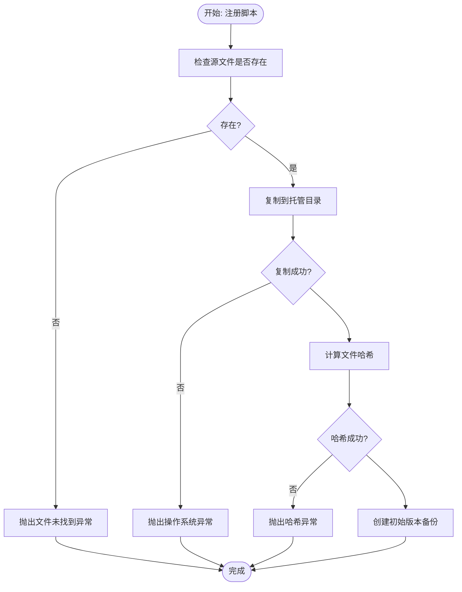
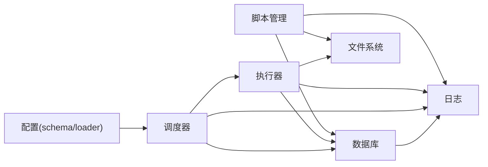

# 异常处理

<cite>
**本文引用的文件**
- [src/pycronguard/config/schema.py](file://src/pycronguard/config/schema.py)
- [src/pycronguard/config/loader.py](file://src/pycronguard/config/loader.py)
- [src/pycronguard/core/task.py](file://src/pycronguard/core/task.py)
- [src/pycronguard/core/scheduler.py](file://src/pycronguard/core/scheduler.py)
- [src/pycronguard/core/executor.py](file://src/pycronguard/core/executor.py)
- [src/pycronguard/scripts/manager.py](file://src/pycronguard/scripts/manager.py)
- [src/pycronguard/scripts/version.py](file://src/pycronguard/scripts/version.py)
- [src/pycronguard/storage/database.py](file://src/pycronguard/storage/database.py)
- [src/pycronguard/logging/logger.py](file://src/pycronguard/logging/logger.py)
</cite>

## 目录
1. [简介](#简介)
2. [项目结构](#项目结构)
3. [核心组件](#核心组件)
4. [架构总览](#架构总览)
5. [详细组件分析](#详细组件分析)
6. [依赖分析](#依赖分析)
7. [性能考虑](#性能考虑)
8. [故障排查指南](#故障排查指南)
9. [结论](#结论)
10. [附录](#附录)

## 简介
本文件为 PyCronGuard 的异常处理 API 参考文档，覆盖配置相关异常、数据库操作异常、调度器异常与脚本文件系统异常的定义、触发条件、错误消息格式与处理建议，并提供最佳实践（异常链传递、日志记录、用户友好提示）、错误码与状态管理机制说明，以及常见异常场景的处理示例与调试技巧。目标是帮助开发者在配置验证、数据库连接、任务执行与脚本版本管理等环节中，建立一致、可追踪且可恢复的异常处理策略。

## 项目结构
围绕异常处理的关键模块与职责如下：
- 配置层：负责配置加载、合并与校验，校验失败时抛出标准异常。
- 核心执行层：调度器与执行器负责任务生命周期与子进程执行，异常通过日志与回写数据库进行可观测性保障。
- 脚本管理层：负责脚本注册、更新、扫描与版本备份，涉及文件系统与数据库交互，可能抛出文件系统与数据库相关异常。
- 存储层：封装数据库会话与 CRUD 操作，异常通过回滚与重新抛出保证一致性。
- 日志层：统一输出格式，便于异常上下文收集与检索。

**图表来源**
- [src/pycronguard/config/schema.py:107-151](file://src/pycronguard/config/schema.py#L107-L151)
- [src/pycronguard/config/loader.py:100-116](file://src/pycronguard/config/loader.py#L100-L116)
- [src/pycronguard/core/task.py:78-123](file://src/pycronguard/core/task.py#L78-L123)
- [src/pycronguard/core/scheduler.py:30-83](file://src/pycronguard/core/scheduler.py#L30-L83)
- [src/pycronguard/core/executor.py:50-85](file://src/pycronguard/core/executor.py#L50-L85)
- [src/pycronguard/scripts/manager.py:23-48](file://src/pycronguard/scripts/manager.py#L23-L48)
- [src/pycronguard/scripts/version.py:52-72](file://src/pycronguard/scripts/version.py#L52-L72)
- [src/pycronguard/storage/database.py:29-46](file://src/pycronguard/storage/database.py#L29-L46)
- [src/pycronguard/logging/logger.py:90-147](file://src/pycronguard/logging/logger.py#L90-L147)

**章节来源**
- [src/pycronguard/config/schema.py:107-151](file://src/pycronguard/config/schema.py#L107-L151)
- [src/pycronguard/config/loader.py:100-116](file://src/pycronguard/config/loader.py#L100-L116)
- [src/pycronguard/core/task.py:78-123](file://src/pycronguard/core/task.py#L78-L123)
- [src/pycronguard/core/scheduler.py:30-83](file://src/pycronguard/core/scheduler.py#L30-L83)
- [src/pycronguard/core/executor.py:50-85](file://src/pycronguard/core/executor.py#L50-L85)
- [src/pycronguard/scripts/manager.py:23-48](file://src/pycronguard/scripts/manager.py#L23-L48)
- [src/pycronguard/scripts/version.py:52-72](file://src/pycronguard/scripts/version.py#L52-L72)
- [src/pycronguard/storage/database.py:29-46](file://src/pycronguard/storage/database.py#L29-L46)
- [src/pycronguard/logging/logger.py:90-147](file://src/pycronguard/logging/logger.py#L90-L147)

## 核心组件
本节概述各模块中与异常处理相关的职责与行为：
- 配置校验：在配置加载后调用校验函数，若参数越界或不合法则抛出标准异常；该异常由上层捕获并转换为用户可读的错误信息。
- 调度器：在解析任务计划表达式失败时记录异常并跳过该任务；暂停/恢复任务时捕获异常并记录日志。
- 执行器：在任务执行过程中捕获异常、记录失败执行记录、释放资源并回调钩子；超时处理与子进程终止均记录日志。
- 脚本管理：注册/更新/扫描/备份/恢复等操作中对文件系统与数据库进行访问，遇到缺失或权限问题时抛出相应异常并记录日志。
- 数据库管理：通过事务上下文管理会话，异常时回滚并重新抛出，确保数据一致性。
- 日志工具：统一 JSON/文本格式输出，便于异常上下文采集与检索。

**章节来源**
- [src/pycronguard/config/schema.py:107-151](file://src/pycronguard/config/schema.py#L107-L151)
- [src/pycronguard/core/scheduler.py:312-327](file://src/pycronguard/core/scheduler.py#L312-L327)
- [src/pycronguard/core/executor.py:376-395](file://src/pycronguard/core/executor.py#L376-L395)
- [src/pycronguard/scripts/manager.py:84-98](file://src/pycronguard/scripts/manager.py#L84-L98)
- [src/pycronguard/storage/database.py:60-68](file://src/pycronguard/storage/database.py#L60-L68)
- [src/pycronguard/logging/logger.py:90-147](file://src/pycronguard/logging/logger.py#L90-L147)

## 架构总览
下图展示了异常在系统中的传播路径与处理策略：

**图表来源**
- [src/pycronguard/config/loader.py:100-116](file://src/pycronguard/config/loader.py#L100-L116)
- [src/pycronguard/config/schema.py:107-151](file://src/pycronguard/config/schema.py#L107-L151)
- [src/pycronguard/core/scheduler.py:312-327](file://src/pycronguard/core/scheduler.py#L312-L327)
- [src/pycronguard/core/executor.py:328-395](file://src/pycronguard/core/executor.py#L328-L395)
- [src/pycronguard/storage/database.py:29-46](file://src/pycronguard/storage/database.py#L29-L46)
- [src/pycronguard/logging/logger.py:90-147](file://src/pycronguard/logging/logger.py#L90-L147)

## 详细组件分析

### 配置相关异常
- 触发条件
  - 线程池并发数小于 1、实例数小于 1。
  - 日志级别不在允许集合内、日志保留天数小于 1。
  - 恢复重试次数、延迟、退避因子、任务超时越界。
  - 健康检查阈值不在 0–100 范围。
  - 连续失败阈值小于 1、冷却时间小于 0。
  - 脚本最大版本数小于 1。
  - 启用邮件告警但未提供 SMTP 主机或收件人列表。
- 错误消息格式
  - 统一采用标准异常类型与清晰的描述性字符串，便于上层捕获与翻译。
- 处理建议
  - 在应用启动阶段集中捕获并转译为用户可读的配置错误提示。
  - 对于邮件告警，建议在启用前进行连通性预检。
- 最佳实践
  - 使用异常链传递原始错误，保留上下文栈以便定位。
  - 将异常信息写入日志并返回统一的错误响应码。

**章节来源**
- [src/pycronguard/config/schema.py:107-151](file://src/pycronguard/config/schema.py#L107-L151)

### 调度器异常
- 触发条件
  - 任务计划表达式解析失败（未知类型、格式错误、取值越界）。
  - 暂停/恢复任务时 APScheduler 抛出异常。
- 错误消息格式
  - 记录包含任务 ID、名称、计划类型与表达式的异常日志。
- 处理建议
  - 解析失败时跳过该任务并记录警告，避免影响其他任务。
  - 对外部控制台操作（暂停/恢复）捕获异常并记录，保持系统可用性。
- 最佳实践
  - 在热重载时对单个任务的解析失败进行隔离处理。
  - 使用异常链记录原始解析错误，便于诊断。

**图表来源**
- [src/pycronguard/core/scheduler.py:312-327](file://src/pycronguard/core/scheduler.py#L312-L327)
- [src/pycronguard/core/task.py:78-123](file://src/pycronguard/core/task.py#L78-L123)

**章节来源**
- [src/pycronguard/core/scheduler.py:168-184](file://src/pycronguard/core/scheduler.py#L168-L184)
- [src/pycronguard/core/scheduler.py:256-259](file://src/pycronguard/core/scheduler.py#L256-L259)
- [src/pycronguard/core/task.py:78-123](file://src/pycronguard/core/task.py#L78-L123)

### 执行器异常
- 触发条件
  - 子进程执行超时，记录超时并尝试终止。
  - 任务执行期间发生未预期异常，记录失败并回写数据库。
  - 回调钩子抛出异常，不影响主流程但记录日志。
- 错误消息格式
  - 包含任务 ID、耗时、返回码、标准输出/错误片段等上下文。
- 处理建议
  - 超时后强制终止子进程并清理运行态记录。
  - 将异常结果写入数据库，确保可观测性。
- 最佳实践
  - 使用 finally 保证资源释放与队列推进。
  - 对外暴露统一的错误码映射，便于监控系统识别。

**图表来源**
- [src/pycronguard/core/executor.py:288-395](file://src/pycronguard/core/executor.py#L288-L395)
- [src/pycronguard/storage/database.py:141-148](file://src/pycronguard/storage/database.py#L141-L148)

**章节来源**
- [src/pycronguard/core/executor.py:328-395](file://src/pycronguard/core/executor.py#L328-L395)

### 脚本文件系统异常
- 触发条件
  - 注册/更新脚本时源文件不存在、复制失败、哈希计算失败、备份/恢复失败。
  - 目录扫描失败、版本清理失败。
- 错误消息格式
  - 明确指出操作对象（脚本名/路径）与失败原因。
- 处理建议
  - 对不可恢复的文件系统错误（如权限不足）向上抛出，由上层决定是否中断流程。
  - 对可恢复的临时性错误（如磁盘空间不足）记录警告并降级处理。
- 最佳实践
  - 在注册前进行存在性与可读性检查。
  - 备份/恢复失败时尝试回滚元数据更新。

**图表来源**
- [src/pycronguard/scripts/manager.py:84-112](file://src/pycronguard/scripts/manager.py#L84-L112)
- [src/pycronguard/scripts/version.py:78-103](file://src/pycronguard/scripts/version.py#L78-L103)

**章节来源**
- [src/pycronguard/scripts/manager.py:84-112](file://src/pycronguard/scripts/manager.py#L84-L112)
- [src/pycronguard/scripts/version.py:132-183](file://src/pycronguard/scripts/version.py#L132-L183)

### 数据库操作异常
- 触发条件
  - 会话创建、表初始化、查询/插入/更新/删除失败。
- 错误消息格式
  - 统一记录异常并重新抛出，确保调用方感知失败。
- 处理建议
  - 在事务上下文中进行批量操作，失败时回滚。
  - 对幂等操作（如更新）在异常后重试或降级。
- 最佳实践
  - 使用上下文管理器确保会话正确关闭。
  - 对关键写操作（任务、执行记录、脚本元数据）进行一致性校验。

**章节来源**
- [src/pycronguard/storage/database.py:29-46](file://src/pycronguard/storage/database.py#L29-L46)
- [src/pycronguard/storage/database.py:60-68](file://src/pycronguard/storage/database.py#L60-L68)

## 依赖分析
异常处理在模块间的耦合关系如下：
- 配置层依赖校验函数，校验失败直接向上抛出。
- 调度器依赖任务解析器与数据库，解析失败与数据库异常分别被隔离处理。
- 执行器依赖数据库与文件系统，异常通过日志与回写记录保障可观测性。
- 脚本管理层与版本管理器依赖数据库与文件系统，异常通过日志与降级处理保障稳定性。
- 日志层为所有异常提供统一输出格式，便于集中检索。

**图表来源**
- [src/pycronguard/config/schema.py:107-151](file://src/pycronguard/config/schema.py#L107-L151)
- [src/pycronguard/config/loader.py:100-116](file://src/pycronguard/config/loader.py#L100-L116)
- [src/pycronguard/core/scheduler.py:312-327](file://src/pycronguard/core/scheduler.py#L312-L327)
- [src/pycronguard/core/executor.py:328-395](file://src/pycronguard/core/executor.py#L328-L395)
- [src/pycronguard/scripts/manager.py:23-48](file://src/pycronguard/scripts/manager.py#L23-L48)
- [src/pycronguard/scripts/version.py:52-72](file://src/pycronguard/scripts/version.py#L52-L72)
- [src/pycronguard/storage/database.py:29-46](file://src/pycronguard/storage/database.py#L29-L46)
- [src/pycronguard/logging/logger.py:90-147](file://src/pycronguard/logging/logger.py#L90-L147)

**章节来源**
- [src/pycronguard/core/scheduler.py:312-327](file://src/pycronguard/core/scheduler.py#L312-L327)
- [src/pycronguard/core/executor.py:328-395](file://src/pycronguard/core/executor.py#L328-L395)
- [src/pycronguard/scripts/manager.py:23-48](file://src/pycronguard/scripts/manager.py#L23-L48)
- [src/pycronguard/scripts/version.py:52-72](file://src/pycronguard/scripts/version.py#L52-L72)
- [src/pycronguard/storage/database.py:29-46](file://src/pycronguard/storage/database.py#L29-L46)
- [src/pycronguard/logging/logger.py:90-147](file://src/pycronguard/logging/logger.py#L90-L147)

## 性能考虑
- 异常处理开销
  - 频繁的文件系统与数据库 IO 异常会显著增加延迟，应尽量在调用前进行预检查。
  - 日志输出在高并发下可能成为瓶颈，建议使用异步日志或批量输出。
- 资源回收
  - 执行器必须在 finally 中释放信号量与清理运行态记录，避免死锁与资源泄漏。
- 超时与重试
  - 对数据库与文件系统操作设置合理超时与指数退避，防止雪崩效应。

[本节为通用指导，无需列出具体文件来源]

## 故障排查指南
- 配置校验失败
  - 现象：应用启动即报错，提示某项配置越界或非法。
  - 排查：核对配置文件对应字段范围与取值集合；启用更详细的日志级别观察校验过程。
  - 参考
    - [src/pycronguard/config/schema.py:107-151](file://src/pycronguard/config/schema.py#L107-L151)
- 调度器无法解析计划
  - 现象：任务未被调度，日志出现解析异常。
  - 排查：检查计划类型与表达式格式；确认 APScheduler 支持的字段取值范围。
  - 参考
    - [src/pycronguard/core/task.py:78-123](file://src/pycronguard/core/task.py#L78-L123)
    - [src/pycronguard/core/scheduler.py:312-327](file://src/pycronguard/core/scheduler.py#L312-L327)
- 任务执行超时或失败
  - 现象：执行记录状态为 failed，日志包含超时或异常信息。
  - 排查：检查脚本逻辑、虚拟环境路径、超时设置；查看标准输出/错误片段。
  - 参考
    - [src/pycronguard/core/executor.py:328-395](file://src/pycronguard/core/executor.py#L328-L395)
- 文件系统异常（脚本注册/备份）
  - 现象：注册/备份/恢复时报文件未找到或复制失败。
  - 排查：确认脚本路径、权限与磁盘空间；检查版本目录可写性。
  - 参考
    - [src/pycronguard/scripts/manager.py:84-112](file://src/pycronguard/scripts/manager.py#L84-L112)
    - [src/pycronguard/scripts/version.py:132-183](file://src/pycronguard/scripts/version.py#L132-L183)
- 数据库异常
  - 现象：CRUD 操作失败，事务回滚。
  - 排查：检查数据库连接、权限与磁盘空间；查看异常堆栈定位失败语句。
  - 参考
    - [src/pycronguard/storage/database.py:60-68](file://src/pycronguard/storage/database.py#L60-L68)

**章节来源**
- [src/pycronguard/config/schema.py:107-151](file://src/pycronguard/config/schema.py#L107-L151)
- [src/pycronguard/core/task.py:78-123](file://src/pycronguard/core/task.py#L78-L123)
- [src/pycronguard/core/scheduler.py:312-327](file://src/pycronguard/core/scheduler.py#L312-L327)
- [src/pycronguard/core/executor.py:328-395](file://src/pycronguard/core/executor.py#L328-L395)
- [src/pycronguard/scripts/manager.py:84-112](file://src/pycronguard/scripts/manager.py#L84-L112)
- [src/pycronguard/scripts/version.py:132-183](file://src/pycronguard/scripts/version.py#L132-L183)
- [src/pycronguard/storage/database.py:60-68](file://src/pycronguard/storage/database.py#L60-L68)

## 结论
PyCronGuard 的异常处理策略以“可观测性优先、边界隔离、异常链保留”为核心原则：配置层集中校验并抛出明确异常；调度器与执行器通过日志与数据库回写保障可观测性；脚本管理层与数据库层通过上下文管理与回滚确保一致性。遵循本文提供的最佳实践与排障步骤，可在复杂生产环境中稳定地处理各类异常场景。

[本节为总结性内容，无需列出具体文件来源]

## 附录

### 错误码与状态管理机制
- 错误码定义
  - 配置校验异常：使用标准异常类型与描述性消息，便于统一捕获与翻译。
  - 文件系统异常：根据操作类型区分（文件未找到、复制失败、哈希失败、备份失败、恢复失败），建议上层映射为统一错误码。
  - 数据库异常：统一记录并重新抛出，便于上层进行重试或降级。
  - 执行器异常：按超时、子进程异常、钩子异常分类，记录到执行记录并写入数据库。
- 状态管理
  - 任务执行状态：pending → running → success 或 failed。
  - 脚本元数据：version_count 自动递增，file_hash 随变更更新。
  - 调度器状态：任务注册、暂停/恢复、热重载等，异常时记录并跳过或降级。

**章节来源**
- [src/pycronguard/core/executor.py:361-374](file://src/pycronguard/core/executor.py#L361-L374)
- [src/pycronguard/scripts/version.py:391-415](file://src/pycronguard/scripts/version.py#L391-L415)
- [src/pycronguard/storage/database.py:141-148](file://src/pycronguard/storage/database.py#L141-L148)

### 异常捕获与处理最佳实践
- 异常链传递
  - 在解析与文件系统操作中使用异常链，保留原始错误上下文。
- 日志记录
  - 使用统一的日志格式，包含时间戳、级别、模块名、消息与异常信息。
- 用户友好提示
  - 将底层异常转换为简洁明了的用户提示，避免泄露内部实现细节。
- 调试技巧
  - 开启更详细的日志级别，结合 JSON 输出进行检索。
  - 对关键路径添加断点与单元测试，覆盖边界条件与异常分支。

**章节来源**
- [src/pycronguard/logging/logger.py:90-147](file://src/pycronguard/logging/logger.py#L90-L147)
- [src/pycronguard/core/task.py:151-152](file://src/pycronguard/core/task.py#L151-L152)
- [src/pycronguard/scripts/version.py:97-102](file://src/pycronguard/scripts/version.py#L97-L102)