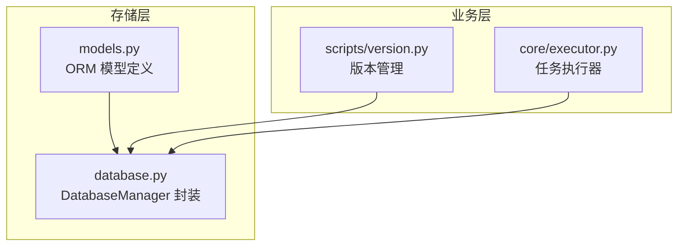
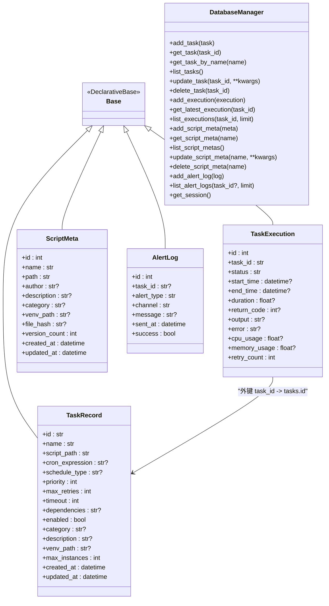
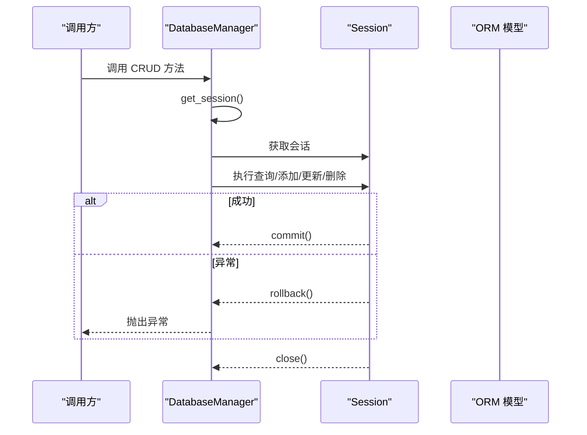
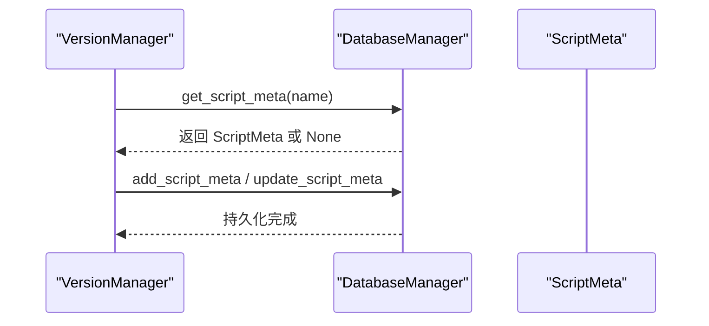
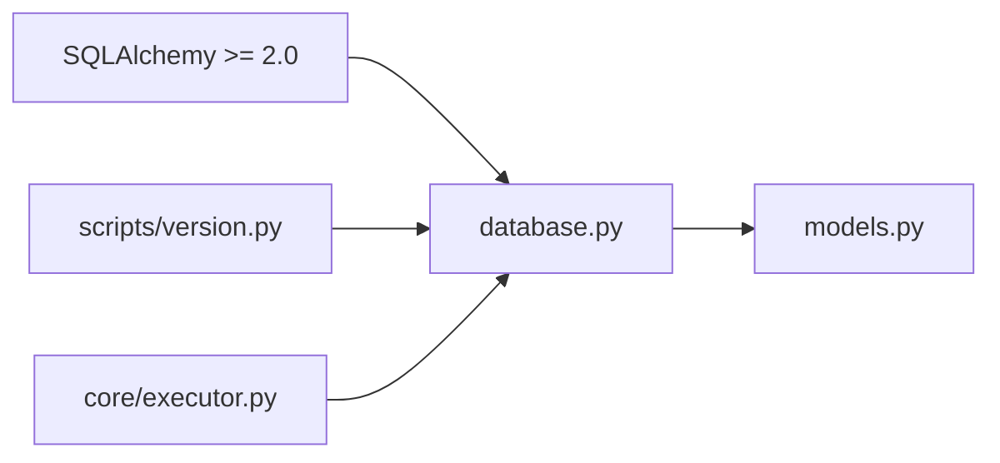

# 数据模型 API

<cite>
**本文引用的文件**
- [models.py](file://src/pycronguard/storage/models.py)
- [database.py](file://src/pycronguard/storage/database.py)
- [version.py](file://src/pycronguard/scripts/version.py)
- [executor.py](file://src/pycronguard/core/executor.py)
- [pyproject.toml](file://pyproject.toml)
- [requirements.txt](file://requirements.txt)
</cite>

## 目录
1. [简介](#简介)
2. [项目结构](#项目结构)
3. [核心组件](#核心组件)
4. [架构总览](#架构总览)
5. [详细组件分析](#详细组件分析)
6. [依赖分析](#依赖分析)
7. [性能考虑](#性能考虑)
8. [故障排查指南](#故障排查指南)
9. [结论](#结论)
10. [附录](#附录)

## 简介
本文件为 PyCronGuard 数据存储系统的数据模型 API 文档，聚焦 SQLAlchemy ORM 模型与数据库管理器的接口设计与使用。内容覆盖以下实体：
- TaskRecord：已注册的定时任务定义
- TaskExecution：单次任务执行记录
- ScriptMeta：受管脚本元数据
- AlertLog：告警投递日志条目

文档同时说明模型之间的关联关系与约束、数据库管理器的 CRUD 与查询方法、事务管理、索引策略与性能优化建议，并提供使用示例与最佳实践，以及数据生命周期与迁移策略的建议。

## 项目结构
数据模型与数据库管理器位于 storage 子包中，核心文件如下：
- storage/models.py：定义 SQLAlchemy ORM 模型（TaskRecord、TaskExecution、ScriptMeta、AlertLog）
- storage/database.py：封装 SQLAlchemy 引擎、会话与各模型的 CRUD/查询方法
- scripts/version.py：版本管理模块，使用 DatabaseManager 读写 ScriptMeta
- core/executor.py：执行器模块，使用 DatabaseManager 查询 TaskExecution 并持久化执行结果

图表来源
- [models.py:1-131](file://src/pycronguard/storage/models.py#L1-L131)
- [database.py:1-271](file://src/pycronguard/storage/database.py#L1-L271)
- [version.py:1-200](file://src/pycronguard/scripts/version.py#L1-L200)
- [executor.py:1-200](file://src/pycronguard/core/executor.py#L1-L200)

章节来源
- [models.py:1-131](file://src/pycronguard/storage/models.py#L1-L131)
- [database.py:1-271](file://src/pycronguard/storage/database.py#L1-L271)

## 核心组件
本节概述四个核心模型的职责与关键字段，便于快速理解数据结构与用途。

- TaskRecord：记录任务定义信息，如名称、表达式、优先级、重试次数、超时、依赖、启用状态、分类、描述、虚拟环境路径、最大并发实例数等；包含创建与更新时间戳。
- TaskExecution：记录某任务的一次执行详情，如状态、开始/结束时间、耗时、返回码、输出、错误、CPU/内存使用、重试次数等；通过外键关联到 TaskRecord。
- ScriptMeta：记录受管脚本的元数据，如名称、路径、作者、描述、分类、虚拟环境路径、文件哈希、版本计数等；包含创建与更新时间戳。
- AlertLog：记录告警投递日志，如任务 ID、告警类型（失败、连续失败、性能）、通道（如邮件）、消息、发送时间、是否成功等。

章节来源
- [models.py:19-56](file://src/pycronguard/storage/models.py#L19-L56)
- [models.py:59-82](file://src/pycronguard/storage/models.py#L59-L82)
- [models.py:85-107](file://src/pycronguard/storage/models.py#L85-L107)
- [models.py:110-130](file://src/pycronguard/storage/models.py#L110-L130)

## 架构总览
下图展示数据模型与数据库管理器之间的关系，以及业务模块如何通过 DatabaseManager 访问数据。

图表来源
- [models.py:15-130](file://src/pycronguard/storage/models.py#L15-L130)
- [database.py:29-271](file://src/pycronguard/storage/database.py#L29-L271)

## 详细组件分析

### TaskRecord 模型
- 表名：tasks
- 主键：id（字符串，UUID，默认生成）
- 唯一约束：name
- 关键字段与类型：
  - 名称、脚本路径、Cron 表达式、调度类型、优先级、最大重试次数、超时（秒）、依赖（JSON 序列化列表）、启用状态、分类、描述、虚拟环境路径、最大并发实例数、创建/更新时间
- 约束与默认值：
  - name 唯一且非空
  - priority 默认 5
  - max_retries 默认 3
  - timeout 默认 3600
  - max_instances 默认 1
  - enabled 默认 true
  - 依赖字段为 JSON 字符串
- 使用场景：
  - 注册新任务、按名称查询、批量列出、更新字段、删除任务

章节来源
- [models.py:19-56](file://src/pycronguard/storage/models.py#L19-L56)
- [database.py:74-136](file://src/pycronguard/storage/database.py#L74-L136)

### TaskExecution 模型
- 表名：task_executions
- 主键：id（整数，自增）
- 外键：task_id -> tasks.id（非空）
- 关键字段与类型：
  - 状态（pending/running/success/failed）、开始/结束时间、耗时（秒）、返回码、输出、错误、CPU/内存使用、重试次数
- 约束与默认值：
  - status 默认 pending
  - 重试次数默认 0
- 使用场景：
  - 新增执行记录、查询最新一次执行、按任务分页列出最近执行记录

章节来源
- [models.py:59-82](file://src/pycronguard/storage/models.py#L59-L82)
- [database.py:141-184](file://src/pycronguard/storage/database.py#L141-L184)

### ScriptMeta 模型
- 表名：script_meta
- 主键：id（整数，自增）
- 唯一约束：name
- 关键字段与类型：
  - 名称、路径、作者、描述、分类、虚拟环境路径、文件哈希、版本计数、创建/更新时间
- 约束与默认值：
  - name 唯一且非空
  - version_count 默认 0
- 使用场景：
  - 新增脚本元数据、按名称查询、批量列出、更新字段、删除元数据

章节来源
- [models.py:85-107](file://src/pycronguard/storage/models.py#L85-L107)
- [database.py:190-239](file://src/pycronguard/storage/database.py#L190-L239)

### AlertLog 模型
- 表名：alert_logs
- 主键：id（整数，自增）
- 关键字段与类型：
  - 任务 ID、告警类型（failure/consecutive_failure/performance）、通道（email）、消息、发送时间、是否成功
- 约束与默认值：
  - alert_type 非空
  - channel 非空
  - success 默认 true
- 使用场景：
  - 新增告警日志、按任务过滤并分页列出最近告警

章节来源
- [models.py:110-130](file://src/pycronguard/storage/models.py#L110-L130)
- [database.py:245-271](file://src/pycronguard/storage/database.py#L245-L271)

### 数据库管理器 DatabaseManager
- 初始化与生命周期：
  - 接收数据库文件路径，自动创建父目录
  - 创建 SQLite 引擎与会话工厂
  - 自动创建表（如不存在）
- 事务管理：
  - 提供上下文管理器 get_session，确保异常时回滚、最终关闭会话
- TaskRecord 相关方法：
  - add_task、get_task、get_task_by_name、list_tasks、update_task、delete_task
- TaskExecution 相关方法：
  - add_execution、get_latest_execution、list_executions
- ScriptMeta 相关方法：
  - add_script_meta、get_script_meta、list_script_metas、update_script_meta、delete_script_meta
- AlertLog 相关方法：
  - add_alert_log、list_alert_logs

图表来源
- [database.py:52-68](file://src/pycronguard/storage/database.py#L52-L68)
- [database.py:74-136](file://src/pycronguard/storage/database.py#L74-L136)
- [database.py:141-184](file://src/pycronguard/storage/database.py#L141-L184)
- [database.py:190-239](file://src/pycronguard/storage/database.py#L190-L239)
- [database.py:245-271](file://src/pycronguard/storage/database.py#L245-L271)

章节来源
- [database.py:29-271](file://src/pycronguard/storage/database.py#L29-L271)

### 业务模块中的数据访问模式
- 版本管理（scripts/version.py）：
  - 通过 DatabaseManager 读取/更新 ScriptMeta，用于脚本变更检测与版本备份
- 任务执行器（core/executor.py）：
  - 在依赖检查与执行记录持久化过程中使用 DatabaseManager 查询 TaskExecution

图表来源
- [version.py:309-385](file://src/pycronguard/scripts/version.py#L309-L385)
- [database.py:190-239](file://src/pycronguard/storage/database.py#L190-L239)

章节来源
- [version.py:309-385](file://src/pycronguard/scripts/version.py#L309-L385)
- [executor.py:190-223](file://src/pycronguard/core/executor.py#L190-L223)

## 依赖分析
- 运行时依赖（SQLAlchemy 2.0+）：
  - 项目在构建配置与依赖清单中声明了 SQLAlchemy 的最低版本要求
- 模块间耦合：
  - storage/models.py 定义模型，不依赖其他模块
  - storage/database.py 依赖 models 中的实体，提供统一的 CRUD/查询接口
  - scripts/version.py 与 core/executor.py 通过 DatabaseManager 访问数据

图表来源
- [pyproject.toml:11-18](file://pyproject.toml#L11-L18)
- [requirements.txt:3-3](file://requirements.txt#L3-L3)
- [database.py:18-24](file://src/pycronguard/storage/database.py#L18-L24)
- [models.py:11-12](file://src/pycronguard/storage/models.py#L11-L12)

章节来源
- [pyproject.toml:11-18](file://pyproject.toml#L11-L18)
- [requirements.txt:3-3](file://requirements.txt#L3-L3)
- [database.py:18-24](file://src/pycronguard/storage/database.py#L18-L24)
- [models.py:11-12](file://src/pycronguard/storage/models.py#L11-L12)

## 性能考虑
- 索引策略建议（基于现有模型与查询模式）：
  - TaskRecord：name 已唯一约束，适合建立唯一索引；若频繁按 cron_expression/schedule_type 查询，可考虑在这些列上建立二级索引
  - TaskExecution：按 task_id 分组查询最近记录，建议在 task_id 上建立索引；按 id 降序排序，SQLite 可利用索引进行排序
  - ScriptMeta：name 唯一，适合唯一索引；若存在大量按路径或哈希查询，可考虑相应索引
  - AlertLog：按 task_id 过滤并按 id 降序，建议在 task_id 上建立索引
- 查询优化：
  - 使用分页查询（limit）控制返回数量，避免一次性加载过多记录
  - 对于高频查询，尽量使用精确过滤条件（如按主键或唯一键）
- 事务与并发：
  - DatabaseManager 的 get_session 提供自动提交/回滚，避免长事务；对批量写入建议合并为单事务
- I/O 与存储：
  - SQLite 适用于中小规模数据；若数据量增长显著，建议评估迁移至 PostgreSQL/MySQL 并引入连接池与索引策略

[本节为通用性能建议，不直接分析具体文件，故无“章节来源”]

## 故障排查指南
- 数据库初始化失败：
  - 检查数据库文件路径是否存在写权限；确认父目录已创建
- 事务异常：
  - get_session 在异常时会回滚；捕获异常后重试或记录日志
- 查询为空：
  - 确认唯一键（如 TaskRecord.name、ScriptMeta.name）是否正确；确认数据是否已持久化
- 依赖检查失败：
  - 当未配置 DatabaseManager 时，执行器会采用宽松策略；请确保正确注入 DatabaseManager

章节来源
- [database.py:37-46](file://src/pycronguard/storage/database.py#L37-L46)
- [database.py:52-68](file://src/pycronguard/storage/database.py#L52-L68)
- [executor.py:218-223](file://src/pycronguard/core/executor.py#L218-L223)

## 结论
本文档系统性梳理了 PyCronGuard 的数据模型与数据库管理器 API，明确了 TaskRecord、TaskExecution、ScriptMeta、AlertLog 的字段、约束与关系，并总结了 CRUD、查询与事务管理的最佳实践。结合索引与查询优化建议，可在 SQLite 场景下获得稳定性能；当业务规模扩大时，可考虑迁移至关系型数据库并完善索引与连接池策略。

[本节为总结性内容，不直接分析具体文件，故无“章节来源”]

## 附录

### 数据模型 API 使用示例与最佳实践
- 插入与更新
  - 新增任务：构造 TaskRecord 实例并通过 DatabaseManager.add_task 持久化
  - 更新任务：通过 DatabaseManager.update_task 指定字段与新值
  - 新增脚本元数据：构造 ScriptMeta 实例并通过 DatabaseManager.add_script_meta 持久化
  - 更新脚本元数据：通过 DatabaseManager.update_script_meta 指定字段与新值
- 查询
  - 按主键查询：TaskRecord.get_task、ScriptMeta.get_script_meta
  - 按唯一键查询：TaskRecord.get_task_by_name
  - 列表查询：list_tasks、list_script_metas
  - 执行记录查询：get_latest_execution、list_executions
  - 告警日志查询：list_alert_logs（支持按任务过滤）
- 删除
  - 删除任务：delete_task
  - 删除脚本元数据：delete_script_meta
- 最佳实践
  - 使用 get_session 包裹操作，确保异常回滚
  - 对高频查询使用合适的过滤条件与分页
  - 对于批量写入，合并为单事务以提升性能

章节来源
- [database.py:74-136](file://src/pycronguard/storage/database.py#L74-L136)
- [database.py:141-184](file://src/pycronguard/storage/database.py#L141-L184)
- [database.py:190-239](file://src/pycronguard/storage/database.py#L190-L239)
- [database.py:245-271](file://src/pycronguard/storage/database.py#L245-L271)

### 数据生命周期与迁移策略
- 生命周期
  - 任务注册与启停：通过 TaskRecord 的 enabled 字段与更新接口控制
  - 执行记录归档：定期清理过期执行记录，保留最近 N 条
  - 脚本元数据演进：通过 version_count 与 file_hash 维护版本与变更
  - 告警日志清理：按时间窗口清理历史告警
- 迁移策略
  - 从 SQLite 迁移到 PostgreSQL/MySQL：保持 SQLAlchemy ORM 不变，调整引擎与方言；为高频查询列建立索引
  - 版本化迁移：使用 Alembic 管理表结构变更，先在测试环境验证再上线
  - 数据导出/导入：定期导出关键表（如 tasks、script_meta、alert_logs），用于备份与审计

[本节为概念性建议，不直接分析具体文件，故无“章节来源”]