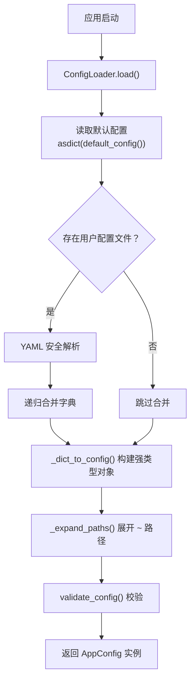
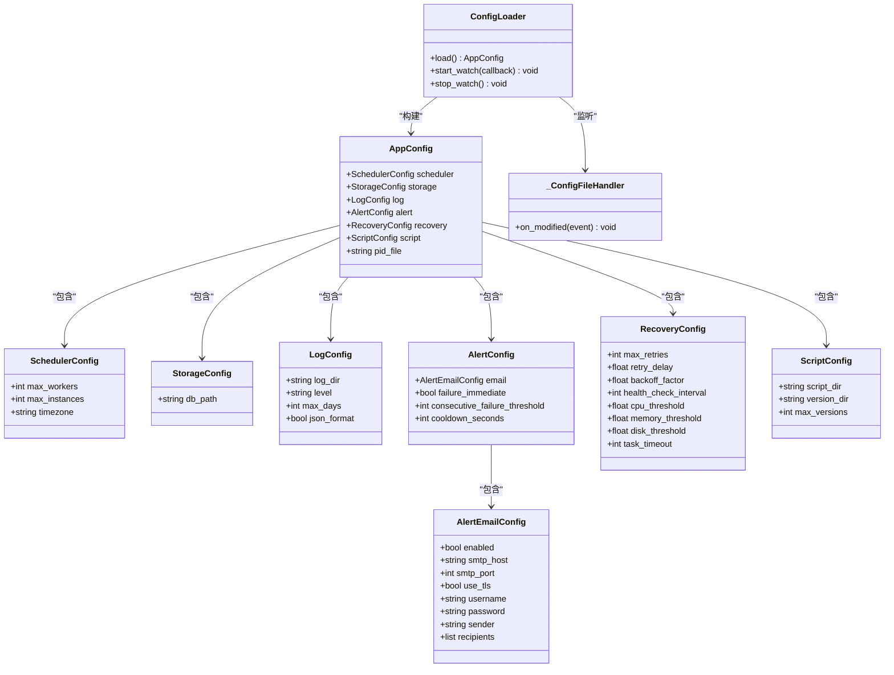
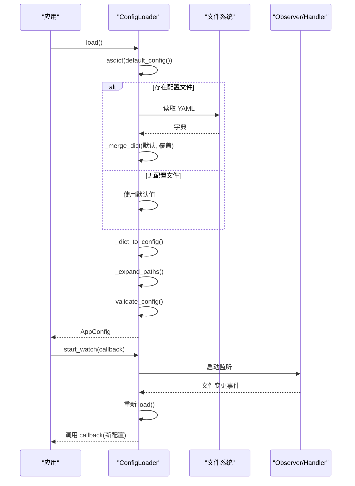
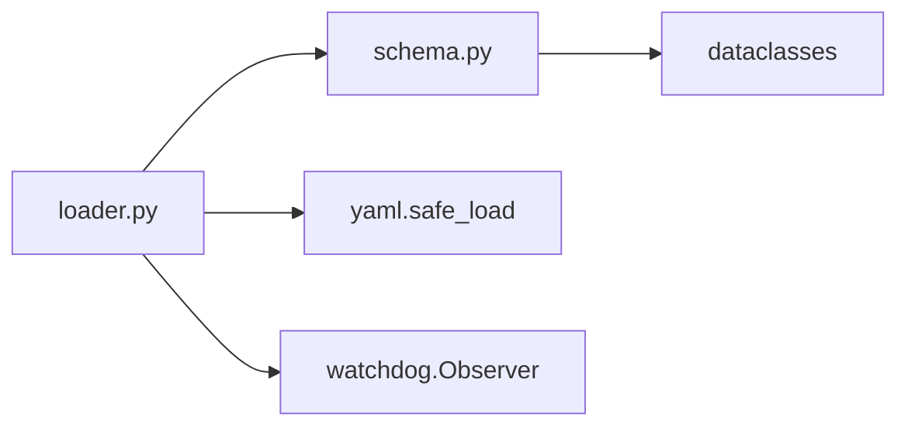

# 配置 API

<cite>
**本文引用的文件**
- [schema.py](file://src/pycronguard/config/schema.py)
- [loader.py](file://src/pycronguard/config/loader.py)
- [default_config.yaml](file://config/default_config.yaml)
</cite>

## 目录
1. [简介](#简介)
2. [项目结构](#项目结构)
3. [核心组件](#核心组件)
4. [架构总览](#架构总览)
5. [详细组件分析](#详细组件分析)
6. [依赖分析](#依赖分析)
7. [性能考虑](#性能考虑)
8. [故障排查指南](#故障排查指南)
9. [结论](#结论)
10. [附录](#附录)

## 简介
本文件为 PyCronGuard 配置系统的详细 API 参考，覆盖以下内容：
- 所有配置数据类的字段定义、类型约束与默认值：SchedulerConfig、StorageConfig、LogConfig、AlertEmailConfig、AlertConfig、RecoveryConfig、ScriptConfig、AppConfig
- 配置验证函数 validate_config 的验证规则与错误处理机制
- 配置加载器 ConfigLoader 的 API 接口：配置文件解析、热重载、配置合并
- 完整的配置示例与最佳实践
- 配置继承关系与优先级规则

## 项目结构
配置系统由三部分组成：
- schema.py：定义配置数据类与默认值、校验逻辑
- loader.py：实现 YAML 解析、默认值合并、路径展开、热重载监听
- default_config.yaml：提供默认配置示例

图表来源
- [loader.py:100-116](file://src/pycronguard/config/loader.py#L100-L116)
- [schema.py:97-104](file://src/pycronguard/config/schema.py#L97-L104)
- [loader.py:174-203](file://src/pycronguard/config/loader.py#L174-L203)
- [loader.py:50-61](file://src/pycronguard/config/loader.py#L50-L61)
- [schema.py:107-151](file://src/pycronguard/config/schema.py#L107-L151)

章节来源
- [loader.py:83-203](file://src/pycronguard/config/loader.py#L83-L203)
- [schema.py:12-151](file://src/pycronguard/config/schema.py#L12-L151)
- [default_config.yaml:1-57](file://config/default_config.yaml#L1-L57)

## 核心组件
本节对每个配置数据类进行字段定义、类型约束与默认值说明，并给出优先级与继承关系。

- SchedulerConfig（调度器）
  - 字段
    - max_workers: 整数，默认 4；约束 ≥ 1
    - max_instances: 整数，默认 1；约束 ≥ 1
    - timezone: 字符串，默认 "Asia/Shanghai"
  - 优先级与继承
    - 来源于 AppConfig.scheduler；若用户配置中未设置，则使用默认值

- StorageConfig（存储/数据库）
  - 字段
    - db_path: 字符串，默认 "~/.pycronguard/data.db"
  - 优先级与继承
    - 来源于 AppConfig.storage；用户配置可覆盖默认路径

- LogConfig（日志）
  - 字段
    - log_dir: 字符串，默认 "~/.pycronguard/logs"
    - level: 字符串，默认 "INFO"；有效值集合 {"DEBUG","INFO","WARNING","ERROR","CRITICAL"}
    - max_days: 整数，默认 30；约束 ≥ 1
    - json_format: 布尔，默认 True

- AlertEmailConfig（邮件告警通道）
  - 字段
    - enabled: 布尔，默认 False
    - smtp_host: 字符串，默认 ""
    - smtp_port: 整数，默认 587
    - use_tls: 布尔，默认 True
    - username: 字符串，默认 ""
    - password: 字符串，默认 ""
    - sender: 字符串，默认 ""
    - recipients: 字符串列表，默认 []

- AlertConfig（告警系统）
  - 字段
    - email: AlertEmailConfig，默认嵌套对象
    - failure_immediate: 布尔，默认 True
    - consecutive_failure_threshold: 整数，默认 3；约束 ≥ 1
    - cooldown_seconds: 整数，默认 300；约束 ≥ 0

- RecoveryConfig（恢复与健康检查）
  - 字段
    - max_retries: 整数，默认 3；约束 ≥ 0
    - retry_delay: 浮点，默认 10.0；约束 ≥ 0
    - backoff_factor: 浮点，默认 2.0；约束 ≥ 1.0
    - health_check_interval: 整数，默认 60
    - cpu_threshold: 浮点，默认 90.0；约束 [0,100]
    - memory_threshold: 浮点，默认 90.0；约束 [0,100]
    - disk_threshold: 浮点，默认 90.0；约束 [0,100]
    - task_timeout: 整数，默认 3600；约束 ≥ 1

- ScriptConfig（脚本管理）
  - 字段
    - script_dir: 字符串，默认 "~/.pycronguard/scripts"
    - version_dir: 字符串，默认 "~/.pycronguard/script_versions"
    - max_versions: 整数，默认 10；约束 ≥ 1

- AppConfig（顶层应用配置）
  - 字段
    - scheduler: SchedulerConfig，默认嵌套对象
    - storage: StorageConfig，默认嵌套对象
    - log: LogConfig，默认嵌套对象
    - alert: AlertConfig，默认嵌套对象
    - recovery: RecoveryConfig，默认嵌套对象
    - script: ScriptConfig，默认嵌套对象
    - pid_file: 字符串，默认 "~/.pycronguard/pycronguard.pid"

章节来源
- [schema.py:12-151](file://src/pycronguard/config/schema.py#L12-L151)

## 架构总览
配置系统采用“默认值 + 用户覆盖”的分层设计，通过 ConfigLoader 将 YAML 配置与默认配置进行递归合并，随后构建强类型对象并执行校验，最终返回可用的 AppConfig 实例。同时支持基于 watchdog 的文件变更监听，实现热重载。

图表来源
- [schema.py:12-151](file://src/pycronguard/config/schema.py#L12-L151)
- [loader.py:83-203](file://src/pycronguard/config/loader.py#L83-L203)

## 详细组件分析

### 配置验证函数 validate_config
作用：在构建强类型配置后，对关键字段进行范围与语义校验，确保运行时安全。

- 校验规则
  - 调度器
    - scheduler.max_workers ≥ 1
    - scheduler.max_instances ≥ 1
  - 日志
    - log.level 必须属于 {"DEBUG","INFO","WARNING","ERROR","CRITICAL"}
    - log.max_days ≥ 1
  - 恢复与健康检查
    - recovery.max_retries ≥ 0
    - recovery.retry_delay ≥ 0
    - recovery.backoff_factor ≥ 1.0
    - recovery.task_timeout ≥ 1
    - 三阈值：0 ≤ cpu_threshold, memory_threshold, disk_threshold ≤ 100
  - 告警
    - alert.consecutive_failure_threshold ≥ 1
    - alert.cooldown_seconds ≥ 0
  - 脚本
    - script.max_versions ≥ 1
  - 邮件告警
    - 若 alert.email.enabled 为真，则必须提供 smtp_host 且 recipients 非空

- 错误处理
  - 任一规则不满足时抛出异常，异常类型为配置值无效的错误类型
  - 热重载失败时记录异常日志但不中断进程

章节来源
- [schema.py:107-151](file://src/pycronguard/config/schema.py#L107-L151)
- [loader.py:72-80](file://src/pycronguard/config/loader.py#L72-L80)

### 配置加载器 ConfigLoader API
- 初始化
  - 参数：config_path（可选），若为 None 或文件不存在则仅使用默认值
- 公共方法
  - load()
    - 功能：从 YAML 加载用户配置并与默认配置合并，构建强类型对象，展开路径，执行校验
    - 返回：AppConfig
  - start_watch(callback)
    - 功能：启动文件监听，当配置文件被修改时重新加载并调用回调
    - 回调参数：新加载的 AppConfig
  - stop_watch()
    - 功能：停止文件监听
- 内部辅助
  - _merge_dict(base, override)：递归合并字典，后者优先
  - _dict_to_config(data)：将字典转换为强类型配置对象，支持嵌套数据类
  - _expand_paths(config)：展开所有路径中的波浪号（~）

图表来源
- [loader.py:100-116](file://src/pycronguard/config/loader.py#L100-L116)
- [loader.py:118-141](file://src/pycronguard/config/loader.py#L118-L141)
- [loader.py:64-81](file://src/pycronguard/config/loader.py#L64-L81)

章节来源
- [loader.py:83-203](file://src/pycronguard/config/loader.py#L83-L203)

### 配置示例与最佳实践
- 示例参考
  - 完整默认配置示例请参见：[default_config.yaml:1-57](file://config/default_config.yaml#L1-L57)
- 最佳实践
  - 路径统一使用相对用户目录（~）以便跨平台兼容，系统会在加载时自动展开
  - 邮件告警启用时务必提供 SMTP 主机与收件人列表
  - 调度器并发参数应结合 CPU 核心数与任务特性合理设置
  - 健康检查阈值建议设置为 80%-90%，避免误报与漏报
  - 日志保留天数建议根据磁盘容量与合规要求设定
  - 脚本版本保留数量需平衡存储空间与回滚需求

章节来源
- [default_config.yaml:1-57](file://config/default_config.yaml#L1-L57)

### 配置继承关系与优先级规则
- 继承关系
  - AppConfig 包含多个子配置对象（scheduler、storage、log、alert、recovery、script）
  - AlertConfig 包含 AlertEmailConfig
- 优先级规则
  - 默认值（来自 default_config）为基线
  - 用户 YAML 配置对默认值进行覆盖（递归合并）
  - 最终构建强类型对象并执行校验
- 路径展开
  - 所有字符串路径字段（db_path、log_dir、script_dir、version_dir、pid_file）在加载完成后统一展开为绝对路径

章节来源
- [schema.py:97-104](file://src/pycronguard/config/schema.py#L97-L104)
- [loader.py:155-172](file://src/pycronguard/config/loader.py#L155-L172)
- [loader.py:50-61](file://src/pycronguard/config/loader.py#L50-L61)

## 依赖分析
- 组件耦合
  - loader.py 依赖 schema.py 中的数据类与校验函数
  - 使用 yaml.safe_load 进行安全解析
  - 使用 watchdog 提供文件变更监听
- 外部依赖
  - watchdog：文件系统事件监听
  - yaml：YAML 解析
  - dataclasses：强类型配置对象构建

图表来源
- [loader.py:20-31](file://src/pycronguard/config/loader.py#L20-L31)
- [loader.py:16-18](file://src/pycronguard/config/loader.py#L16-L18)

章节来源
- [loader.py:20-31](file://src/pycronguard/config/loader.py#L20-L31)

## 性能考虑
- 合并策略
  - 递归合并字典，避免深层嵌套重复键导致的覆盖问题
- 文件监听
  - 使用守护线程与阻塞 join，避免主线程阻塞
- 路径展开
  - 在一次遍历中完成多字段展开，减少多次 I/O
- 校验成本
  - 校验逻辑简单直接，开销极低，建议在每次热重载后均执行

## 故障排查指南
- 常见错误与定位
  - 校验失败：检查对应字段是否满足最小/最大值或枚举限制
  - 邮件告警启用但缺少必要字段：确认 SMTP 主机与收件人列表
  - 热重载失败：查看日志中异常堆栈，确认文件权限与路径正确性
- 排查步骤
  - 确认 YAML 语法正确且键名匹配
  - 对照默认配置逐项核对覆盖值
  - 在开发环境开启更详细日志级别以捕获异常细节

章节来源
- [schema.py:107-151](file://src/pycronguard/config/schema.py#L107-L151)
- [loader.py:72-80](file://src/pycronguard/config/loader.py#L72-L80)

## 结论
PyCronGuard 的配置系统以清晰的数据类模型为基础，通过默认值与用户覆盖的分层设计，配合严格的校验与热重载能力，提供了高可用、易维护的配置体验。遵循本文档的字段约束、优先级与最佳实践，可快速搭建稳定可靠的运行环境。

## 附录
- 关键 API 一览
  - default_config()：生成默认配置对象
  - validate_config(config)：执行配置校验
  - ConfigLoader.load()：加载并合并配置
  - ConfigLoader.start_watch(callback)：启动热重载监听
  - ConfigLoader.stop_watch()：停止热重载监听