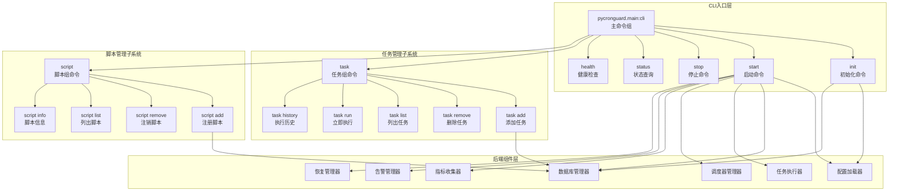

# 命令行界面

<cite>
**本文引用的文件**
- [pyproject.toml](file://pyproject.toml)
- [src/pycronguard/__main__.py](file://src/pycronguard/__main__.py)
- [src/pycronguard/main.py](file://src/pycronguard/main.py)
- [src/pycronguard/deploy/daemon.py](file://src/pycronguard/deploy/daemon.py)
- [src/pycronguard/scripts/manager.py](file://src/pycronguard/scripts/manager.py)
- [src/pycronguard/scripts/version.py](file://src/pycronguard/scripts/version.py)
- [src/pycronguard/monitor/metrics.py](file://src/pycronguard/monitor/metrics.py)
- [src/pycronguard/recovery/health.py](file://src/pycronguard/recovery/health.py)
- [src/pycronguard/config/schema.py](file://src/pycronguard/config/schema.py)
- [src/pycronguard/config/loader.py](file://src/pycronguard/config/loader.py)
- [src/pycronguard/logging/logger.py](file://src/pycronguard/logging/logger.py)
- [src/pycronguard/core/task.py](file://src/pycronguard/core/task.py)
- [src/pycronguard/storage/database.py](file://src/pycronguard/storage/database.py)
- [src/pycronguard/storage/models.py](file://src/pycronguard/storage/models.py)
- [config/default_config.yaml](file://config/default_config.yaml)
</cite>

## 目录
1. [简介](#简介)
2. [CLI架构概览](#cli架构概览)
3. [核心命令详解](#核心命令详解)
4. [命令组织结构](#命令组织结构)
5. [参数与选项说明](#参数与选项说明)
6. [使用示例](#使用示例)
7. [输出解读与错误处理](#输出解读与错误处理)
8. [高级功能](#高级功能)
9. [故障排查指南](#故障排查指南)
10. [CLI扩展开发](#cli扩展开发)

## 简介
PyCronGuard 提供了一个功能完整的命令行界面，基于 Click 框架构建，支持15+个核心子命令。该CLI实现了完整的任务调度管理、脚本版本控制、系统监控和运维管理功能。本文档详细介绍所有可用命令、参数选项、使用方法和最佳实践。

## CLI架构概览
PyCronGuard CLI采用分层架构设计，主要组件包括：



**图表来源**
- [src/pycronguard/main.py:153-985](file://src/pycronguard/main.py#L153-L985)
- [src/pycronguard/deploy/daemon.py:22-247](file://src/pycronguard/deploy/daemon.py#L22-L247)
- [src/pycronguard/scripts/manager.py:23-441](file://src/pycronguard/scripts/manager.py#L23-L441)

## 核心命令详解

### 初始化命令 (init)
用于初始化PyCronGuard的配置文件和目录结构。

**命令格式：**
```bash
pycronguard init
```

**功能特性：**
- 创建基础目录结构：`~/.pycronguard/{logs,scripts,script_versions}`
- 生成默认配置文件（如果不存在）
- 初始化数据库连接
- 支持自定义配置路径

**输出示例：**
```
✓ 创建目录: ~/.pycronguard
✓ 创建目录: ~/.pycronguard/logs
✓ 创建目录: ~/.pycronguard/scripts
✓ 创建目录: ~/.pycronguard/script_versions
✓ 创建默认配置: ~/.pycronguard/config.yaml
✓ 初始化数据库: ~/.pycronguard/pycronguard.db
初始化完成！使用 'pycronguard start' 启动调度器。
```

### 启动命令 (start)
启动PyCronGuard调度器服务。

**命令格式：**
```bash
pycronguard start [-c/--config PATH] [-d/--daemon] [-f/--foreground]
```

**参数选项：**
- `-c, --config PATH`: 指定配置文件路径
- `-d, --daemon`: 以守护进程模式运行
- `-f, --foreground`: 前台运行模式（默认）

**功能特性：**
- 支持守护进程和前台两种运行模式
- 自动创建PID文件
- 配置文件热重载
- 优雅关闭处理（SIGTERM/SIGINT）
- 系统健康检查和死锁检测

**输出示例：**
```
正在启动 PyCronGuard ...
✓ 调度器已启动
✓ HealthChecker started
✓ DeadlockDetector started
✓ PyCronGuard 正在运行 (PID: 12345)
按 Ctrl+C 停止
```

### 停止命令 (stop)
停止正在运行的PyCronGuard服务。

**命令格式：**
```bash
pycronguard stop
```

**功能特性：**
- 通过PID文件定位运行中的进程
- 发送SIGTERM信号优雅停止
- 支持强制停止（SIGKILL）
- 清理PID文件

**输出示例：**
```
正在停止 PyCronGuard (PID: 12345) ...
✓ PyCronGuard 已停止
```

### 状态查询 (status)
查看PyCronGuard服务运行状态。

**命令格式：**
```bash
pycronguard status [-c/--config PATH]
```

**功能特性：**
- 检查服务是否正在运行
- 显示PID信息
- 列出已注册的任务
- 显示任务的基本信息

**输出示例：**
```
状态: 运行中 (PID: 12345)
已注册任务: 3
名称                 类型       状态     优先级
--------------------------------------------------
backup_daily         daily      启用     5
clean_logs           weekly     启用     3
send_report          cron       禁用     7
```

### 健康检查 (health)
执行系统健康检查。

**命令格式：**
```bash
pycronguard health [-c/--config PATH]
```

**功能特性：**
- 检查CPU使用率
- 检查内存使用率
- 检查磁盘使用率
- 检查系统负载均值
- 对比配置阈值

**输出示例：**
```
系统健康检查
========================================
✓ CPU 使用率: 45.2% (阈值: 80.0%)
✓ 内存使用率: 62.1% (阈值: 85.0%)
✓ 磁盘使用率: 33.7% (阈值: 90.0%)
• 负载均值: 1.23
✓ 系统健康
```

## 命令组织结构

### 任务管理组 (task)
任务管理子命令组，提供完整的任务生命周期管理。

#### 添加任务 (task add)
添加新的定时任务。

**命令格式：**
```bash
pycronguard task add -n NAME -s SCRIPT -t TYPE -S SCHEDULE \
    [--priority N] [--timeout N] [--max-retries N] \
    [--category TEXT] [--description TEXT] [--depends-on NAME]
```

**参数说明：**
- `-n, --name`: 任务名称（必需）
- `-s, --script`: 脚本路径（必需）
- `-t, --schedule-type`: 调度类型（cron/daily/weekly/monthly/interval）
- `-S, --schedule`: 调度表达式（必需）
- `--priority`: 优先级（1-10，默认5）
- `--timeout`: 超时时间（秒，默认3600）
- `--max-retries`: 最大重试次数（默认3）
- `--category`: 任务分类
- `--description`: 任务描述
- `--depends-on`: 依赖的任务名称（可多次指定）

**调度表达式示例：**
```bash
# Cron表达式
pycronguard task add -n "daily_backup" -s "/scripts/backup.py" -t cron -S "0 2 * * *" --priority 5

# 每日执行
pycronguard task add -n "daily_cleanup" -s "/scripts/cleanup.py" -t daily -S "02:00" --priority 3

# 每周执行
pycronguard task add -n "weekly_report" -s "/scripts/report.py" -t weekly -S "sat 03:00" --priority 7

# 每月执行
pycronguard task add -n "monthly_archive" -s "/scripts/archive.py" -t monthly -S "01 04:00" --priority 6

# 间隔执行（每30分钟）
pycronguard task add -n "interval_check" -s "/scripts/check.py" -t interval -S "30m" --priority 4
```

#### 删除任务 (task remove)
删除指定的定时任务。

**命令格式：**
```bash
pycronguard task remove NAME [-f/--force]
```

**参数说明：**
- `NAME`: 任务名称
- `-f, --force`: 强制删除，无需确认

#### 列出任务 (task list)
列出所有已注册的任务。

**命令格式：**
```bash
pycronguard task list [--category CATEGORY] [--status STATUS]
```

**参数说明：**
- `--category`: 按分类过滤
- `--status`: 按状态过滤（enabled/disabled）

#### 立即执行 (task run)
立即执行指定任务。

**命令格式：**
```bash
pycronguard task run NAME
```

#### 查看历史 (task history)
查看任务执行历史和统计信息。

**命令格式：**
```bash
pycronguard task history NAME [--days N] [--limit N] [--stats-only]
```

**参数说明：**
- `--days`: 查看最近N天的记录（默认30天）
- `--limit`: 显示最近N条记录（默认20条）
- `--stats-only`: 仅显示统计摘要

### 脚本管理组 (script)
脚本管理子命令组，提供脚本注册、版本控制和管理功能。

#### 注册脚本 (script add)
注册新的脚本到管理库。

**命令格式：**
```bash
pycronguard script add -p PATH [-n NAME] [-a AUTHOR] \
    [--description DESC] [--category CAT] [--venv VENV]
```

**参数说明：**
- `-p, --path`: 脚本文件路径（必需）
- `-n, --name`: 脚本名称（默认使用文件名）
- `-a, --author`: 作者
- `--description`: 描述
- `--category`: 分类
- `--venv`: 虚拟环境路径

#### 注销脚本 (script remove)
从管理库中注销脚本。

**命令格式：**
```bash
pycronguard script remove NAME [-d/--delete-file]
```

**参数说明：**
- `-d, --delete-file`: 同时删除脚本文件

#### 列出脚本 (script list)
列出所有已注册的脚本。

**命令格式：**
```bash
pycronguard script list [--category CATEGORY]
```

#### 脚本信息 (script info)
查看脚本详细信息和版本历史。

**命令格式：**
```bash
pycronguard script info NAME
```

## 参数与选项说明

### 全局参数
所有命令都支持以下全局参数：

| 参数 | 简写 | 类型 | 默认值 | 描述 |
|------|------|------|--------|------|
| `--config` | `-c` | 字符串 | `~/.pycronguard/config.yaml` | 指定配置文件路径 |
| `--verbose` | `-v` | 标志 | `false` | 详细输出模式 |

### 配置文件参数
配置文件支持以下主要配置项：

**调度器配置：**
```yaml
scheduler:
  max_workers: 4          # 最大工作线程数
  max_instances: 10       # 最大实例数
  job_defaults:
    coalesce: true       # 合并错过的工作
    misfire_grace_time: 30  # 错过执行的宽限时间
```

**存储配置：**
```yaml
storage:
  db_path: ~/.pycronguard/pycronguard.db  # 数据库文件路径
```

**日志配置：**
```yaml
log:
  log_dir: ~/.pycronguard/logs      # 日志目录
  level: INFO                      # 日志级别
  max_days: 7                      # 日志保留天数
  json_format: false               # JSON格式输出
```

**告警配置：**
```yaml
alert:
  email_enabled: false             # 邮件告警
  smtp_server: ""                  # SMTP服务器
  smtp_port: 587                   # SMTP端口
  username: ""                     # 用户名
  password: ""                     # 密码
  from_addr: ""                    # 发件人
  to_addrs: []                     # 收件人列表
```

**恢复配置：**
```yaml
recovery:
  cpu_threshold: 80.0              # CPU使用率阈值
  memory_threshold: 85.0           # 内存使用率阈值
  disk_threshold: 90.0             # 磁盘使用率阈值
  health_check_interval: 60        # 健康检查间隔（秒）
  deadlock_detection_interval: 300 # 死锁检测间隔（秒）
```

**脚本配置：**
```yaml
script:
  script_dir: ~/.pycronguard/scripts      # 脚本目录
  version_dir: ~/.pycronguard/script_versions  # 版本目录
  max_versions: 10                       # 最大版本数
```

## 使用示例

### 基础部署流程
```bash
# 1. 初始化PyCronGuard
pycronguard init

# 2. 编辑配置文件（可选）
vim ~/.pycronguard/config.yaml

# 3. 启动服务
pycronguard start -d

# 4. 查看状态
pycronguard status

# 5. 停止服务
pycronguard stop
```

### 任务管理示例
```bash
# 添加一个每日备份任务
pycronguard task add -n "daily_backup" \
    -s "/home/user/scripts/backup.py" \
    -t daily -S "02:00" \
    --priority 5 \
    --timeout 7200 \
    --max-retries 3 \
    --category "backup" \
    --description "Daily system backup"

# 添加一个带依赖的任务
pycronguard task add -n "weekly_report" \
    -s "/home/user/scripts/report.py" \
    -t weekly -S "sat 03:00" \
    --depends-on "daily_backup"

# 立即执行任务
pycronguard task run "daily_backup"

# 查看任务历史
pycronguard task history "daily_backup" --days 7 --limit 10
```

### 脚本管理示例
```bash
# 注册脚本
pycronguard script add -p "/home/user/scripts/monitor.py" \
    -n "system_monitor" \
    -a "admin" \
    -c "monitoring" \
    --venv "/opt/python3.10"

# 查看脚本信息
pycronguard script info "system_monitor"

# 列出所有脚本
pycronguard script list --category "monitoring"

# 注销脚本
pycronguard script remove "system_monitor" --delete-file
```

### 系统监控示例
```bash
# 执行健康检查
pycronguard health

# 查看系统状态
pycronguard status

# 查看最近执行记录
pycronguard task history "daily_backup" --stats-only
```

## 输出解读与错误处理

### 成功输出格式
PyCronGuard使用统一的输出格式，便于脚本化处理：

**成功操作：**
```
✓ 任务 'daily_backup' 已添加 (ID: task_12345)
✓ 脚本 'system_monitor' 已注册 (路径: /home/user/scripts/monitor.py)
✓ PyCronGuard 正在运行 (PID: 12345)
```

**状态信息：**
```
状态: 运行中 (PID: 12345)
已注册任务: 3
名称                 类型       状态     优先级
--------------------------------------------------
backup_daily         daily      启用     5
```

**统计信息：**
```
📊 最近 7 天统计
────────────────────────────
总执行次数:  15
成功:        14 (93.3%)
失败:        1 (6.7%)
平均耗时:    12.4s
最大耗时:    45.2s
P95 耗时:    23.1s
最后执行:    2024-01-15 02:00:01
最后状态:    成功
```

### 错误处理机制
PyCronGuard提供详细的错误信息和处理机制：

**常见错误类型：**
- 配置文件错误：配置项缺失或格式不正确
- 文件路径错误：脚本文件不存在或权限不足
- 数据库连接错误：数据库文件损坏或权限问题
- 网络连接错误：SMTP服务器连接失败
- 调度器错误：任务调度冲突或资源不足

**错误输出格式：**
```
✗ 任务 'daily_backup' 已存在
✗ 脚本文件不存在: /home/user/scripts/backup.py
✗ 初始化失败: 数据库连接错误
✗ 无法加载配置: 配置文件格式错误
```

**错误处理建议：**
1. 检查配置文件语法和路径
2. 验证脚本文件的可执行性和权限
3. 确认数据库文件的可写权限
4. 检查网络连接和防火墙设置
5. 查看系统资源使用情况

## 高级功能

### 配置文件热重载
PyCronGuard支持配置文件的实时热重载：

```bash
# 启动服务后修改配置文件
vim ~/.pycronguard/config.yaml

# 发送SIGHUP信号触发重载
kill -SIGHUP $(cat ~/.pycronguard/pycronguard.pid)

# 或者直接重启服务
pycronguard stop && pycronguard start
```

### 优雅关闭
服务支持多种信号处理：

```bash
# 发送SIGTERM优雅关闭
kill -TERM $(cat ~/.pycronguard/pycronguard.pid)

# 发送SIGINT中断
kill -INT $(cat ~/.pycronguard/pycronguard.pid)

# 发送SIGHUP重载配置
kill -HUP $(cat ~/.pycronguard/pycronguard.pid)
```

### 监控集成
系统集成了多种监控功能：

**健康检查：**
- CPU使用率监控
- 内存使用率监控  
- 磁盘使用率监控
- 系统负载监控

**任务监控：**
- 执行成功率统计
- 平均执行时间
- 最大执行时间
- P95延迟统计

**告警机制：**
- 邮件告警
- Slack通知
- 自定义Webhook

## 故障排查指南

### 常见问题诊断

**问题1：服务无法启动**
```bash
# 检查配置文件
pycronguard init --config /path/to/config.yaml

# 查看详细日志
tail -f ~/.pycronguard/logs/pycronguard.log

# 检查端口占用
netstat -tulpn | grep 8080
```

**问题2：任务执行失败**
```bash
# 查看任务历史
pycronguard task history "failed_task"

# 检查脚本权限
ls -la /path/to/script.py

# 验证Python环境
python3 -m pip list | grep required-package
```

**问题3：数据库连接问题**
```bash
# 检查数据库文件
ls -la ~/.pycronguard/pycronguard.db

# 验证文件权限
chmod 666 ~/.pycronguard/pycronguard.db

# 重建数据库
rm ~/.pycronguard/pycronguard.db
pycronguard init
```

### 性能优化建议

**系统资源优化：**
- 调整max_workers参数适应CPU核心数
- 设置合理的max_instances限制
- 优化调度器的misfire处理策略

**存储优化：**
- 定期清理日志文件
- 限制任务历史记录数量
- 优化数据库索引

**网络优化：**
- 配置合适的超时时间
- 启用连接池
- 优化告警通知频率

## CLI扩展开发

### 自定义命令开发

要为PyCronGuard添加自定义命令，可以按照以下步骤：

**步骤1：在main.py中添加新命令**
```python
@cli.command()
@click.option("--custom-option", default="default_value", help="自定义选项")
@click.pass_context
def custom_command(ctx: click.Context, custom_option: str) -> None:
    """自定义命令描述"""
    # 获取配置
    config_path = ctx.obj.get("config_path") or _DEFAULT_CONFIG_PATH
    config, db_manager = _init_light(config_path)
    
    # 实现业务逻辑
    click.echo(f"自定义命令执行: {custom_option}")
```

**步骤2：添加命令参数和选项**
```python
@cli.command()
@click.argument("target")
@click.option("--dry-run", is_flag=True, help="预览模式")
@click.option("--output-format", type=click.Choice(['json', 'table', 'csv']), 
              default='table', help="输出格式")
@click.pass_context
def advanced_command(ctx, target, dry_run, output_format):
    """高级命令示例"""
    # 实现逻辑...
```

**步骤3：集成现有组件**
```python
# 使用现有组件
from pycronguard.config.loader import ConfigLoader
from pycronguard.storage.database import DatabaseManager
from pycronguard.core.executor import TaskExecutor
from pycronguard.monitor.metrics import MetricsCollector
```

### 批量操作脚本

**批量添加任务脚本：**
```bash
#!/bin/bash
# batch_add_tasks.sh

SCRIPTS_DIR="/path/to/scripts"
CONFIG_FILE="$HOME/.pycronguard/config.yaml"

echo "批量添加任务..."

for script in "$SCRIPTS_DIR"/*.py; do
    if [ -f "$script" ]; then
        NAME=$(basename "$script" .py)
        echo "添加任务: $NAME"
        
        pycronguard task add \
            -n "$NAME" \
            -s "$script" \
            -t "daily" \
            -S "02:00" \
            --category "automated" \
            --priority 5
    fi
done

echo "批量添加完成"
```

**自动化监控脚本：**
```python
#!/usr/bin/env python3
"""自动化监控脚本"""

import subprocess
import time
from datetime import datetime

def check_service_health():
    """检查服务健康状态"""
    try:
        result = subprocess.run([
            'pycronguard', 'health'
        ], capture_output=True, text=True, timeout=30)
        
        if result.returncode == 0:
            print(f"[{datetime.now()}] 服务健康")
            return True
        else:
            print(f"[{datetime.now()}] 服务异常: {result.stderr}")
            return False
    except subprocess.TimeoutExpired:
        print(f"[{datetime.now()}] 健康检查超时")
        return False

def main():
    """主循环"""
    while True:
        check_service_health()
        time.sleep(60)  # 每分钟检查一次

if __name__ == "__main__":
    main()
```

### 配置管理最佳实践

**配置文件模板：**
```yaml
# ~/.pycronguard/config.yaml

scheduler:
  max_workers: 4
  max_instances: 10
  job_defaults:
    coalesce: true
    misfire_grace_time: 30

storage:
  db_path: ~/.pycronguard/pycronguard.db

log:
  log_dir: ~/.pycronguard/logs
  level: INFO
  max_days: 7
  json_format: false

alert:
  email_enabled: false
  smtp_server: ""
  smtp_port: 587
  username: ""
  password: ""
  from_addr: ""
  to_addrs: []

recovery:
  cpu_threshold: 80.0
  memory_threshold: 85.0
  disk_threshold: 90.0
  health_check_interval: 60
  deadlock_detection_interval: 300

script:
  script_dir: ~/.pycronguard/scripts
  version_dir: ~/.pycronguard/script_versions
  max_versions: 10
```

**配置验证脚本：**
```python
#!/usr/bin/env python3
"""配置验证工具"""

import yaml
import os
from pathlib import Path

def validate_config(config_path):
    """验证配置文件"""
    try:
        with open(config_path, 'r') as f:
            config = yaml.safe_load(f)
        
        required_sections = ['scheduler', 'storage', 'log']
        for section in required_sections:
            if section not in config:
                print(f"错误: 缺少必需配置段: {section}")
                return False
        
        print("配置文件验证通过")
        return True
    except Exception as e:
        print(f"配置文件验证失败: {e}")
        return False

if __name__ == "__main__":
    config_path = Path.home() / ".pycronguard" / "config.yaml"
    validate_config(config_path)
```

通过以上文档，用户可以全面了解PyCronGuard CLI的功能和使用方法，包括所有15+个核心命令的详细说明、参数选项、使用示例和故障排查指南。CLI提供了完整的任务调度管理、脚本版本控制、系统监控和运维管理功能，适合生产环境使用。