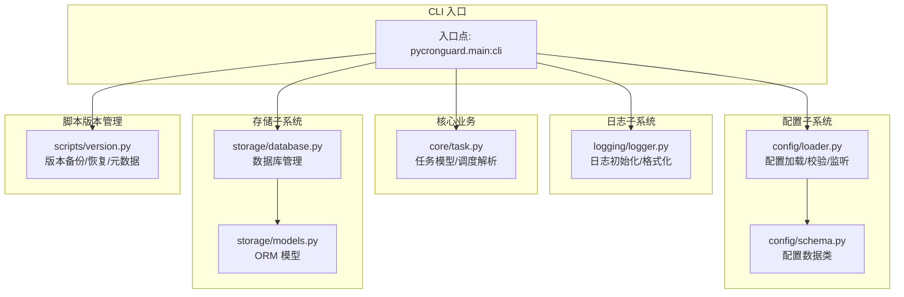
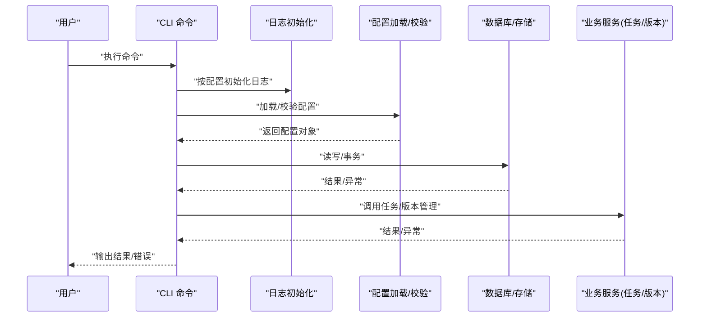
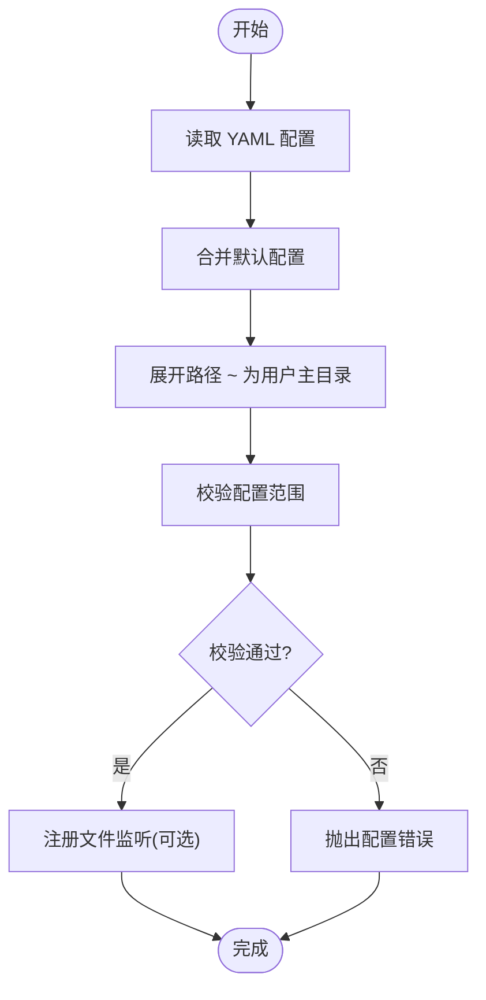
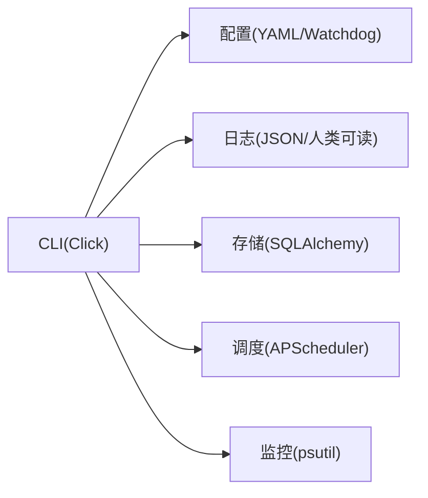

# 命令行界面

<cite>
**本文引用的文件**
- [pyproject.toml](file://pyproject.toml)
- [requirements.txt](file://requirements.txt)
- [src/pycronguard/__init__.py](file://src/pycronguard/__init__.py)
- [src/pycronguard/config/schema.py](file://src/pycronguard/config/schema.py)
- [src/pycronguard/config/loader.py](file://src/pycronguard/config/loader.py)
- [src/pycronguard/logging/logger.py](file://src/pycronguard/logging/logger.py)
- [src/pycronguard/core/task.py](file://src/pycronguard/core/task.py)
- [src/pycronguard/scripts/version.py](file://src/pycronguard/scripts/version.py)
- [src/pycronguard/storage/database.py](file://src/pycronguard/storage/database.py)
- [src/pycronguard/storage/models.py](file://src/pycronguard/storage/models.py)
- [config/default_config.yaml](file://config/default_config.yaml)
</cite>

## 目录
1. [简介](#简介)
2. [项目结构](#项目结构)
3. [核心组件](#核心组件)
4. [架构总览](#架构总览)
5. [详细组件分析](#详细组件分析)
6. [依赖关系分析](#依赖关系分析)
7. [性能考虑](#性能考虑)
8. [故障排查指南](#故障排查指南)
9. [结论](#结论)
10. [附录](#附录)

## 简介
本文件面向 PyCronGuard 的命令行界面（CLI）使用与扩展，目标读者包括运维工程师、系统管理员与高级用户。文档基于仓库现有源码进行分析，梳理 CLI 架构设计、命令组织方式、参数与选项、输出解读与错误处理，并提供批量与自动化脚本编写建议以及 CLI 扩展与自定义命令的开发指南。

当前仓库中，CLI 入口点在项目元数据中声明为 pycronguard.main:cli，但未在源码树中发现该文件。因此，本文将从“已实现模块”出发，给出可落地的 CLI 使用与扩展方案：以 Click 为基础的命令组织、配置加载与验证、日志初始化、任务模型与版本控制等模块均可作为 CLI 子命令的后端支撑。

## 项目结构
PyCronGuard 采用按功能域分层的目录组织方式：
- 配置子系统：schema 定义配置结构，loader 负责加载与校验、文件监听与热重载
- 日志子系统：logger 提供统一日志初始化与格式化
- 核心业务：task 定义任务模型与调度表达式解析
- 存储子系统：models 与 database 提供数据库模型与访问接口
- 脚本版本管理：scripts/version 提供脚本版本备份、恢复与元数据持久化
- 默认配置：config/default_config.yaml 提供默认配置模板

图表来源
- [pyproject.toml:26-27](file://pyproject.toml#L26-L27)
- [src/pycronguard/config/schema.py:1-151](file://src/pycronguard/config/schema.py#L1-L151)
- [src/pycronguard/config/loader.py:1-84](file://src/pycronguard/config/loader.py#L1-L84)
- [src/pycronguard/logging/logger.py:98-127](file://src/pycronguard/logging/logger.py#L98-L127)
- [src/pycronguard/core/task.py:1-281](file://src/pycronguard/core/task.py#L1-L281)
- [src/pycronguard/storage/models.py](file://src/pycronguard/storage/models.py)
- [src/pycronguard/storage/database.py](file://src/pycronguard/storage/database.py)
- [src/pycronguard/scripts/version.py:1-416](file://src/pycronguard/scripts/version.py#L1-L416)

章节来源
- [pyproject.toml:1-34](file://pyproject.toml#L1-L34)
- [requirements.txt:1-7](file://requirements.txt#L1-L7)
- [src/pycronguard/__init__.py:1-4](file://src/pycronguard/__init__.py#L1-L4)

## 核心组件
- 配置系统
  - 数据类定义：包含调度器、存储、日志、告警、恢复、脚本管理等配置项
  - 默认值与校验：提供 default_config 与 validate_config，确保配置范围合法
  - 加载与监听：支持 YAML 加载、路径展开、文件变更监听与回调
- 日志系统
  - 初始化：按配置创建轮转文件处理器与控制台处理器，支持 JSON/人类可读格式
  - 级别：依据配置字符串映射到标准日志级别
- 任务系统
  - 任务模型：TaskConfig 描述任务属性；提供与数据库记录的双向转换
  - 调度解析：支持 cron/daily/weekly/monthly/interval 表达式解析
- 存储系统
  - ORM 模型：TaskRecord 等
  - 数据库管理：DatabaseManager 提供增删改查与事务封装
- 版本管理
  - 备份/恢复：按时间戳与短哈希命名版本文件
  - 元数据：记录脚本哈希、版本计数、创建/更新时间等

章节来源
- [src/pycronguard/config/schema.py:12-151](file://src/pycronguard/config/schema.py#L12-L151)
- [src/pycronguard/config/loader.py:50-84](file://src/pycronguard/config/loader.py#L50-L84)
- [src/pycronguard/logging/logger.py:98-127](file://src/pycronguard/logging/logger.py#L98-L127)
- [src/pycronguard/core/task.py:23-281](file://src/pycronguard/core/task.py#L23-L281)
- [src/pycronguard/storage/models.py](file://src/pycronguard/storage/models.py)
- [src/pycronguard/storage/database.py](file://src/pycronguard/storage/database.py)
- [src/pycronguard/scripts/version.py:23-416](file://src/pycronguard/scripts/version.py#L23-L416)

## 架构总览
CLI 架构围绕 Click 组织命令，命令执行时：
- 初始化日志系统（按配置）
- 加载并校验配置（支持文件监听）
- 访问存储与业务模块（任务、版本、数据库）
- 输出结果或错误信息

图表来源
- [src/pycronguard/logging/logger.py:98-127](file://src/pycronguard/logging/logger.py#L98-L127)
- [src/pycronguard/config/loader.py:83-160](file://src/pycronguard/config/loader.py#L83-L160)
- [src/pycronguard/storage/database.py](file://src/pycronguard/storage/database.py)
- [src/pycronguard/core/task.py:214-281](file://src/pycronguard/core/task.py#L214-L281)
- [src/pycronguard/scripts/version.py:132-184](file://src/pycronguard/scripts/version.py#L132-L184)

## 详细组件分析

### CLI 架构与命令组织
- 入口点声明
  - 项目元数据声明入口点为 pycronguard.main:cli，Click 作为依赖存在
- 建议的命令组织
  - 启动/停止/重启/状态：通过进程 PID 文件与守护逻辑配合实现
  - 配置管理：加载/校验/导出/监听
  - 任务管理：增删改查、调度解析、执行与恢复
  - 脚本版本：备份/恢复/列表/清理
  - 日志：级别切换、格式切换、查看最近日志
- 参数与选项
  - 配置文件路径：显式指定 YAML 配置路径
  - 日志级别：DEBUG/INFO/WARNING/ERROR/CRITICAL
  - JSON 输出：用于机器可读输出
  - 调试模式：开启更详细日志与异常堆栈
  - 并发与实例限制：影响调度器行为
  - 超时与重试：影响任务执行策略
  - 告警与恢复：邮箱告警开关、阈值与冷却时间

章节来源
- [pyproject.toml:11-18](file://pyproject.toml#L11-L18)
- [pyproject.toml:26-27](file://pyproject.toml#L26-L27)
- [requirements.txt:4](file://requirements.txt#L4)
- [src/pycronguard/config/schema.py:12-96](file://src/pycronguard/config/schema.py#L12-L96)

### 配置加载与校验流程

图表来源
- [src/pycronguard/config/loader.py:50-84](file://src/pycronguard/config/loader.py#L50-L84)
- [src/pycronguard/config/schema.py:107-151](file://src/pycronguard/config/schema.py#L107-L151)

章节来源
- [src/pycronguard/config/loader.py:83-160](file://src/pycronguard/config/loader.py#L83-L160)
- [src/pycronguard/config/schema.py:98-151](file://src/pycronguard/config/schema.py#L98-L151)

### 日志初始化与格式化
- 日志目录：按配置创建并轮转
- 控制台与文件：同时输出
- 格式：JSON 或人类可读
- 级别：按配置字符串映射

章节来源
- [src/pycronguard/logging/logger.py:98-127](file://src/pycronguard/logging/logger.py#L98-L127)
- [src/pycronguard/config/schema.py:29-36](file://src/pycronguard/config/schema.py#L29-L36)

### 任务模型与调度解析
- 任务字段：名称、脚本路径、调度类型与表达式、优先级、超时、依赖、虚拟环境、并发实例等
- 调度解析：cron/daily/weekly/monthly/interval
- 模型转换：TaskConfig 与 TaskRecord 双向转换

章节来源
- [src/pycronguard/core/task.py:23-281](file://src/pycronguard/core/task.py#L23-L281)

### 数据库与存储
- ORM 模型：TaskRecord 等
- 数据库管理：连接、事务、CRUD

章节来源
- [src/pycronguard/storage/models.py](file://src/pycronguard/storage/models.py)
- [src/pycronguard/storage/database.py](file://src/pycronguard/storage/database.py)

### 脚本版本管理
- 备份：按时间戳+短哈希命名，保留最新版本上限
- 列表：列出版本文件与元信息
- 恢复：将指定版本复制回目标路径
- 元数据：哈希、版本计数、创建/更新时间

章节来源
- [src/pycronguard/scripts/version.py:132-304](file://src/pycronguard/scripts/version.py#L132-L304)

## 依赖关系分析
- CLI 依赖 Click（声明于依赖与可选依赖）
- 配置依赖 pyyaml、watchdog
- 存储依赖 sqlalchemy
- 调度依赖 apscheduler
- 进程监控依赖 psutil

图表来源
- [pyproject.toml:11-18](file://pyproject.toml#L11-L18)
- [requirements.txt:1-7](file://requirements.txt#L1-7)

章节来源
- [pyproject.toml:11-18](file://pyproject.toml#L11-L18)
- [requirements.txt:1-7](file://requirements.txt#L1-7)

## 性能考虑
- 日志轮转与保留天数：合理设置避免磁盘占用过高
- 调度器并发与实例：根据 CPU/IO 能力调整最大工作线程与实例数
- 数据库连接池与事务：批处理写入、减少锁竞争
- 版本备份数量：控制版本上限，定期清理旧版本
- 监控阈值：CPU/Memory/Disk 阈值与健康检查间隔需平衡准确性与开销

## 故障排查指南
- 配置错误
  - 现象：启动时报配置非法
  - 排查：核对配置键名、数值范围与必填项
  - 参考：配置校验函数与默认配置
- 日志异常
  - 现象：日志目录不可写、格式化失败
  - 排查：确认目录权限、路径展开、格式选择
- 任务执行失败
  - 现象：任务超时、依赖不满足、虚拟环境不可用
  - 排查：检查调度表达式、依赖列表、脚本路径与 venv
- 版本恢复失败
  - 现象：无法写入目标路径、版本文件缺失
  - 排查：确认版本路径存在、目标目录可写、哈希一致性

章节来源
- [src/pycronguard/config/schema.py:107-151](file://src/pycronguard/config/schema.py#L107-L151)
- [src/pycronguard/logging/logger.py:98-127](file://src/pycronguard/logging/logger.py#L98-L127)
- [src/pycronguard/core/task.py:78-207](file://src/pycronguard/core/task.py#L78-L207)
- [src/pycronguard/scripts/version.py:260-304](file://src/pycronguard/scripts/version.py#L260-L304)

## 结论
- 当前仓库未包含 CLI 入口实现文件，但已具备完善的配置、日志、任务、存储与版本管理模块，可作为 CLI 的坚实后端支撑。
- 建议以 Click 组织命令，结合现有模块实现启动/停止/重启/状态、配置管理、任务与版本操作、日志与告警等功能。
- 通过默认配置与校验机制，CLI 将具备良好的健壮性与可维护性。

## 附录

### 命令与参数参考（基于现有模块能力）
- 启动/停止/重启/状态
  - 参数：配置文件路径、日志级别、JSON 输出、调试模式
  - 说明：通过 PID 文件与守护逻辑实现；日志按配置初始化
- 配置管理
  - 参数：配置文件路径、导出/校验/监听
  - 说明：支持 YAML 加载、路径展开、文件变更监听
- 任务管理
  - 参数：任务 ID/名称、脚本路径、调度表达式、优先级、超时、依赖、并发实例
  - 说明：支持多种调度类型与表达式解析
- 脚本版本
  - 参数：脚本名称、版本路径、目标路径、最大版本数
  - 说明：备份/恢复/列表/清理
- 日志
  - 参数：日志目录、级别、保留天数、JSON 格式
  - 说明：轮转与控制台输出

章节来源
- [src/pycronguard/config/schema.py:12-96](file://src/pycronguard/config/schema.py#L12-L96)
- [src/pycronguard/config/loader.py:50-84](file://src/pycronguard/config/loader.py#L50-L84)
- [src/pycronguard/logging/logger.py:98-127](file://src/pycronguard/logging/logger.py#L98-L127)
- [src/pycronguard/core/task.py:23-281](file://src/pycronguard/core/task.py#L23-L281)
- [src/pycronguard/scripts/version.py:132-304](file://src/pycronguard/scripts/version.py#L132-L304)

### 使用示例（步骤化）
- 启动服务
  - 步骤：准备配置文件 → 设置日志级别 → 启动 CLI → 查看状态
  - 参考：配置加载与日志初始化
- 添加任务
  - 步骤：编写脚本 → 指定调度表达式 → 创建任务 → 观察执行
  - 参考：任务模型与调度解析
- 回滚脚本版本
  - 步骤：列出版本 → 选择目标版本 → 恢复到目标路径 → 更新元数据
  - 参考：版本管理
- 导出与校验配置
  - 步骤：加载 YAML → 合并默认 → 展开路径 → 校验 → 输出
  - 参考：配置加载与校验

章节来源
- [src/pycronguard/config/loader.py:83-160](file://src/pycronguard/config/loader.py#L83-L160)
- [src/pycronguard/core/task.py:78-207](file://src/pycronguard/core/task.py#L78-L207)
- [src/pycronguard/scripts/version.py:220-304](file://src/pycronguard/scripts/version.py#L220-L304)

### 批量操作与自动化脚本
- 批量添加任务：遍历脚本目录，生成任务配置并入库
- 自动化巡检：定时查询任务执行状态与资源使用，触发告警
- 版本轮转：定期清理超过上限的历史版本
- 配置热更新：监听配置文件变化，平滑重载

章节来源
- [src/pycronguard/config/loader.py:64-84](file://src/pycronguard/config/loader.py#L64-L84)
- [src/pycronguard/scripts/version.py:185-218](file://src/pycronguard/scripts/version.py#L185-L218)

### CLI 扩展与自定义命令开发指南
- 新增命令
  - 使用 Click 定义命令与选项
  - 引入现有模块：配置加载、日志初始化、数据库访问、任务/版本管理
- 命令组织
  - 分组：启动/配置/任务/版本/日志
  - 选项：路径展开、级别映射、JSON 输出
- 错误处理
  - 包装异常并输出结构化错误
  - 记录关键上下文（配置路径、任务 ID、版本路径）

章节来源
- [pyproject.toml:26-27](file://pyproject.toml#L26-L27)
- [src/pycronguard/config/loader.py:83-160](file://src/pycronguard/config/loader.py#L83-L160)
- [src/pycronguard/logging/logger.py:98-127](file://src/pycronguard/logging/logger.py#L98-L127)
- [src/pycronguard/storage/database.py](file://src/pycronguard/storage/database.py)
- [src/pycronguard/core/task.py:214-281](file://src/pycronguard/core/task.py#L214-L281)
- [src/pycronguard/scripts/version.py:132-184](file://src/pycronguard/scripts/version.py#L132-L184)