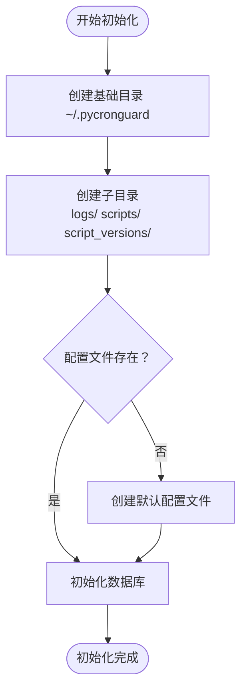
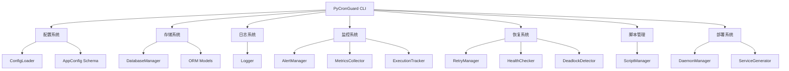
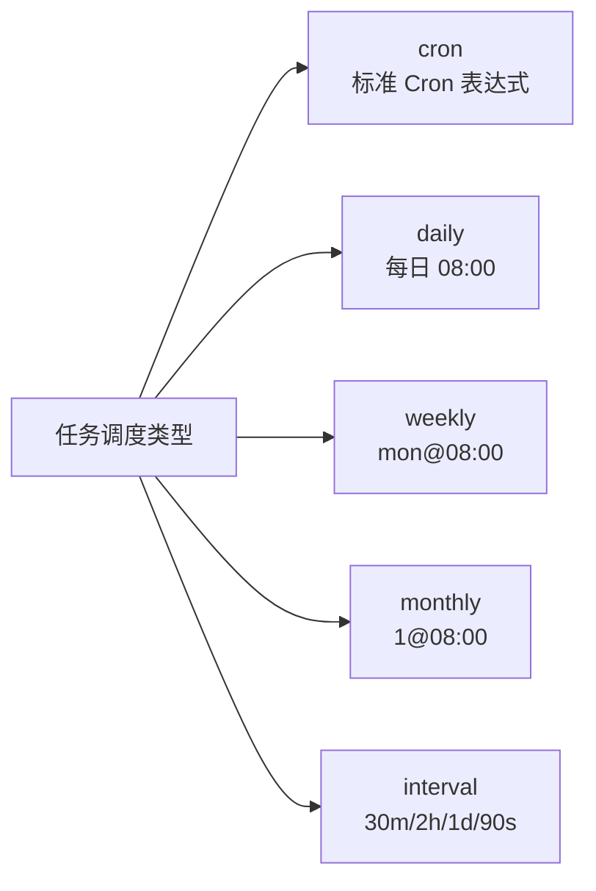
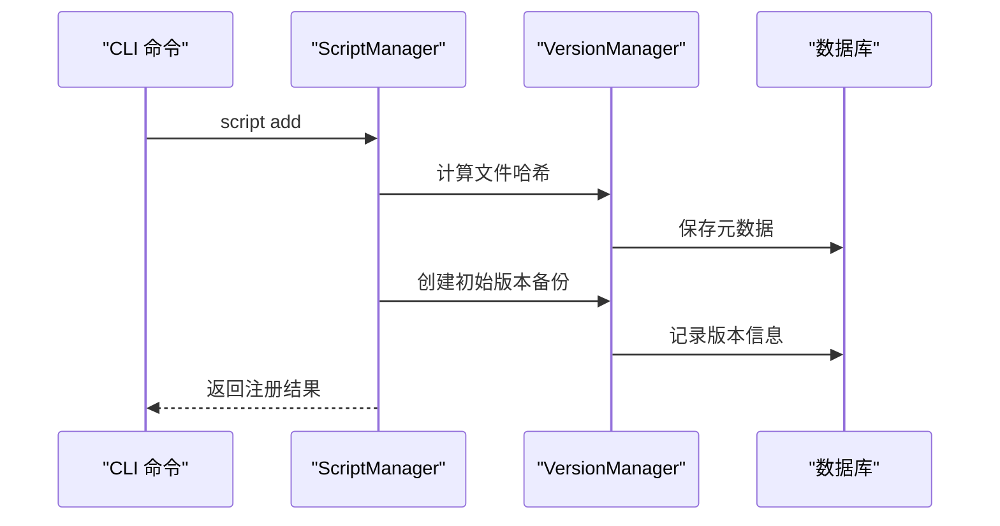
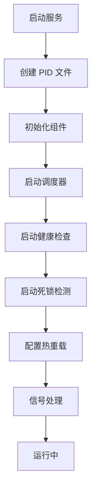

# 快速开始

<cite>
**本文引用的文件**
- [pyproject.toml](file://pyproject.toml)
- [requirements.txt](file://requirements.txt)
- [main.py](file://src/pycronguard/main.py)
- [default_config.yaml](file://config/default_config.yaml)
- [loader.py](file://src/pycronguard/config/loader.py)
- [schema.py](file://src/pycronguard/config/schema.py)
- [database.py](file://src/pycronguard/storage/database.py)
- [models.py](file://src/pycronguard/storage/models.py)
- [logger.py](file://src/pycronguard/logging/logger.py)
- [manager.py](file://src/pycronguard/scripts/manager.py)
- [daemon.py](file://src/pycronguard/deploy/daemon.py)
- [service.py](file://src/pycronguard/deploy/service.py)
- [example_task.py](file://scripts/example_task.py)
- [pycronguard.service](file://deploy/pycronguard.service)
- [com.pycronguard.plist](file://deploy/com.pycronguard.plist)
- [__init__.py](file://src/pycronguard/__init__.py)
</cite>

## 目录
1. [简介](#简介)
2. [安装与环境准备](#安装与环境准备)
3. [初始化系统](#初始化系统)
4. [配置系统](#配置系统)
5. [核心组件](#核心组件)
6. [CLI 命令详解](#cli-命令详解)
7. [第一个定时任务](#第一个定时任务)
8. [任务管理](#任务管理)
9. [脚本管理](#脚本管理)
10. [部署与服务化](#部署与服务化)
11. [监控与健康检查](#监控与健康检查)
12. [故障排除指南](#故障排除指南)
13. [最佳实践](#最佳实践)

## 简介
PyCronGuard 是一个功能完整的 Python 定时任务管理与监控工具，基于 APScheduler 实现调度，支持 YAML 配置、SQLite 存储、日志轮转与 JSON 输出、邮件告警、健康检查与自动恢复、脚本版本管理等功能。本"快速开始"将帮助你完成环境准备、安装与配置，并通过一个最小可行示例带你创建第一个定时任务，随后演示常见使用场景与故障排除建议。

## 安装与环境准备
- **Python 版本要求**：3.10 及以上
- **推荐使用虚拟环境**隔离依赖
- **核心依赖**包括 APScheduler、PyYAML、SQLAlchemy、Click、psutil、watchdog
- **安装方式**：
  - 通过 pip 安装：`pip install pycronguard`
  - 从源码安装：`pip install -e .`
  - 开发依赖：`pip install -e ".[dev]"`

**章节来源**
- [pyproject.toml:9](file://pyproject.toml#L9)
- [pyproject.toml:11-18](file://pyproject.toml#L11-L18)
- [requirements.txt:1-7](file://requirements.txt#L1-7)

## 初始化系统
PyCronGuard 提供完整的初始化流程，自动创建必要的目录结构和配置文件：



**图表来源**
- [main.py:169-231](file://src/pycronguard/main.py#L169-L231)

**使用方法**：
```bash
# 初始化系统
pycronguard init

# 查看当前状态
pycronguard status

# 启动服务
pycronguard start

# 停止服务
pycronguard stop
```

**章节来源**
- [main.py:169-231](file://src/pycronguard/main.py#L169-L231)
- [main.py:238-340](file://src/pycronguard/main.py#L238-L340)

## 配置系统
默认配置文件提供完整的系统配置选项：

**核心配置项**：
- **调度器配置**：`max_workers`、`max_instances`、`timezone`
- **存储配置**：`db_path`（SQLite 数据库路径）
- **日志配置**：`log_dir`、`level`、`max_days`、`json_format`
- **告警配置**：`failure_immediate`、`consecutive_failure_threshold`、`cooldown_seconds`
- **恢复配置**：`max_retries`、`retry_delay`、`backoff_factor`、`health_check_interval`
- **脚本管理配置**：`script_dir`、`version_dir`、`max_versions`
- **PID 文件路径**：`pid_file`

**章节来源**
- [default_config.yaml:1-57](file://config/default_config.yaml#L1-L57)
- [loader.py:83-204](file://src/pycronguard/config/loader.py#L83-L204)
- [schema.py:12-96](file://src/pycronguard/config/schema.py#L12-L96)

## 核心组件
PyCronGuard 采用模块化架构设计，包含以下核心组件：



**图表来源**
- [main.py:53-145](file://src/pycronguard/main.py#L53-L145)
- [database.py:29-271](file://src/pycronguard/storage/database.py#L29-L271)
- [logger.py:90-159](file://src/pycronguard/logging/logger.py#L90-L159)

**章节来源**
- [main.py:53-145](file://src/pycronguard/main.py#L53-L145)
- [database.py:29-271](file://src/pycronguard/storage/database.py#L29-L271)
- [logger.py:90-159](file://src/pycronguard/logging/logger.py#L90-L159)

## CLI 命令详解

### 基础命令
- `pycronguard init`：初始化系统配置和目录结构
- `pycronguard start`：启动调度器服务（支持守护进程模式）
- `pycronguard stop`：停止守护进程
- `pycronguard status`：查看运行状态

### 任务管理命令
- `pycronguard task add`：添加新任务
- `pycronguard task remove`：删除任务
- `pycronguard task list`：列出所有任务
- `pycronguard task run`：立即执行任务
- `pycronguard task history`：查看任务历史记录

### 脚本管理命令
- `pycronguard script add`：注册脚本
- `pycronguard script remove`：注销脚本
- `pycronguard script list`：列出所有脚本
- `pycronguard script info`：查看脚本详细信息

### 系统命令
- `pycronguard health`：执行系统健康检查
- `pycronguard --help`：显示帮助信息

**章节来源**
- [main.py:153-985](file://src/pycronguard/main.py#L153-L985)

## 第一个定时任务

### 步骤 1：创建示例脚本
首先，让我们创建一个简单的示例任务脚本：

**章节来源**
- [example_task.py:1-68](file://scripts/example_task.py#L1-L68)

### 步骤 2：注册脚本
```bash
# 注册示例脚本
pycronguard script add --path scripts/example_task.py --name example-task
```

### 步骤 3：创建定时任务
```bash
# 创建每 5 分钟执行一次的任务
pycronguard task add --name example-task \
    --script example-task \
    --schedule-type interval --schedule 5m \
    --priority 5 --timeout 3600
```

### 步骤 4：启动服务并测试
```bash
# 启动服务
pycronguard start

# 立即执行一次任务
pycronguard task run example-task

# 查看任务历史
pycronguard task history example-task
```

**章节来源**
- [example_task.py:12-23](file://scripts/example_task.py#L12-L23)
- [main.py:435-527](file://src/pycronguard/main.py#L435-L527)

## 任务管理

### 任务类型支持
PyCronGuard 支持多种调度类型：



**图表来源**
- [main.py:435-527](file://src/pycronguard/main.py#L435-L527)

### 任务高级特性
- **优先级管理**：1-10 数值，数值越大优先级越高
- **超时控制**：防止任务长时间阻塞
- **重试机制**：自动重试失败的任务
- **依赖关系**：支持任务间的依赖关系
- **分类管理**：按类别组织和筛选任务

**章节来源**
- [main.py:435-527](file://src/pycronguard/main.py#L435-L527)
- [main.py:661-758](file://src/pycronguard/main.py#L661-L758)

## 脚本管理

### 脚本注册与版本控制


**图表来源**
- [manager.py:53-139](file://src/pycronguard/scripts/manager.py#L53-L139)

### 脚本管理功能
- **自动复制**：将外部脚本复制到受管目录
- **版本备份**：自动备份脚本变更历史
- **语法验证**：检查 Python 语法正确性
- **虚拟环境支持**：为脚本指定独立的 Python 环境
- **批量扫描**：发现未注册的脚本文件

**章节来源**
- [manager.py:53-139](file://src/pycronguard/scripts/manager.py#L53-L139)
- [manager.py:302-332](file://src/pycronguard/scripts/manager.py#L302-L332)

## 部署与服务化

### 守护进程管理
PyCronGuard 提供完整的守护进程支持：



**图表来源**
- [main.py:238-340](file://src/pycronguard/main.py#L238-L340)
- [daemon.py:37-86](file://src/pycronguard/deploy/daemon.py#L37-L86)

### 系统服务生成
支持多平台的服务配置生成：

- **Linux systemd**：自动生成 `.service` 文件
- **macOS launchd**：自动生成 `.plist` 文件  
- **Windows**：生成启动批处理脚本

**章节来源**
- [daemon.py:37-86](file://src/pycronguard/deploy/daemon.py#L37-L86)
- [service.py:62-86](file://src/pycronguard/deploy/service.py#L62-L86)

## 监控与健康检查

### 健康检查指标
- **CPU 使用率**：超过阈值触发告警
- **内存使用率**：监控系统资源使用情况
- **磁盘使用率**：检查存储空间
- **负载均值**：评估系统整体负载

### 告警系统
- **即时告警**：任务失败时立即通知
- **连续告警**：多次失败后触发
- **冷却机制**：避免重复告警
- **邮件告警**：支持 SMTP 配置

**章节来源**
- [main.py:928-977](file://src/pycronguard/main.py#L928-L977)
- [default_config.yaml:22-47](file://config/default_config.yaml#L22-L47)

## 故障排除指南

### 常见问题与解决方案

#### 初始化失败
**症状**：`pycronguard init` 报错
**原因**：权限不足或路径不存在
**解决**：检查用户权限，确保 `~/.pycronguard` 目录可写

#### 服务启动失败
**症状**：`pycronguard start` 后立即退出
**原因**：配置文件错误或数据库初始化失败
**解决**：检查配置文件格式，验证数据库路径权限

#### 任务执行失败
**症状**：任务状态显示失败
**解决**：查看任务历史记录，检查脚本语法和依赖

#### 守护进程无法停止
**症状**：`pycronguard stop` 无效
**解决**：检查 PID 文件，手动终止进程

**章节来源**
- [main.py:346-377](file://src/pycronguard/main.py#L346-L377)
- [daemon.py:159-213](file://src/pycronguard/deploy/daemon.py#L159-L213)

## 最佳实践

### 配置管理
- 使用版本控制系统管理配置文件
- 为不同环境准备不同的配置
- 定期备份配置和数据库

### 任务设计
- 为每个任务设置合理的超时时间
- 使用优先级管理关键任务
- 建立任务依赖关系图
- 实施重试策略和告警机制

### 监控与维护
- 定期检查系统健康状态
- 监控资源使用情况
- 备份重要数据和配置
- 制定应急响应计划

### 部署策略
- 生产环境使用 systemd/launchd 服务
- 配置适当的日志轮转
- 设置监控和告警
- 定期更新和维护

通过本快速开始指南，你已经掌握了 PyCronGuard 的核心功能和使用方法。建议在生产环境中进一步完善配置，建立完善的监控和告警体系，并结合实际业务需求优化任务设计和部署策略。