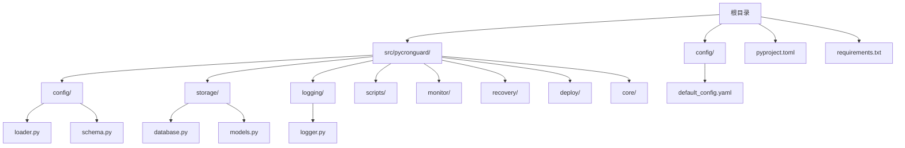
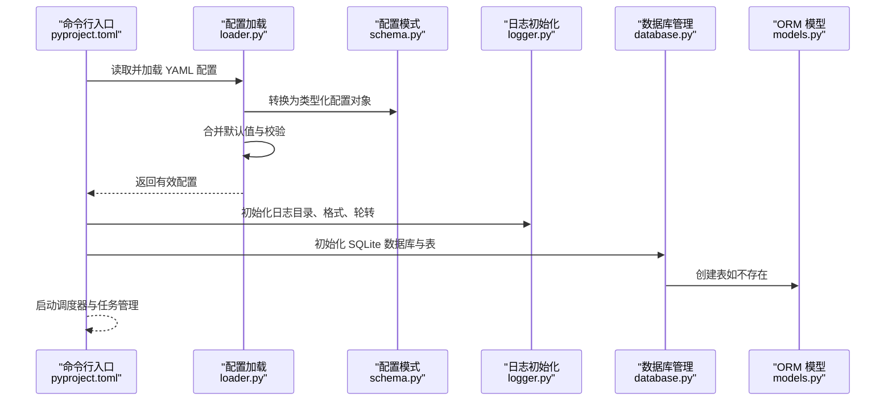
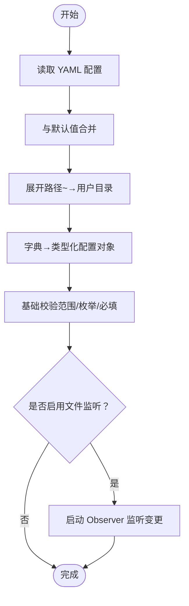
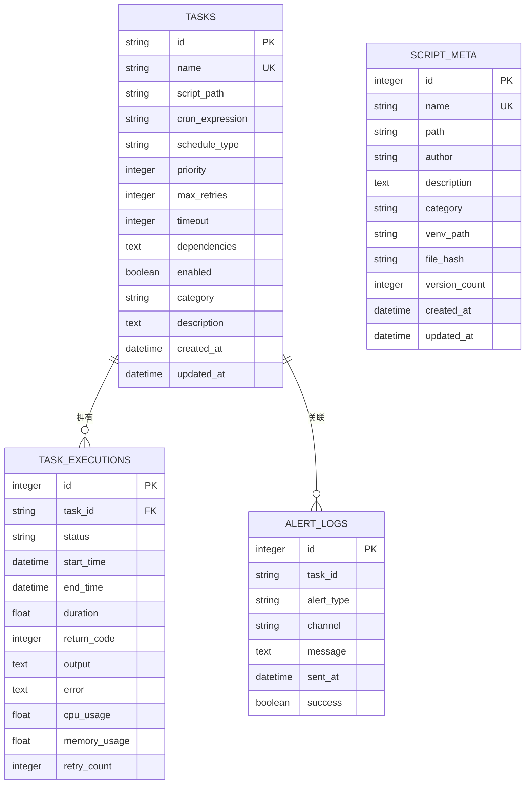
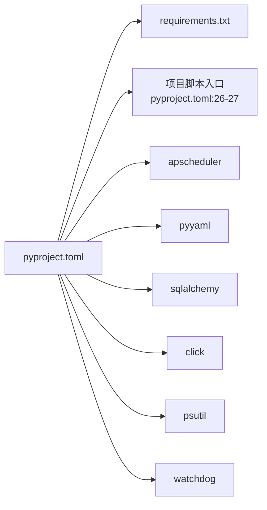

# 快速开始

<cite>
**本文引用的文件**
- [pyproject.toml](file://pyproject.toml)
- [requirements.txt](file://requirements.txt)
- [default_config.yaml](file://config/default_config.yaml)
- [loader.py](file://src/pycronguard/config/loader.py)
- [schema.py](file://src/pycronguard/config/schema.py)
- [database.py](file://src/pycronguard/storage/database.py)
- [models.py](file://src/pycronguard/storage/models.py)
- [logger.py](file://src/pycronguard/logging/logger.py)
- [__init__.py](file://src/pycronguard/__init__.py)
</cite>

## 目录
1. [简介](#简介)
2. [项目结构](#项目结构)
3. [核心组件](#核心组件)
4. [架构总览](#架构总览)
5. [详细组件分析](#详细组件分析)
6. [依赖分析](#依赖分析)
7. [性能考虑](#性能考虑)
8. [故障排除指南](#故障排除指南)
9. [结论](#结论)
10. [附录](#附录)

## 简介
PyCronGuard 是一个强大的 Python 定时任务管理与监控工具，基于 APScheduler 实现调度，支持 YAML 配置、SQLite 存储、日志轮转与 JSON 输出、邮件告警、健康检查与自动恢复、脚本版本管理等功能。本“快速开始”将帮助你完成环境准备、安装与配置，并通过一个最小可行示例带你创建第一个定时任务，随后演示常见使用场景与故障排除建议。

## 项目结构
仓库采用按功能域分层的组织方式：核心配置、存储、日志、监控、恢复、脚本管理等模块清晰分离；默认配置位于 config 目录下；包结构以 src/pycronguard 为核心，通过 pyproject.toml 中的入口点暴露命令行工具。

图表来源
- [pyproject.toml:1-34](file://pyproject.toml#L1-L34)
- [default_config.yaml:1-57](file://config/default_config.yaml#L1-L57)
- [loader.py:1-204](file://src/pycronguard/config/loader.py#L1-L204)
- [schema.py:1-151](file://src/pycronguard/config/schema.py#L1-L151)
- [database.py:1-271](file://src/pycronguard/storage/database.py#L1-L271)
- [models.py:1-125](file://src/pycronguard/storage/models.py#L1-L125)
- [logger.py:1-159](file://src/pycronguard/logging/logger.py#L1-L159)

章节来源
- [pyproject.toml:1-34](file://pyproject.toml#L1-L34)
- [requirements.txt:1-7](file://requirements.txt#L1-L7)
- [default_config.yaml:1-57](file://config/default_config.yaml#L1-L57)

## 核心组件
- 配置系统：提供 YAML 加载、默认值合并、路径展开、校验与文件变更监听能力，支持嵌套数据类结构。
- 存储系统：基于 SQLAlchemy 的 SQLite 管理器，提供任务、执行记录、脚本元数据、告警日志的 CRUD。
- 日志系统：支持 JSON 格式输出、按日轮转、控制台输出与保留天数设置。
- 默认配置：集中定义调度器、存储、日志、告警、恢复、脚本管理、PID 文件等默认参数。

章节来源
- [loader.py:83-204](file://src/pycronguard/config/loader.py#L83-L204)
- [schema.py:85-151](file://src/pycronguard/config/schema.py#L85-L151)
- [database.py:29-271](file://src/pycronguard/storage/database.py#L29-L271)
- [models.py:19-125](file://src/pycronguard/storage/models.py#L19-L125)
- [logger.py:90-159](file://src/pycronguard/logging/logger.py#L90-L159)
- [default_config.yaml:1-57](file://config/default_config.yaml#L1-L57)

## 架构总览
下图展示了从命令行到配置加载、数据库初始化、日志配置以及任务执行记录的端到端流程。

图表来源
- [pyproject.toml:26-27](file://pyproject.toml#L26-L27)
- [loader.py:100-116](file://src/pycronguard/config/loader.py#L100-L116)
- [schema.py:98-151](file://src/pycronguard/config/schema.py#L98-L151)
- [logger.py:90-147](file://src/pycronguard/logging/logger.py#L90-L147)
- [database.py:37-46](file://src/pycronguard/storage/database.py#L37-L46)
- [models.py:19-125](file://src/pycronguard/storage/models.py#L19-L125)

## 详细组件分析

### 安装与环境准备
- Python 版本要求：3.10 及以上。
- 推荐使用虚拟环境隔离依赖。
- 依赖项包括 APScheduler、PyYAML、SQLAlchemy、Click、psutil、watchdog。
- 可通过 pip 安装或从源码安装。

章节来源
- [pyproject.toml:9](file://pyproject.toml#L9)
- [pyproject.toml:11-18](file://pyproject.toml#L11-L18)
- [requirements.txt:1-7](file://requirements.txt#L1-7)

### 配置系统与默认配置
- 默认配置文件提供调度器、存储、日志、告警、恢复、脚本管理、PID 文件等键位。
- 配置加载器负责：
  - 读取 YAML 并与默认值递归合并；
  - 将路径中的波浪号展开为用户主目录；
  - 将字典转换为类型化配置对象；
  - 执行基础校验（数值范围、枚举集合、必填项）；
  - 可选地启动文件变更监听，实时重新加载配置。

图表来源
- [loader.py:100-116](file://src/pycronguard/config/loader.py#L100-L116)
- [loader.py:50-61](file://src/pycronguard/config/loader.py#L50-L61)
- [loader.py:174-203](file://src/pycronguard/config/loader.py#L174-L203)
- [schema.py:107-151](file://src/pycronguard/config/schema.py#L107-L151)

章节来源
- [default_config.yaml:1-57](file://config/default_config.yaml#L1-L57)
- [loader.py:83-204](file://src/pycronguard/config/loader.py#L83-L204)
- [schema.py:12-96](file://src/pycronguard/config/schema.py#L12-L96)

### 数据库与模型
- 数据库管理器负责：
  - 自动创建父目录；
  - 初始化 SQLite 引擎；
  - 创建所有表（首次运行）；
  - 提供带事务的会话上下文；
  - 提供任务、执行记录、脚本元数据、告警日志的 CRUD 方法。
- ORM 模型涵盖：
  - 任务定义（名称唯一、可选 Cron 表达式、优先级、超时、依赖等）；
  - 任务执行记录（状态、耗时、返回码、输出、错误、资源使用、重试计数）；
  - 脚本元数据（路径、作者、描述、分类、虚拟环境、哈希、版本计数）；
  - 告警日志（类型、通道、消息、发送时间、成功标记）。

图表来源
- [models.py:19-125](file://src/pycronguard/storage/models.py#L19-L125)
- [database.py:29-271](file://src/pycronguard/storage/database.py#L29-L271)

章节来源
- [database.py:29-271](file://src/pycronguard/storage/database.py#L29-L271)
- [models.py:19-125](file://src/pycronguard/storage/models.py#L19-L125)

### 日志系统
- 支持 JSON 格式输出与人类可读格式切换；
- 按日轮转并按保留天数清理旧文件；
- 控制台与文件双通道输出；
- 提供命名 Logger 获取方法。

章节来源
- [logger.py:18-84](file://src/pycronguard/logging/logger.py#L18-L84)
- [logger.py:90-159](file://src/pycronguard/logging/logger.py#L90-L159)

### 第一个定时任务：从零到运行
以下为最小可行示例的步骤说明（不包含具体代码内容）：

- 准备环境
  - 使用 Python 3.10+ 创建并激活虚拟环境。
  - 安装依赖：可通过 pip 安装或从源码安装。
- 创建配置文件
  - 在用户主目录下创建配置目录，并复制默认配置文件作为起点。
  - 至少配置存储数据库路径、日志目录、脚本目录等关键路径。
- 初始化数据库
  - 启动应用时会自动创建数据库与表（若不存在）。
- 编写一个简单脚本
  - 将脚本放置在配置中指定的脚本目录下，确保可执行权限。
- 注册并启动任务
  - 通过命令行工具注册一个任务（包含脚本路径、Cron 表达式或周期类型），并启动服务。
- 查看任务状态与执行结果
  - 查询最近执行记录，确认状态、耗时、返回码、输出与错误信息。
- 监控与告警
  - 如启用邮件告警，可在连续失败或性能异常时收到通知。

章节来源
- [default_config.yaml:11-56](file://config/default_config.yaml#L11-L56)
- [database.py:37-46](file://src/pycronguard/storage/database.py#L37-L46)
- [models.py:53-77](file://src/pycronguard/storage/models.py#L53-L77)

## 依赖分析
- 构建与运行依赖由 pyproject.toml 统一声明，其中包含 Python 版本要求与核心依赖列表。
- requirements.txt 提供与 pyproject.toml 对应的纯文本依赖清单，便于直接安装。
- 入口点通过项目脚本映射到命令行函数，便于全局调用。

图表来源
- [pyproject.toml:11-18](file://pyproject.toml#L11-L18)
- [pyproject.toml:26-27](file://pyproject.toml#L26-L27)
- [requirements.txt:1-7](file://requirements.txt#L1-L7)

章节来源
- [pyproject.toml:1-34](file://pyproject.toml#L1-L34)
- [requirements.txt:1-7](file://requirements.txt#L1-L7)

## 性能考虑
- 调度器线程池大小与并发实例数需结合系统资源与任务特性合理配置，避免过度竞争导致抖动。
- 日志轮转与保留天数影响磁盘占用，建议根据业务规模调整。
- 数据库操作建议批量写入与适度索引，避免频繁小事务造成开销。
- 健康检查与资源阈值（CPU、内存、磁盘）应结合实际负载设定，防止误报或漏报。

## 故障排除指南
- Python 版本过低
  - 症状：安装或运行时报错。
  - 处理：升级至 Python 3.10+。
- 依赖缺失或版本冲突
  - 症状：导入模块失败或运行时报错。
  - 处理：使用 requirements.txt 或 pyproject.toml 的依赖清单进行安装；在虚拟环境中隔离依赖。
- 配置文件无效
  - 症状：配置加载失败或校验异常。
  - 处理：对照默认配置逐项检查键名与类型；确保路径可解析且存在；必要时关闭文件监听以避免干扰。
- 数据库无法初始化
  - 症状：首次启动报错或表未创建。
  - 处理：确认数据库路径可写；检查权限；删除或迁移旧数据库文件后重启。
- 日志输出不符合预期
  - 症状：日志未生成、格式不符或未轮转。
  - 处理：检查日志目录权限与轮转参数；确认 JSON 格式开关与级别设置。
- 任务未执行或状态异常
  - 症状：任务未触发、状态停滞或频繁失败。
  - 处理：检查 Cron 表达式或周期类型；查看最近执行记录与错误字段；核对脚本路径与可执行权限；适当提高超时与重试策略。

章节来源
- [schema.py:107-151](file://src/pycronguard/config/schema.py#L107-L151)
- [database.py:37-46](file://src/pycronguard/storage/database.py#L37-L46)
- [logger.py:90-147](file://src/pycronguard/logging/logger.py#L90-L147)
- [models.py:53-77](file://src/pycronguard/storage/models.py#L53-L77)

## 结论
通过本快速开始指南，你已了解 PyCronGuard 的安装与配置要点、核心组件职责与数据流，并完成了首个定时任务的最小可行示例。建议在生产环境中进一步完善配置（如启用邮件告警、设置健康检查与恢复策略），并结合日志与执行记录持续优化任务稳定性与可观测性。

## 附录
- 版本信息：参见包内版本常量。
- 默认配置参考：参见默认配置文件中的各节键位与默认值。

章节来源
- [__init__.py:1-4](file://src/pycronguard/__init__.py#L1-L4)
- [default_config.yaml:1-57](file://config/default_config.yaml#L1-L57)