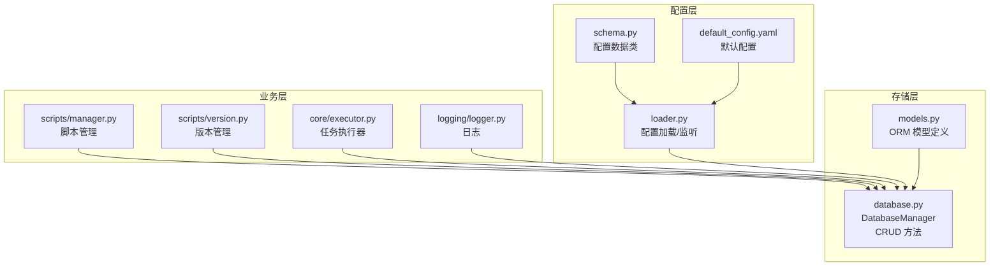
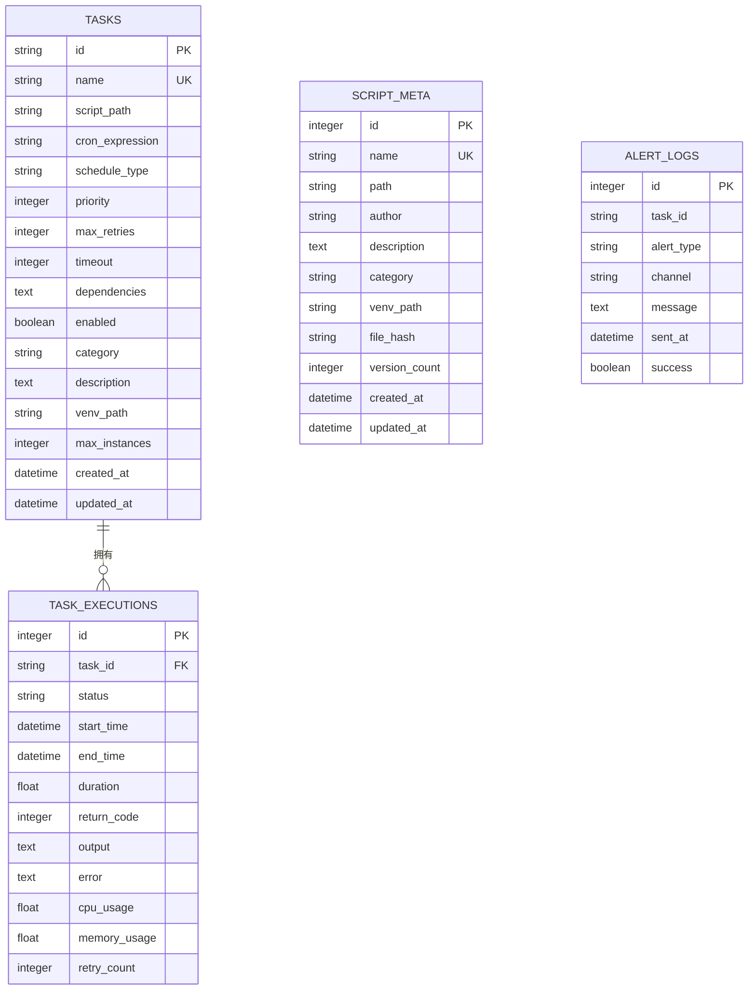
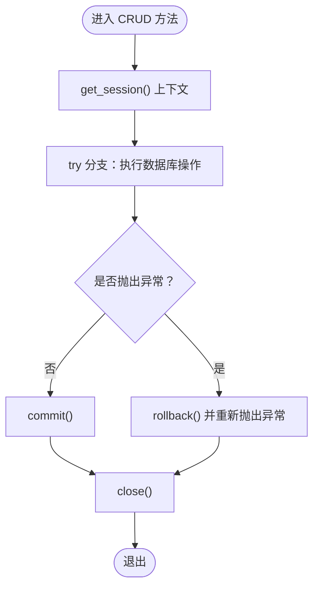
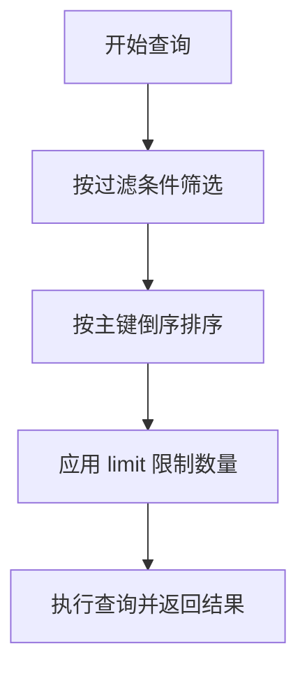
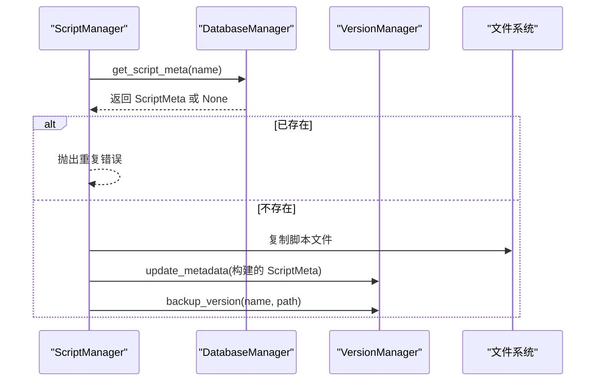
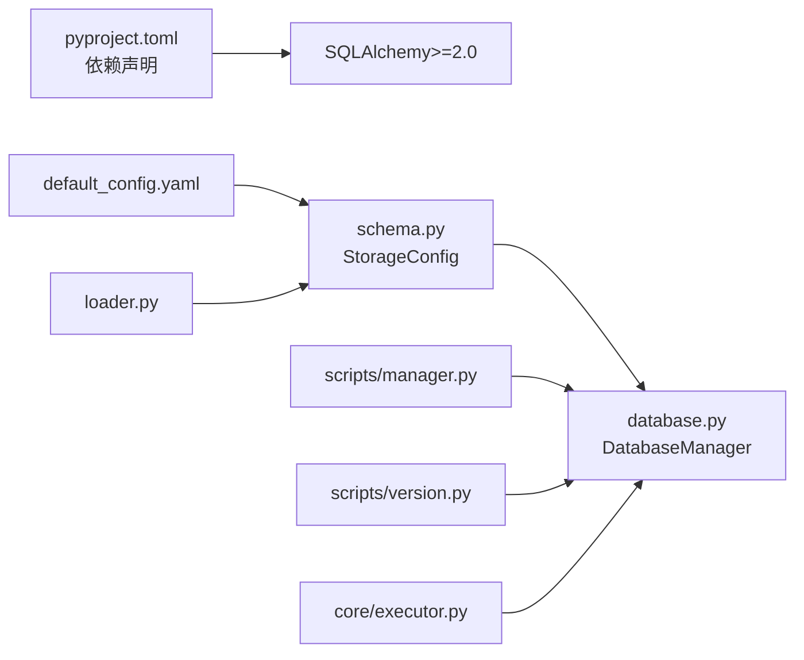

# CRUD 操作实现

<cite>
**本文引用的文件**
- [models.py](file://src/pycronguard/storage/models.py)
- [database.py](file://src/pycronguard/storage/database.py)
- [loader.py](file://src/pycronguard/config/loader.py)
- [schema.py](file://src/pycronguard/config/schema.py)
- [default_config.yaml](file://config/default_config.yaml)
- [manager.py](file://src/pycronguard/scripts/manager.py)
- [version.py](file://src/pycronguard/scripts/version.py)
- [executor.py](file://src/pycronguard/core/executor.py)
- [logger.py](file://src/pycronguard/logging/logger.py)
- [pyproject.toml](file://pyproject.toml)
</cite>

## 目录
1. [简介](#简介)
2. [项目结构](#项目结构)
3. [核心组件](#核心组件)
4. [架构总览](#架构总览)
5. [详细组件分析](#详细组件分析)
6. [依赖分析](#依赖分析)
7. [性能考虑](#性能考虑)
8. [故障排查指南](#故障排查指南)
9. [结论](#结论)
10. [附录](#附录)

## 简介
本文件面向 PyCronGuard 的 CRUD 操作实现，系统性梳理数据模型与数据库访问层的增删改查方法设计、事务处理机制、查询优化策略、分页与排序实现、性能优化建议、错误处理与调试技巧，并提供扩展自定义 CRUD 方法的指导。内容基于存储层的 SQLAlchemy ORM 模型与数据库管理器实现，覆盖任务、执行记录、脚本元数据与告警日志等实体。

## 项目结构
PyCronGuard 的存储层位于 storage 子包，核心由以下模块组成：
- models.py：定义 SQLAlchemy ORM 模型（TaskRecord、TaskExecution、ScriptMeta、AlertLog）。
- database.py：封装数据库引擎、会话管理与各模型的 CRUD 方法。
- config/loader.py 与 config/schema.py：配置加载与校验，其中包含存储配置（数据库路径）。
- scripts/manager.py 与 scripts/version.py：脚本仓库管理与版本备份，内部通过 DatabaseManager 访问数据库。
- core/executor.py：任务执行器在运行后写入执行记录到数据库。
- logging/logger.py：日志初始化，便于定位数据库与业务问题。
- pyproject.toml：项目依赖，包含 SQLAlchemy 版本要求。



图表来源
- [models.py:15-131](file://src/pycronguard/storage/models.py#L15-L131)
- [database.py:29-271](file://src/pycronguard/storage/database.py#L29-L271)
- [loader.py:83-204](file://src/pycronguard/config/loader.py#L83-L204)
- [schema.py:86-151](file://src/pycronguard/config/schema.py#L86-L151)
- [default_config.yaml:1-57](file://config/default_config.yaml#L1-L57)
- [manager.py:23-441](file://src/pycronguard/scripts/manager.py#L23-L441)
- [version.py:52-310](file://src/pycronguard/scripts/version.py#L52-L310)
- [executor.py:342-379](file://src/pycronguard/core/executor.py#L342-L379)
- [logger.py:98-127](file://src/pycronguard/logging/logger.py#L98-L127)

章节来源
- [models.py:15-131](file://src/pycronguard/storage/models.py#L15-L131)
- [database.py:29-271](file://src/pycronguard/storage/database.py#L29-L271)
- [loader.py:83-204](file://src/pycronguard/config/loader.py#L83-L204)
- [schema.py:86-151](file://src/pycronguard/config/schema.py#L86-L151)
- [default_config.yaml:1-57](file://config/default_config.yaml#L1-L57)
- [manager.py:23-441](file://src/pycronguard/scripts/manager.py#L23-L441)
- [version.py:52-310](file://src/pycronguard/scripts/version.py#L52-L310)
- [executor.py:342-379](file://src/pycronguard/core/executor.py#L342-L379)
- [logger.py:98-127](file://src/pycronguard/logging/logger.py#L98-L127)

## 核心组件
- 数据模型（ORM）：TaskRecord、TaskExecution、ScriptMeta、AlertLog，分别对应“任务”“执行记录”“脚本元数据”“告警日志”四类实体。
- 数据库管理器（DatabaseManager）：封装 SQLAlchemy 引擎与会话工厂，提供统一的 get_session 上下文管理器，确保自动提交与异常回滚；并暴露各模型的 CRUD 方法族（add_*、get_*、list_*、update_*、delete_*）。
- 配置系统：通过 ConfigLoader 加载 YAML，默认配置来自 default_config.yaml，Schema 定义了 StorageConfig（含 db_path），用于确定 SQLite 数据库文件位置。
- 业务集成：脚本管理器与版本管理器通过 DatabaseManager 访问数据库；任务执行器在执行完成后写入 TaskExecution 记录。

章节来源
- [models.py:19-131](file://src/pycronguard/storage/models.py#L19-L131)
- [database.py:29-271](file://src/pycronguard/storage/database.py#L29-L271)
- [loader.py:83-204](file://src/pycronguard/config/loader.py#L83-L204)
- [schema.py:21-96](file://src/pycronguard/config/schema.py#L21-L96)
- [default_config.yaml:11-14](file://config/default_config.yaml#L11-L14)
- [manager.py:35-43](file://src/pycronguard/scripts/manager.py#L35-L43)
- [version.py:61-72](file://src/pycronguard/scripts/version.py#L61-L72)
- [executor.py:362-374](file://src/pycronguard/core/executor.py#L362-L374)

## 架构总览
下图展示 CRUD 层与上层业务的交互关系，以及事务控制与查询排序的关键路径。

```mermaid
sequenceDiagram
participant Caller as "调用方"
participant DBM as "DatabaseManager"
participant Sess as "SQLAlchemy 会话"
participant ORM as "ORM 模型"
Caller->>DBM : 调用 CRUD 方法如 add_task/get_task/list_tasks 等
DBM->>DBM : get_session() 上下文管理器
DBM->>Sess : 创建会话并进入 try 分支
DBM->>Sess : 执行 add/query/delete/update
alt 成功
Sess-->>DBM : commit()
else 异常
Sess-->>DBM : rollback()
DBM-->>Caller : 抛出异常
finally
Sess-->>DBM : close()
end
DBM-->>Caller : 返回结果或 None
```

图表来源
- [database.py:52-68](file://src/pycronguard/storage/database.py#L52-L68)
- [database.py:74-135](file://src/pycronguard/storage/database.py#L74-L135)
- [database.py:141-184](file://src/pycronguard/storage/database.py#L141-L184)
- [database.py:190-239](file://src/pycronguard/storage/database.py#L190-L239)
- [database.py:245-271](file://src/pycronguard/storage/database.py#L245-L271)

## 详细组件分析

### 数据模型与表结构
- TaskRecord：任务定义，主键为字符串 UUID，包含名称唯一索引、优先级、重试、超时、依赖、启用状态、分类、描述、虚拟环境路径、最大并发实例数等字段，并带有 created_at/updated_at 时间戳。
- TaskExecution：单次执行记录，外键关联任务，包含状态、开始/结束时间、耗时、返回码、输出、错误、CPU/内存使用、重试计数等字段，并按主键倒序排序。
- ScriptMeta：脚本元数据，名称唯一，包含作者、描述、分类、虚拟环境路径、文件哈希、版本数量、时间戳等。
- AlertLog：告警日志，包含任务 ID、告警类型（failure/consecutive_failure/performance）、通道（email）、消息、发送时间、成功标志等，并按主键倒序排序。



图表来源
- [models.py:19-131](file://src/pycronguard/storage/models.py#L19-L131)

章节来源
- [models.py:19-131](file://src/pycronguard/storage/models.py#L19-L131)

### 事务处理机制与调用约定
- 会话生命周期：DatabaseManager.get_session() 提供上下文管理器，确保异常时自动回滚，成功时自动提交，并最终关闭会话。
- 调用约定：
  - add_*：接收模型实例，直接 session.add()，无需额外参数。
  - get_*：按主键或唯一字段查询，返回模型实例或 None。
  - list_*：返回列表，通常按主键倒序以获得最新记录。
  - update_*：按过滤条件更新，传入关键字参数映射字段名与新值。
  - delete_*：按主键获取并删除，若不存在则忽略。



图表来源
- [database.py:52-68](file://src/pycronguard/storage/database.py#L52-L68)

章节来源
- [database.py:52-68](file://src/pycronguard/storage/database.py#L52-L68)
- [database.py:74-135](file://src/pycronguard/storage/database.py#L74-L135)
- [database.py:141-184](file://src/pycronguard/storage/database.py#L141-L184)
- [database.py:190-239](file://src/pycronguard/storage/database.py#L190-L239)
- [database.py:245-271](file://src/pycronguard/storage/database.py#L245-L271)

### 查询优化与分页排序
- 排序策略：对 TaskExecution 与 AlertLog 的 list_* 查询均采用按主键倒序（desc），以保证“最近优先”的展示效果。
- 分页策略：list_* 方法接受 limit 参数（默认 50），并在查询中应用 limit 控制返回数量。
- 索引与唯一约束：模型层面已为 name 字段建立唯一索引（TaskRecord、ScriptMeta），可显著提升按名称查询效率。
- 批量操作建议：当前实现逐条 add/update，未见批量接口。如需大批量写入，可考虑使用 bulk_save_objects/bulk_insert_mappings（需在后续扩展中引入）。



图表来源
- [database.py:167-184](file://src/pycronguard/storage/database.py#L167-L184)
- [database.py:254-271](file://src/pycronguard/storage/database.py#L254-L271)
- [database.py:95-105](file://src/pycronguard/storage/database.py#L95-L105)
- [database.py:209-218](file://src/pycronguard/storage/database.py#L209-L218)

章节来源
- [database.py:167-184](file://src/pycronguard/storage/database.py#L167-L184)
- [database.py:254-271](file://src/pycronguard/storage/database.py#L254-L271)
- [database.py:95-105](file://src/pycronguard/storage/database.py#L95-L105)
- [database.py:209-218](file://src/pycronguard/storage/database.py#L209-L218)

### 业务集成与实际调用示例
- 脚本注册与注销：ScriptManager 在注册前通过 DatabaseManager 查询同名脚本是否存在；注销时删除 ScriptMeta 记录。
- 任务执行记录：TaskExecutor 在任务完成后调用 DatabaseManager.add_execution 写入执行记录。
- 配置驱动：ConfigLoader 加载 default_config.yaml 中的 storage.db_path，作为 DatabaseManager 初始化参数。



图表来源
- [manager.py:92-138](file://src/pycronguard/scripts/manager.py#L92-L138)
- [version.py:132-183](file://src/pycronguard/scripts/version.py#L132-L183)

章节来源
- [manager.py:92-138](file://src/pycronguard/scripts/manager.py#L92-L138)
- [version.py:132-183](file://src/pycronguard/scripts/version.py#L132-L183)
- [executor.py:362-374](file://src/pycronguard/core/executor.py#L362-L374)
- [loader.py:100-116](file://src/pycronguard/config/loader.py#L100-L116)
- [schema.py:21-26](file://src/pycronguard/config/schema.py#L21-L26)
- [default_config.yaml:11-14](file://config/default_config.yaml#L11-L14)

## 依赖分析
- SQLAlchemy 版本：项目要求 SQLAlchemy>=2.0，本 CRUD 实现使用 SQLAlchemy 2.0+ 的 DeclarativeBase/Mapped 风格与 desc 排序。
- 依赖关系：DatabaseManager 依赖 models 中的 ORM 类；ConfigLoader 生成 AppConfig，其中包含 StorageConfig.db_path；脚本管理器与版本管理器依赖 DatabaseManager；任务执行器依赖 DatabaseManager 写入执行记录。



图表来源
- [pyproject.toml:11-18](file://pyproject.toml#L11-L18)
- [schema.py:21-26](file://src/pycronguard/config/schema.py#L21-L26)
- [default_config.yaml:11-14](file://config/default_config.yaml#L11-L14)
- [loader.py:100-116](file://src/pycronguard/config/loader.py#L100-L116)
- [manager.py:35-43](file://src/pycronguard/scripts/manager.py#L35-L43)
- [version.py:61-72](file://src/pycronguard/scripts/version.py#L61-L72)
- [executor.py:362-374](file://src/pycronguard/core/executor.py#L362-L374)

章节来源
- [pyproject.toml:11-18](file://pyproject.toml#L11-L18)
- [schema.py:21-26](file://src/pycronguard/config/schema.py#L21-L26)
- [default_config.yaml:11-14](file://config/default_config.yaml#L11-L14)
- [loader.py:100-116](file://src/pycronguard/config/loader.py#L100-L116)
- [manager.py:35-43](file://src/pycronguard/scripts/manager.py#L35-L43)
- [version.py:61-72](file://src/pycronguard/scripts/version.py#L61-L72)
- [executor.py:362-374](file://src/pycronguard/core/executor.py#L362-L374)

## 性能考虑
- 查询排序与索引
  - 对于 TaskExecution 与 AlertLog 的 list_*，已按主键倒序排序，有利于“最近优先”展示；建议在高频过滤字段（如 task_id）上建立索引以加速查询。
  - 当前模型中 name 字段已具备唯一索引，有助于 get_task_by_name 与 get_script_meta 的快速检索。
- 分页与批量
  - list_* 已支持 limit 控制返回数量，建议在前端或调用侧设置合理上限，避免一次性拉取过多数据。
  - 若需要批量写入，可在现有 add_* 基础上扩展批量接口（如 bulk_save_objects），减少往返开销。
- 连接与会话
  - 当前使用 sessionmaker 绑定 engine，未启用连接池参数。可考虑在 create_engine 时增加 pool_size、max_overflow、pool_recycle 等参数以提升高并发下的连接复用效率。
- 日志与可观测性
  - 可开启 SQLAlchemy echo（开发阶段）观察 SQL 语句；生产环境建议关闭以降低日志噪声。
  - 结合 logging/logger.py 的日志配置，统一输出格式与轮转策略，便于定位数据库相关问题。

[本节为通用性能建议，不直接分析具体文件，故无章节来源]

## 故障排查指南
- 事务异常回滚
  - 若 CRUD 方法抛出异常，get_session 将触发回滚并重新抛出异常。请检查调用方是否正确捕获并记录异常。
- 常见问题定位
  - 数据库路径：确认 default_config.yaml 中 storage.db_path 是否正确展开与存在；ConfigLoader 会将 ~ 展开为用户目录。
  - 唯一约束冲突：注册脚本时若名称重复，将抛出值错误；注册任务时若名称重复，应避免重复插入。
  - 外键约束：删除任务前请确认无关联执行记录；删除脚本元数据不会影响历史版本文件。
- 调试技巧
  - 在开发阶段可临时开启 SQLAlchemy echo 观察 SQL 语句；结合 logger 的 JSON/文本格式输出定位问题。
  - 对于 list_* 查询，检查 limit 参数与排序字段是否符合预期。

章节来源
- [database.py:52-68](file://src/pycronguard/storage/database.py#L52-L68)
- [loader.py:50-61](file://src/pycronguard/config/loader.py#L50-L61)
- [default_config.yaml:11-14](file://config/default_config.yaml#L11-L14)
- [logger.py:98-127](file://src/pycronguard/logging/logger.py#L98-L127)

## 结论
PyCronGuard 的 CRUD 实现以 DatabaseManager 为核心，围绕 SQLAlchemy ORM 模型提供标准化的增删改查方法族，并通过上下文管理器确保事务一致性。查询层面采用主键倒序与 limit 分页，满足“最近优先”的展示需求；模型层面已具备关键字段的唯一索引，有助于提升查询效率。未来可在批量写入、连接池配置与索引策略方面进一步优化，以支撑更高吞吐与更低延迟的场景。

[本节为总结性内容，不直接分析具体文件，故无章节来源]

## 附录

### CRUD 方法族一览与调用约定
- 任务（TaskRecord）
  - 新增：add_task(task)
  - 查询：get_task(task_id)、get_task_by_name(name)
  - 列表：list_tasks()
  - 更新：update_task(task_id, **kwargs)
  - 删除：delete_task(task_id)
- 执行记录（TaskExecution）
  - 新增：add_execution(execution)
  - 查询：get_latest_execution(task_id)
  - 列表：list_executions(task_id, limit=50)
- 脚本元数据（ScriptMeta）
  - 新增：add_script_meta(meta)
  - 查询：get_script_meta(name)
  - 列表：list_script_metas()
  - 更新：update_script_meta(name, **kwargs)
  - 删除：delete_script_meta(name)
- 告警日志（AlertLog）
  - 新增：add_alert_log(log)
  - 列表：list_alert_logs(task_id=None, limit=50)

章节来源
- [database.py:74-135](file://src/pycronguard/storage/database.py#L74-L135)
- [database.py:141-184](file://src/pycronguard/storage/database.py#L141-L184)
- [database.py:190-239](file://src/pycronguard/storage/database.py#L190-L239)
- [database.py:245-271](file://src/pycronguard/storage/database.py#L245-L271)

### 扩展自定义 CRUD 方法的建议
- 设计原则
  - 保持与现有 CRUD 方法族一致的命名风格（add_/get_/list_/update_/delete_）。
  - 严格遵循事务约定：所有方法均应在 get_session 上下文中执行。
  - 明确过滤条件与排序规则，必要时补充索引。
- 典型扩展方向
  - 条件过滤：为常用过滤字段（如 task_id、status、category）添加索引，并在 CRUD 方法中显式使用 filter/filter_by。
  - 批量写入：新增 bulk_* 方法，减少多次往返；注意与事务边界配合。
  - 聚合统计：提供 count_* 或 stats_* 方法，返回聚合结果而非完整列表。
- 错误处理
  - 在方法内部捕获并记录可预期异常（如唯一约束冲突），对外抛出清晰的业务异常类型。
  - 对于不可恢复的异常（如数据库连接失败），确保回滚并向上抛出。

[本节为扩展指导，不直接分析具体文件，故无章节来源]