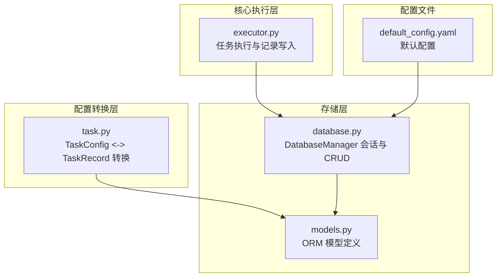
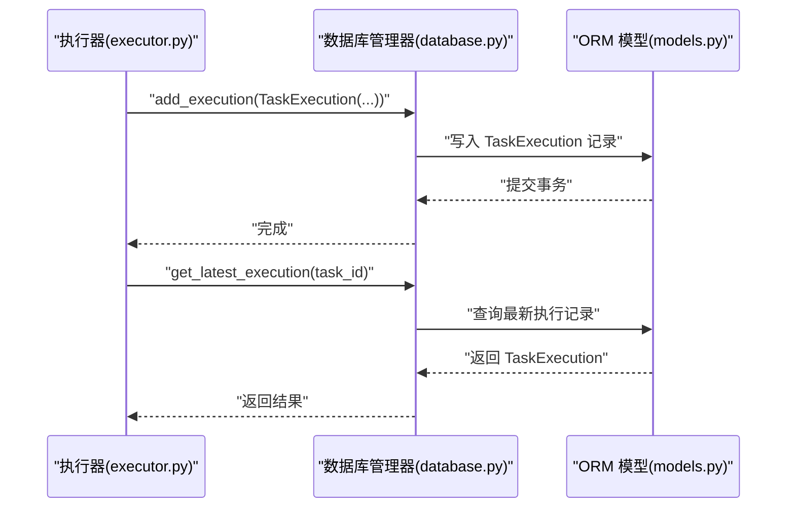
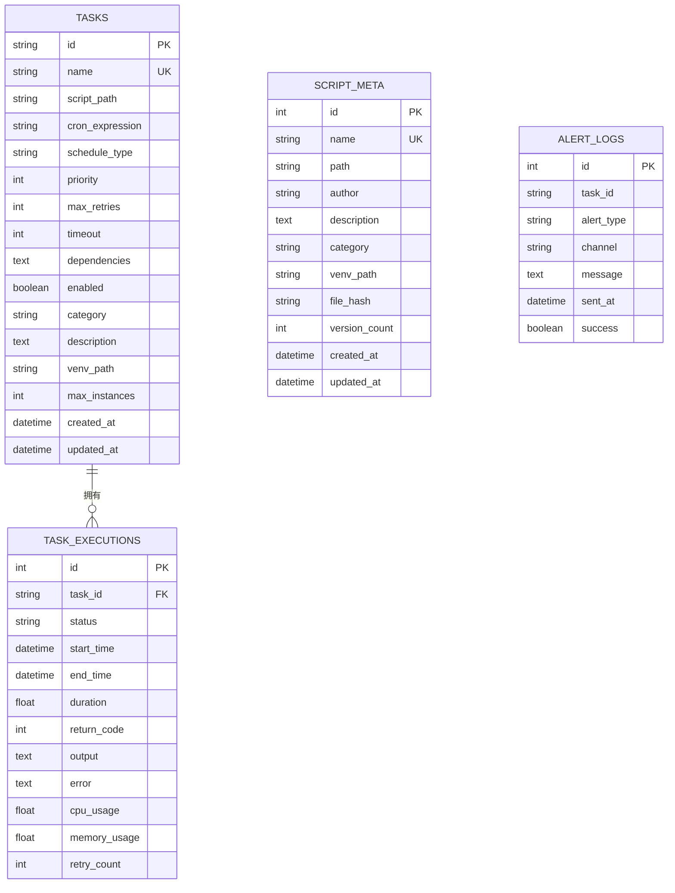
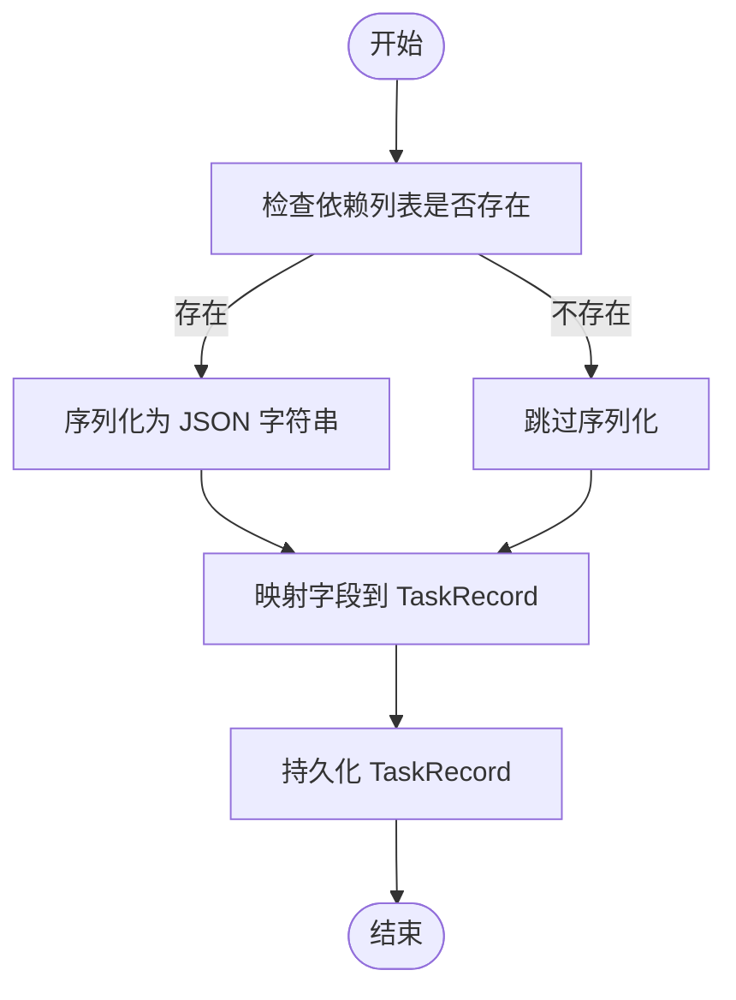

# ORM 模型定义

<cite>
**本文档引用的文件**
- [models.py](file://src/pycronguard/storage/models.py)
- [database.py](file://src/pycronguard/storage/database.py)
- [task.py](file://src/pycronguard/core/task.py)
- [executor.py](file://src/pycronguard/core/executor.py)
- [default_config.yaml](file://config/default_config.yaml)
- [pyproject.toml](file://pyproject.toml)
</cite>

## 目录
1. [简介](#简介)
2. [项目结构](#项目结构)
3. [核心组件](#核心组件)
4. [架构总览](#架构总览)
5. [详细组件分析](#详细组件分析)
6. [依赖关系分析](#依赖关系分析)
7. [性能考虑](#性能考虑)
8. [故障排除指南](#故障排除指南)
9. [结论](#结论)
10. [附录](#附录)

## 简介
本文件面向 PyCronGuard 的 SQLAlchemy ORM 模型，系统性地阐述 TaskRecord、TaskExecution、ScriptMeta、AlertLog 四个核心数据模型的设计理念、字段定义、数据类型与约束、模型间关联关系、业务语义、使用场景与数据流转过程，并提供序列化机制、JSON 转换支持、数据验证规则、扩展指导以及性能优化建议与查询最佳实践。文档同时结合实际代码实现，确保技术深度与可操作性。

## 项目结构
PyCronGuard 将 ORM 模型与数据库管理器集中于存储层，通过统一的 DatabaseManager 提供会话管理与 CRUD 操作封装，核心模块分布如下：
- 存储层：models.py 定义 ORM 模型；database.py 提供数据库生命周期与 CRUD 方法。
- 核心执行层：executor.py 在任务执行过程中持久化执行记录。
- 配置转换层：task.py 在内存 TaskConfig 与数据库 TaskRecord 之间进行双向转换，含 JSON 序列化处理。
- 配置文件：default_config.yaml 提供默认运行参数，其中包含数据库路径等关键配置项。

图表来源
- [models.py:1-131](file://src/pycronguard/storage/models.py#L1-L131)
- [database.py:1-271](file://src/pycronguard/storage/database.py#L1-L271)
- [executor.py:342-394](file://src/pycronguard/core/executor.py#L342-L394)
- [task.py:214-280](file://src/pycronguard/core/task.py#L214-L280)
- [default_config.yaml:11-13](file://config/default_config.yaml#L11-L13)

章节来源
- [models.py:1-131](file://src/pycronguard/storage/models.py#L1-L131)
- [database.py:1-271](file://src/pycronguard/storage/database.py#L1-L271)
- [task.py:1-280](file://src/pycronguard/core/task.py#L1-L280)
- [executor.py:112-415](file://src/pycronguard/core/executor.py#L112-L415)
- [default_config.yaml:1-57](file://config/default_config.yaml#L1-L57)

## 核心组件
本节概述四个 ORM 模型的职责与关键字段，便于快速理解整体设计。

- TaskRecord：注册的任务定义，包含任务标识、名称、脚本路径、调度表达式、优先级、重试策略、超时、依赖关系、启用状态、分类、描述、虚拟环境路径、最大并发实例数以及时间戳。
- TaskExecution：单次任务执行记录，包含执行标识、父任务 ID、执行状态、开始/结束时间、耗时、返回码、输出、错误信息、CPU/内存使用量以及重试计数。
- ScriptMeta：受管脚本元数据，包含脚本唯一标识、路径、作者、描述、分类、虚拟环境路径、文件哈希、版本数量以及时间戳。
- AlertLog：告警投递日志条目，包含告警标识、关联任务 ID、告警类型（失败、连续失败、性能）、通道（如邮件）、消息体、发送时间与成功标记。

章节来源
- [models.py:19-56](file://src/pycronguard/storage/models.py#L19-L56)
- [models.py:59-82](file://src/pycronguard/storage/models.py#L59-L82)
- [models.py:85-107](file://src/pycronguard/storage/models.py#L85-L107)
- [models.py:110-130](file://src/pycronguard/storage/models.py#L110-L130)

## 架构总览
ORM 模型与执行流程的关系如下：核心执行器在任务执行前后通过 DatabaseManager 写入或读取 TaskExecution 记录；配置转换层负责 TaskConfig 与 TaskRecord 的双向映射及 JSON 依赖序列化；DatabaseManager 统一封装 SQLite 引擎、会话生命周期与 CRUD 操作。

图表来源
- [executor.py:362-394](file://src/pycronguard/core/executor.py#L362-L394)
- [database.py:141-184](file://src/pycronguard/storage/database.py#L141-L184)
- [models.py:59-82](file://src/pycronguard/storage/models.py#L59-L82)

## 详细组件分析

### TaskRecord 模型
- 设计理念
  - 作为任务的“权威定义”，承载调度、执行策略与资源限制等信息。
  - 使用字符串主键（UUID）以避免冲突并便于跨系统迁移。
- 字段与约束
  - id：字符串主键，UUID，默认生成。
  - name：字符串唯一索引，非空，用于去重与检索。
  - script_path：脚本绝对路径，非空。
  - cron_expression：调度表达式，可空。
  - schedule_type：调度类型枚举值（cron/daily/weekly/monthly），可空。
  - priority：整数优先级，默认 5。
  - max_retries：最大重试次数，默认 3。
  - timeout：超时秒数，默认 3600。
  - dependencies：Text 类型，JSON 序列化的依赖任务 ID 列表，可空。
  - enabled：布尔开关，默认 True。
  - category/description：分类与描述，可空。
  - venv_path：虚拟环境路径，可空。
  - max_instances：最大并发实例数，默认 1。
  - created_at/updated_at：服务器默认时间戳，更新时自动刷新。
- 关联关系
  - 与 TaskExecution 通过外键 tasks.id 关联，形成一对多关系。
  - 未显式声明级联删除，遵循引用完整性，删除父任务需先清理子执行记录。
- 业务含义与使用场景
  - 用于注册、更新、查询任务定义；与调度器配合决定何时执行。
  - 依赖关系通过 JSON 存储，便于灵活表达复杂拓扑。
- 数据流转
  - TaskConfig -> TaskRecord：转换时将依赖列表序列化为 JSON。
  - TaskRecord -> TaskConfig：反序列化 JSON 并容错处理。
- 序列化与验证
  - 依赖字段采用 JSON 序列化，读取时进行异常捕获与日志警告。
  - 未在模型层引入额外验证器，依赖调用方与配置校验层。
- 扩展指导
  - 新增字段：保持与 TaskConfig 映射一致，必要时同步转换函数。
  - 修改字段：确保向后兼容，避免破坏 JSON 结构与默认值。
  - 删除字段：需迁移历史数据并在转换逻辑中兼容旧格式。

章节来源
- [models.py:19-56](file://src/pycronguard/storage/models.py#L19-L56)
- [task.py:214-280](file://src/pycronguard/core/task.py#L214-L280)

### TaskExecution 模型
- 设计理念
  - 记录每次任务执行的完整生命周期与性能指标。
- 字段与约束
  - id：自增整数主键。
  - task_id：外键指向 tasks.id，非空。
  - status：执行状态（pending/running/success/failed），默认 pending。
  - start_time/end_time：执行起止时间，可空。
  - duration：耗时（秒），可空。
  - return_code：进程返回码，可空。
  - output/error：标准输出与错误输出，可空（限制长度以控制存储）。
  - cpu_usage/memory_usage：CPU/内存使用量，可空。
  - retry_count：重试计数，默认 0。
- 关联关系
  - 与 TaskRecord 一对一（父任务）。
  - 未声明级联删除，避免误删历史执行记录。
- 业务含义与使用场景
  - 用于监控执行状态、统计性能、定位失败原因。
- 数据流转
  - 执行器在任务完成后构造 TaskExecution 并写入数据库。
- 序列化与验证
  - 输出/错误字段截断至一定长度，防止过大文本影响性能。
  - 状态值由执行器严格设置，模型层仅约束枚举范围。
- 扩展指导
  - 可新增指标字段（如磁盘 IO、网络请求次数）。
  - 若需要更细粒度的状态机，可在应用层扩展状态转换逻辑。

章节来源
- [models.py:59-82](file://src/pycronguard/storage/models.py#L59-L82)
- [executor.py:362-394](file://src/pycronguard/core/executor.py#L362-L394)

### ScriptMeta 模型
- 设计理念
  - 管理受控脚本的元信息与版本追踪。
- 字段与约束
  - id：自增主键。
  - name/path：脚本唯一名称与路径，name 唯一。
  - author/description/category：元信息，可空。
  - venv_path：虚拟环境路径，可空。
  - file_hash：文件哈希，可空，用于变更检测。
  - version_count：版本数量，默认 0。
  - created_at/updated_at：时间戳。
- 关联关系
  - 与 TaskRecord 的 script_path 无直接外键约束，但可通过 name/path 建立逻辑关联。
- 业务含义与使用场景
  - 用于脚本版本管理、变更检测与审计。
- 数据流转
  - 由脚本管理模块维护，DatabaseManager 提供 CRUD。
- 序列化与验证
  - 未涉及 JSON 序列化。
- 扩展指导
  - 可增加脚本内容摘要、依赖清单等字段。

章节来源
- [models.py:85-107](file://src/pycronguard/storage/models.py#L85-L107)
- [database.py:190-239](file://src/pycronguard/storage/database.py#L190-L239)

### AlertLog 模型
- 设计理念
  - 记录告警投递历史，便于审计与重试。
- 字段与约束
  - id：自增主键。
  - task_id：关联任务 ID，可空。
  - alert_type：告警类型（failure/consecutive_failure/performance），非空。
  - channel：投递渠道（如 email），非空。
  - message：告警消息体，可空。
  - sent_at：发送时间，默认服务器时间。
  - success：是否成功，默认 True。
- 关联关系
  - 与 TaskRecord 无外键约束，逻辑关联。
- 业务含义与使用场景
  - 用于审计告警投递结果与回溯问题。
- 数据流转
  - 由告警模块写入，DatabaseManager 提供 CRUD。
- 序列化与验证
  - 未涉及 JSON 序列化。
- 扩展指导
  - 可增加告警级别、接收者列表等字段。

章节来源
- [models.py:110-130](file://src/pycronguard/storage/models.py#L110-L130)
- [database.py:245-270](file://src/pycronguard/storage/database.py#L245-L270)

## 依赖关系分析
- 模型间关系
  - TaskRecord 与 TaskExecution：一对多（一个任务可有多个执行记录）。
  - ScriptMeta 与 TaskRecord：无直接外键，但可通过脚本路径建立逻辑关联。
  - AlertLog 与 TaskRecord：无直接外键，逻辑关联。
- 外键与级联
  - TaskExecution.task_id -> tasks.id：存在外键约束，但未声明级联删除。
  - 该设计有利于保留历史执行记录，但删除父任务前需清理子记录。
- 依赖链
  - 执行器 -> DatabaseManager -> ORM 模型
  - 配置转换层 -> ORM 模型
  - 配置文件 -> DatabaseManager 初始化

图表来源
- [models.py:19-130](file://src/pycronguard/storage/models.py#L19-L130)

章节来源
- [models.py:19-130](file://src/pycronguard/storage/models.py#L19-L130)
- [database.py:141-184](file://src/pycronguard/storage/database.py#L141-L184)

## 性能考虑
- 查询优化
  - TaskExecution 按 task_id 过滤并按主键倒序查询，适合“最近 N 条”场景。
  - 建议对 task_id 建立索引（当前由外键隐含索引）。
- 存储优化
  - 输出/错误字段截断，避免大文本占用过多空间。
  - 使用 Float 存储 CPU/内存使用量，精度足够且节省空间。
- 事务与连接
  - DatabaseManager 使用上下文管理器确保事务提交/回滚与会话关闭。
  - SQLite 适用于中小规模数据，若数据量增长显著，建议迁移到 PostgreSQL/MySQL。
- 索引与约束
  - name 字段在 TaskRecord 与 ScriptMeta 上具备唯一性，有助于快速检索。
  - created_at/updated_at 使用服务器默认值，减少应用层时间计算开销。

章节来源
- [database.py:52-68](file://src/pycronguard/storage/database.py#L52-L68)
- [executor.py:362-394](file://src/pycronguard/core/executor.py#L362-L394)
- [models.py:27-46](file://src/pycronguard/storage/models.py#L27-L46)

## 故障排除指南
- 依赖解析失败
  - 现象：TaskRecord.dependencies JSON 解析异常。
  - 处理：转换层已捕获 JSON 解析错误并记录警告，不影响任务注册。
  - 建议：修复依赖 JSON 格式或清理无效数据。
- 执行记录缺失
  - 现象：查询最新执行记录为空。
  - 处理：确认执行器是否成功写入 TaskExecution；检查数据库路径与权限。
- 外键约束冲突
  - 现象：删除 TaskRecord 时报外键约束错误。
  - 处理：先删除对应 TaskExecution 记录，或在应用层增加清理逻辑。
- 告警投递异常
  - 现象：AlertLog.success 为 False。
  - 处理：检查告警通道配置与网络连通性；查看 sent_at 与 message 获取详情。

章节来源
- [task.py:256-263](file://src/pycronguard/core/task.py#L256-L263)
- [executor.py:362-394](file://src/pycronguard/core/executor.py#L362-L394)
- [database.py:132-135](file://src/pycronguard/storage/database.py#L132-L135)

## 结论
PyCronGuard 的 ORM 模型围绕任务生命周期与执行监控构建，结构清晰、职责明确。TaskRecord 与 TaskExecution 形成完整的任务与执行关系，ScriptMeta 与 AlertLog 分别承担脚本管理与告警审计职责。通过 JSON 序列化支持灵活的依赖关系表达，配合 DatabaseManager 的会话与 CRUD 封装，满足中小型应用场景的数据持久化需求。建议在生产环境中关注索引与事务管理，并根据数据规模评估数据库迁移方案。

## 附录

### 字段定义与约束对照表
- TaskRecord
  - id：字符串主键，UUID
  - name：字符串唯一，非空
  - script_path：字符串，非空
  - cron_expression：字符串，可空
  - schedule_type：字符串枚举，可空
  - priority：整数，默认 5
  - max_retries：整数，默认 3
  - timeout：整数（秒），默认 3600
  - dependencies：Text（JSON），可空
  - enabled：布尔，默认 True
  - category/description：字符串/文本，可空
  - venv_path：字符串，可空
  - max_instances：整数，默认 1
  - created_at/updated_at：日期时间，默认服务器时间
- TaskExecution
  - id：整数主键，自增
  - task_id：字符串外键，非空
  - status：字符串枚举，默认 pending
  - start_time/end_time：日期时间，可空
  - duration：浮点（秒），可空
  - return_code：整数，可空
  - output/error：文本，可空（截断）
  - cpu_usage/memory_usage：浮点，可空
  - retry_count：整数，默认 0
- ScriptMeta
  - id：整数主键，自增
  - name：字符串唯一，非空
  - path：字符串，非空
  - author/description/category：字符串/文本，可空
  - venv_path：字符串，可空
  - file_hash：字符串，可空
  - version_count：整数，默认 0
  - created_at/updated_at：日期时间，默认服务器时间
- AlertLog
  - id：整数主键，自增
  - task_id：字符串，可空
  - alert_type：字符串枚举，默认 failure/consecutive_failure/performance
  - channel：字符串枚举，默认 email
  - message：文本，可空
  - sent_at：日期时间，默认服务器时间
  - success：布尔，默认 True

章节来源
- [models.py:19-130](file://src/pycronguard/storage/models.py#L19-L130)

### 数据转换与序列化流程
- TaskConfig -> TaskRecord
  - 依赖列表序列化为 JSON 字符串
  - 其他字段按名称映射
- TaskRecord -> TaskConfig
  - 从 JSON 反序列化依赖列表
  - 异常时记录警告并回退为空列表

图表来源
- [task.py:214-244](file://src/pycronguard/core/task.py#L214-L244)

章节来源
- [task.py:214-280](file://src/pycronguard/core/task.py#L214-L280)

### 扩展与兼容性建议
- 新增字段
  - 在 models.py 中添加字段与注释
  - 在 TaskConfig 与 TaskRecord 转换函数中同步映射
  - 如涉及 JSON 结构，提供向后兼容的解析逻辑
- 修改字段
  - 保持默认值与类型兼容
  - 更新转换函数与查询逻辑
- 删除字段
  - 迁移历史数据
  - 在转换函数中忽略旧字段
- 向后兼容
  - 对 JSON 字段提供容错解析
  - 为可空字段提供默认值

章节来源
- [models.py:19-130](file://src/pycronguard/storage/models.py#L19-L130)
- [task.py:214-280](file://src/pycronguard/core/task.py#L214-L280)

### 配置与初始化
- 数据库路径
  - 默认位于用户目录下的 SQLite 文件
- 会话生命周期
  - DatabaseManager 自动创建引擎与表
  - 提供上下文管理器确保事务安全

章节来源
- [default_config.yaml:11-13](file://config/default_config.yaml#L11-L13)
- [database.py:37-46](file://src/pycronguard/storage/database.py#L37-L46)