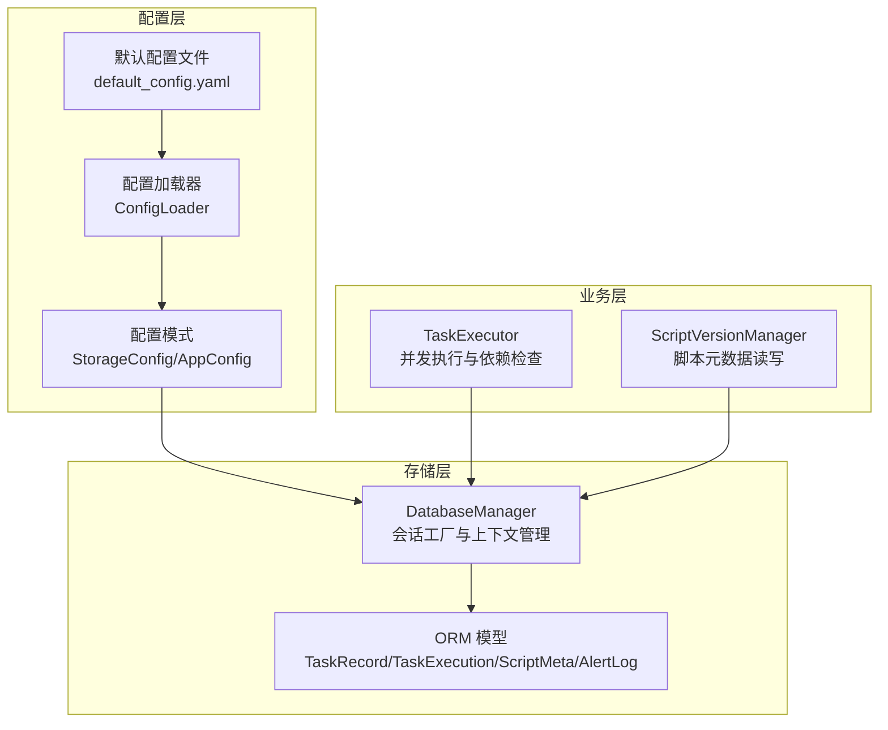
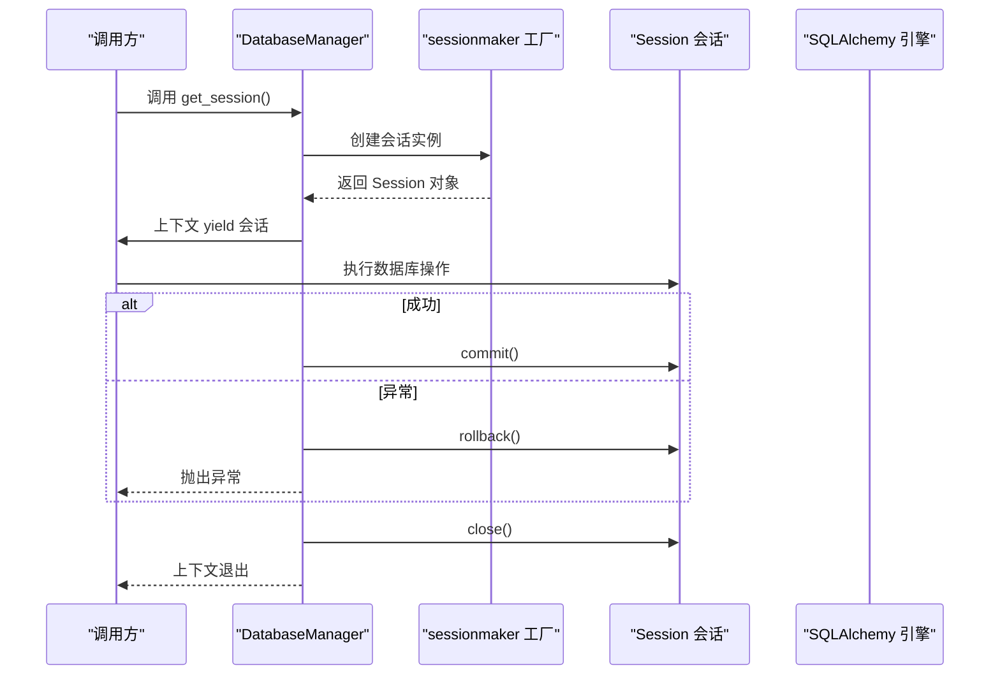
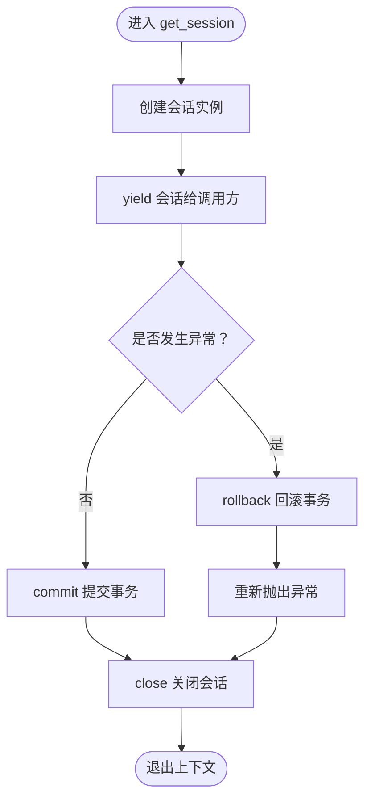
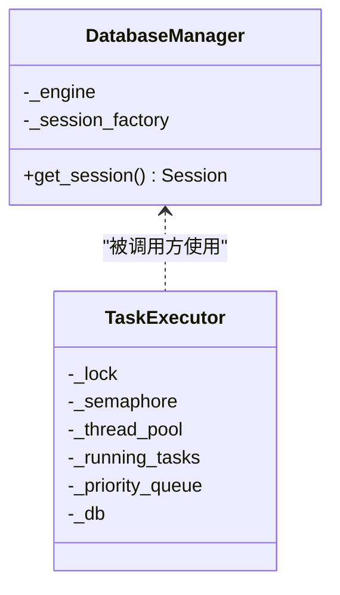
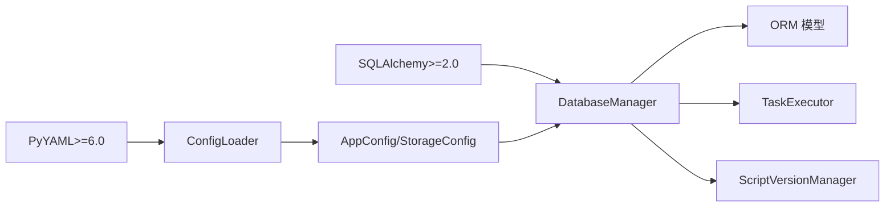

# 会话管理

<cite>
**本文引用的文件**
- [src/pycronguard/storage/database.py](file://src/pycronguard/storage/database.py)
- [src/pycronguard/storage/models.py](file://src/pycronguard/storage/models.py)
- [src/pycronguard/config/loader.py](file://src/pycronguard/config/loader.py)
- [src/pycronguard/config/schema.py](file://src/pycronguard/config/schema.py)
- [config/default_config.yaml](file://config/default_config.yaml)
- [src/pycronguard/core/executor.py](file://src/pycronguard/core/executor.py)
- [src/pycronguard/scripts/version.py](file://src/pycronguard/scripts/version.py)
- [pyproject.toml](file://pyproject.toml)
- [requirements.txt](file://requirements.txt)
</cite>

## 目录
1. [简介](#简介)
2. [项目结构](#项目结构)
3. [核心组件](#核心组件)
4. [架构总览](#架构总览)
5. [详细组件分析](#详细组件分析)
6. [依赖分析](#依赖分析)
7. [性能考虑](#性能考虑)
8. [故障排查指南](#故障排查指南)
9. [结论](#结论)
10. [附录](#附录)

## 简介
本文件聚焦于 PyCronGuard 的数据库会话管理，系统性阐述以下主题：
- get_session 上下文管理器的设计原理与使用方法：会话生命周期控制、自动资源清理、异常处理机制
- 事务管理策略：自动提交、手动回滚、嵌套事务处理
- 会话工厂模式应用：sessionmaker 的配置与性能优化
- 并发访问控制：线程安全保证、锁机制与死锁预防策略
- 会话配置参数：超时设置、连接池大小与回收策略
- 最佳实践与常见问题解决方案
- 自定义会话管理的扩展指导

## 项目结构
围绕数据库与会话管理的关键文件组织如下：
- 存储层：数据库引擎与会话工厂、ORM 模型定义
- 配置层：默认配置与加载器，提供数据库路径等关键参数
- 执行层：任务执行器在运行时通过数据库管理器记录执行状态
- 脚本版本管理：脚本元数据读写使用数据库管理器

图表来源
- [src/pycronguard/storage/database.py:29-69](file://src/pycronguard/storage/database.py#L29-L69)
- [src/pycronguard/storage/models.py:15-131](file://src/pycronguard/storage/models.py#L15-L131)
- [src/pycronguard/config/schema.py:22-96](file://src/pycronguard/config/schema.py#L22-L96)
- [src/pycronguard/config/loader.py:83-116](file://src/pycronguard/config/loader.py#L83-L116)
- [config/default_config.yaml:11-13](file://config/default_config.yaml#L11-L13)
- [src/pycronguard/core/executor.py:50-72](file://src/pycronguard/core/executor.py#L50-L72)
- [src/pycronguard/scripts/version.py:309-355](file://src/pycronguard/scripts/version.py#L309-L355)

章节来源
- [src/pycronguard/storage/database.py:29-69](file://src/pycronguard/storage/database.py#L29-L69)
- [src/pycronguard/storage/models.py:15-131](file://src/pycronguard/storage/models.py#L15-L131)
- [src/pycronguard/config/schema.py:22-96](file://src/pycronguard/config/schema.py#L22-L96)
- [src/pycronguard/config/loader.py:83-116](file://src/pycronguard/config/loader.py#L83-L116)
- [config/default_config.yaml:11-13](file://config/default_config.yaml#L11-L13)
- [src/pycronguard/core/executor.py:50-72](file://src/pycronguard/core/executor.py#L50-L72)
- [src/pycronguard/scripts/version.py:309-355](file://src/pycronguard/scripts/version.py#L309-L355)

## 核心组件
- DatabaseManager：封装 SQLAlchemy 引擎与会话工厂，提供 get_session 上下文管理器与各模型的 CRUD 辅助方法
- ORM 模型：TaskRecord、TaskExecution、ScriptMeta、AlertLog
- 配置体系：StorageConfig、AppConfig 及其加载器 ConfigLoader
- 业务集成：TaskExecutor 与 ScriptVersionManager 在运行时使用数据库管理器进行持久化

章节来源
- [src/pycronguard/storage/database.py:29-69](file://src/pycronguard/storage/database.py#L29-L69)
- [src/pycronguard/storage/models.py:15-131](file://src/pycronguard/storage/models.py#L15-L131)
- [src/pycronguard/config/schema.py:22-96](file://src/pycronguard/config/schema.py#L22-L96)
- [src/pycronguard/config/loader.py:83-116](file://src/pycronguard/config/loader.py#L83-L116)

## 架构总览
下图展示会话管理在整体架构中的位置与交互：

图表来源
- [src/pycronguard/storage/database.py:52-68](file://src/pycronguard/storage/database.py#L52-L68)

## 详细组件分析

### get_session 上下文管理器设计与实现
- 生命周期控制
  - 入口：创建会话实例
  - 中间：yield 给调用方执行业务逻辑
  - 成功：提交事务
  - 异常：回滚事务
  - 退出：关闭会话，释放资源
- 自动资源清理
  - finally 分支确保会话关闭，避免连接泄漏
- 异常处理机制
  - 捕获任意异常并回滚，随后重新抛出，保证调用方感知错误
- 事务语义
  - 单次上下文内为一个原子事务；未显式支持嵌套事务，嵌套调用需谨慎

图表来源
- [src/pycronguard/storage/database.py:52-68](file://src/pycronguard/storage/database.py#L52-L68)

章节来源
- [src/pycronguard/storage/database.py:52-68](file://src/pycronguard/storage/database.py#L52-L68)

### 事务管理策略
- 自动提交
  - 成功路径自动提交，确保数据持久化
- 手动回滚
  - 异常路径自动回滚，保证一致性
- 嵌套事务处理
  - 当前实现不支持原生嵌套事务；若在已开启的会话中再次调用 get_session，外层提交/回滚将影响内层操作
  - 建议：在单个上下文中完成所有数据库操作，避免嵌套上下文

章节来源
- [src/pycronguard/storage/database.py:52-68](file://src/pycronguard/storage/database.py#L52-L68)

### 会话工厂模式与性能优化
- 工厂配置
  - 使用 sessionmaker 绑定引擎，集中管理会话创建
  - 引擎创建时禁用 echo，降低日志开销
- 性能优化建议
  - 连接池大小：默认由 SQLAlchemy 控制；可通过额外参数调整（如 pool_size、max_overflow、pool_recycle），需结合并发与资源限制评估
  - 会话复用：在高并发场景下，尽量减少频繁创建/销毁会话
  - 事务批量：合并多次写入到单个事务中，减少提交次数
  - 查询优化：合理使用索引与过滤条件，避免全表扫描

章节来源
- [src/pycronguard/storage/database.py:37-46](file://src/pycronguard/storage/database.py#L37-L46)
- [pyproject.toml:11-18](file://pyproject.toml#L11-L18)
- [requirements.txt:3-3](file://requirements.txt#L3-L3)

### 并发访问控制与死锁预防
- 线程安全
  - get_session 为每个调用方创建独立会话，避免跨线程共享同一 Session 实例
- 锁机制
  - 业务层使用线程锁保护共享状态（如优先队列、运行中任务字典）
  - 数据库层面依赖 SQLite 的串行化隔离与事务原子性
- 死锁预防策略
  - 避免长事务持有锁；尽快提交或回滚
  - 保持事务内操作顺序一致，减少锁竞争
  - 将读写分离，降低写锁持有时长

图表来源
- [src/pycronguard/storage/database.py:29-69](file://src/pycronguard/storage/database.py#L29-L69)
- [src/pycronguard/core/executor.py:50-72](file://src/pycronguard/core/executor.py#L50-L72)

章节来源
- [src/pycronguard/storage/database.py:29-69](file://src/pycronguard/storage/database.py#L29-L69)
- [src/pycronguard/core/executor.py:50-72](file://src/pycronguard/core/executor.py#L50-L72)

### 会话配置参数说明
- 数据库路径
  - 来源：StorageConfig.db_path，默认位于用户目录下的私有路径
  - 加载：ConfigLoader 将 YAML 配置合并到 AppConfig，并展开路径
- 超时设置
  - 任务超时在 RecoveryConfig 中定义，用于执行器层面的进程超时控制
  - 会话层未直接暴露超时参数；如需连接超时，可在引擎创建时传参
- 连接池大小与回收策略
  - 默认由 SQLAlchemy 控制；可按需扩展参数（如 pool_size、pool_recycle、pool_pre_ping）

章节来源
- [src/pycronguard/config/schema.py:22-26](file://src/pycronguard/config/schema.py#L22-L26)
- [src/pycronguard/config/loader.py:100-116](file://src/pycronguard/config/loader.py#L100-L116)
- [config/default_config.yaml:11-13](file://config/default_config.yaml#L11-L13)
- [src/pycronguard/config/schema.py:66-73](file://src/pycronguard/config/schema.py#L66-L73)

### 会话使用最佳实践
- 单次上下文内的单一职责：在一个 with get_session() 上下文中完成所有相关数据库操作
- 明确异常处理：在上层捕获并处理业务异常，避免吞掉底层数据库错误
- 避免长事务：尽快提交或回滚，减少锁占用
- 会话复用：在同一线程内复用会话，减少创建成本
- 读写分离：批量写入合并为一次事务，读取与写入分离

### 常见问题与解决方案
- 会话未关闭导致连接泄漏
  - 确保始终使用 get_session 上下文管理器，避免绕过 finally 分支
- 嵌套事务引发的数据不一致
  - 不要在已有会话上下文中再次开启新的上下文；将相关操作合并到同一事务
- 事务长时间持有锁
  - 将事务拆分为更小片段，或调整业务流程减少锁持有时间
- 配置路径解析错误
  - 使用 ConfigLoader 展开路径后再传递给 DatabaseManager 初始化

章节来源
- [src/pycronguard/storage/database.py:52-68](file://src/pycronguard/storage/database.py#L52-L68)
- [src/pycronguard/config/loader.py:50-61](file://src/pycronguard/config/loader.py#L50-L61)

### 自定义会话管理扩展指导
- 扩展点
  - 在 DatabaseManager 中增加自定义会话参数（如超时、只读会话等）
  - 为不同业务场景提供专用的上下文管理器（如只读上下文）
- 接入方式
  - 通过 ConfigLoader 注入新配置项，映射到 AppConfig
  - 在业务模块中注入扩展后的 DatabaseManager 实例
- 注意事项
  - 保持线程安全与资源清理的契约不变
  - 明确事务边界，避免隐式嵌套

章节来源
- [src/pycronguard/storage/database.py:29-69](file://src/pycronguard/storage/database.py#L29-L69)
- [src/pycronguard/config/loader.py:175-203](file://src/pycronguard/config/loader.py#L175-L203)

## 依赖分析
- 外部依赖
  - SQLAlchemy 2.x：ORM 与会话管理
  - APScheduler、PyYAML、Watchdog 等：调度、配置与文件监控
- 内部耦合
  - DatabaseManager 依赖 SQLAlchemy 引擎与 sessionmaker
  - TaskExecutor 与 ScriptVersionManager 通过 DatabaseManager 访问数据库
  - 配置层为存储层提供 db_path 参数

图表来源
- [pyproject.toml:11-18](file://pyproject.toml#L11-L18)
- [requirements.txt:3-3](file://requirements.txt#L3-L3)
- [src/pycronguard/storage/database.py:15-16](file://src/pycronguard/storage/database.py#L15-L16)
- [src/pycronguard/config/loader.py:16-31](file://src/pycronguard/config/loader.py#L16-L31)

章节来源
- [pyproject.toml:11-18](file://pyproject.toml#L11-L18)
- [requirements.txt:3-3](file://requirements.txt#L3-L3)
- [src/pycronguard/storage/database.py:15-16](file://src/pycronguard/storage/database.py#L15-L16)
- [src/pycronguard/config/loader.py:16-31](file://src/pycronguard/config/loader.py#L16-L31)

## 性能考虑
- 连接池与并发
  - 在高并发场景下，适当增大连接池容量并启用预检连接，减少连接建立与校验开销
- 事务批量化
  - 将多个写操作合并到单个事务中，降低提交频率
- 查询优化
  - 为常用查询字段建立索引，避免全表扫描
- I/O 与磁盘
  - SQLite 适合中小规模数据；若数据量增长显著，建议迁移到关系型数据库并启用连接池与读写分离

## 故障排查指南
- 无法初始化数据库
  - 检查 db_path 是否存在且具备写权限；确认父目录已创建
- 事务未生效
  - 确认业务逻辑在 get_session 上下文中执行；避免在上下文外直接操作 Session
- 连接泄漏
  - 确认 finally 分支是否被执行；排查异常路径是否提前返回
- 配置未生效
  - 检查 ConfigLoader 是否正确合并 YAML 与默认配置；确认路径展开逻辑

章节来源
- [src/pycronguard/storage/database.py:37-46](file://src/pycronguard/storage/database.py#L37-L46)
- [src/pycronguard/config/loader.py:100-116](file://src/pycronguard/config/loader.py#L100-L116)
- [src/pycronguard/config/loader.py:50-61](file://src/pycronguard/config/loader.py#L50-L61)

## 结论
PyCronGuard 的会话管理以 SQLAlchemy 为基础，通过 DatabaseManager 的 get_session 上下文管理器实现了简洁可靠的事务语义与资源清理。结合配置体系与业务模块，形成了清晰的分层架构。在生产环境中，建议根据并发与数据规模对连接池与事务策略进行针对性优化，并严格遵循上下文使用规范，确保一致性与稳定性。

## 附录
- 配置项速览
  - storage.db_path：数据库文件路径
  - scheduler.max_workers：执行器线程池大小
  - recovery.task_timeout：任务超时（秒）
- 相关实现参考
  - get_session 上下文管理器：[src/pycronguard/storage/database.py:52-68](file://src/pycronguard/storage/database.py#L52-L68)
  - 数据库初始化与工厂：[src/pycronguard/storage/database.py:37-46](file://src/pycronguard/storage/database.py#L37-L46)
  - 配置加载与合并：[src/pycronguard/config/loader.py:100-116](file://src/pycronguard/config/loader.py#L100-L116)
  - 默认配置文件：[config/default_config.yaml:11-13](file://config/default_config.yaml#L11-L13)