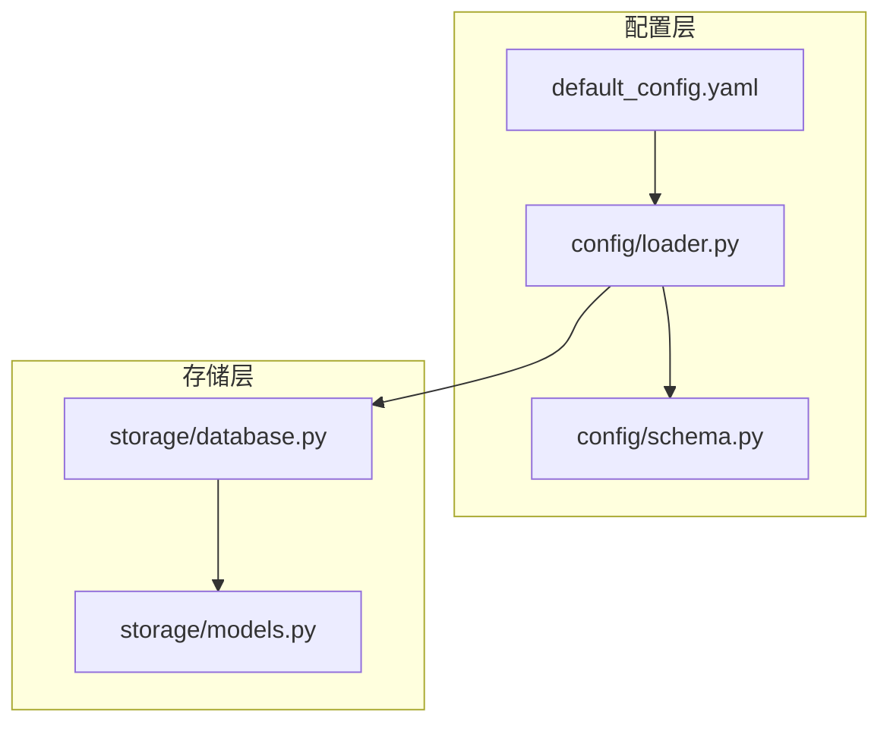
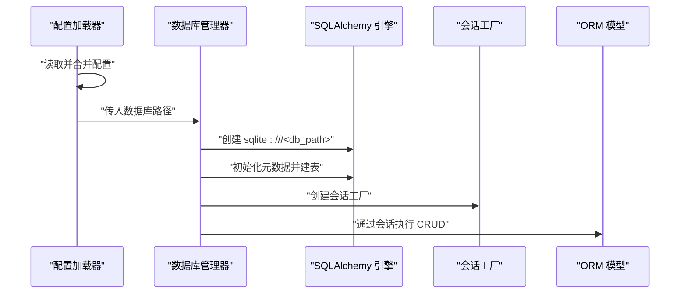
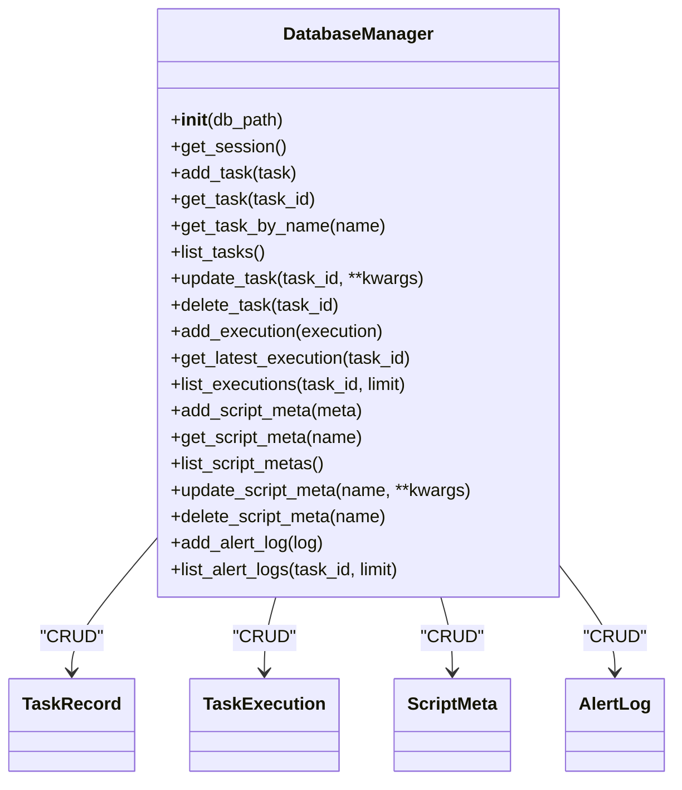
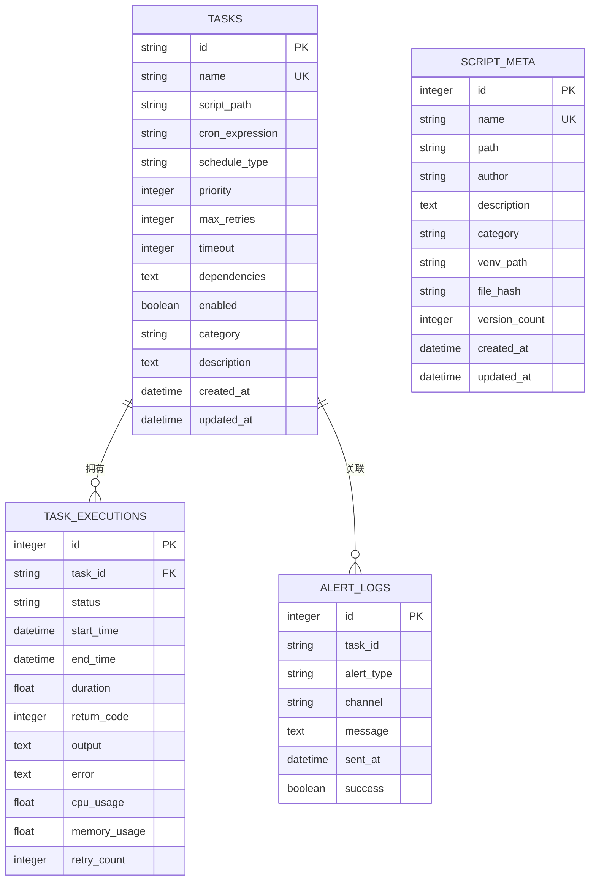
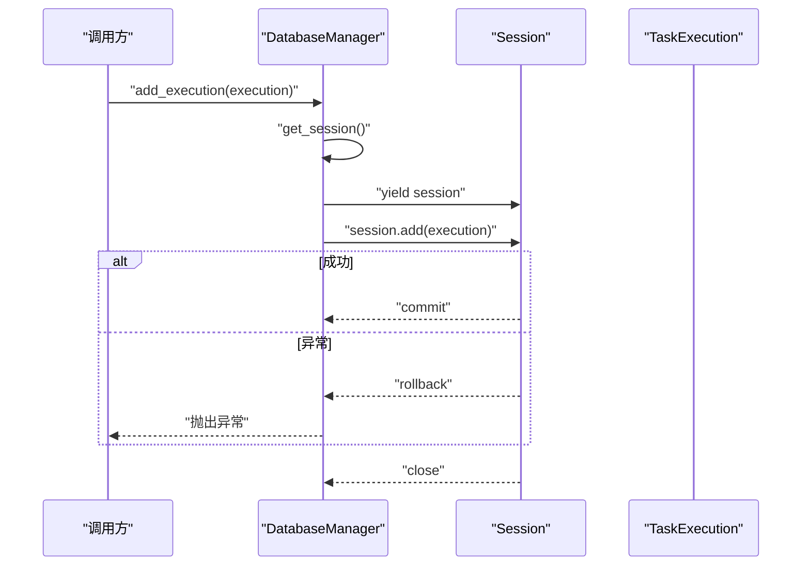
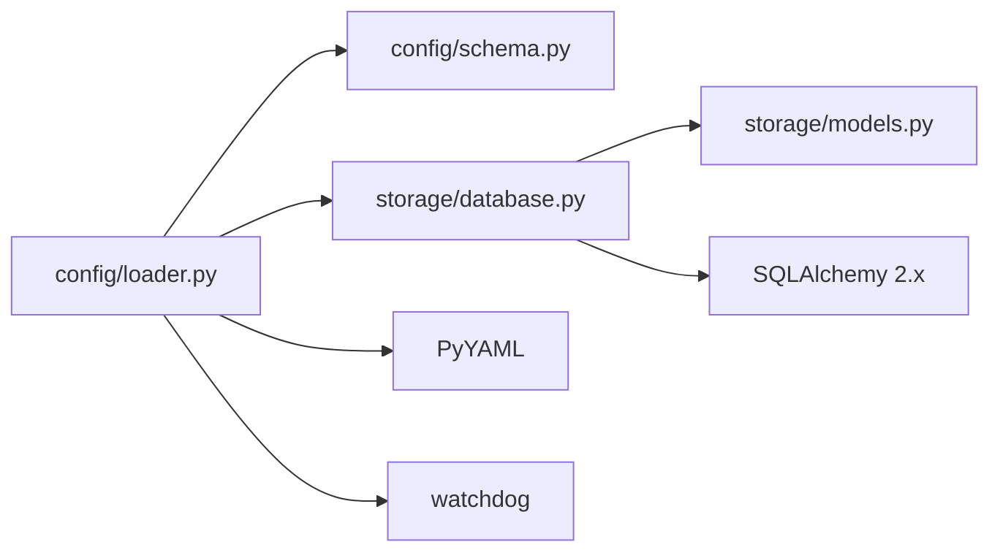

# 数据存储系统

<cite>
**本文引用的文件**
- [src/pycronguard/storage/database.py](file://src/pycronguard/storage/database.py)
- [src/pycronguard/storage/models.py](file://src/pycronguard/storage/models.py)
- [src/pycronguard/config/loader.py](file://src/pycronguard/config/loader.py)
- [src/pycronguard/config/schema.py](file://src/pycronguard/config/schema.py)
- [config/default_config.yaml](file://config/default_config.yaml)
- [pyproject.toml](file://pyproject.toml)
</cite>

## 目录
1. [简介](#简介)
2. [项目结构](#项目结构)
3. [核心组件](#核心组件)
4. [架构总览](#架构总览)
5. [详细组件分析](#详细组件分析)
6. [依赖分析](#依赖分析)
7. [性能考量](#性能考量)
8. [故障排查指南](#故障排查指南)
9. [结论](#结论)
10. [附录](#附录)

## 简介
本章节面向 PyCronGuard 的数据存储系统，聚焦于 SQLite 作为默认存储引擎的选择与优势、基于 SQLAlchemy ORM 的数据模型设计与关系映射、数据库管理器的实现细节（会话管理、事务处理、并发控制）、完整的 CRUD 操作与查询优化策略、数据生命周期与备份恢复建议、迁移策略、配置参数与连接字符串格式、安全注意事项，以及如何扩展支持其他存储后端。

## 项目结构
数据存储相关代码集中在 storage 子包中，配合配置加载模块完成从配置到数据库实例的初始化与使用。

**图表来源**
- [src/pycronguard/config/loader.py:100-116](file://src/pycronguard/config/loader.py#L100-L116)
- [src/pycronguard/config/schema.py:21-26](file://src/pycronguard/config/schema.py#L21-L26)
- [src/pycronguard/storage/database.py:37-46](file://src/pycronguard/storage/database.py#L37-L46)
- [src/pycronguard/storage/models.py:15-17](file://src/pycronguard/storage/models.py#L15-L17)

**章节来源**
- [src/pycronguard/config/loader.py:100-116](file://src/pycronguard/config/loader.py#L100-L116)
- [src/pycronguard/config/schema.py:21-26](file://src/pycronguard/config/schema.py#L21-L26)
- [src/pycronguard/storage/database.py:37-46](file://src/pycronguard/storage/database.py#L37-L46)
- [src/pycronguard/storage/models.py:15-17](file://src/pycronguard/storage/models.py#L15-L17)

## 核心组件
- 数据库管理器：负责数据库生命周期、引擎与会话工厂创建、表初始化、事务性会话封装、各模型的 CRUD 方法。
- ORM 模型：定义 TaskRecord、TaskExecution、ScriptMeta、AlertLog 四个核心实体及其字段、注释与外键关系。
- 配置加载：从 YAML 合并默认配置，展开路径变量，校验参数，并提供运行时热更新能力。

**章节来源**
- [src/pycronguard/storage/database.py:29-46](file://src/pycronguard/storage/database.py#L29-L46)
- [src/pycronguard/storage/models.py:19-51](file://src/pycronguard/storage/models.py#L19-L51)
- [src/pycronguard/storage/models.py:53-77](file://src/pycronguard/storage/models.py#L53-L77)
- [src/pycronguard/storage/models.py:79-102](file://src/pycronguard/storage/models.py#L79-L102)
- [src/pycronguard/storage/models.py:104-124](file://src/pycronguard/storage/models.py#L104-L124)
- [src/pycronguard/config/loader.py:50-61](file://src/pycronguard/config/loader.py#L50-L61)
- [src/pycronguard/config/schema.py:21-26](file://src/pycronguard/config/schema.py#L21-L26)

## 架构总览
下图展示了从配置到数据库管理器再到 ORM 模型的整体交互：

**图表来源**
- [src/pycronguard/config/loader.py:100-116](file://src/pycronguard/config/loader.py#L100-L116)
- [src/pycronguard/storage/database.py:37-46](file://src/pycronguard/storage/database.py#L37-L46)
- [src/pycronguard/storage/models.py:15-17](file://src/pycronguard/storage/models.py#L15-L17)

## 详细组件分析

### 数据库管理器 DatabaseManager
- 初始化与生命周期
  - 接收数据库文件路径，自动创建父目录。
  - 创建 SQLAlchemy 引擎（SQLite），关闭 echo。
  - 基于 Base 元数据创建所有表。
- 会话与事务
  - 提供上下文管理器 get_session，确保异常回滚、最终关闭。
  - 所有 CRUD 方法均在该事务性作用域内执行。
- CRUD 实现概览
  - TaskRecord：新增、按主键/名称查询、列表、更新、删除。
  - TaskExecution：新增、按任务查询最新执行、按任务列出最近执行（限制数量）。
  - ScriptMeta：新增、按名称查询、列表、更新、删除。
  - AlertLog：新增、按任务过滤列出最近日志（限制数量）。

**图表来源**
- [src/pycronguard/storage/database.py:29-271](file://src/pycronguard/storage/database.py#L29-L271)
- [src/pycronguard/storage/models.py:19-124](file://src/pycronguard/storage/models.py#L19-L124)

**章节来源**
- [src/pycronguard/storage/database.py:37-46](file://src/pycronguard/storage/database.py#L37-L46)
- [src/pycronguard/storage/database.py:52-68](file://src/pycronguard/storage/database.py#L52-L68)
- [src/pycronguard/storage/database.py:74-136](file://src/pycronguard/storage/database.py#L74-L136)
- [src/pycronguard/storage/database.py:141-184](file://src/pycronguard/storage/database.py#L141-L184)
- [src/pycronguard/storage/database.py:190-239](file://src/pycronguard/storage/database.py#L190-L239)
- [src/pycronguard/storage/database.py:245-271](file://src/pycronguard/storage/database.py#L245-L271)

### ORM 模型与关系映射
- TaskRecord（任务定义）
  - 主键：UUID 字符串。
  - 唯一约束：name。
  - 字段：脚本路径、Cron 表达式、调度类型、优先级、最大重试、超时、依赖（JSON 序列化字符串）、启用状态、分类、描述等；带创建/更新时间戳。
- TaskExecution（单次执行记录）
  - 主键：自增整数。
  - 外键：task_id 指向 tasks.id。
  - 字段：状态、开始/结束时间、耗时、返回码、输出、错误、CPU/内存使用、重试次数。
- ScriptMeta（脚本元数据）
  - 主键：自增整数。
  - 唯一约束：name。
  - 字段：路径、作者、描述、分类、虚拟环境路径、文件哈希、版本计数、创建/更新时间戳。
- AlertLog（告警投递日志）
  - 主键：自增整数。
  - 可空外键：task_id。
  - 字段：告警类型（失败/连续失败/性能）、通道（如邮件）、消息、发送时间、成功标志。

**图表来源**
- [src/pycronguard/storage/models.py:19-51](file://src/pycronguard/storage/models.py#L19-L51)
- [src/pycronguard/storage/models.py:53-77](file://src/pycronguard/storage/models.py#L53-L77)
- [src/pycronguard/storage/models.py:79-102](file://src/pycronguard/storage/models.py#L79-L102)
- [src/pycronguard/storage/models.py:104-124](file://src/pycronguard/storage/models.py#L104-L124)

**章节来源**
- [src/pycronguard/storage/models.py:19-51](file://src/pycronguard/storage/models.py#L19-L51)
- [src/pycronguard/storage/models.py:53-77](file://src/pycronguard/storage/models.py#L53-L77)
- [src/pycronguard/storage/models.py:79-102](file://src/pycronguard/storage/models.py#L79-L102)
- [src/pycronguard/storage/models.py:104-124](file://src/pycronguard/storage/models.py#L104-L124)

### 配置与连接字符串
- 配置项
  - storage.db_path：默认位于用户主目录下的本地 SQLite 文件。
  - 路径展开：配置加载器在加载后对路径进行 ~ 展开。
- 连接字符串
  - 使用 SQLAlchemy 的 sqlite:/// 前缀指向文件路径。
- 安全与隔离
  - 本地文件权限由操作系统控制。
  - 无网络传输，降低泄露风险。

**章节来源**
- [config/default_config.yaml:11-14](file://config/default_config.yaml#L11-L14)
- [src/pycronguard/config/loader.py:50-61](file://src/pycronguard/config/loader.py#L50-L61)
- [src/pycronguard/storage/database.py](file://src/pycronguard/storage/database.py#L41)

### 查询流程与事务处理
以下序列图展示典型“新增任务执行记录”的流程，体现事务性会话与异常回滚：

**图表来源**
- [src/pycronguard/storage/database.py:141-148](file://src/pycronguard/storage/database.py#L141-L148)
- [src/pycronguard/storage/database.py:52-68](file://src/pycronguard/storage/database.py#L52-L68)

**章节来源**
- [src/pycronguard/storage/database.py:52-68](file://src/pycronguard/storage/database.py#L52-L68)
- [src/pycronguard/storage/database.py:141-148](file://src/pycronguard/storage/database.py#L141-L148)

### 并发控制与会话管理
- 会话范围：每个 CRUD 操作都在独立的事务性会话中执行，异常自动回滚，结束后关闭会话。
- 并发访问：SQLite 在写入时采用文件级锁；在单机场景下足以保证一致性。
- 建议：若未来需要更高并发或分布式部署，可将存储后端替换为支持并发写入的关系型数据库。

**章节来源**
- [src/pycronguard/storage/database.py:52-68](file://src/pycronguard/storage/database.py#L52-L68)

### 查询优化与索引策略
- 已有索引
  - 主键：自动建立（TaskRecord.id、TaskExecution.id、ScriptMeta.id、AlertLog.id）。
  - 唯一约束：TaskRecord.name、ScriptMeta.name。
- 建议索引
  - TaskExecution.task_id：用于按任务查询最近执行与历史执行。
  - AlertLog.task_id：用于按任务筛选告警日志。
  - AlertLog.sent_at：用于按时间排序查询最近告警。
- 分页与限制
  - 列表接口默认限制返回条数，避免一次性拉取大量数据。

**章节来源**
- [src/pycronguard/storage/models.py:24-26](file://src/pycronguard/storage/models.py#L24-L26)
- [src/pycronguard/storage/models.py:58-61](file://src/pycronguard/storage/models.py#L58-L61)
- [src/pycronguard/storage/models.py:84-85](file://src/pycronguard/storage/models.py#L84-L85)
- [src/pycronguard/storage/models.py:109-110](file://src/pycronguard/storage/models.py#L109-L110)
- [src/pycronguard/storage/database.py:167-184](file://src/pycronguard/storage/database.py#L167-L184)
- [src/pycronguard/storage/database.py:254-271](file://src/pycronguard/storage/database.py#L254-L271)

### 数据生命周期管理
- 自动建表：首次初始化时根据 Base 元数据创建所有表。
- 时间戳：各模型包含 created_at/updated_at 字段，便于审计与清理。
- 清理策略（建议）
  - 按时间窗口清理过期执行记录与告警日志。
  - 控制脚本版本数量上限，定期归档旧版本。

**章节来源**
- [src/pycronguard/storage/database.py:44-46](file://src/pycronguard/storage/database.py#L44-L46)
- [src/pycronguard/storage/models.py:42-47](file://src/pycronguard/storage/models.py#L42-L47)
- [src/pycronguard/storage/models.py:93-98](file://src/pycronguard/storage/models.py#L93-L98)
- [src/pycronguard/storage/models.py:118-120](file://src/pycronguard/storage/models.py#L118-L120)

### 备份与恢复机制
- 备份
  - 直接复制 SQLite 数据库文件即可完成备份。
  - 建议在应用空闲时段执行备份。
- 恢复
  - 停止服务后替换数据库文件，启动服务验证。
- 注意事项
  - 备份前确保数据库文件未被进程占用。
  - 对比备份文件完整性与时间戳。

**章节来源**
- [src/pycronguard/storage/database.py:37-41](file://src/pycronguard/storage/database.py#L37-L41)

### 数据迁移策略
- 版本演进
  - 新增字段：在模型中添加并设置默认值，迁移时自动填充。
  - 删除字段：需编写迁移脚本，先迁移数据再删除列。
  - 修改约束：如唯一性、非空等，需分步执行并处理冲突数据。
- 迁移工具
  - SQLAlchemy 2.x 提供 Alembic 等迁移工具，可在后续版本引入。
- 测试
  - 在开发环境验证迁移脚本，确保数据一致性。

**章节来源**
- [src/pycronguard/storage/models.py](file://src/pycronguard/storage/models.py#L27)
- [src/pycronguard/storage/models.py:36-38](file://src/pycronguard/storage/models.py#L36-L38)
- [src/pycronguard/storage/models.py:62-63](file://src/pycronguard/storage/models.py#L62-L63)

### 扩展存储后端指导
- 抽象接口
  - 将 DatabaseManager 的构造与会话工厂抽象为接口，便于替换不同数据库驱动。
- 连接字符串
  - 支持 MySQL、PostgreSQL 等数据库的连接字符串格式。
- 事务与并发
  - 不同数据库的事务隔离级别与并发控制策略不同，需针对性调整。
- ORM 适配
  - 保持模型定义不变，仅替换引擎与方言。

**章节来源**
- [src/pycronguard/storage/database.py](file://src/pycronguard/storage/database.py#L41)
- [src/pycronguard/storage/database.py:15-24](file://src/pycronguard/storage/database.py#L15-L24)

## 依赖分析
- 组件耦合
  - DatabaseManager 依赖 SQLAlchemy 引擎与会话工厂，依赖 models 中的实体类。
  - 配置加载器负责解析与校验配置，提供路径展开与热更新。
- 外部依赖
  - SQLAlchemy 2.x：ORM 与引擎。
  - watchdog：配置文件监听。
  - yaml：YAML 解析。
- 潜在循环依赖
  - 当前模块间无循环导入，耦合度低，职责清晰。

**图表来源**
- [src/pycronguard/config/loader.py:15-31](file://src/pycronguard/config/loader.py#L15-L31)
- [src/pycronguard/storage/database.py:15-24](file://src/pycronguard/storage/database.py#L15-L24)
- [pyproject.toml:11-18](file://pyproject.toml#L11-L18)

**章节来源**
- [src/pycronguard/config/loader.py:15-31](file://src/pycronguard/config/loader.py#L15-L31)
- [src/pycronguard/storage/database.py:15-24](file://src/pycronguard/storage/database.py#L15-L24)
- [pyproject.toml:11-18](file://pyproject.toml#L11-L18)

## 性能考量
- I/O 与锁
  - SQLite 为单文件数据库，写入时存在文件级锁，适合单机、轻量写入场景。
- 事务批量
  - 将多个写操作放入同一事务中提交，减少磁盘写入次数。
- 查询限制
  - 列表接口默认限制返回数量，避免大结果集导致内存压力。
- 索引建议
  - 为高频过滤字段建立索引，如 TaskExecution.task_id、AlertLog.task_id、AlertLog.sent_at。
- 连接池
  - 当前使用 SQLAlchemy 会话工厂，未显式配置连接池参数；在高并发场景可考虑引入连接池配置。

**章节来源**
- [src/pycronguard/storage/database.py:167-184](file://src/pycronguard/storage/database.py#L167-L184)
- [src/pycronguard/storage/database.py:254-271](file://src/pycronguard/storage/database.py#L254-L271)

## 故障排查指南
- 初始化失败
  - 检查数据库路径是否存在可写权限。
  - 查看日志输出确认建表是否成功。
- 事务异常
  - 若出现异常，会话将自动回滚；检查上游异常堆栈定位问题。
- 查询为空
  - 确认过滤条件（如任务 ID、名称）是否正确。
  - 检查是否有数据或是否被清理策略移除。
- 配置变更未生效
  - 确认配置文件监听是否开启，且文件路径正确。

**章节来源**
- [src/pycronguard/storage/database.py:44-46](file://src/pycronguard/storage/database.py#L44-L46)
- [src/pycronguard/config/loader.py:118-150](file://src/pycronguard/config/loader.py#L118-L150)

## 结论
PyCronGuard 的数据存储系统以 SQLite 为默认后端，结合 SQLAlchemy ORM 提供简洁一致的模型定义与 CRUD 能力。通过事务性会话管理、路径展开与配置校验，系统具备良好的可用性与可维护性。对于未来扩展，建议在保持模型不变的前提下，通过抽象接口替换存储后端，并引入迁移工具与连接池配置以提升性能与可靠性。

## 附录
- 关键实现位置
  - 数据库管理器初始化与建表：[src/pycronguard/storage/database.py:37-46](file://src/pycronguard/storage/database.py#L37-L46)
  - 会话与事务封装：[src/pycronguard/storage/database.py:52-68](file://src/pycronguard/storage/database.py#L52-L68)
  - TaskRecord CRUD：[src/pycronguard/storage/database.py:74-136](file://src/pycronguard/storage/database.py#L74-L136)
  - TaskExecution CRUD：[src/pycronguard/storage/database.py:141-184](file://src/pycronguard/storage/database.py#L141-L184)
  - ScriptMeta CRUD：[src/pycronguard/storage/database.py:190-239](file://src/pycronguard/storage/database.py#L190-L239)
  - AlertLog CRUD：[src/pycronguard/storage/database.py:245-271](file://src/pycronguard/storage/database.py#L245-L271)
  - ORM 模型定义：[src/pycronguard/storage/models.py:19-124](file://src/pycronguard/storage/models.py#L19-L124)
  - 配置加载与路径展开：[src/pycronguard/config/loader.py:50-61](file://src/pycronguard/config/loader.py#L50-L61)
  - 配置结构定义：[src/pycronguard/config/schema.py:21-26](file://src/pycronguard/config/schema.py#L21-L26)
  - 默认配置示例：[config/default_config.yaml:11-14](file://config/default_config.yaml#L11-L14)
  - 依赖声明：[pyproject.toml:11-18](file://pyproject.toml#L11-L18)