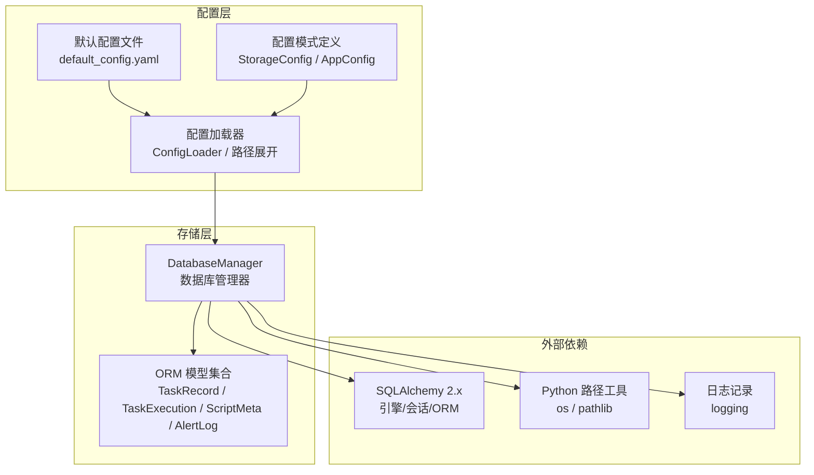
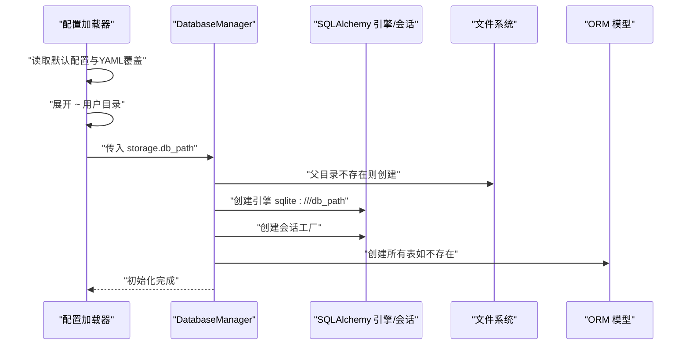
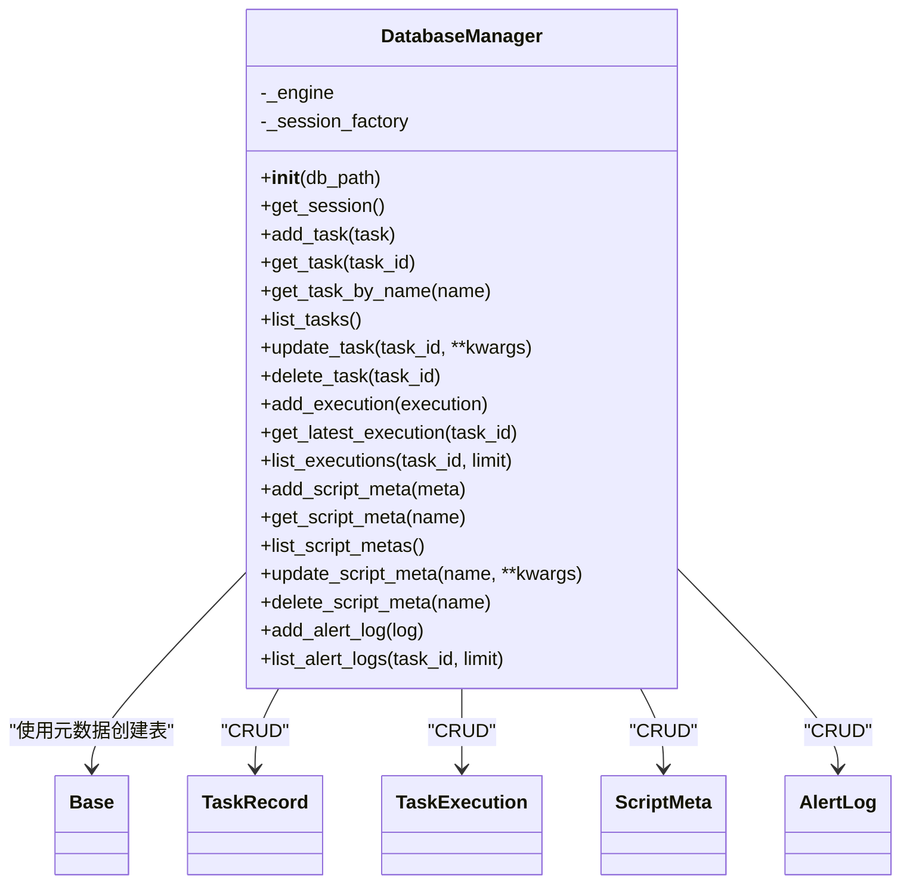
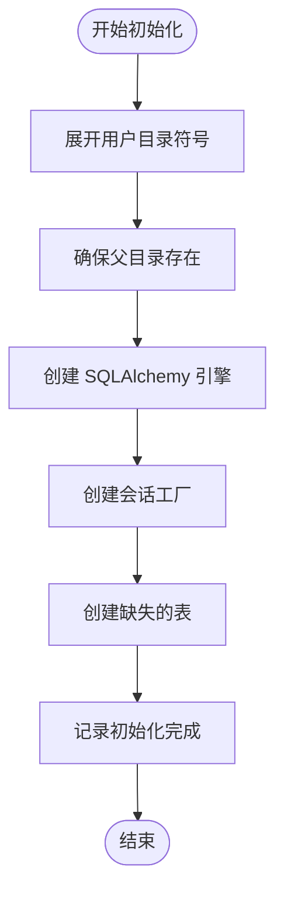
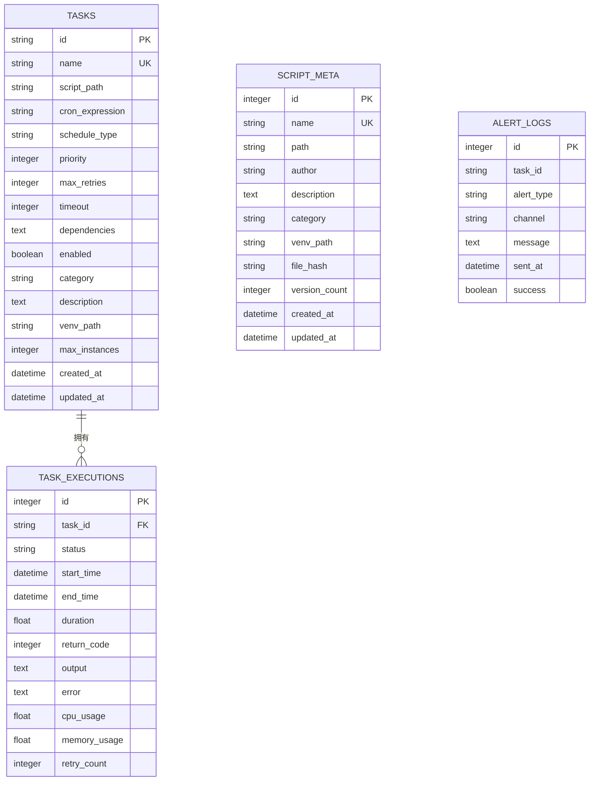
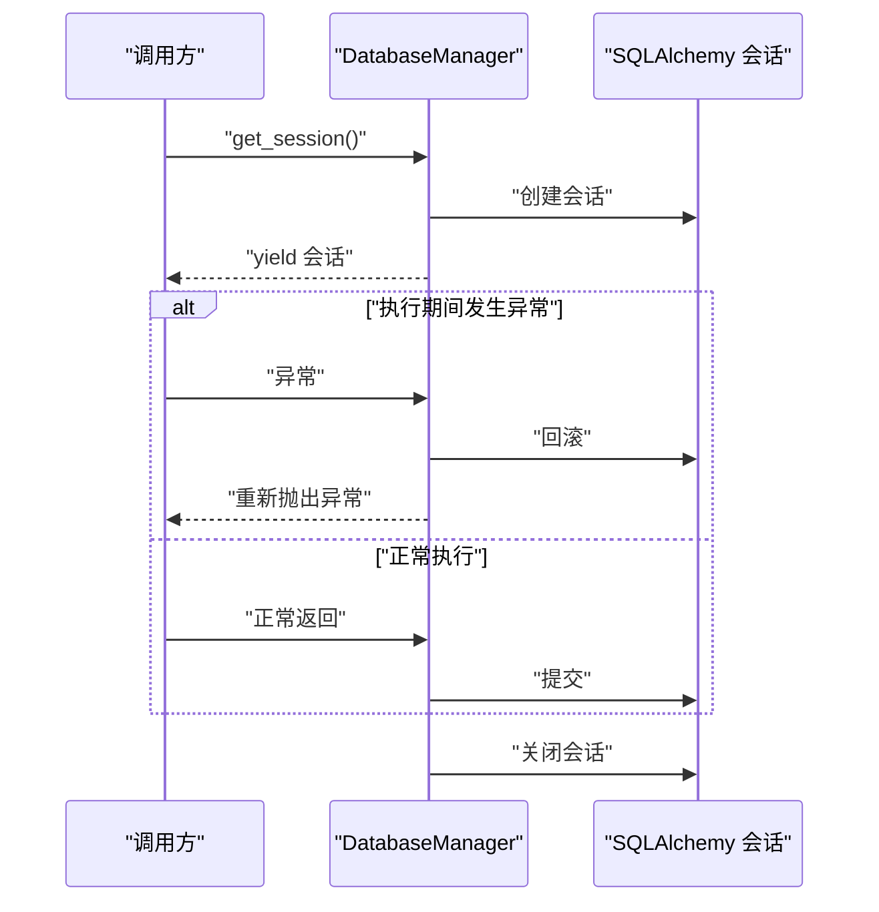
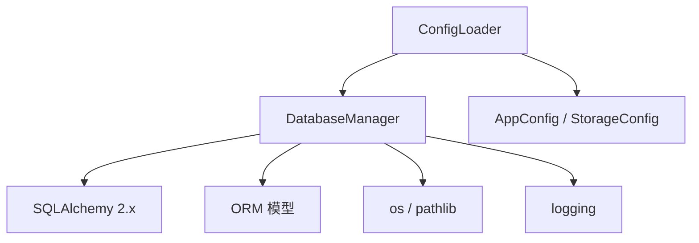

# 数据库架构设计

<cite>
**本文档引用的文件**
- [database.py](file://src/pycronguard/storage/database.py)
- [models.py](file://src/pycronguard/storage/models.py)
- [loader.py](file://src/pycronguard/config/loader.py)
- [schema.py](file://src/pycronguard/config/schema.py)
- [default_config.yaml](file://config/default_config.yaml)
- [pyproject.toml](file://pyproject.toml)
- [requirements.txt](file://requirements.txt)
</cite>

## 目录
1. [简介](#简介)
2. [项目结构](#项目结构)
3. [核心组件](#核心组件)
4. [架构总览](#架构总览)
5. [详细组件分析](#详细组件分析)
6. [依赖关系分析](#依赖关系分析)
7. [性能考量](#性能考量)
8. [故障排除指南](#故障排除指南)
9. [结论](#结论)
10. [附录](#附录)

## 简介
本文件系统性阐述 PyCronGuard 的数据库架构设计，重点围绕以下目标展开：
- 解释为何选择 SQLite 作为默认存储引擎：轻量、零配置、跨平台兼容等优势。
- 深入分析 DatabaseManager 类的设计与实现：单例模式思想、连接与会话管理、事务生命周期控制。
- 文档化数据库初始化流程：表结构创建、目录权限处理、错误处理机制。
- 解释 SQLAlchemy 引擎配置参数：连接字符串格式、性能优化设置、并发控制策略。
- 提供数据库路径管理、相对路径解析、用户目录扩展的实现细节。
- 总结数据库配置最佳实践与安全注意事项。

## 项目结构
PyCronGuard 的数据库相关代码集中在 storage 子模块中，配合配置加载与验证模块共同完成数据库路径解析、初始化与 ORM 映射。

图表来源
- [database.py:1-271](file://src/pycronguard/storage/database.py#L1-L271)
- [models.py:1-131](file://src/pycronguard/storage/models.py#L1-L131)
- [loader.py:1-204](file://src/pycronguard/config/loader.py#L1-L204)
- [schema.py:1-151](file://src/pycronguard/config/schema.py#L1-L151)
- [default_config.yaml:1-57](file://config/default_config.yaml#L1-L57)

章节来源
- [database.py:1-271](file://src/pycronguard/storage/database.py#L1-L271)
- [models.py:1-131](file://src/pycronguard/storage/models.py#L1-L131)
- [loader.py:1-204](file://src/pycronguard/config/loader.py#L1-L204)
- [schema.py:1-151](file://src/pycronguard/config/schema.py#L1-L151)
- [default_config.yaml:1-57](file://config/default_config.yaml#L1-L57)

## 核心组件
- DatabaseManager：封装 SQLAlchemy 引擎与会话工厂，负责数据库初始化、表结构创建以及面向各 ORM 模型的 CRUD 辅助方法。
- ORM 模型集合：基于 SQLAlchemy 2.0+ 的声明式基类，映射到 SQLite 表，涵盖任务、执行、脚本元数据与告警日志。
- 配置系统：通过 dataclass 定义配置结构，支持 YAML 加载、路径展开与校验；默认数据库路径位于用户主目录下的隐藏目录中。

章节来源
- [database.py:29-46](file://src/pycronguard/storage/database.py#L29-L46)
- [models.py:15-131](file://src/pycronguard/storage/models.py#L15-L131)
- [schema.py:21-26](file://src/pycronguard/config/schema.py#L21-L26)
- [loader.py:50-61](file://src/pycronguard/config/loader.py#L50-L61)

## 架构总览
下图展示了从配置加载到数据库初始化与 ORM 使用的整体流程。

图表来源
- [loader.py:100-116](file://src/pycronguard/config/loader.py#L100-L116)
- [loader.py:50-61](file://src/pycronguard/config/loader.py#L50-L61)
- [database.py:37-46](file://src/pycronguard/storage/database.py#L37-L46)

## 详细组件分析

### DatabaseManager 设计与实现
DatabaseManager 是数据库访问的核心抽象，承担以下职责：
- 初始化：接收数据库路径，展开用户目录，确保父目录存在，创建 SQLAlchemy 引擎与会话工厂，并自动创建缺失的表。
- 会话管理：提供上下文管理器以确保事务提交或回滚与会话关闭的正确性。
- CRUD 辅助：针对 TaskRecord、TaskExecution、ScriptMeta、AlertLog 提供常用增删改查操作。

图表来源
- [database.py:29-271](file://src/pycronguard/storage/database.py#L29-L271)
- [models.py:15-131](file://src/pycronguard/storage/models.py#L15-L131)

章节来源
- [database.py:29-68](file://src/pycronguard/storage/database.py#L29-L68)
- [database.py:74-136](file://src/pycronguard/storage/database.py#L74-L136)
- [database.py:141-184](file://src/pycronguard/storage/database.py#L141-L184)
- [database.py:190-239](file://src/pycronguard/storage/database.py#L190-L239)
- [database.py:245-271](file://src/pycronguard/storage/database.py#L245-L271)

### 数据库初始化流程
初始化流程的关键步骤如下：
- 路径展开与目录准备：将用户目录符号展开为绝对路径，并确保父目录存在。
- 引擎与会话工厂创建：使用 SQLite 连接字符串创建引擎，禁用 SQL 输出以减少日志噪声。
- 表结构创建：基于 ORM 基类元数据一次性创建所有表。

图表来源
- [database.py:37-46](file://src/pycronguard/storage/database.py#L37-L46)

章节来源
- [database.py:37-46](file://src/pycronguard/storage/database.py#L37-L46)

### SQLAlchemy 引擎配置与并发控制
- 连接字符串格式：采用 SQLite 本地文件路径形式，便于零配置部署。
- 引擎参数：当前实现未显式设置额外参数，保持默认行为；echo 设置为关闭以避免冗余日志。
- 并发控制策略：SQLite 在单文件模式下天然串行化写入，适合本项目轻量场景；若未来需要更高并发，可考虑 WAL 模式与更细粒度的锁策略（需在引擎参数中启用）。

章节来源
- [database.py:41-42](file://src/pycronguard/storage/database.py#L41-L42)

### 数据库路径管理与用户目录扩展
- 默认路径：来自配置模式中的默认值，位于用户主目录下的隐藏目录中。
- 路径展开：在配置加载阶段统一展开用户目录符号，确保后续路径解析一致。
- 目录创建：初始化时自动创建父目录，避免运行时因目录缺失导致的异常。

章节来源
- [schema.py:21-26](file://src/pycronguard/config/schema.py#L21-L26)
- [loader.py:50-61](file://src/pycronguard/config/loader.py#L50-L61)
- [database.py:37-40](file://src/pycronguard/storage/database.py#L37-L40)

### ORM 模型与表结构
ORM 模型基于 DeclarativeBase，映射到 SQLite 表，字段类型与约束体现了业务需求：
- TaskRecord：任务定义，包含名称唯一性、调度表达式、优先级、超时、虚拟环境路径、最大并发实例等。
- TaskExecution：单次执行记录，包含状态、时间戳、耗时、返回码、输出与错误、资源使用统计、重试次数等。
- ScriptMeta：脚本元数据，包含作者、描述、分类、虚拟环境路径、文件哈希、版本数量等。
- AlertLog：告警日志，包含告警类型、通道、消息、发送时间与成功标志等。

图表来源
- [models.py:19-56](file://src/pycronguard/storage/models.py#L19-L56)
- [models.py:59-82](file://src/pycronguard/storage/models.py#L59-L82)
- [models.py:85-107](file://src/pycronguard/storage/models.py#L85-L107)
- [models.py:110-130](file://src/pycronguard/storage/models.py#L110-L130)

章节来源
- [models.py:15-131](file://src/pycronguard/storage/models.py#L15-L131)

### 会话生命周期与事务控制
DatabaseManager 通过上下文管理器提供受控的会话生命周期：
- 获取会话：创建新会话实例。
- 成功路径：提交事务并关闭会话。
- 异常路径：回滚事务并重新抛出异常，确保一致性。
- 资源清理：最终总是关闭会话，防止连接泄漏。

图表来源
- [database.py:52-68](file://src/pycronguard/storage/database.py#L52-L68)

章节来源
- [database.py:52-68](file://src/pycronguard/storage/database.py#L52-L68)

## 依赖关系分析
- 组件耦合：DatabaseManager 依赖 SQLAlchemy 引擎与会话工厂，依赖 ORM 模型集合进行表创建与查询。
- 外部依赖：SQLAlchemy 2.x 为 ORM 与引擎提供基础能力；os 与 pathlib 用于路径处理；logging 用于日志记录。
- 配置耦合：配置加载器负责将 YAML 配置转换为强类型对象，并展开用户目录，再传递给 DatabaseManager。

图表来源
- [database.py:15-24](file://src/pycronguard/storage/database.py#L15-L24)
- [loader.py:100-116](file://src/pycronguard/config/loader.py#L100-L116)
- [schema.py:86-96](file://src/pycronguard/config/schema.py#L86-L96)

章节来源
- [database.py:15-24](file://src/pycronguard/storage/database.py#L15-L24)
- [loader.py:100-116](file://src/pycronguard/config/loader.py#L100-L116)
- [schema.py:86-96](file://src/pycronguard/config/schema.py#L86-L96)

## 性能考量
- SQLite 单文件模型：天然串行化写入，适合本项目轻量场景；若未来需要更高并发，可考虑 WAL 模式与更细粒度的锁策略（需在引擎参数中启用）。
- 查询限制：列表查询默认限制返回条目数量，避免一次性加载过多数据。
- 日志控制：SQLAlchemy 的 echo 已关闭，减少日志噪声；建议仅在调试时开启。
- 路径与目录：提前创建父目录，避免运行时 IO 异常。

章节来源
- [database.py:41-42](file://src/pycronguard/storage/database.py#L41-L42)
- [database.py:167-184](file://src/pycronguard/storage/database.py#L167-L184)
- [database.py:254-270](file://src/pycronguard/storage/database.py#L254-L270)

## 故障排除指南
- 数据库初始化失败
  - 检查数据库路径是否可写，确认父目录已创建。
  - 确认 SQLite 文件权限与磁盘空间充足。
- ORM 表未创建
  - 确保初始化时调用了表创建逻辑。
  - 检查 ORM 基类元数据是否正确注册。
- 会话异常
  - 确保使用上下文管理器获取会话，避免手动持有会话导致的资源泄漏。
  - 发生异常时会自动回滚，检查异常堆栈定位问题。
- 路径问题
  - 确认配置加载阶段已完成用户目录展开。
  - 检查路径是否包含非法字符或过长。

章节来源
- [database.py:37-46](file://src/pycronguard/storage/database.py#L37-L46)
- [database.py:52-68](file://src/pycronguard/storage/database.py#L52-L68)
- [loader.py:50-61](file://src/pycronguard/config/loader.py#L50-L61)

## 结论
PyCronGuard 的数据库架构以 SQLite 为核心，结合 SQLAlchemy 2.x 的 ORM 能力，提供了简洁可靠的持久化方案。DatabaseManager 将引擎、会话与 CRUD 辅助封装为一体，配合配置系统的路径展开与校验，实现了开箱即用且易于维护的数据存储层。对于未来扩展，可在保证一致性的前提下引入更精细的并发控制与性能优化策略。

## 附录

### SQLite 作为默认存储引擎的选择理由
- 轻量：无需独立服务进程，单文件即可满足大多数场景。
- 零配置：无需安装、启动、授权与复杂配置。
- 跨平台：统一的文件格式与驱动，便于分发与部署。
- 一致性：ACID 特性保障数据完整性。

章节来源
- [database.py:41-42](file://src/pycronguard/storage/database.py#L41-L42)

### 数据库配置最佳实践
- 默认路径：使用用户主目录下的隐藏目录存放数据库文件，避免权限问题。
- 权限管理：确保运行用户对数据库文件与父目录具有读写权限。
- 备份策略：定期备份数据库文件，防止意外损坏。
- 监控与告警：结合日志与告警系统监控数据库可用性。

章节来源
- [schema.py:21-26](file://src/pycronguard/config/schema.py#L21-L26)
- [default_config.yaml:11-13](file://config/default_config.yaml#L11-L13)

### 安全注意事项
- 路径注入：严格限制数据库路径输入，避免路径遍历攻击。
- 权限最小化：数据库文件权限应最小化，仅允许必要用户访问。
- 日志敏感信息：避免在日志中记录敏感数据，SQLAlchemy 的 echo 应保持关闭。
- 外部依赖版本：确保 SQLAlchemy 与相关依赖处于安全版本范围。

章节来源
- [pyproject.toml:11-18](file://pyproject.toml#L11-L18)
- [requirements.txt:1-7](file://requirements.txt#L1-L7)
- [database.py:41-42](file://src/pycronguard/storage/database.py#L41-L42)