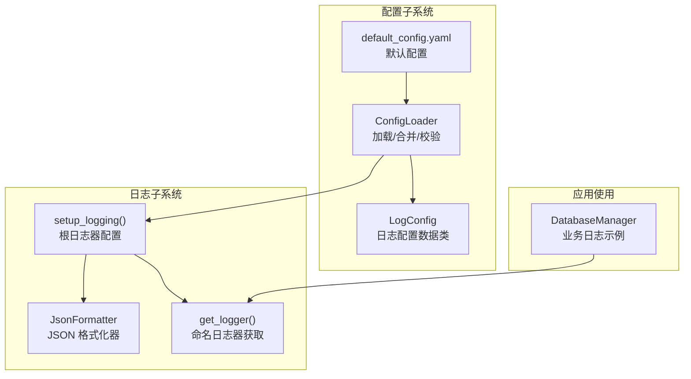
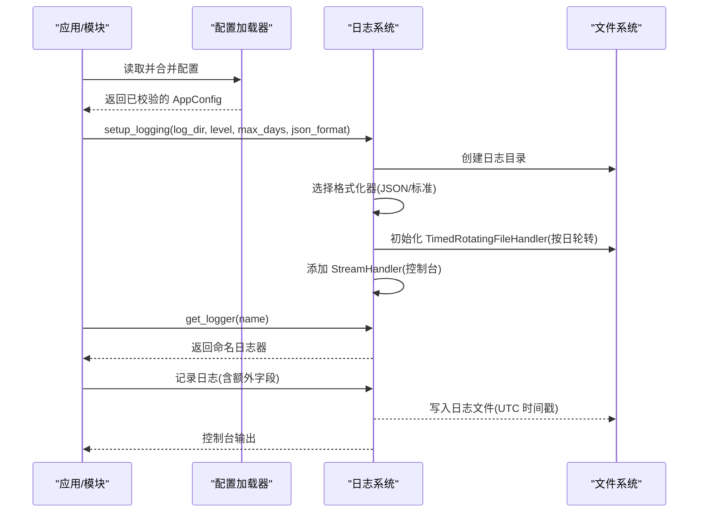
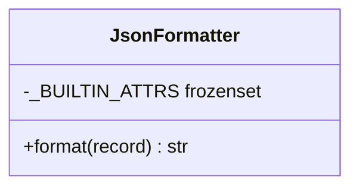
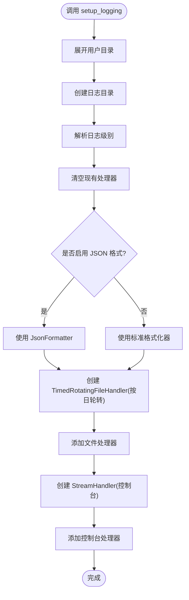
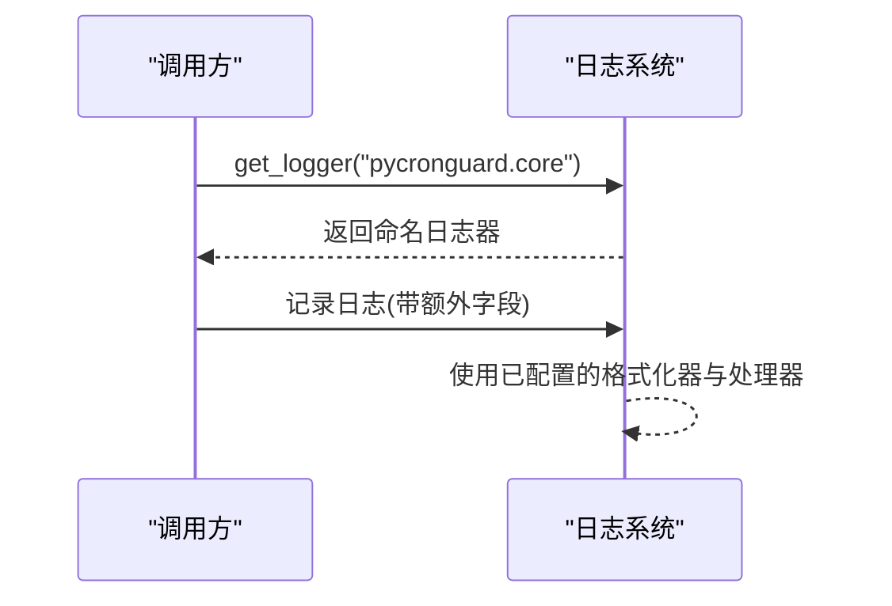
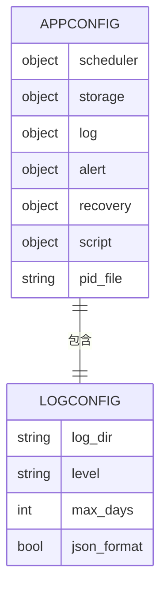
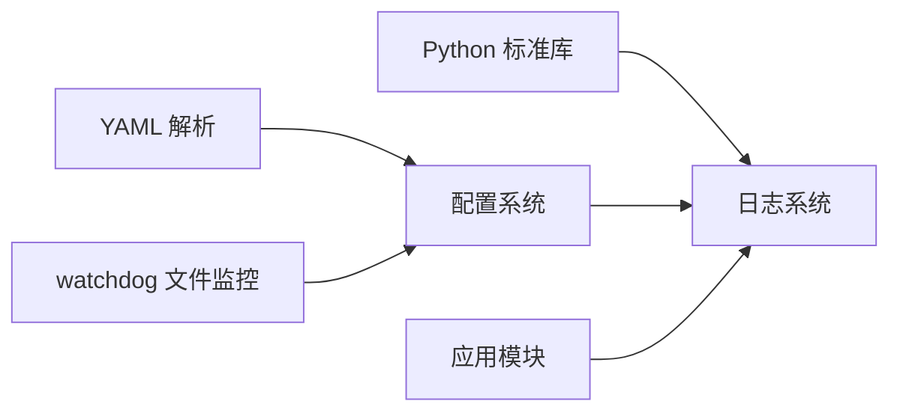

# 日志系统

<cite>
**本文引用的文件**
- [src/pycronguard/logging/logger.py](file://src/pycronguard/logging/logger.py)
- [src/pycronguard/config/schema.py](file://src/pycronguard/config/schema.py)
- [src/pycronguard/config/loader.py](file://src/pycronguard/config/loader.py)
- [config/default_config.yaml](file://config/default_config.yaml)
- [src/pycronguard/storage/database.py](file://src/pycronguard/storage/database.py)
</cite>

## 目录
1. [简介](#简介)
2. [项目结构](#项目结构)
3. [核心组件](#核心组件)
4. [架构总览](#架构总览)
5. [详细组件分析](#详细组件分析)
6. [依赖分析](#依赖分析)
7. [性能考虑](#性能考虑)
8. [故障排除指南](#故障排除指南)
9. [结论](#结论)
10. [附录：配置参数与最佳实践](#附录配置参数与最佳实践)

## 简介
本文件面向 PyCronGuard 的日志系统，提供从设计理念到实现细节、从配置参数到运维实践的完整技术文档。重点包括：
- 结构化日志与 JSON 输出的优势
- 日志记录器的实现细节（级别、格式化器、处理器）
- 日志轮转机制（按日轮转与保留策略）
- 完整的日志配置参数说明
- 日志分析与监控最佳实践（聚合、检索、告警）
- 性能优化与故障排除
- 自定义格式与扩展输出的指导

## 项目结构
日志系统由以下部分组成：
- 日志核心：JSON 格式化器与根日志器配置函数
- 配置模型：日志配置的数据类定义与默认值
- 配置加载：YAML 加载、合并、校验与路径展开
- 应用使用：在业务模块中通过命名日志器记录事件

**图表来源**
- [src/pycronguard/logging/logger.py:18-158](file://src/pycronguard/logging/logger.py#L18-L158)
- [src/pycronguard/config/schema.py:28-36](file://src/pycronguard/config/schema.py#L28-L36)
- [src/pycronguard/config/loader.py:83-204](file://src/pycronguard/config/loader.py#L83-L204)
- [config/default_config.yaml:15-21](file://config/default_config.yaml#L15-L21)
- [src/pycronguard/storage/database.py:26-46](file://src/pycronguard/storage/database.py#L26-L46)

**章节来源**
- [src/pycronguard/logging/logger.py:1-158](file://src/pycronguard/logging/logger.py#L1-L158)
- [src/pycronguard/config/schema.py:28-36](file://src/pycronguard/config/schema.py#L28-L36)
- [src/pycronguard/config/loader.py:83-204](file://src/pycronguard/config/loader.py#L83-L204)
- [config/default_config.yaml:15-21](file://config/default_config.yaml#L15-L21)
- [src/pycronguard/storage/database.py:26-46](file://src/pycronguard/storage/database.py#L26-L46)

## 核心组件
- JsonFormatter：将每条日志记录为单行 JSON 对象，包含时间戳、级别、名称、消息及附加字段；异常信息与堆栈信息可选附加。
- setup_logging：一次性配置根日志器，创建目录、选择格式化器、添加文件与控制台处理器，并设置轮转策略与保留天数。
- get_logger：返回命名日志器，便于按模块/功能域进行分类与分级。

关键特性：
- JSON 输出：利于结构化采集、解析与检索
- 双通道输出：同时写入文件与标准错误输出
- 按日轮转：以午夜为界滚动，保留指定天数
- 可配置级别与格式：支持人类可读与 JSON 两种格式

**章节来源**
- [src/pycronguard/logging/logger.py:18-158](file://src/pycronguard/logging/logger.py#L18-L158)

## 架构总览
下图展示日志系统在应用中的位置与交互：

**图表来源**
- [src/pycronguard/config/loader.py:100-116](file://src/pycronguard/config/loader.py#L100-L116)
- [src/pycronguard/logging/logger.py:90-147](file://src/pycronguard/logging/logger.py#L90-L147)

## 详细组件分析

### JsonFormatter 组件
- 设计目标：统一输出结构化日志，便于下游日志平台处理
- 字段构成：时间戳（UTC）、级别、日志器名称、消息正文、附加字段、异常文本、堆栈信息
- 过滤策略：排除标准 LogRecord 属性，避免重复与冗余
- 异常处理：自动格式化 exc_info 并注入 exception 字段
- 编码与兼容：UTF-8 编码，非字符串类型使用默认转换

**图表来源**
- [src/pycronguard/logging/logger.py:18-84](file://src/pycronguard/logging/logger.py#L18-L84)

**章节来源**
- [src/pycronguard/logging/logger.py:18-84](file://src/pycronguard/logging/logger.py#L18-L84)

### 日志记录器配置组件
- 根日志器：一次性设置级别与处理器，避免重复添加
- 文件处理器：按日轮转，备份数量等于保留天数，UTF-8 编码
- 控制台处理器：输出到标准错误，便于本地调试
- 格式化器选择：根据配置决定使用 JSON 或标准格式

**图表来源**
- [src/pycronguard/logging/logger.py:90-147](file://src/pycronguard/logging/logger.py#L90-L147)

**章节来源**
- [src/pycronguard/logging/logger.py:90-147](file://src/pycronguard/logging/logger.py#L90-L147)

### 命名日志器组件
- 提供按模块/功能域命名的日志器，便于区分来源
- 与根日志器共享格式化器与处理器，确保一致性

**图表来源**
- [src/pycronguard/logging/logger.py:149-158](file://src/pycronguard/logging/logger.py#L149-L158)

**章节来源**
- [src/pycronguard/logging/logger.py:149-158](file://src/pycronguard/logging/logger.py#L149-L158)

### 配置模型与加载
- LogConfig：定义日志目录、级别、保留天数、JSON 格式开关
- default_config.yaml：提供默认值与注释说明
- ConfigLoader：加载 YAML、合并覆盖、路径展开、嵌套数据类转换、校验
- 校验规则：日志级别合法性、保留天数范围、其他子系统参数约束

**图表来源**
- [src/pycronguard/config/schema.py:28-36](file://src/pycronguard/config/schema.py#L28-L36)
- [src/pycronguard/config/schema.py:86-96](file://src/pycronguard/config/schema.py#L86-L96)

**章节来源**
- [src/pycronguard/config/schema.py:28-36](file://src/pycronguard/config/schema.py#L28-L36)
- [src/pycronguard/config/schema.py:107-151](file://src/pycronguard/config/schema.py#L107-L151)
- [src/pycronguard/config/loader.py:100-116](file://src/pycronguard/config/loader.py#L100-L116)
- [config/default_config.yaml:15-21](file://config/default_config.yaml#L15-L21)

### 应用侧使用示例
- 在业务模块中通过命名日志器记录事件，如数据库初始化成功等
- 可结合额外字段传递上下文信息，便于后续检索与分析

**章节来源**
- [src/pycronguard/storage/database.py:26-46](file://src/pycronguard/storage/database.py#L26-L46)

## 依赖分析
- 日志系统依赖 Python 标准库 logging、logging.handlers.TimedRotatingFileHandler、json、datetime、pathlib、os、sys
- 配置系统依赖 YAML 解析与文件监控（watchdog），用于热更新
- 日志系统与配置系统通过配置对象解耦，便于替换与测试

**图表来源**
- [src/pycronguard/logging/logger.py:9-15](file://src/pycronguard/logging/logger.py#L9-L15)
- [src/pycronguard/config/loader.py:16-18](file://src/pycronguard/config/loader.py#L16-L18)

**章节来源**
- [src/pycronguard/logging/logger.py:9-15](file://src/pycronguard/logging/logger.py#L9-L15)
- [src/pycronguard/config/loader.py:16-18](file://src/pycronguard/config/loader.py#L16-L18)

## 性能考虑
- JSON 序列化成本：在高频日志场景下，建议评估 JSON.dumps 的开销，必要时可考虑缓冲或批量写入
- 轮转频率：按日轮转通常足够，若日志量极大，可考虑更细粒度轮转（需配合外部工具或自定义处理器）
- 编码与字符集：UTF-8 编码保证跨平台一致性，但对多字节字符较多的场景需关注编码开销
- 控制台输出：在生产环境建议关闭控制台输出或降低级别，减少 I/O 压力
- 处理器数量：当前采用双处理器（文件+控制台），在高并发下建议统一到文件处理器并交由日志代理收集

## 故障排除指南
- 日志目录不可写：确认日志目录存在且具备写权限；程序会在启动时尝试创建目录
- 轮转未生效：检查是否正确调用了配置函数；确认未重复初始化导致处理器重复添加
- 日志级别不生效：确认传入的级别字符串合法且与配置一致
- JSON 格式异常：检查记录中是否存在不可序列化对象；必要时在业务侧进行预处理
- 异常信息缺失：确保使用带 exc_info 的记录方法，或在捕获异常时显式传入
- 堆栈信息缺失：确保在捕获异常时启用 stack_info 参数

**章节来源**
- [src/pycronguard/logging/logger.py:111-120](file://src/pycronguard/logging/logger.py#L111-L120)
- [src/pycronguard/logging/logger.py:77-82](file://src/pycronguard/logging/logger.py#L77-L82)

## 结论
PyCronGuard 的日志系统以结构化 JSON 输出为核心，结合按日轮转与双通道输出，满足生产环境对可观测性与可维护性的需求。通过配置模型与加载器，实现了灵活的参数化与校验保障。建议在生产环境中统一使用 JSON 格式、合理设置保留策略，并配合日志代理与集中式日志平台实现高效采集、检索与告警。

## 附录：配置参数与最佳实践

### 日志配置参数说明
- log_dir：日志文件存放目录（支持 ~ 展开）
- level：日志级别（DEBUG/INFO/WARNING/ERROR/CRITICAL）
- max_days：保留天数（即轮转备份数量）
- json_format：是否启用 JSON 格式输出

上述参数来源于配置数据类与默认配置文件，且在配置加载时会进行路径展开与参数校验。

**章节来源**
- [src/pycronguard/config/schema.py:28-36](file://src/pycronguard/config/schema.py#L28-L36)
- [config/default_config.yaml:15-21](file://config/default_config.yaml#L15-L21)
- [src/pycronguard/config/loader.py:50-61](file://src/pycronguard/config/loader.py#L50-L61)
- [src/pycronguard/config/schema.py:118-122](file://src/pycronguard/config/schema.py#L118-L122)

### 日志轮转机制
- 轮转策略：按日轮转（midnight），每个日期生成一个独立文件
- 保留策略：保留最近 max_days 天的轮转文件
- 编码方式：UTF-8
- 处理器：文件处理器与控制台处理器并行

**章节来源**
- [src/pycronguard/logging/logger.py:129-146](file://src/pycronguard/logging/logger.py#L129-L146)

### 日志分析与监控最佳实践
- 结构化检索：利用 JSON 字段（如 level、name、message）进行过滤与聚合
- 时间窗口：结合 UTC 时间戳进行跨日检索与趋势分析
- 异常追踪：优先关注包含 exception 字段的记录，结合堆栈信息定位问题
- 告警集成：基于日志级别与关键字触发告警；结合失败阈值与冷却时间策略
- 日志聚合：通过日志代理统一收集，导入集中式日志平台进行可视化与报表

### 自定义格式与扩展输出
- 自定义格式化器：继承 logging.Formatter，按需调整字段与输出样式
- 扩展输出：新增处理器（如 HTTP、Syslog、队列）并绑定到根日志器
- 上下文字段：在记录时传入额外键值对，便于关联查询与审计

**章节来源**
- [src/pycronguard/logging/logger.py:18-84](file://src/pycronguard/logging/logger.py#L18-L84)
- [src/pycronguard/logging/logger.py:90-147](file://src/pycronguard/logging/logger.py#L90-L147)