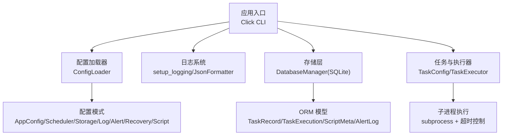
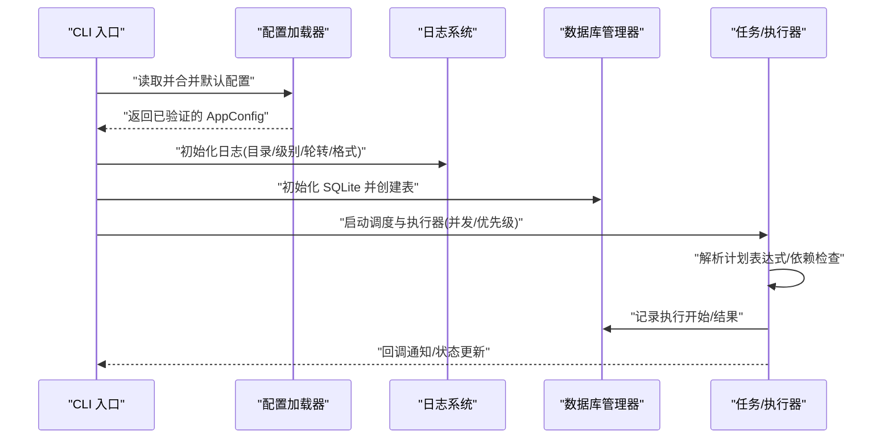
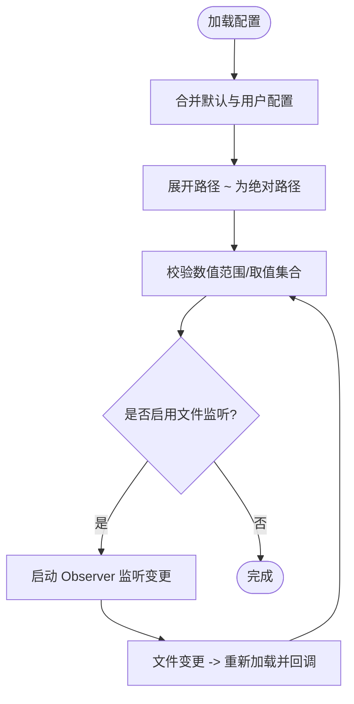
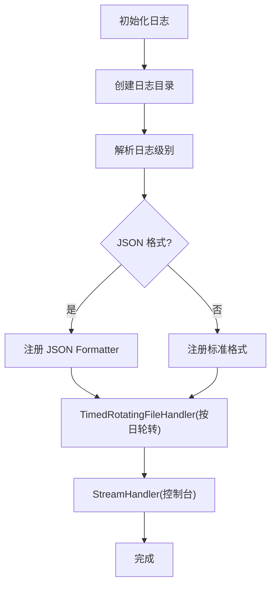
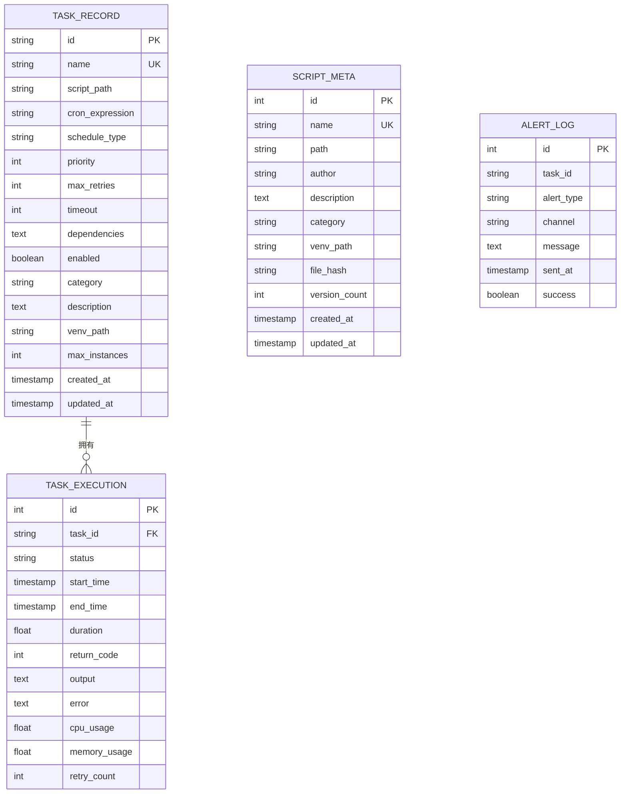
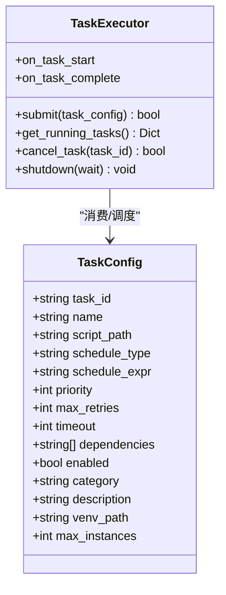
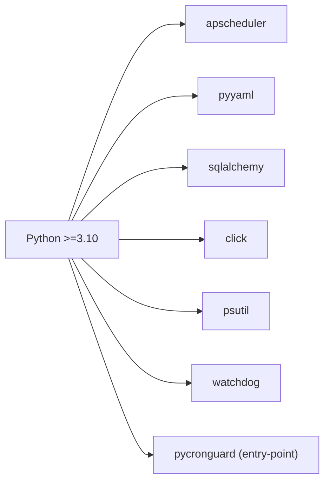

# 部署指南

<cite>
**本文引用的文件**
- [pyproject.toml](file://pyproject.toml)
- [requirements.txt](file://requirements.txt)
- [default_config.yaml](file://config/default_config.yaml)
- [__init__.py](file://src/pycronguard/__init__.py)
- [schema.py](file://src/pycronguard/config/schema.py)
- [loader.py](file://src/pycronguard/config/loader.py)
- [logger.py](file://src/pycronguard/logging/logger.py)
- [database.py](file://src/pycronguard/storage/database.py)
- [models.py](file://src/pycronguard/storage/models.py)
- [task.py](file://src/pycronguard/core/task.py)
- [executor.py](file://src/pycronguard/core/executor.py)
</cite>

## 目录
1. [简介](#简介)
2. [项目结构](#项目结构)
3. [核心组件](#核心组件)
4. [架构总览](#架构总览)
5. [详细组件分析](#详细组件分析)
6. [依赖关系分析](#依赖关系分析)
7. [性能考虑](#性能考虑)
8. [故障排除指南](#故障排除指南)
9. [结论](#结论)
10. [附录](#附录)

## 简介
本指南面向运维与平台工程团队，提供 PyCronGuard 在生产环境中的完整部署方案。内容涵盖系统要求、依赖安装、环境配置、多部署方式（systemd 服务、Docker 容器化、Kubernetes 集群）、监控与维护最佳实践、安全配置建议、高可用与负载均衡方案、故障排除、日常维护与升级策略，以及与 CI/CD 的集成思路。

## 项目结构
PyCronGuard 采用模块化设计，核心围绕“配置加载、日志、存储（SQLite）、任务模型与执行器”展开，并通过 Click 提供命令行入口。默认配置文件位于 config/default_config.yaml，应用版本信息在包元数据中声明。

图表来源
- [pyproject.toml:26-27](file://pyproject.toml#L26-L27)
- [loader.py:83-116](file://src/pycronguard/config/loader.py#L83-L116)
- [schema.py:86-96](file://src/pycronguard/config/schema.py#L86-L96)
- [logger.py:90-147](file://src/pycronguard/logging/logger.py#L90-L147)
- [database.py:29-46](file://src/pycronguard/storage/database.py#L29-L46)
- [models.py:19-131](file://src/pycronguard/storage/models.py#L19-L131)
- [task.py:23-60](file://src/pycronguard/core/task.py#L23-L60)
- [executor.py:50-77](file://src/pycronguard/core/executor.py#L50-L77)

章节来源
- [pyproject.toml:1-34](file://pyproject.toml#L1-L34)
- [default_config.yaml:1-57](file://config/default_config.yaml#L1-L57)
- [__init__.py:1-4](file://src/pycronguard/__init__.py#L1-L4)

## 核心组件
- 配置体系：通过 YAML 加载与校验，支持路径展开与文件变更监听；默认配置提供调度、存储、日志、告警、恢复、脚本等分段参数。
- 存储与模型：基于 SQLAlchemy 2.x 的 SQLite 引擎，自动建表；提供任务、执行记录、脚本元数据、告警日志的 CRUD 封装。
- 日志系统：支持按日轮转与 JSON 输出格式，便于集中采集与检索。
- 任务与执行器：优先队列 + 线程池并发控制，支持依赖检查、超时、取消、回调钩子。
- CLI 入口：通过 Click 注册命令入口，供 systemd/Docker/K8s 等运行时调用。

章节来源
- [loader.py:83-116](file://src/pycronguard/config/loader.py#L83-L116)
- [schema.py:86-151](file://src/pycronguard/config/schema.py#L86-L151)
- [database.py:29-271](file://src/pycronguard/storage/database.py#L29-L271)
- [models.py:19-131](file://src/pycronguard/storage/models.py#L19-L131)
- [logger.py:90-159](file://src/pycronguard/logging/logger.py#L90-L159)
- [task.py:23-281](file://src/pycronguard/core/task.py#L23-L281)
- [executor.py:50-463](file://src/pycronguard/core/executor.py#L50-L463)
- [pyproject.toml:26-27](file://pyproject.toml#L26-L27)

## 架构总览
下图展示从配置到执行的关键交互流程，强调配置加载、日志初始化、数据库生命周期、任务解析与执行器调度。

图表来源
- [loader.py:100-116](file://src/pycronguard/config/loader.py#L100-L116)
- [logger.py:90-147](file://src/pycronguard/logging/logger.py#L90-L147)
- [database.py:29-46](file://src/pycronguard/storage/database.py#L29-L46)
- [task.py:78-207](file://src/pycronguard/core/task.py#L78-L207)
- [executor.py:265-411](file://src/pycronguard/core/executor.py#L265-L411)

## 详细组件分析

### 配置加载与校验
- 支持从 YAML 合并默认配置，路径字段自动展开为绝对路径。
- 支持文件变更监听，修改后触发回调以重新加载配置。
- 对关键阈值与范围进行校验，确保运行时安全。

图表来源
- [loader.py:100-116](file://src/pycronguard/config/loader.py#L100-L116)
- [loader.py:118-141](file://src/pycronguard/config/loader.py#L118-L141)
- [loader.py:50-61](file://src/pycronguard/config/loader.py#L50-L61)
- [schema.py:107-151](file://src/pycronguard/config/schema.py#L107-L151)

章节来源
- [loader.py:83-204](file://src/pycronguard/config/loader.py#L83-L204)
- [schema.py:12-151](file://src/pycronguard/config/schema.py#L12-L151)

### 日志系统
- 按日轮转，支持 JSON 输出，便于结构化采集。
- 控制台与文件双通道，避免重复添加处理器。
- 可配置保留天数与日志级别。

图表来源
- [logger.py:90-147](file://src/pycronguard/logging/logger.py#L90-L147)

章节来源
- [logger.py:18-159](file://src/pycronguard/logging/logger.py#L18-L159)

### 存储与模型
- SQLite 引擎，自动建表；会话管理封装事务提交/回滚/关闭。
- ORM 模型覆盖任务、执行记录、脚本元数据、告警日志。
- 提供常用 CRUD 方法，支持查询最新执行、分页列表等。

图表来源
- [models.py:19-131](file://src/pycronguard/storage/models.py#L19-L131)
- [database.py:29-271](file://src/pycronguard/storage/database.py#L29-L271)

章节来源
- [database.py:29-271](file://src/pycronguard/storage/database.py#L29-L271)
- [models.py:19-131](file://src/pycronguard/storage/models.py#L19-L131)

### 任务与执行器
- 任务配置包含 ID、名称、脚本路径、计划类型/表达式、优先级、重试、超时、依赖、虚拟环境、并发上限等。
- 执行器基于线程池与信号量实现并发控制，堆实现优先队列，支持依赖检查、超时、取消、回调钩子。
- 子进程执行脚本，捕获输出与返回码，记录执行结果。

图表来源
- [task.py:23-60](file://src/pycronguard/core/task.py#L23-L60)
- [executor.py:50-77](file://src/pycronguard/core/executor.py#L50-L77)

章节来源
- [task.py:23-281](file://src/pycronguard/core/task.py#L23-L281)
- [executor.py:50-463](file://src/pycronguard/core/executor.py#L50-L463)

## 依赖关系分析
- Python 版本要求：>= 3.10。
- 关键依赖：apscheduler、pyyaml、sqlalchemy、click、psutil、watchdog。
- 包管理与 CLI：通过 setuptools 构建，注册命令入口 pycronguard -> main:cli。

图表来源
- [pyproject.toml:9](file://pyproject.toml#L9)
- [pyproject.toml:11-18](file://pyproject.toml#L11-L18)
- [pyproject.toml:26-27](file://pyproject.toml#L26-L27)

章节来源
- [pyproject.toml:1-34](file://pyproject.toml#L1-L34)
- [requirements.txt:1-7](file://requirements.txt#L1-L7)

## 性能考虑
- 并发与优先级：通过 max_workers 与任务优先级控制吞吐；合理设置 max_instances 避免资源争用。
- 超时与取消：为每个任务设置合理 timeout，防止僵尸进程；支持取消正在执行的任务。
- 日志轮转：按日轮转与 JSON 格式减少 I/O 开销，避免日志过大影响性能。
- 数据库：SQLite 单机轻量，注意磁盘空间与备份；对高频查询可结合索引与限制返回条数。
- 资源监控：利用 psutil 采集 CPU/Memory/Disk 使用率，结合恢复阈值进行告警与降载。

## 故障排除指南
- 配置加载失败
  - 现象：启动时报配置校验错误或无法读取 YAML。
  - 排查：确认配置文件路径、键名拼写、数值范围；检查路径展开是否成功。
  - 参考
    - [loader.py:100-116](file://src/pycronguard/config/loader.py#L100-L116)
    - [schema.py:107-151](file://src/pycronguard/config/schema.py#L107-L151)
- 日志未生成或格式异常
  - 现象：无日志文件或非 JSON 格式。
  - 排查：确认日志目录存在且可写；检查 json_format 与日志级别；避免重复初始化导致处理器重复。
  - 参考
    - [logger.py:90-147](file://src/pycronguard/logging/logger.py#L90-L147)
- 数据库连接/建表失败
  - 现象：无法创建表或连接失败。
  - 排查：确认 db_path 所在目录可写；SQLite 文件权限；网络盘挂载情况。
  - 参考
    - [database.py:29-46](file://src/pycronguard/storage/database.py#L29-L46)
- 任务执行超时或卡死
  - 现象：任务超过 timeout 仍未结束。
  - 排查：提高 timeout 或优化脚本；检查子进程是否产生僵尸进程；必要时使用 cancel_task。
  - 参考
    - [executor.py:329-336](file://src/pycronguard/core/executor.py#L329-L336)
    - [executor.py:146-174](file://src/pycronguard/core/executor.py#L146-L174)
- 依赖检查不生效
  - 现象：任务未按预期等待前置任务完成。
  - 排查：确认依赖 task_id 正确；检查数据库中最新执行记录状态是否为 success；DB 不可用时策略为宽松放行。
  - 参考
    - [executor.py:202-234](file://src/pycronguard/core/executor.py#L202-L234)
- 告警未发送
  - 现象：失败/性能异常未触发告警。
  - 排查：确认告警通道配置（如邮箱）已启用且参数完整；检查冷却时间与连续失败阈值。
  - 参考
    - [default_config.yaml:22-37](file://config/default_config.yaml#L22-L37)
    - [schema.py:146-151](file://src/pycronguard/config/schema.py#L146-L151)

## 结论
通过清晰的配置体系、可靠的 SQLite 存储、灵活的日志与执行器机制，PyCronGuard 能够在多种部署形态下稳定运行。建议在生产中结合 systemd/Kubernetes 实现高可用与弹性伸缩，并配合监控与日志平台进行统一观测与治理。

## 附录

### 生产环境部署步骤
- 系统要求
  - Python 版本：>= 3.10
  - 权限：具备写入日志目录、数据库文件所在目录与脚本目录的权限
- 依赖安装
  - 使用 pip 安装项目依赖（推荐使用虚拟环境）
  - 参考
    - [pyproject.toml:11-18](file://pyproject.toml#L11-L18)
    - [requirements.txt:1-7](file://requirements.txt#L1-7)
- 环境配置
  - 准备配置文件（默认路径参考默认配置），确保路径展开为绝对路径
  - 初始化日志目录、数据库文件目录、脚本目录
  - 参考
    - [default_config.yaml:5-57](file://config/default_config.yaml#L5-L57)
    - [loader.py:50-61](file://src/pycronguard/config/loader.py#L50-L61)
    - [logger.py:90-112](file://src/pycronguard/logging/logger.py#L90-L112)
    - [database.py:37-46](file://src/pycronguard/storage/database.py#L37-L46)

### 多种部署方式

#### systemd 服务配置
- 目标：将 PyCronGuard 作为系统服务长期运行，具备自启动、重启与日志落盘能力。
- 建议步骤
  - 创建服务单元文件，设置 ExecStart 指向 CLI 入口，WorkingDirectory 指向项目根目录
  - 设置标准输出/错误重定向至日志文件，结合默认配置中的日志轮转
  - 使用 Restart=always 与 RestartSec 参数提升可用性
  - 设置用户/组与最小权限原则，限制可访问路径
- 参考
  - [pyproject.toml:26-27](file://pyproject.toml#L26-L27)
  - [default_config.yaml:15-21](file://config/default_config.yaml#L15-L21)

#### Docker 容器化部署
- 目标：将应用打包为容器镜像，便于跨环境一致运行。
- 建议步骤
  - 基于官方 Python 3.10+ 镜像构建
  - 复制项目代码与依赖清单，安装依赖
  - 暴露必要端口（若未来开放 API），挂载配置文件与持久化目录（日志、数据库、脚本）
  - 使用只读根文件系统与非 root 用户运行
  - 编排时设置健康检查与重启策略
- 参考
  - [pyproject.toml:9](file://pyproject.toml#L9)
  - [default_config.yaml:11-56](file://config/default_config.yaml#L11-L56)

#### Kubernetes 集群部署
- 目标：在集群内以 Deployment/StatefulSet 形式部署，结合 ConfigMap/Secret 管理配置与密钥。
- 建议步骤
  - 使用 Deployment 管理副本数，StatefulSet 用于需要稳定存储的场景
  - 通过 ConfigMap 注入默认配置，Secret 管理敏感项（如邮箱密码）
  - 挂载 PVC 到日志与数据库目录，确保数据持久化
  - 配置 liveness/readiness 探针，结合日志与健康检查指标
  - 使用 HPA 根据 CPU/内存或自定义指标弹性扩缩
- 参考
  - [default_config.yaml:11-56](file://config/default_config.yaml#L11-L56)
  - [models.py:19-131](file://src/pycronguard/storage/models.py#L19-L131)

### 监控与维护最佳实践
- 性能监控
  - 采集 CPU/内存/磁盘使用率与任务执行耗时，结合阈值告警
  - 监控数据库连接数与慢查询（SQLite 场景关注 I/O）
- 日志管理
  - 使用 JSON 格式日志，集中采集到日志平台；按日轮转并设置保留天数
  - 对关键事件（任务失败、超时、依赖不满足）增加结构化字段
- 健康检查
  - 周期性执行健康检查，检查进程存活、数据库连通性、磁盘空间与阈值
  - 参考
    - [default_config.yaml:38-48](file://config/default_config.yaml#L38-L48)
    - [logger.py:90-147](file://src/pycronguard/logging/logger.py#L90-L147)

### 安全配置建议
- 权限管理
  - 以非 root 用户运行；仅授予必要的文件系统权限
  - 限制脚本目录与数据库目录的访问范围
- 网络配置
  - 若无 API 需求，避免暴露端口；如需远程管理，使用受控网络与 TLS
- 数据保护
  - 对敏感配置（邮箱凭据）使用 Secret 管理；定期轮换密钥
  - 启用日志脱敏，避免敏感信息泄露

### 负载均衡与高可用
- 负载均衡
  - 多实例部署时，使用共享存储（PVC/对象存储）保存配置与脚本；或通过配置中心同步
- 高可用
  - 使用多副本与滚动更新；结合探针与自动重启策略
  - 对关键任务启用重试与退避策略，避免雪崩效应
- 参考
  - [default_config.yaml:38-48](file://config/default_config.yaml#L38-L48)
  - [executor.py:50-77](file://src/pycronguard/core/executor.py#L50-L77)

### 日常维护与升级
- 维护
  - 定期清理过期日志与旧版本脚本；监控磁盘配额
  - 备份数据库文件与关键配置；验证恢复流程
- 升级
  - 小步快跑，先在测试环境验证；灰度发布，观察指标与日志
  - 升级前导出任务与执行历史，升级后核对一致性

### CI/CD 集成
- 构建
  - 使用 Python 3.10+ 环境，安装依赖并运行测试
- 测试
  - 覆盖配置加载、日志输出、数据库操作、任务执行与取消等关键路径
- 部署
  - Docker 镜像构建后推送至镜像仓库；Kubernetes 部署通过 GitOps 管理
- 参考
  - [pyproject.toml:20-24](file://pyproject.toml#L20-L24)
  - [pyproject.toml:32-34](file://pyproject.toml#L32-L34)