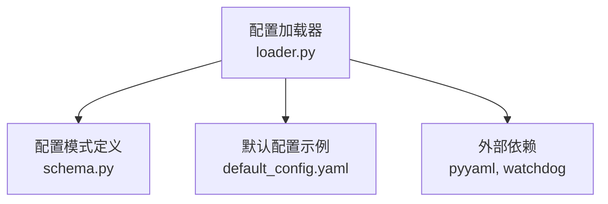
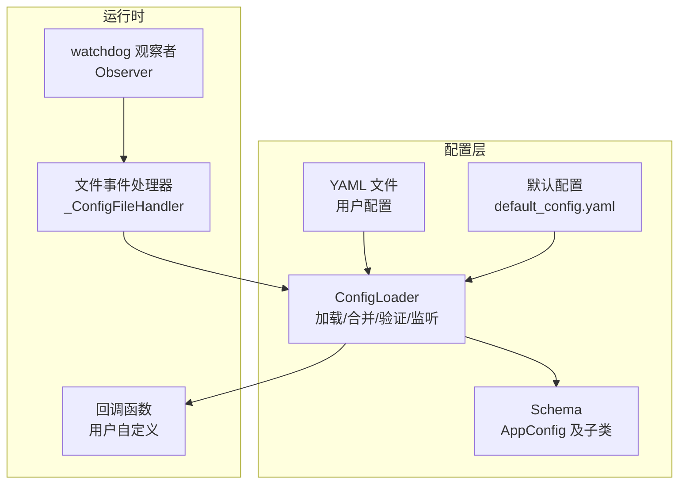
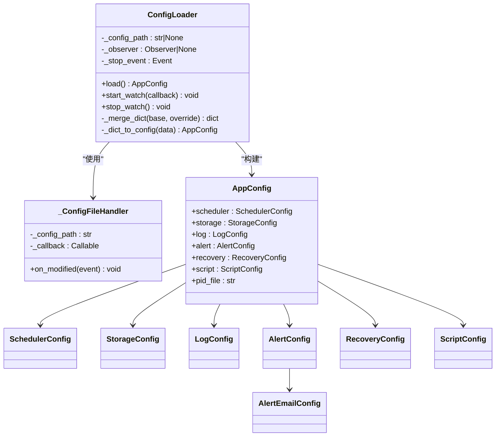
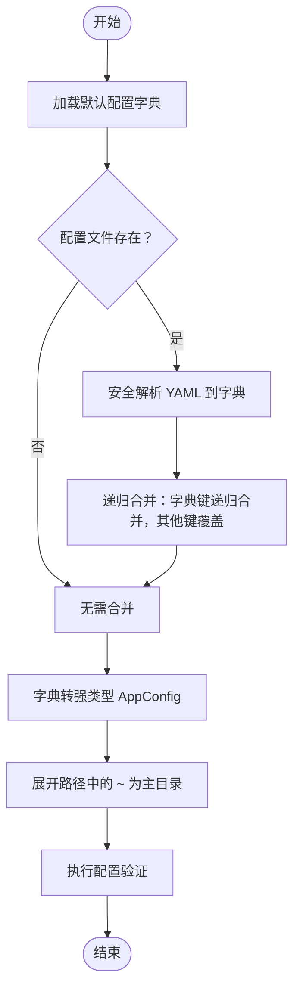
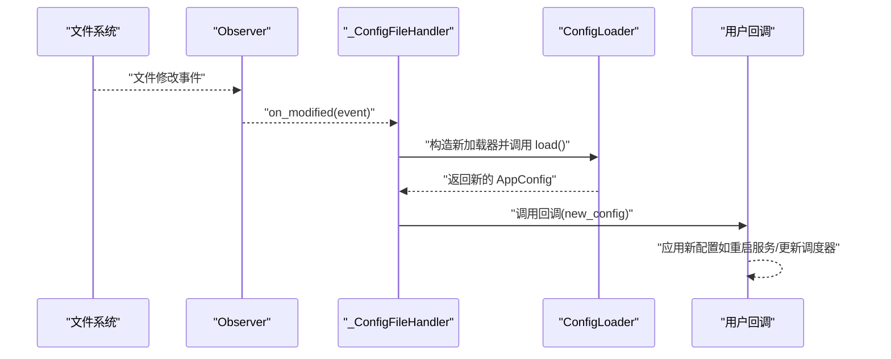
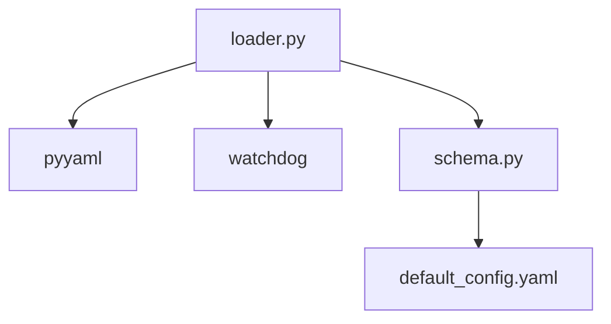

# 配置加载器

<cite>
**本文引用的文件**
- [loader.py](file://src/pycronguard/config/loader.py)
- [schema.py](file://src/pycronguard/config/schema.py)
- [default_config.yaml](file://config/default_config.yaml)
- [pyproject.toml](file://pyproject.toml)
- [requirements.txt](file://requirements.txt)
</cite>

## 目录
1. [简介](#简介)
2. [项目结构](#项目结构)
3. [核心组件](#核心组件)
4. [架构总览](#架构总览)
5. [详细组件分析](#详细组件分析)
6. [依赖分析](#依赖分析)
7. [性能考虑](#性能考虑)
8. [故障排查指南](#故障排查指南)
9. [结论](#结论)
10. [附录](#附录)

## 简介
本文件面向 PyCronGuard 的配置加载器，系统性阐述 ConfigLoader 类的工作原理与使用方法，覆盖以下关键主题：
- YAML 文件解析与默认值合并
- 配置验证与路径展开
- 配置文件监听机制与热重载
- 完整加载流程：从文件读取到数据类转换
- 使用示例与最佳实践
- 错误处理、性能优化与调试技巧

## 项目结构
配置相关代码位于 src/pycronguard/config 目录，核心文件如下：
- loader.py：配置加载器实现，含 YAML 解析、默认值合并、路径展开、配置验证、文件监听与热重载
- schema.py：配置数据模型定义，包含各子系统的数据类及默认配置与校验函数
- default_config.yaml：默认配置示例文件，用于对照理解字段含义与默认值

图表来源
- [loader.py:1-204](file://src/pycronguard/config/loader.py#L1-L204)
- [schema.py:1-151](file://src/pycronguard/config/schema.py#L1-L151)
- [default_config.yaml:1-57](file://config/default_config.yaml#L1-L57)

章节来源
- [loader.py:1-204](file://src/pycronguard/config/loader.py#L1-L204)
- [schema.py:1-151](file://src/pycronguard/config/schema.py#L1-L151)
- [default_config.yaml:1-57](file://config/default_config.yaml#L1-L57)

## 核心组件
- ConfigLoader：负责从 YAML 加载配置、与默认值合并、转换为强类型对象、路径展开、验证，并可启动/停止文件监听以实现热重载。
- _ConfigFileHandler：内部文件系统事件处理器，捕获配置文件修改事件并触发回调。
- AppConfig 及其子类：配置数据模型，包含调度、存储、日志、告警、恢复、脚本等子系统配置。
- default_config()：返回带默认值的 AppConfig 实例。
- validate_config()：对 AppConfig 执行基础校验，确保数值范围与必填项有效。

章节来源
- [loader.py:83-204](file://src/pycronguard/config/loader.py#L83-L204)
- [schema.py:86-151](file://src/pycronguard/config/schema.py#L86-L151)

## 架构总览
下图展示配置加载器在系统中的角色与交互：

图表来源
- [loader.py:83-204](file://src/pycronguard/config/loader.py#L83-L204)
- [schema.py:86-151](file://src/pycronguard/config/schema.py#L86-L151)
- [default_config.yaml:1-57](file://config/default_config.yaml#L1-L57)

## 详细组件分析

### ConfigLoader 类
ConfigLoader 是配置加载与热重载的核心类，提供以下能力：
- 从 YAML 文件读取用户配置并与其默认值进行递归合并
- 将合并后的字典转换为强类型 AppConfig 对象
- 展开路径中的波浪号（~）为用户主目录
- 执行配置验证，确保数值范围与必填项有效
- 通过 watchdog 监听配置文件变更，触发回调以实现热重载

图表来源
- [loader.py:83-204](file://src/pycronguard/config/loader.py#L83-L204)
- [schema.py:86-151](file://src/pycronguard/config/schema.py#L86-L151)

章节来源
- [loader.py:83-204](file://src/pycronguard/config/loader.py#L83-L204)
- [schema.py:86-151](file://src/pycronguard/config/schema.py#L86-L151)

### YAML 文件解析与默认值合并
- 默认值来源：通过 default_config() 返回的 AppConfig 实例作为基础字典。
- 用户配置来源：若提供了有效的配置文件路径且文件存在，则使用安全解析读取 YAML 并与默认值进行递归合并。
- 合并策略：当键对应的值均为字典时，递归合并；否则后者覆盖前者。

图表来源
- [loader.py:100-116](file://src/pycronguard/config/loader.py#L100-L116)
- [loader.py:155-172](file://src/pycronguard/config/loader.py#L155-L172)
- [loader.py:174-203](file://src/pycronguard/config/loader.py#L174-L203)

章节来源
- [loader.py:100-116](file://src/pycronguard/config/loader.py#L100-L116)
- [loader.py:155-172](file://src/pycronguard/config/loader.py#L155-L172)
- [loader.py:174-203](file://src/pycronguard/config/loader.py#L174-L203)

### 路径展开
- 作用：将配置中涉及路径的字符串字段中的波浪号（~）展开为当前用户的主目录，保证路径在不同用户环境下的可用性。
- 影响字段：存储数据库路径、日志目录、脚本目录、脚本版本目录、PID 文件路径。

章节来源
- [loader.py:50-61](file://src/pycronguard/config/loader.py#L50-L61)

### 配置验证
- 验证范围：调度器工作线程数与实例数、日志级别与保留天数、恢复重试参数、阈值范围、告警阈值与冷却时间、脚本最大版本数、邮件告警启用时的必要字段。
- 异常：当任一校验条件不满足时抛出异常，阻止无效配置进入运行时。

章节来源
- [schema.py:107-151](file://src/pycronguard/config/schema.py#L107-L151)

### 配置文件监听与热重载
- 监听机制：通过 watchdog 的 Observer 订阅配置文件所在目录的文件修改事件。
- 事件处理：_ConfigFileHandler 在检测到目标文件被修改时，重新加载配置并通过回调传递新的 AppConfig 实例。
- 生命周期：start_watch 创建观察者并启动；stop_watch 停止并等待观察者线程退出。

图表来源
- [loader.py:118-149](file://src/pycronguard/config/loader.py#L118-L149)
- [loader.py:64-81](file://src/pycronguard/config/loader.py#L64-L81)

章节来源
- [loader.py:118-149](file://src/pycronguard/config/loader.py#L118-L149)
- [loader.py:64-81](file://src/pycronguard/config/loader.py#L64-L81)

### 数据类转换流程
- 字段过滤：仅保留 AppConfig 的已知字段，忽略未知键。
- 分段处理：对顶层键进行映射，将对应子字典转换为相应的子数据类（如 scheduler、storage、log 等）。
- 嵌套处理：对 alert.email 等嵌套字典，先按子类构造再注入到父类。
- 异常处理：未识别的键会被忽略，避免因新增字段导致加载失败。

章节来源
- [loader.py:174-203](file://src/pycronguard/config/loader.py#L174-L203)
- [schema.py:86-96](file://src/pycronguard/config/schema.py#L86-L96)

## 依赖分析
- 外部库依赖
  - pyyaml：用于安全解析 YAML
  - watchdog：用于文件系统事件监听
- 内部依赖
  - schema.py：提供数据类定义与默认配置、校验函数
  - default_config.yaml：提供默认配置示例，便于对照理解字段

图表来源
- [loader.py:16-31](file://src/pycronguard/config/loader.py#L16-L31)
- [pyproject.toml:11-18](file://pyproject.toml#L11-L18)
- [requirements.txt:1-7](file://requirements.txt#L1-7)

章节来源
- [pyproject.toml:11-18](file://pyproject.toml#L11-L18)
- [requirements.txt:1-7](file://requirements.txt#L1-7)

## 性能考虑
- 合并算法复杂度：递归合并字典的时间复杂度为 O(N)，其中 N 为用户配置键数量；空间复杂度为 O(N)。
- 路径展开：仅对路径相关字段进行展开，开销极小。
- 验证成本：验证逻辑为常数次比较，开销可忽略。
- 监听线程：watchdog 的 Observer 以守护线程运行，避免阻塞主线程退出；stop_watch 提供超时等待，确保资源释放。
- 建议
  - 避免频繁修改配置文件，减少不必要的热重载触发。
  - 回调函数应尽量轻量，避免在回调中执行耗时操作。
  - 对于大规模配置，优先使用默认值，减少覆盖字段数量。

[本节为通用性能建议，不直接分析具体文件]

## 故障排查指南
- 无法启动监听
  - 现象：start_watch 输出警告“未设置配置路径”，无法监听。
  - 排查：确认传入的配置路径非空且存在。
- 监听未生效
  - 现象：修改配置文件后未触发回调。
  - 排查：确认监听目录与文件路径一致；检查权限与文件是否被移动或删除。
- 热重载失败
  - 现象：回调中记录异常日志“重新加载配置失败”。
  - 排查：检查 YAML 语法、字段类型与范围；确保 validate_config 通过。
- 配置验证失败
  - 现象：抛出异常，提示某字段超出范围或必填项缺失。
  - 排查：对照 schema 中的校验规则修正配置。
- 路径不可用
  - 现象：数据库或日志目录无法写入。
  - 排查：确认展开后的路径存在且具备写权限。

章节来源
- [loader.py:127-129](file://src/pycronguard/config/loader.py#L127-L129)
- [loader.py:74-80](file://src/pycronguard/config/loader.py#L74-L80)
- [schema.py:107-151](file://src/pycronguard/config/schema.py#L107-L151)

## 结论
ConfigLoader 提供了从 YAML 到强类型配置的完整链路，具备默认值合并、路径展开与严格验证能力，并支持基于 watchdog 的热重载。通过合理的回调设计，可在不中断服务的情况下平滑更新配置。建议在生产环境中结合监控与日志，确保配置变更的可观测性与可回滚性。

[本节为总结性内容，不直接分析具体文件]

## 附录

### 使用示例与最佳实践
- 初始化与加载
  - 传入配置文件路径，调用 load() 获取强类型配置对象。
  - 若未提供路径或文件不存在，将使用默认配置。
- 启动监听与热重载
  - 调用 start_watch(callback)，在回调中应用新配置（如重启调度器、刷新日志句柄等）。
  - 在进程退出前调用 stop_watch()，确保观察者线程安全停止。
- 最佳实践
  - 将敏感配置（如邮件凭据）置于受控环境变量或密钥管理中，不在 YAML 中明文保存。
  - 回调中避免阻塞主线程，必要时异步处理。
  - 对配置变更进行审计与版本控制，便于追踪问题。

章节来源
- [loader.py:100-116](file://src/pycronguard/config/loader.py#L100-L116)
- [loader.py:118-149](file://src/pycronguard/config/loader.py#L118-L149)

### 配置字段参考（来自 schema 与默认示例）
- 调度器：最大工作线程数、最大实例数、时区
- 存储：数据库文件路径
- 日志：日志目录、日志级别、保留天数、JSON 格式
- 告警：失败立即告警、连续失败阈值、冷却时间、邮件告警子配置
- 恢复：最大重试次数、初始重试延迟、指数退避因子、健康检查间隔、CPU/内存/磁盘阈值、任务超时
- 脚本：脚本目录、版本目录、最大版本数
- PID 文件：进程标识文件路径

章节来源
- [schema.py:12-96](file://src/pycronguard/config/schema.py#L12-L96)
- [default_config.yaml:1-57](file://config/default_config.yaml#L1-L57)