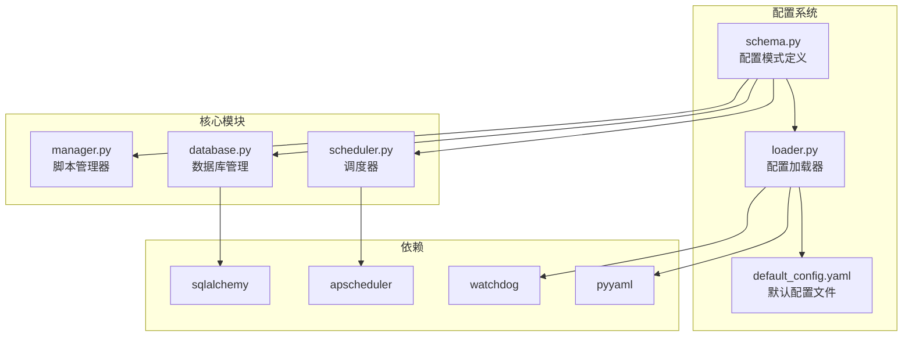
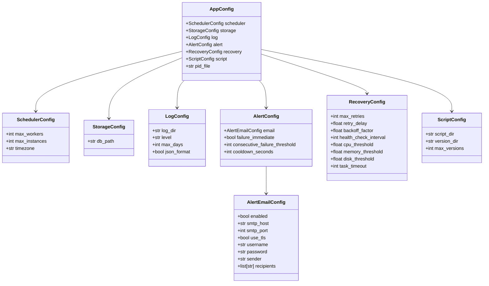
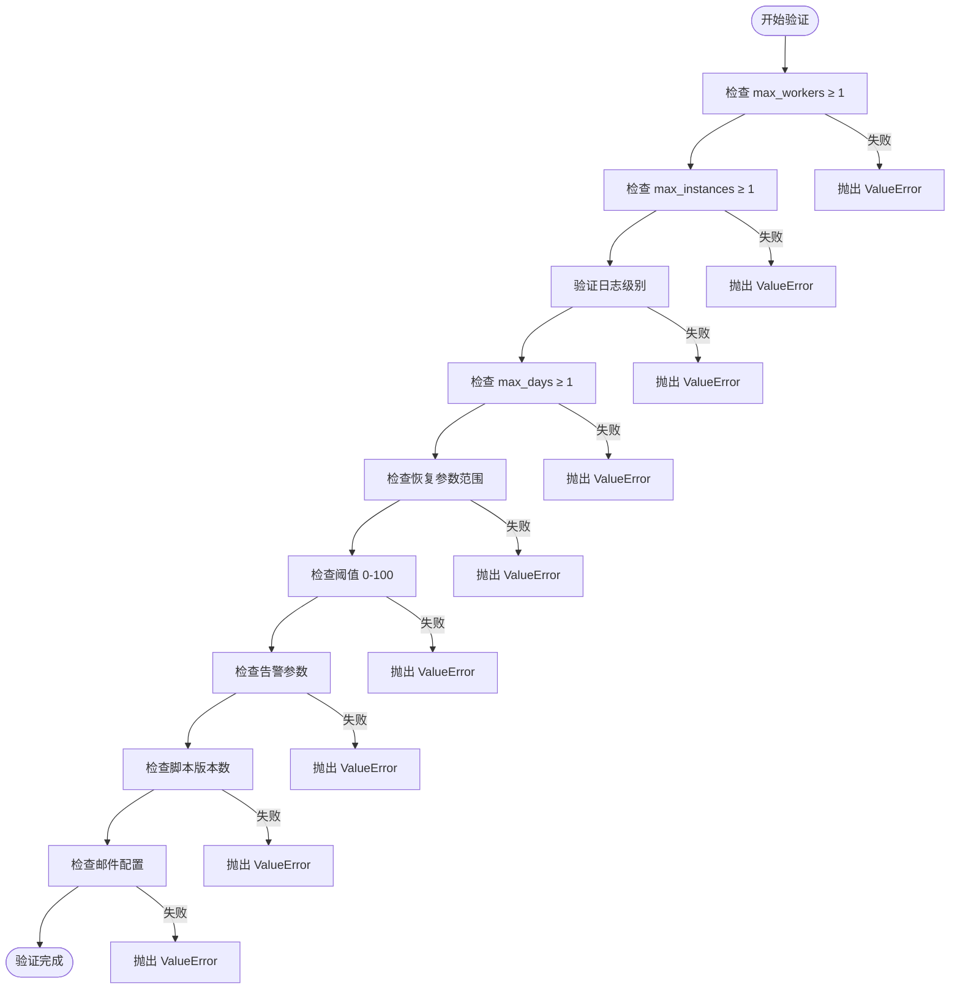
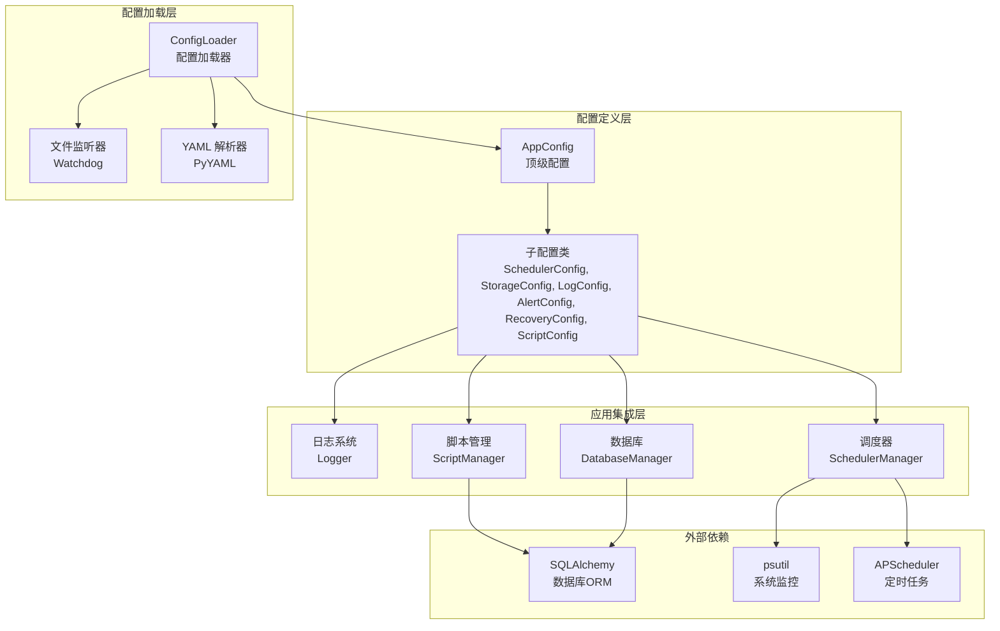
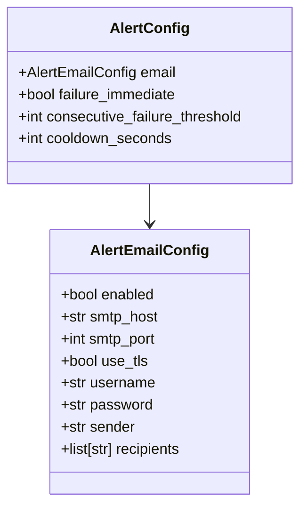
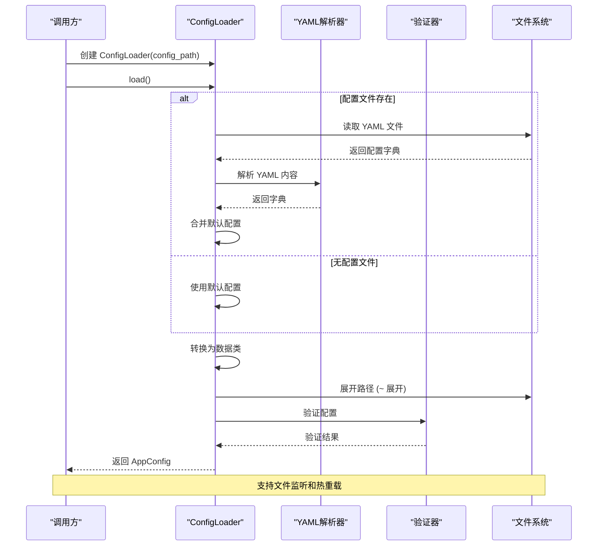

# 配置模式定义

<cite>
**本文档引用的文件**
- [schema.py](file://src/pycronguard/config/schema.py)
- [loader.py](file://src/pycronguard/config/loader.py)
- [default_config.yaml](file://config/default_config.yaml)
- [scheduler.py](file://src/pycronguard/core/scheduler.py)
- [database.py](file://src/pycronguard/storage/database.py)
- [manager.py](file://src/pycronguard/scripts/manager.py)
- [pyproject.toml](file://pyproject.toml)
- [requirements.txt](file://requirements.txt)
</cite>

## 目录
1. [简介](#简介)
2. [项目结构](#项目结构)
3. [核心组件](#核心组件)
4. [架构概览](#架构概览)
5. [详细组件分析](#详细组件分析)
6. [依赖分析](#依赖分析)
7. [性能考虑](#性能考虑)
8. [故障排除指南](#故障排除指南)
9. [结论](#结论)

## 简介

PyCronGuard 是一个强大的 Python 定时任务管理和监控工具，采用数据类模式（dataclasses）定义完整的配置系统。该配置模式以 AppConfig 为核心，通过嵌套的数据类结构实现了清晰的层次化配置管理，涵盖了调度器、存储、日志、告警、恢复和脚本管理等各个子系统的配置需求。

配置模式的设计理念基于以下原则：
- **类型安全**：使用 Python 3.7+ 的 dataclasses 提供静态类型检查
- **可扩展性**：支持从 YAML 文件加载和动态热重载
- **验证机制**：内置配置验证确保参数的有效性和合理性
- **路径处理**：自动处理用户目录展开（~）和绝对路径转换

## 项目结构

PyCronGuard 的配置系统主要分布在以下文件中：

**图表来源**
- [schema.py:1-151](file://src/pycronguard/config/schema.py#L1-L151)
- [loader.py:1-204](file://src/pycronguard/config/loader.py#L1-L204)
- [default_config.yaml:1-57](file://config/default_config.yaml#L1-L57)

**章节来源**
- [schema.py:1-151](file://src/pycronguard/config/schema.py#L1-L151)
- [loader.py:1-204](file://src/pycronguard/config/loader.py#L1-L204)
- [default_config.yaml:1-57](file://config/default_config.yaml#L1-L57)

## 核心组件

### AppConfig - 应用程序顶级配置

AppConfig 是整个配置系统的根节点，它聚合了所有子配置类，形成了完整的配置层次结构：

**图表来源**
- [schema.py:12-96](file://src/pycronguard/config/schema.py#L12-L96)

### 配置验证系统

配置验证函数提供了运行时参数检查，确保配置的合理性和有效性：

**图表来源**
- [schema.py:107-151](file://src/pycronguard/config/schema.py#L107-L151)

**章节来源**
- [schema.py:85-151](file://src/pycronguard/config/schema.py#L85-L151)

## 架构概览

PyCronGuard 的配置架构采用了分层设计，从底层的配置模式定义到上层的应用集成：

**图表来源**
- [loader.py:83-204](file://src/pycronguard/config/loader.py#L83-L204)
- [scheduler.py:30-83](file://src/pycronguard/core/scheduler.py#L30-L83)
- [database.py:29-47](file://src/pycronguard/storage/database.py#L29-L47)
- [manager.py:23-48](file://src/pycronguard/scripts/manager.py#L23-L48)

## 详细组件分析

### 调度器配置 (SchedulerConfig)

调度器配置负责管理定时任务执行的核心参数：

| 字段名 | 数据类型 | 默认值 | 验证规则 | 描述 |
|--------|----------|--------|----------|------|
| max_workers | int | 4 | ≥ 1 | 线程池最大工作线程数 |
| max_instances | int | 1 | ≥ 1 | 同一任务最大并发实例数 |
| timezone | str | "Asia/Shanghai" | 有效时区标识 | APScheduler 使用的时区 |

调度器配置在调度器初始化时被直接使用：
- 时区设置传递给 APScheduler BackgroundScheduler
- 工作线程数影响任务执行的并发能力
- 实例数量控制同一任务的并发执行限制

**章节来源**
- [schema.py:12-19](file://src/pycronguard/config/schema.py#L12-L19)
- [scheduler.py:49-51](file://src/pycronguard/core/scheduler.py#L49-L51)

### 存储配置 (StorageConfig)

存储配置定义了数据库文件的位置：

| 字段名 | 数据类型 | 默认值 | 验证规则 | 描述 |
|--------|----------|--------|----------|------|
| db_path | str | "~/.pycronguard/data.db" | 有效文件路径 | SQLite 数据库文件路径 |

存储配置的关键特性：
- 自动展开用户目录（~）为完整路径
- 父目录自动创建确保数据库文件可以正常创建
- 支持相对路径和绝对路径

**章节来源**
- [schema.py:22-26](file://src/pycronguard/config/schema.py#L22-L26)
- [loader.py:56](file://src/pycronguard/config/loader.py#L56)
- [database.py:37-46](file://src/pycronguard/storage/database.py#L37-L46)

### 日志配置 (LogConfig)

日志配置提供了灵活的日志记录选项：

| 字段名 | 数据类型 | 默认值 | 验证规则 | 描述 |
|--------|----------|--------|----------|------|
| log_dir | str | "~/.pycronguard/logs" | 有效目录路径 | 日志文件存储目录 |
| level | str | "INFO" | "DEBUG", "INFO", "WARNING", "ERROR", "CRITICAL" | 日志级别 |
| max_days | int | 30 | ≥ 1 | 日志文件保留天数 |
| json_format | bool | True | 无 | 是否使用 JSON 格式输出 |

日志配置的验证确保了日志系统的正确性：
- 日志级别必须是预定义的有效值之一
- 保留天数必须为正整数
- 路径展开确保日志文件可以正确写入

**章节来源**
- [schema.py:29-36](file://src/pycronguard/config/schema.py#L29-L36)
- [loader.py:57](file://src/pycronguard/config/loader.py#L57)
- [schema.py:118-122](file://src/pycronguard/config/schema.py#L118-L122)

### 告警配置 (AlertConfig)

告警配置支持多种告警渠道和策略：

**图表来源**
- [schema.py:53-60](file://src/pycronguard/config/schema.py#L53-L60)
- [schema.py:39-50](file://src/pycronguard/config/schema.py#L39-L50)

告警配置的关键参数：
- **failure_immediate**: 失败后是否立即触发告警
- **consecutive_failure_threshold**: 连续失败达到此次数才触发告警
- **cooldown_seconds**: 同一任务告警的冷却时间（秒）

邮件告警配置的验证规则：
- 当启用邮件告警时，必须提供 SMTP 主机和收件人列表
- SMTP 端口默认使用 587（TLS）
- 支持 TLS 加密连接

**章节来源**
- [schema.py:53-60](file://src/pycronguard/config/schema.py#L53-L60)
- [schema.py:146-151](file://src/pycronguard/config/schema.py#L146-L151)

### 恢复配置 (RecoveryConfig)

恢复配置定义了系统自愈和健康检查机制：

| 字段名 | 数据类型 | 默认值 | 验证规则 | 描述 |
|--------|----------|--------|----------|------|
| max_retries | int | 3 | ≥ 0 | 最大重试次数 |
| retry_delay | float | 10.0 | ≥ 0 | 初始重试延迟（秒） |
| backoff_factor | float | 2.0 | ≥ 1.0 | 指数退避因子 |
| health_check_interval | int | 60 | ≥ 1 | 健康检查间隔（秒） |
| cpu_threshold | float | 90.0 | 0-100 | CPU 使用率阈值（%） |
| memory_threshold | float | 90.0 | 0-100 | 内存使用率阈值（%） |
| disk_threshold | float | 90.0 | 0-100 | 磁盘使用率阈值（%） |
| task_timeout | int | 3600 | ≥ 1 | 任务超时时间（秒） |

恢复配置的验证确保了系统稳定性和资源保护：
- 所有数值参数必须在合理范围内
- 阈值必须在 0-100 百分比范围内
- 超时时间必须为正整数

**章节来源**
- [schema.py:63-74](file://src/pycronguard/config/schema.py#L63-L74)
- [schema.py:124-137](file://src/pycronguard/config/schema.py#L124-L137)

### 脚本配置 (ScriptConfig)

脚本配置管理脚本仓库和版本控制：

| 字段名 | 数据类型 | 默认值 | 验证规则 | 描述 |
|--------|----------|--------|----------|------|
| script_dir | str | "~/.pycronguard/scripts" | 有效目录路径 | 脚本管理目录 |
| version_dir | str | "~/.pycronguard/script_versions" | 有效目录路径 | 脚本版本备份目录 |
| max_versions | int | 10 | ≥ 1 | 每个脚本最大保留版本数 |

脚本配置的特点：
- 支持独立的脚本目录和版本目录
- 自动处理脚本文件的复制和版本备份
- 版本控制确保脚本变更的可追溯性

**章节来源**
- [schema.py:77-83](file://src/pycronguard/config/schema.py#L77-L83)
- [loader.py:58-60](file://src/pycronguard/config/loader.py#L58-L60)
- [manager.py:35-47](file://src/pycronguard/scripts/manager.py#L35-L47)

## 依赖分析

### 配置加载流程

配置系统采用渐进式加载和验证机制：

**图表来源**
- [loader.py:100-116](file://src/pycronguard/config/loader.py#L100-L116)
- [loader.py:174-203](file://src/pycronguard/config/loader.py#L174-L203)

### 外部依赖关系

配置系统依赖的主要外部库：

| 依赖库 | 版本要求 | 用途 | 配置使用场景 |
|--------|----------|------|-------------|
| apscheduler | >=3.10.0 | 定时任务调度 | SchedulerConfig.timezone, max_instances |
| pyyaml | >=6.0 | YAML 文件解析 | ConfigLoader.load(), default_config.yaml |
| sqlalchemy | >=2.0 | 数据库 ORM | DatabaseManager, StorageConfig.db_path |
| watchdog | >=3.0 | 文件系统监控 | ConfigLoader.start_watch(), hot-reload |
| psutil | >=5.9 | 系统资源监控 | RecoveryConfig.cpu/memory/disk_threshold |

**章节来源**
- [pyproject.toml:11-18](file://pyproject.toml#L11-L18)
- [requirements.txt:1-7](file://requirements.txt#L1-L7)

## 性能考虑

### 配置加载性能优化

1. **增量加载**：仅在需要时解析 YAML 文件，避免不必要的 I/O 操作
2. **缓存机制**：ConfigLoader 维护内部状态，支持热重载而无需重启进程
3. **路径预处理**：在配置加载阶段统一处理路径展开，减少运行时计算开销

### 内存使用优化

- **数据类优势**：使用 dataclasses 减少内存占用和属性访问开销
- **懒加载策略**：非必要的配置项在首次使用时才进行初始化
- **类型提示**：提供编译时类型检查，减少运行时错误和回退成本

### 并发安全性

- **不可变配置**：配置对象在验证后保持不变，避免并发修改问题
- **线程安全**：ConfigLoader 在文件监听时使用事件驱动模型，避免阻塞主线程

## 故障排除指南

### 常见配置错误及解决方案

| 错误类型 | 错误信息 | 可能原因 | 解决方案 |
|----------|----------|----------|----------|
| 配置验证错误 | "scheduler.max_workers must be >= 1" | 数值配置不合法 | 将配置值调整为正整数 |
| 路径解析错误 | "路径不存在或权限不足" | 文件路径无效 | 检查并修正配置路径 |
| YAML 解析错误 | "YAML 格式错误" | 配置文件格式不正确 | 使用 YAML 验证工具检查语法 |
| 依赖缺失错误 | "模块导入失败" | 缺少必要的依赖包 | 运行 pip install 安装缺失依赖 |

### 调试技巧

1. **启用详细日志**：将日志级别设置为 DEBUG 获取更详细的配置加载信息
2. **配置导出**：使用 asdict() 将配置对象转换为字典进行调试
3. **逐步验证**：逐个注释配置项来定位具体问题所在

**章节来源**
- [schema.py:107-151](file://src/pycronguard/config/schema.py#L107-L151)
- [loader.py:72-81](file://src/pycronguard/config/loader.py#L72-L81)

## 结论

PyCronGuard 的配置模式定义展现了现代 Python 应用的优秀实践：

**设计理念优势**：
- **类型安全**：完整的类型注解确保编译时错误检测
- **可维护性**：清晰的层次结构便于理解和扩展
- **灵活性**：支持 YAML 配置和动态热重载
- **健壮性**：内置验证机制防止无效配置

**扩展指导**：
1. **新增配置项**：遵循现有数据类模式，在相应配置类中添加字段
2. **自定义验证**：在 validate_config 函数中添加新的验证逻辑
3. **配置合并**：利用 ConfigLoader 的递归合并机制支持复杂嵌套配置
4. **热重载支持**：通过 Watchdog 机制实现配置的实时更新

该配置系统为 PyCronGuard 提供了坚实的基础，既满足了当前的功能需求，又为未来的功能扩展预留了充足的空间。