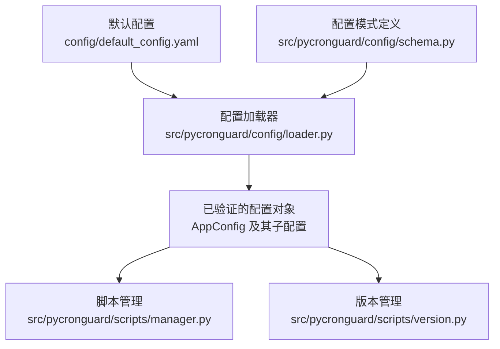
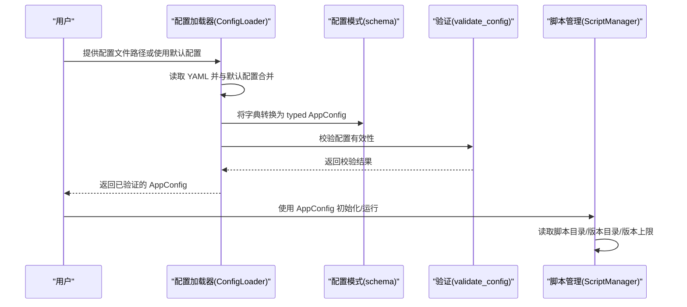
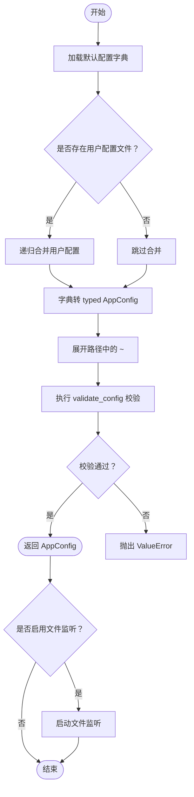
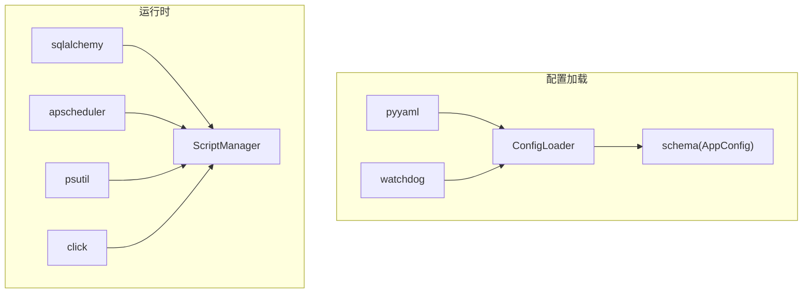

# 配置示例和最佳实践

<cite>
**本文引用的文件**
- [default_config.yaml](file://config/default_config.yaml)
- [loader.py](file://src/pycronguard/config/loader.py)
- [schema.py](file://src/pycronguard/config/schema.py)
- [pyproject.toml](file://pyproject.toml)
- [requirements.txt](file://requirements.txt)
- [version.py](file://src/pycronguard/scripts/version.py)
- [manager.py](file://src/pycronguard/scripts/manager.py)
</cite>

## 目录
1. [简介](#简介)
2. [项目结构](#项目结构)
3. [核心组件](#核心组件)
4. [架构总览](#架构总览)
5. [详细组件分析](#详细组件分析)
6. [依赖分析](#依赖分析)
7. [性能考虑](#性能考虑)
8. [故障排查指南](#故障排查指南)
9. [结论](#结论)
10. [附录](#附录)

## 简介
本文件面向 PyCronGuard 用户，系统化地介绍配置文件结构、各配置项含义与取值范围、相互影响关系，并提供开发、测试、生产等多环境的最佳实践建议。同时涵盖配置验证与调试方法、常见错误定位与修复思路，以及从旧版本到新版本的迁移与兼容性说明。

## 项目结构
PyCronGuard 的配置体系由默认配置文件与运行时加载器共同构成：默认配置提供合理的缺省值；运行时加载器负责读取用户覆盖配置、合并默认值、校验有效性，并支持配置文件热更新监听。

图表来源
- [default_config.yaml:1-57](file://config/default_config.yaml#L1-L57)
- [loader.py:83-203](file://src/pycronguard/config/loader.py#L83-L203)
- [schema.py:85-104](file://src/pycronguard/config/schema.py#L85-L104)

章节来源
- [default_config.yaml:1-57](file://config/default_config.yaml#L1-L57)
- [loader.py:83-203](file://src/pycronguard/config/loader.py#L83-L203)
- [schema.py:85-104](file://src/pycronguard/config/schema.py#L85-L104)

## 核心组件
- 默认配置文件：提供各子系统的缺省值，便于快速上手。
- 配置加载器：负责 YAML 解析、与默认配置合并、路径展开、类型转换、校验与热更新监听。
- 配置模式定义：以数据类描述顶层配置与各子系统配置，确保类型安全与可读性。
- 脚本与版本管理：消费配置中的脚本目录、版本目录与版本数量限制，实现脚本版本备份与清理。

章节来源
- [loader.py:83-203](file://src/pycronguard/config/loader.py#L83-L203)
- [schema.py:12-95](file://src/pycronguard/config/schema.py#L12-L95)
- [version.py:52-183](file://src/pycronguard/scripts/version.py#L52-L183)
- [manager.py:180-232](file://src/pycronguard/scripts/manager.py#L180-L232)

## 架构总览
下图展示了配置从文件到运行时对象的完整流程，以及与脚本管理模块的交互。

图表来源
- [loader.py:100-116](file://src/pycronguard/config/loader.py#L100-L116)
- [schema.py:107-151](file://src/pycronguard/config/schema.py#L107-L151)
- [manager.py:180-232](file://src/pycronguard/scripts/manager.py#L180-L232)

## 详细组件分析

### 配置文件结构与字段说明
- 顶层键
  - scheduler：调度器相关配置
  - storage：存储/数据库配置
  - log：日志配置
  - alert：告警配置
  - recovery：恢复与健康检查配置
  - script：脚本管理配置
  - pid_file：进程 PID 文件路径

- 子系统配置项详解
  - scheduler
    - max_workers：线程池最大工作线程数，必须 ≥ 1
    - max_instances：同一任务最大并发实例数，必须 ≥ 1
    - timezone：时区字符串，用于调度器时间处理
  - storage
    - db_path：SQLite 数据库文件路径，支持 ~ 展开
  - log
    - log_dir：日志目录，支持 ~ 展开
    - level：日志级别，允许值：DEBUG/INFO/WARNING/ERROR/CRITICAL
    - max_days：日志保留天数，必须 ≥ 1
    - json_format：是否启用 JSON 格式日志输出
  - alert
    - failure_immediate：失败后是否立即告警
    - consecutive_failure_threshold：连续失败阈值，必须 ≥ 1
    - cooldown_seconds：同一任务告警冷却时间（秒），必须 ≥ 0
    - email：邮件告警通道
      - enabled：是否启用邮件告警
      - smtp_host：SMTP 主机，启用时必填
      - smtp_port：SMTP 端口
      - use_tls：是否启用 TLS
      - username/password：SMTP 认证凭据
      - sender：发件人邮箱
      - recipients：收件人邮箱列表，启用时不能为空
  - recovery
    - max_retries：最大重试次数，必须 ≥ 0
    - retry_delay：初始重试延迟（秒），必须 ≥ 0
    - backoff_factor：指数退避因子，必须 ≥ 1.0
    - health_check_interval：健康检查间隔（秒）
    - cpu_threshold/memory_threshold/disk_threshold：CPU/内存/磁盘使用率阈值（%），范围 0–100
    - task_timeout：任务超时时间（秒），必须 ≥ 1
  - script
    - script_dir：脚本存放目录，支持 ~ 展开
    - version_dir：脚本版本备份目录，支持 ~ 展开
    - max_versions：每个脚本最多保留版本数，必须 ≥ 1
  - pid_file：PID 文件路径，支持 ~ 展开

章节来源
- [default_config.yaml:6-56](file://config/default_config.yaml#L6-L56)
- [schema.py:12-95](file://src/pycronguard/config/schema.py#L12-L95)
- [schema.py:107-151](file://src/pycronguard/config/schema.py#L107-L151)

### 配置加载与校验流程
- 加载步骤
  - 读取默认配置（字典形式）
  - 若用户提供配置文件且存在，则解析 YAML 并与默认配置递归合并
  - 将合并后的字典转换为 typed AppConfig（含嵌套子配置）
  - 展开所有路径中的 ~ 占位符
  - 执行 validate_config 校验
- 校验规则
  - 数值范围校验（如 ≥1/≥0/≥1.0、0–100）
  - 必填字段校验（启用邮件告警时 SMTP 主机与收件人列表）
  - 日志级别枚举校验
- 热更新
  - 支持通过 watchdog 监听配置文件变更，自动重新加载并回调通知

图表来源
- [loader.py:100-116](file://src/pycronguard/config/loader.py#L100-L116)
- [loader.py:118-150](file://src/pycronguard/config/loader.py#L118-L150)
- [schema.py:107-151](file://src/pycronguard/config/schema.py#L107-L151)

章节来源
- [loader.py:100-116](file://src/pycronguard/config/loader.py#L100-L116)
- [loader.py:118-150](file://src/pycronguard/config/loader.py#L118-L150)
- [schema.py:107-151](file://src/pycronguard/config/schema.py#L107-L151)

### 配置项相互影响关系
- 调度器与资源
  - max_workers 与 max_instances 共同决定并发能力与资源占用，应结合任务特性与服务器资源设置
  - timezone 影响任务触发时间计算
- 日志与存储
  - log.max_days 控制日志保留周期，需与存储空间规划匹配
  - storage.db_path 决定数据库文件位置，需确保写权限与磁盘空间
- 告警与恢复
  - alert.consecutive_failure_threshold 与 cooldown_seconds 影响告警频率与噪音控制
  - recovery.cpu/memory/disk_threshold 与 task_timeout 影响健康检查灵敏度与任务容忍度
- 脚本与版本
  - script.max_versions 控制版本保留数量，影响磁盘占用
  - script_dir 与 version_dir 的路径展开与权限直接影响脚本注册、备份与恢复

章节来源
- [schema.py:12-95](file://src/pycronguard/config/schema.py#L12-L95)
- [schema.py:107-151](file://src/pycronguard/config/schema.py#L107-L151)
- [version.py:52-183](file://src/pycronguard/scripts/version.py#L52-L183)

### 不同环境的最佳配置建议
- 开发环境
  - 日志级别：DEBUG，保留天数适中（例如 7 天）
  - 告警：关闭邮件告警或降低阈值，避免频繁打扰
  - 恢复：较短的 task_timeout 与较低的健康检查间隔，便于快速发现问题
  - 脚本：较小的 max_versions，便于频繁迭代
- 测试环境
  - 日志级别：INFO，保留天数中等（例如 14 天）
  - 告警：开启邮件告警，设置合理阈值与冷却时间
  - 恢复：适度的重试次数与退避因子，平衡稳定性与响应速度
  - 脚本：中等的 max_versions，兼顾历史回溯与空间占用
- 生产环境
  - 日志级别：INFO 或 WARNING，保留天数较长（例如 30 天），开启 JSON 格式便于日志采集
  - 告警：启用邮件告警，设置较高的连续失败阈值与合理的冷却时间
  - 恢复：较大的 task_timeout 与合理的 CPU/内存/磁盘阈值，避免误报；适当增加重试次数与退避因子
  - 脚本：较大的 max_versions，确保可回滚性；定期清理旧版本

章节来源
- [default_config.yaml:6-56](file://config/default_config.yaml#L6-L56)
- [schema.py:107-151](file://src/pycronguard/config/schema.py#L107-L151)

### 配置验证与调试方法
- 验证方法
  - 使用加载器加载配置并调用 validate_config，捕获 ValueError 获取具体错误原因
  - 对于路径类字段，确认 ~ 已正确展开且目标目录存在且具备相应权限
  - 对于邮件告警，确认启用开关与必要字段均满足要求
- 调试步骤
  - 启用配置文件监听，修改配置后观察日志输出“配置文件已更改，正在重新加载…”
  - 检查日志目录与文件权限，确保日志写入成功
  - 在脚本管理模块中验证脚本目录与版本目录的读写权限
- 常见错误与解决
  - 数值越界：调整数值至允许范围（如 ≥1/≥0/≥1.0、0–100）
  - 日志级别非法：改为允许值之一
  - 邮件告警未启用但缺少主机或收件人：启用开关或将字段留空
  - 路径不可写：修正目录权限或更换目录

章节来源
- [loader.py:100-116](file://src/pycronguard/config/loader.py#L100-L116)
- [loader.py:118-150](file://src/pycronguard/config/loader.py#L118-L150)
- [schema.py:107-151](file://src/pycronguard/config/schema.py#L107-L151)

### 配置迁移指南与版本兼容性
- 版本兼容性
  - 当前版本要求 Python ≥ 3.10，相关依赖版本在 pyproject.toml 中声明
  - 若从旧版本升级，请先备份现有配置文件
- 迁移步骤
  - 比对默认配置文件与旧配置文件差异，逐项核对新增/删除的键
  - 对照各配置项的取值范围与默认值，修正不合法或过时的设置
  - 逐步替换配置文件，先在测试环境验证，再推广到生产
- 注意事项
  - 新增的 email 嵌套配置需按层级正确填写
  - 路径类字段若使用 ~，请确认运行用户具备相应权限
  - 如启用配置文件监听，请确保文件系统监控可用

章节来源
- [pyproject.toml:5-18](file://pyproject.toml#L5-L18)
- [default_config.yaml:6-56](file://config/default_config.yaml#L6-L56)
- [loader.py:118-150](file://src/pycronguard/config/loader.py#L118-L150)

## 依赖分析
- 配置加载依赖
  - YAML 解析：pyyaml
  - 文件监控：watchdog
  - 数据库：sqlalchemy
  - 调度器：apscheduler
  - 系统信息：psutil
  - 命令行：click
- 运行时行为
  - 配置加载器依赖 schema 定义的数据类进行类型转换与校验
  - 脚本管理模块依赖配置中的脚本与版本目录进行备份与恢复

图表来源
- [pyproject.toml:11-17](file://pyproject.toml#L11-L17)
- [loader.py:16-31](file://src/pycronguard/config/loader.py#L16-L31)
- [schema.py:85-95](file://src/pycronguard/config/schema.py#L85-L95)

章节来源
- [pyproject.toml:11-17](file://pyproject.toml#L11-L17)
- [requirements.txt:1-7](file://requirements.txt#L1-7)
- [loader.py:16-31](file://src/pycronguard/config/loader.py#L16-L31)
- [schema.py:85-95](file://src/pycronguard/config/schema.py#L85-L95)

## 性能考虑
- 并发与资源
  - 合理设置 scheduler.max_workers 与 max_instances，避免过度并发导致资源争用
  - 结合任务类型（IO 密集/计算密集）选择合适的线程数
- 日志与存储
  - log.json_format 与 log.max_days 影响磁盘 IO 与空间占用，建议生产环境开启 JSON 便于集中采集
  - storage.db_path 所在分区容量与 IO 性能需满足业务峰值
- 健康检查
  - recovery.health_check_interval 与 task_timeout 需权衡检测灵敏度与系统负载
  - CPU/内存/磁盘阈值过高可能导致误报，过低可能错过预警

## 故障排查指南
- 配置加载失败
  - 检查 YAML 语法与缩进
  - 查看 validate_config 抛出的具体错误信息
- 文件监听无效
  - 确认配置文件路径有效且可读
  - 检查 watchdog 依赖安装与权限
- 日志无法写入
  - 确认 log.log_dir 存在且具备写权限
  - 检查磁盘空间与配额
- 邮件告警异常
  - 确认 alert.email.enabled 与必要字段齐全
  - 验证 SMTP 主机、端口、TLS、认证信息与收件人列表
- 脚本备份/恢复失败
  - 检查 script.script_dir 与 script.version_dir 权限
  - 确认磁盘空间充足，版本数量未超过上限

章节来源
- [loader.py:118-150](file://src/pycronguard/config/loader.py#L118-L150)
- [schema.py:107-151](file://src/pycronguard/config/schema.py#L107-L151)
- [version.py:52-183](file://src/pycronguard/scripts/version.py#L52-L183)

## 结论
通过默认配置与加载器的配合，PyCronGuard 提供了灵活而可靠的配置机制。遵循本文档的配置项说明、最佳实践与排错方法，可在不同环境中稳定运行。建议在生产环境优先启用 JSON 日志、合理设置健康检查阈值与告警策略，并定期审查脚本版本与存储空间。

## 附录
- 完整配置示例参考路径
  - [默认配置示例:1-57](file://config/default_config.yaml#L1-L57)
- 关键实现参考路径
  - [配置加载与合并:100-116](file://src/pycronguard/config/loader.py#L100-L116)
  - [配置模式定义:85-104](file://src/pycronguard/config/schema.py#L85-L104)
  - [配置校验逻辑:107-151](file://src/pycronguard/config/schema.py#L107-L151)
  - [脚本版本管理:52-183](file://src/pycronguard/scripts/version.py#L52-L183)
  - [脚本元数据更新:180-232](file://src/pycronguard/scripts/manager.py#L180-L232)