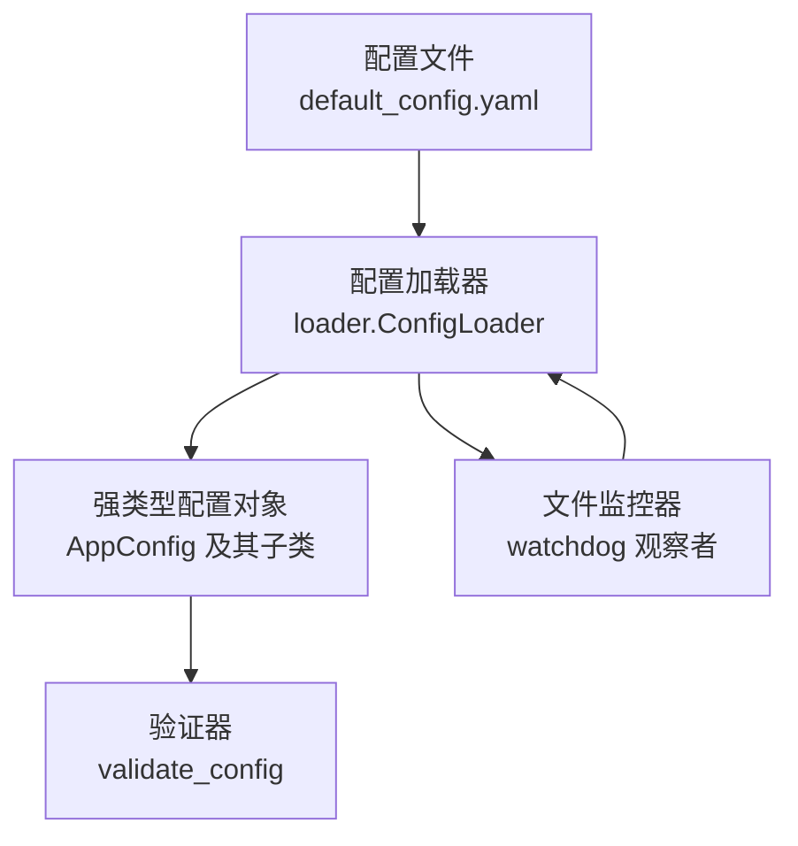
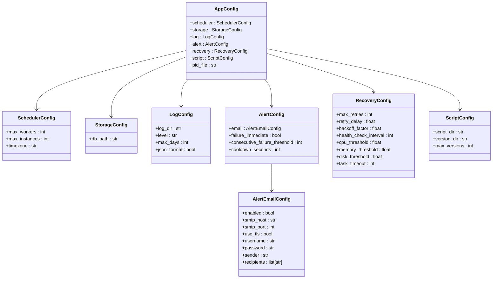
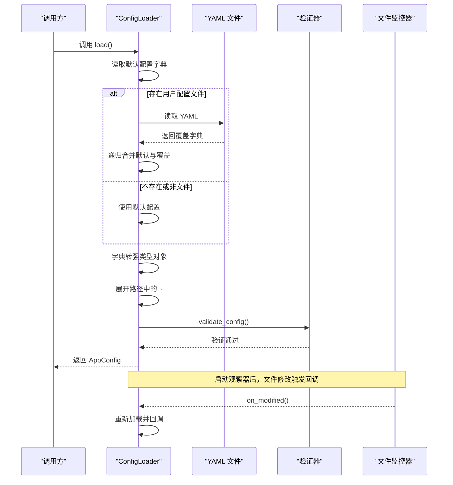
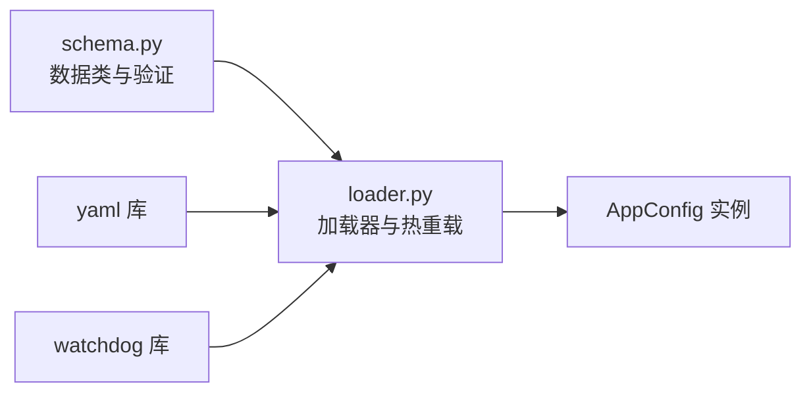
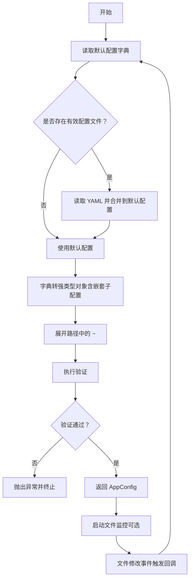

# 配置管理系统

<cite>
**本文引用的文件**
- [default_config.yaml](file://config/default_config.yaml)
- [loader.py](file://src/pycronguard/config/loader.py)
- [schema.py](file://src/pycronguard/config/schema.py)
- [test_config.py](file://tests/test_config.py)
- [manager.py](file://src/pycronguard/scripts/manager.py)
- [daemon.py](file://src/pycronguard/deploy/daemon.py)
</cite>

## 目录
1. [简介](#简介)
2. [项目结构](#项目结构)
3. [核心组件](#核心组件)
4. [架构总览](#架构总览)
5. [详细组件分析](#详细组件分析)
6. [依赖分析](#依赖分析)
7. [性能考虑](#性能考虑)
8. [故障排查指南](#故障排查指南)
9. [结论](#结论)
10. [附录](#附录)

## 简介
本文件系统性地文档化 PyCronGuard 的配置管理系统，重点阐述以下方面：
- 配置架构设计理念：以数据类模式为核心，结合 YAML 配置文件，实现强类型、可验证、可热重载的配置体系。
- 配置加载器工作机制：文件解析、默认值合并、嵌套数据类转换、路径展开、验证与热重载。
- 完整配置模式定义：调度器、存储、日志、告警、恢复、脚本管理、PID文件等子系统的参数说明与约束。
- 配置示例与最佳实践：提供默认配置文件与常见场景建议，解释各配置项作用与相互关系。
- 验证规则、错误处理与调试技巧：帮助开发者快速定位配置问题并进行扩展。

## 项目结构
配置系统由三层组成：
- 配置模式定义层：使用数据类描述完整的配置结构，确保类型安全与可读性。
- 配置加载与验证层：负责从 YAML 加载、合并默认值、转换为强类型对象、执行验证、路径展开与热重载。
- 配置文件层：提供默认配置模板，便于用户按需覆盖关键参数。



**图表来源**
- [default_config.yaml:1-57](file://config/default_config.yaml#L1-L57)
- [loader.py:83-203](file://src/pycronguard/config/loader.py#L83-L203)
- [schema.py:85-151](file://src/pycronguard/config/schema.py#L85-L151)

**章节来源**
- [default_config.yaml:1-57](file://config/default_config.yaml#L1-L57)
- [loader.py:83-203](file://src/pycronguard/config/loader.py#L83-L203)
- [schema.py:12-151](file://src/pycronguard/config/schema.py#L12-L151)

## 核心组件
- 数据类模式定义：通过多级数据类组织配置，顶层为 AppConfig，包含调度器、存储、日志、告警、恢复、脚本管理、PID文件等子配置对象。
- 配置加载器：支持从指定 YAML 文件加载并合并默认配置；将字典转换为强类型对象；展开路径中的波浪号；执行验证；可选启动文件监控以实现热重载。
- 验证器：对数值范围、字符串枚举、布尔开关以及依赖条件进行校验，保证配置在运行前即满足业务约束。

**章节来源**
- [schema.py:85-151](file://src/pycronguard/config/schema.py#L85-L151)
- [loader.py:83-203](file://src/pycronguard/config/loader.py#L83-L203)
- [schema.py:107-151](file://src/pycronguard/config/schema.py#L107-L151)

## 架构总览
配置系统采用"YAML 文件 + 数据类 + 验证 + 热重载"的组合架构，确保配置的可维护性与运行时稳定性。



**图表来源**
- [schema.py:12-151](file://src/pycronguard/config/schema.py#L12-L151)

## 详细组件分析

### 配置模式定义（数据类）
- 分层设计：顶层 AppConfig 组织各子系统配置；子配置对象独立封装各自领域的参数，降低耦合。
- 默认值：每个字段均提供合理默认值，减少用户配置负担。
- 嵌套结构：AlertConfig 内部嵌套 AlertEmailConfig，体现"分组配置"的组织方式。

**章节来源**
- [schema.py:12-96](file://src/pycronguard/config/schema.py#L12-L96)

### 配置加载器（ConfigLoader）
- 加载流程
  - 读取默认配置并转为字典。
  - 若存在用户配置文件且为有效文件，则读取 YAML 并与默认配置递归合并。
  - 将合并后的字典转换为强类型 AppConfig 对象。
  - 展开路径中的波浪号（如用户目录）。
  - 执行验证，抛出异常或返回合法配置。
- 热重载
  - 使用 watchdog 监听配置文件所在目录的修改事件。
  - 当文件被修改时，重新加载配置并通过回调通知上层模块。
  - 提供启动/停止观察器的方法，便于生命周期管理。



**图表来源**
- [loader.py:100-116](file://src/pycronguard/config/loader.py#L100-L116)
- [loader.py:118-149](file://src/pycronguard/config/loader.py#L118-L149)
- [loader.py:64-81](file://src/pycronguard/config/loader.py#L64-L81)

**章节来源**
- [loader.py:83-203](file://src/pycronguard/config/loader.py#L83-L203)

### 配置验证规则
- 调度器
  - 工作线程数必须大于等于 1。
  - 同一任务最大实例数必须大于等于 1。
- 日志
  - 日志级别必须为预设集合之一。
  - 日志保留天数必须大于等于 1。
- 恢复与健康检查
  - 最大重试次数必须大于等于 0。
  - 初始重试延迟必须大于等于 0。
  - 指数退避因子必须大于等于 1。
  - 任务超时必须大于等于 1。
  - CPU/内存/磁盘阈值必须在 0 到 100 之间。
- 告警
  - 连续失败阈值必须大于等于 1。
  - 告警冷却时间必须大于等于 0。
  - 当启用邮件告警时，SMTP 主机与收件人列表必须提供。
- 脚本管理
  - 每脚本最大保留版本数必须大于等于 1。
- PID 文件
  - PID 文件路径支持波浪号展开，无需特殊验证。

**章节来源**
- [schema.py:107-151](file://src/pycronguard/config/schema.py#L107-L151)

### 配置文件与默认值
- 默认配置文件提供完整键空间与默认值，便于直接使用或作为参考。
- 支持仅覆盖需要变更的部分键，未覆盖部分自动采用默认值。
- 路径字段在加载后统一展开为绝对路径，避免运行时路径解析问题。

**章节来源**
- [default_config.yaml:1-57](file://config/default_config.yaml#L1-L57)
- [loader.py:50-61](file://src/pycronguard/config/loader.py#L50-L61)

### 新增配置项详解

#### 恢复配置（recovery）
恢复配置提供系统自愈能力，包含重试机制、健康检查和资源监控：
- max_retries：最大重试次数，0 表示禁用重试
- retry_delay：初始重试延迟（秒），支持小数
- backoff_factor：指数退避因子，必须 ≥ 1.0
- health_check_interval：健康检查间隔（秒）
- cpu_threshold/memory_threshold/disk_threshold：资源使用率阈值（0-100%）
- task_timeout：单个任务超时时间（秒）

#### 脚本管理配置（script）
脚本管理配置控制脚本仓库的存储和版本管理：
- script_dir：脚本主目录，存放已注册的脚本文件
- version_dir：脚本版本备份目录，保存历史版本
- max_versions：每脚本最大保留版本数，防止磁盘空间无限增长

#### PID 文件配置（pid_file）
PID 文件配置用于进程标识和管理：
- pid_file：PID 文件路径，支持波浪号展开到用户主目录
- 用于守护进程模式下的进程状态跟踪和优雅停机

**章节来源**
- [default_config.yaml:38-56](file://config/default_config.yaml#L38-L56)
- [schema.py:62-95](file://src/pycronguard/config/schema.py#L62-L95)

## 依赖分析
- 组件内聚与耦合
  - loader 依赖 schema 中的数据类与验证函数，职责清晰。
  - schema 保持纯数据类定义，不引入外部依赖，便于测试与复用。
- 外部依赖
  - YAML 解析：用于读取用户配置。
  - watchdog：用于文件监控与热重载。
  - 标准库：os、pathlib、logging、threading 等。



**图表来源**
- [loader.py:16-31](file://src/pycronguard/config/loader.py#L16-L31)
- [schema.py:12-151](file://src/pycronguard/config/schema.py#L12-L151)

**章节来源**
- [loader.py:16-31](file://src/pycronguard/config/loader.py#L16-L31)
- [schema.py:12-151](file://src/pycronguard/config/schema.py#L12-L151)

## 性能考虑
- 递归合并字典：在配置层级较深时，合并操作的时间复杂度与覆盖字典大小成正比，建议控制覆盖配置的体量。
- 文件监控：watchdog 在后台线程运行，对主流程影响较小；但频繁写入可能带来额外 IO 压力，建议在生产环境谨慎开启热重载。
- 路径展开：仅在初始化阶段执行一次，成本极低。
- 验证：验证逻辑为常量时间检查，开销可忽略。

## 故障排查指南
- 常见错误与定位
  - 配置值越界：例如日志级别不在允许集合中、阈值超出范围等。根据验证器抛出的异常消息定位具体字段。
  - 邮件告警配置缺失：当启用邮件告警时，若 SMTP 主机或收件人列表为空，会触发异常。
  - 文件监控无效：若未设置配置文件路径或父目录不可监控，将记录警告并跳过监听。
  - 恢复配置异常：检查重试参数的数学合理性（如退避因子必须 ≥ 1）。
  - 脚本管理配置问题：确认脚本目录权限和磁盘空间充足。
- 调试技巧
  - 开启应用日志到 DEBUG 级别，观察配置加载与热重载过程的日志输出。
  - 临时将配置文件改为只读，确认热重载是否仍能触发回调。
  - 使用最小化覆盖配置，逐步增加键，定位导致失败的具体字段。
- 错误处理机制
  - 加载器在热重载失败时会记录异常而不中断进程，确保系统稳定。
  - 验证器在发现非法值时抛出异常，阻止启动或继续运行。

**章节来源**
- [schema.py:107-151](file://src/pycronguard/config/schema.py#L107-L151)
- [loader.py:72-81](file://src/pycronguard/config/loader.py#L72-L81)
- [loader.py:127-129](file://src/pycronguard/config/loader.py#L127-L129)

## 结论
PyCronGuard 的配置系统以数据类为核心，结合 YAML 文件与严格的验证机制，提供了类型安全、易于扩展且具备热重载能力的配置方案。通过合理的默认值与清晰的分层结构，用户可以快速上手并在生产环境中安全地进行动态调整。新增的恢复配置、脚本管理和 PID 文件配置进一步增强了系统的健壮性和可维护性。

## 附录

### 配置模式定义与参数说明
- 调度器（scheduler）
  - max_workers：线程池最大工作线程数（整数，≥1）
  - max_instances：同一任务最大并发实例数（整数，≥1）
  - timezone：时区字符串（字符串）
- 存储（storage）
  - db_path：数据库文件路径（字符串，支持波浪号展开）
- 日志（log）
  - log_dir：日志目录（字符串，支持波浪号展开）
  - level：日志级别（字符串，取值集合：DEBUG/INFO/WARNING/ERROR/CRITICAL）
  - max_days：日志保留天数（整数，≥1）
  - json_format：是否使用 JSON 格式输出（布尔）
- 告警（alert）
  - email.enabled：是否启用邮件告警（布尔）
  - email.smtp_host：SMTP 主机（字符串）
  - email.smtp_port：SMTP 端口（整数）
  - email.use_tls：是否启用 TLS（布尔）
  - email.username：用户名（字符串）
  - email.password：密码（字符串）
  - email.sender：发件人地址（字符串）
  - email.recipients：收件人列表（数组，非空时启用邮件告警）
  - failure_immediate：失败后是否立即告警（布尔）
  - consecutive_failure_threshold：连续失败 N 次后告警（整数，≥1）
  - cooldown_seconds：同一任务告警冷却时间（秒，≥0）
- 恢复与健康检查（recovery）
  - max_retries：最大重试次数（整数，≥0）
  - retry_delay：初始重试延迟（秒，≥0）
  - backoff_factor：指数退避因子（浮点数，≥1.0）
  - health_check_interval：健康检查间隔（秒）
  - cpu_threshold：CPU 使用率阈值（百分比，0–100）
  - memory_threshold：内存使用率阈值（百分比，0–100）
  - disk_threshold：磁盘使用率阈值（百分比，0–100）
  - task_timeout：任务超时时间（秒，≥1）
- 脚本管理（script）
  - script_dir：脚本目录（字符串，支持波浪号展开）
  - version_dir：脚本版本目录（字符串，支持波浪号展开）
  - max_versions：每脚本最大保留版本数（整数，≥1）
- 全局（pid_file）
  - pid_file：PID 文件路径（字符串，支持波浪号展开）

**章节来源**
- [schema.py:12-96](file://src/pycronguard/config/schema.py#L12-L96)
- [default_config.yaml:5-57](file://config/default_config.yaml#L5-L57)

### 配置加载与热重载流程图


**图表来源**
- [loader.py:100-116](file://src/pycronguard/config/loader.py#L100-L116)
- [loader.py:118-149](file://src/pycronguard/config/loader.py#L118-L149)
- [loader.py:64-81](file://src/pycronguard/config/loader.py#L64-L81)

### 配置示例与最佳实践
- 示例参考：请参阅默认配置文件，其中包含所有可用键及注释说明。
- 最佳实践
  - 仅覆盖必要键，避免冗余配置。
  - 使用相对稳定的默认值，仅在确有需要时调整。
  - 生产环境建议开启热重载时配合监控与回滚策略。
  - 邮件告警启用时务必提供完整的 SMTP 与收件人配置。
  - 调整阈值与超时时间时，结合实际硬件与任务特性评估。
  - 恢复配置应根据业务重要性设置合理的重试策略。
  - 脚本管理配置需确保足够的磁盘空间和适当的版本保留策略。

**章节来源**
- [default_config.yaml:1-57](file://config/default_config.yaml#L1-L57)

### 扩展配置系统的指导
- 新增配置项
  - 在对应子数据类中添加字段，并提供合理默认值。
  - 在顶层 AppConfig 中声明该子配置字段。
  - 如涉及嵌套配置，更新映射表以便正确转换。
- 新增验证规则
  - 在验证函数中追加新的约束检查，明确错误信息。
- 新增子系统
  - 定义新的数据类与默认值，注册到顶层配置映射中。
  - 更新加载器的映射表以支持新子系统的嵌套转换。
- 热重载集成
  - 确保新增配置在运行时可安全更新，必要时在回调中刷新内部状态。
  - 注意文件监控的性能与可靠性，避免频繁写入造成抖动。

**章节来源**
- [schema.py:85-151](file://src/pycronguard/config/schema.py#L85-L151)
- [loader.py:35-47](file://src/pycronguard/config/loader.py#L35-L47)
- [loader.py:174-203](file://src/pycronguard/config/loader.py#L174-L203)

### 配置系统使用示例

#### 基础配置示例
```yaml
# 调度器配置
scheduler:
  max_workers: 4
  max_instances: 1
  timezone: "Asia/Shanghai"

# 数据库存储配置
storage:
  db_path: "~/.pycronguard/data.db"

# 日志配置
log:
  log_dir: "~/.pycronguard/logs"
  level: "INFO"
  max_days: 30
  json_format: true

# 告警配置
alert:
  failure_immediate: true
  consecutive_failure_threshold: 3
  cooldown_seconds: 300
  email:
    enabled: false
    smtp_host: ""
    smtp_port: 587
    use_tls: true
    username: ""
    password: ""
    sender: ""
    recipients: []

# 恢复与健康检查配置
recovery:
  max_retries: 3
  retry_delay: 10.0
  backoff_factor: 2.0
  health_check_interval: 60
  cpu_threshold: 90.0
  memory_threshold: 90.0
  disk_threshold: 90.0
  task_timeout: 3600

# 脚本管理配置
script:
  script_dir: "~/.pycronguard/scripts"
  version_dir: "~/.pycronguard/script_versions"
  max_versions: 10

# PID 文件路径
pid_file: "~/.pycronguard/pycronguard.pid"
```

#### 高级配置示例
```yaml
# 生产环境推荐配置
scheduler:
  max_workers: 8
  max_instances: 3
  timezone: "UTC"

log:
  level: "INFO"
  max_days: 60
  json_format: true

alert:
  failure_immediate: true
  consecutive_failure_threshold: 5
  cooldown_seconds: 600
  email:
    enabled: true
    smtp_host: "smtp.gmail.com"
    smtp_port: 587
    use_tls: true
    username: "alerts@company.com"
    password: "your-password"
    sender: "alerts@company.com"
    recipients: ["admin@company.com"]

recovery:
  max_retries: 5
  retry_delay: 30.0
  backoff_factor: 2.0
  health_check_interval: 30
  cpu_threshold: 85.0
  memory_threshold: 85.0
  disk_threshold: 85.0
  task_timeout: 7200

script:
  script_dir: "/opt/pycronguard/scripts"
  version_dir: "/opt/pycronguard/script_versions"
  max_versions: 20

pid_file: "/var/run/pycronguard.pid"
```

**章节来源**
- [default_config.yaml:1-57](file://config/default_config.yaml#L1-L57)