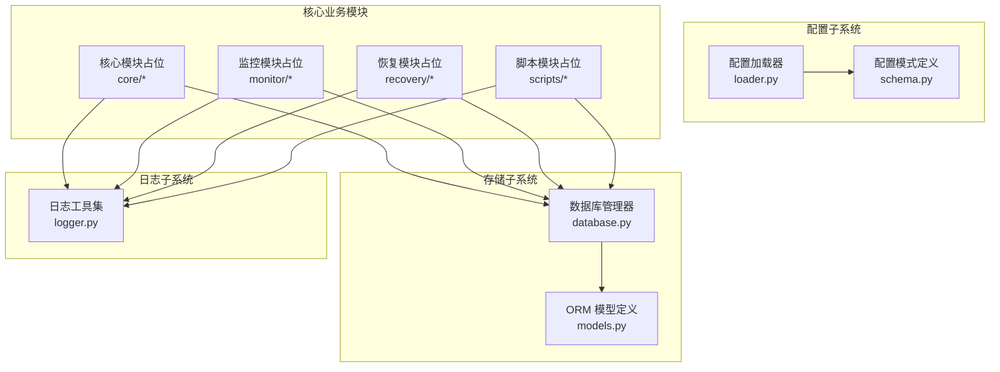
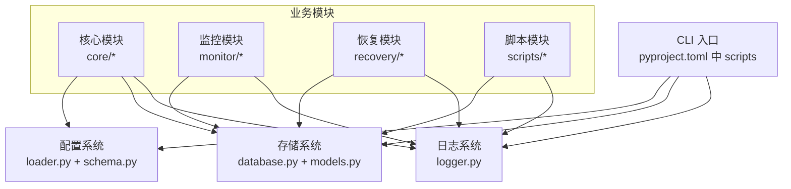
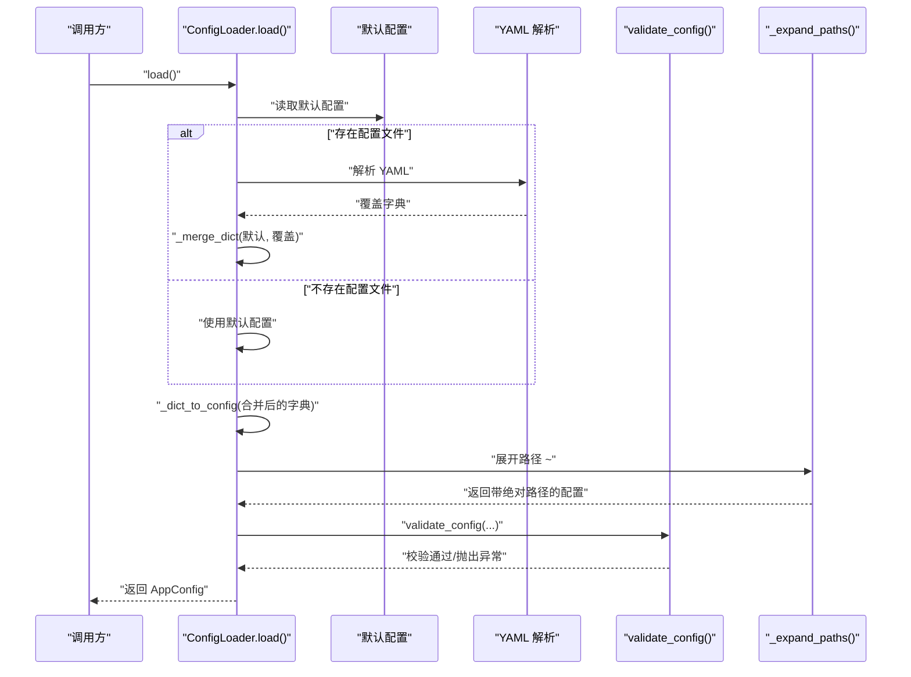
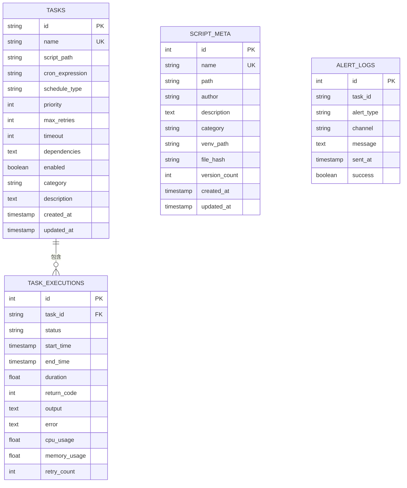
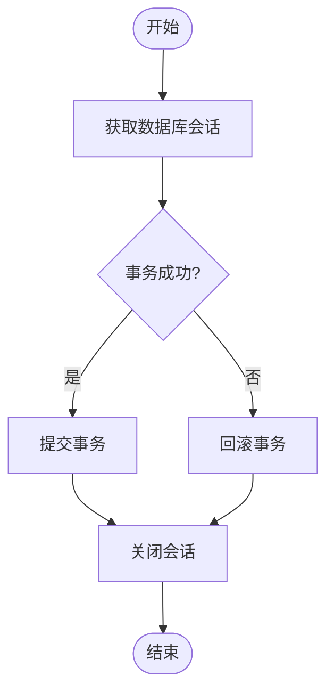
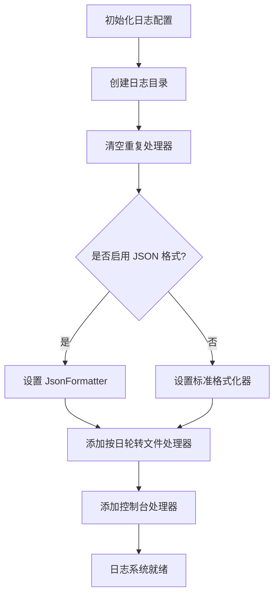
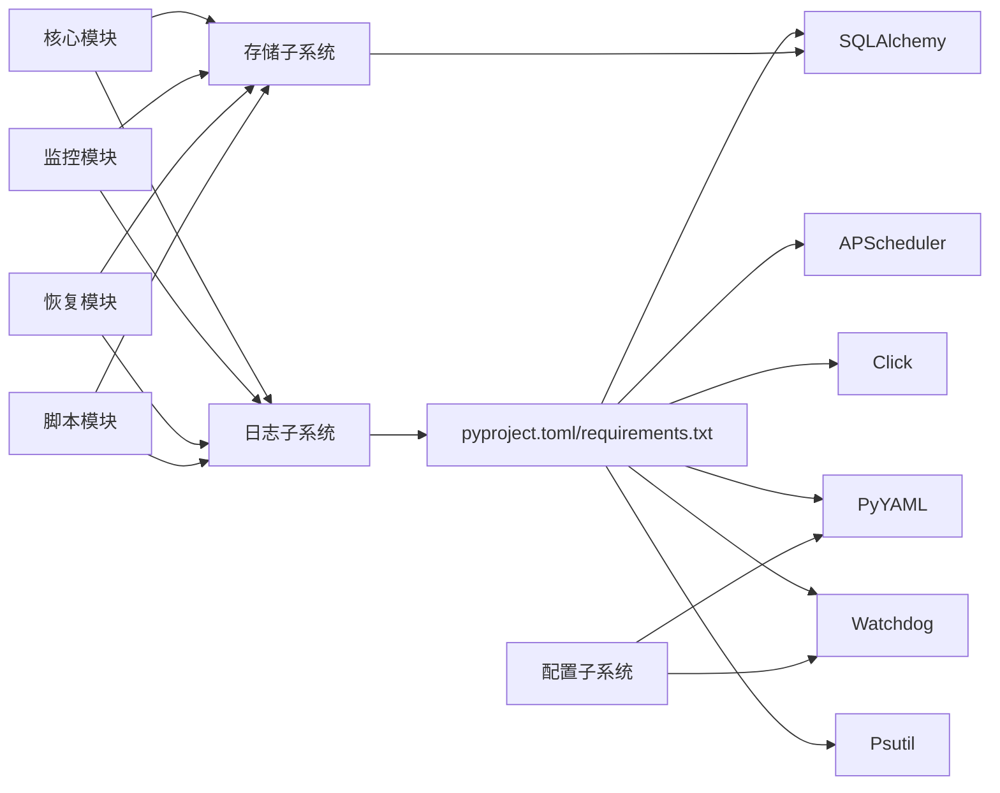

# 项目概述

<cite>
**本文引用的文件**
- [pyproject.toml](file://pyproject.toml)
- [requirements.txt](file://requirements.txt)
- [default_config.yaml](file://config/default_config.yaml)
- [__init__.py](file://src/pycronguard/__init__.py)
- [loader.py](file://src/pycronguard/config/loader.py)
- [schema.py](file://src/pycronguard/config/schema.py)
- [database.py](file://src/pycronguard/storage/database.py)
- [models.py](file://src/pycronguard/storage/models.py)
- [logger.py](file://src/pycronguard/logging/logger.py)
</cite>

## 目录
1. [引言](#引言)
2. [项目结构](#项目结构)
3. [核心组件](#核心组件)
4. [架构总览](#架构总览)
5. [详细组件分析](#详细组件分析)
6. [依赖分析](#依赖分析)
7. [性能考虑](#性能考虑)
8. [故障排查指南](#故障排查指南)
9. [结论](#结论)
10. [附录](#附录)

## 引言
PyCronGuard 是一个面向企业级运维的 Python 定时任务管理与监控工具。它通过统一的任务注册、调度、执行追踪、监控告警与智能恢复能力，帮助团队在复杂环境中稳定运行各类定时作业，并提供完善的日志与脚本管理支持。项目采用模块化设计，围绕配置驱动、数据持久化与可观测性构建，适合中小到中大型企业的日常运维与批处理场景。

## 项目结构
项目采用分层与按功能域划分的组织方式：
- 配置子系统：负责加载、校验与热更新应用配置
- 存储子系统：基于 SQLAlchemy 的 ORM 模型与数据库会话管理
- 日志子系统：提供 JSON 格式化输出与按日轮转的日志策略
- 核心业务模块：预留扩展点，用于后续实现调度器、监控、恢复与脚本管理等能力
- 部署与监控、恢复、脚本管理等目录暂为空或占位，体现模块化演进思路

图表来源
- [loader.py:83-204](file://src/pycronguard/config/loader.py#L83-L204)
- [schema.py:12-151](file://src/pycronguard/config/schema.py#L12-L151)
- [database.py:29-271](file://src/pycronguard/storage/database.py#L29-L271)
- [models.py:15-125](file://src/pycronguard/storage/models.py#L15-L125)
- [logger.py:90-159](file://src/pycronguard/logging/logger.py#L90-L159)

章节来源
- [pyproject.toml:1-34](file://pyproject.toml#L1-L34)
- [requirements.txt:1-7](file://requirements.txt#L1-L7)
- [default_config.yaml:1-57](file://config/default_config.yaml#L1-L57)

## 核心组件
- 配置系统：支持 YAML 加载、默认值合并、嵌套数据类转换与文件变更监听，确保配置可维护与可热更新
- 存储系统：SQLite + SQLAlchemy，提供任务、执行记录、脚本元数据与告警日志的建模与 CRUD 能力
- 日志系统：支持 JSON 输出与按日轮转，便于集中采集与检索
- CLI 入口：通过 Click 提供命令行入口，便于安装后直接运行

章节来源
- [loader.py:83-204](file://src/pycronguard/config/loader.py#L83-L204)
- [schema.py:86-151](file://src/pycronguard/config/schema.py#L86-L151)
- [database.py:29-271](file://src/pycronguard/storage/database.py#L29-L271)
- [models.py:19-125](file://src/pycronguard/storage/models.py#L19-L125)
- [logger.py:90-159](file://src/pycronguard/logging/logger.py#L90-L159)
- [pyproject.toml:26-27](file://pyproject.toml#L26-L27)

## 架构总览
下图展示了 PyCronGuard 的高层架构：配置子系统负责提供运行期参数；存储子系统承载数据模型与会话；日志子系统贯穿各模块；核心业务模块（调度、监控、恢复、脚本）通过统一的数据接口与日志接口进行协作。

图表来源
- [pyproject.toml:26-27](file://pyproject.toml#L26-L27)
- [loader.py:83-204](file://src/pycronguard/config/loader.py#L83-L204)
- [schema.py:86-151](file://src/pycronguard/config/schema.py#L86-L151)
- [database.py:29-271](file://src/pycronguard/storage/database.py#L29-L271)
- [models.py:19-125](file://src/pycronguard/storage/models.py#L19-L125)
- [logger.py:90-159](file://src/pycronguard/logging/logger.py#L90-L159)

## 详细组件分析

### 配置系统（Config）
- 功能要点
  - 从 YAML 文件加载用户配置并与默认配置合并
  - 将字典转换为强类型数据类，支持嵌套字段（如告警邮件子配置）
  - 支持文件变更监听并通过回调触发重新加载
  - 对关键配置项进行范围与一致性校验
- 关键流程（配置加载与校验）

图表来源
- [loader.py:100-116](file://src/pycronguard/config/loader.py#L100-L116)
- [loader.py:174-203](file://src/pycronguard/config/loader.py#L174-L203)
- [loader.py:50-61](file://src/pycronguard/config/loader.py#L50-L61)
- [schema.py:107-151](file://src/pycronguard/config/schema.py#L107-L151)

章节来源
- [loader.py:83-204](file://src/pycronguard/config/loader.py#L83-L204)
- [schema.py:12-151](file://src/pycronguard/config/schema.py#L12-L151)
- [default_config.yaml:5-57](file://config/default_config.yaml#L5-L57)

### 存储系统（Storage）
- 功能要点
  - 基于 SQLAlchemy 的 SQLite 引擎初始化与表自动创建
  - 提供统一的会话上下文管理，保证事务性与资源回收
  - 针对任务、执行记录、脚本元数据与告警日志提供 CRUD 方法
- 数据模型关系

图表来源
- [models.py:19-125](file://src/pycronguard/storage/models.py#L19-L125)

- 数据访问流程（会话管理与 CRUD）

图表来源
- [database.py:52-68](file://src/pycronguard/storage/database.py#L52-L68)

章节来源
- [database.py:29-271](file://src/pycronguard/storage/database.py#L29-L271)
- [models.py:19-125](file://src/pycronguard/storage/models.py#L19-L125)

### 日志系统（Logging）
- 功能要点
  - JSON 格式化输出，便于结构化日志采集与检索
  - 按日轮转与保留策略，支持控制台与文件双通道
  - 提供命名 Logger 获取方法，便于模块化日志隔离
- 日志格式与输出策略

图表来源
- [logger.py:90-147](file://src/pycronguard/logging/logger.py#L90-L147)

章节来源
- [logger.py:18-159](file://src/pycronguard/logging/logger.py#L18-L159)

### 技术栈概览
- APScheduler：提供强大的任务调度内核，支持多种触发器与执行策略
- SQLAlchemy：提供 ORM 能力与数据库抽象，支撑任务与执行记录的持久化
- Click：提供命令行接口，便于安装与运行
- PyYAML：解析配置文件
- Watchdog：监听配置文件变更，实现热重载
- Psutil：用于系统资源监控（在后续模块中使用）

章节来源
- [pyproject.toml:11-18](file://pyproject.toml#L11-L18)
- [requirements.txt:1-7](file://requirements.txt#L1-L7)

## 依赖分析
- 组件耦合
  - 配置系统独立于业务模块，通过强类型配置对象注入
  - 存储系统被所有业务模块共享，遵循统一的会话与事务语义
  - 日志系统作为横切关注点，被各模块复用
- 外部依赖
  - 配置与存储依赖第三方库；日志与 CLI 依赖标准库与第三方库
- 可能的循环依赖
  - 当前模块间为单向依赖，未见循环

图表来源
- [pyproject.toml:11-18](file://pyproject.toml#L11-L18)
- [requirements.txt:1-7](file://requirements.txt#L1-L7)
- [loader.py:16-18](file://src/pycronguard/config/loader.py#L16-L18)
- [database.py:15-24](file://src/pycronguard/storage/database.py#L15-L24)
- [logger.py:13-15](file://src/pycronguard/logging/logger.py#L13-L15)

章节来源
- [pyproject.toml:1-34](file://pyproject.toml#L1-L34)
- [requirements.txt:1-7](file://requirements.txt#L1-L7)

## 性能考虑
- 数据库连接与会话
  - 使用会话工厂与上下文管理器，避免连接泄漏与减少事务开销
  - 建议在高并发场景下合理设置调度器线程池大小与实例上限
- 日志输出
  - JSON 格式便于结构化采集，但需注意磁盘 IO；建议结合日志采集器与轮转策略
- 配置热更新
  - 文件监听仅在开发与运维场景使用，生产环境建议通过重启或统一配置中心管理

## 故障排查指南
- 配置相关
  - 若配置文件无效或字段越界，加载阶段会抛出异常；请检查字段范围与必填项
  - 邮件告警启用时需提供 SMTP 主机与收件人列表
- 存储相关
  - 数据库路径需可写且父目录存在；若首次启动未生成表，请确认权限与路径展开逻辑
  - 执行查询时注意过滤条件与排序，避免全表扫描
- 日志相关
  - 若日志未输出或格式异常，检查日志级别、格式化器与处理器是否正确配置
  - 检查日志目录是否存在以及磁盘空间是否充足

章节来源
- [schema.py:107-151](file://src/pycronguard/config/schema.py#L107-L151)
- [loader.py:50-61](file://src/pycronguard/config/loader.py#L50-L61)
- [database.py:37-46](file://src/pycronguard/storage/database.py#L37-L46)
- [logger.py:111-147](file://src/pycronguard/logging/logger.py#L111-L147)

## 结论
PyCronGuard 以清晰的模块边界与强类型的配置体系为基础，结合 SQLite + SQLAlchemy 的轻量存储与结构化日志能力，为企业提供了可扩展、可观测、易维护的定时任务管理平台。随着调度、监控、恢复与脚本管理模块的逐步完善，项目将具备与主流运维工具竞争的能力，并满足企业级对稳定性与可运维性的要求。

## 附录
- 默认配置说明（节选）
  - 调度器：线程池大小、最大实例数、时区
  - 存储：数据库文件路径
  - 日志：日志目录、级别、保留天数、JSON 输出开关
  - 告警：失败立即告警、连续失败阈值、冷却时间、邮件告警开关与参数
  - 恢复：最大重试、初始延迟、指数退避、健康检查间隔、CPU/内存/磁盘阈值、任务超时
  - 脚本管理：脚本目录、版本目录、最大版本数
  - PID 文件：进程标识文件路径

章节来源
- [default_config.yaml:5-57](file://config/default_config.yaml#L5-L57)