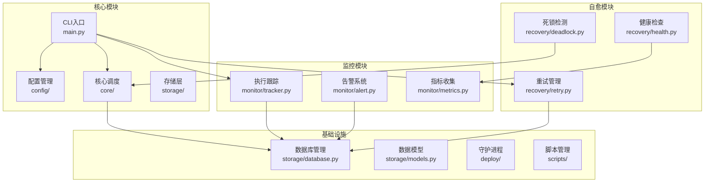
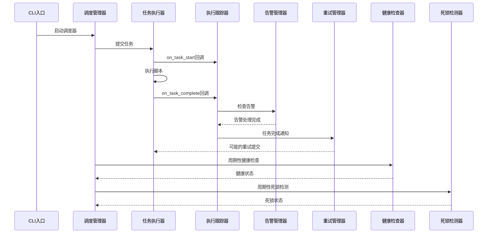
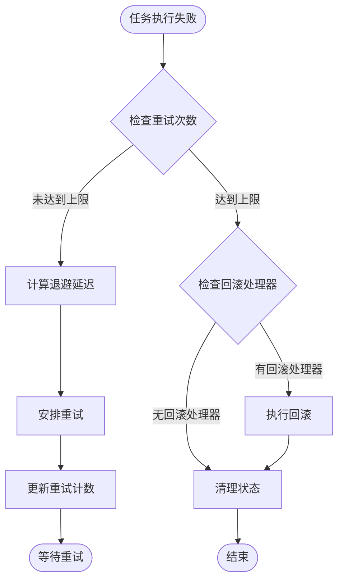
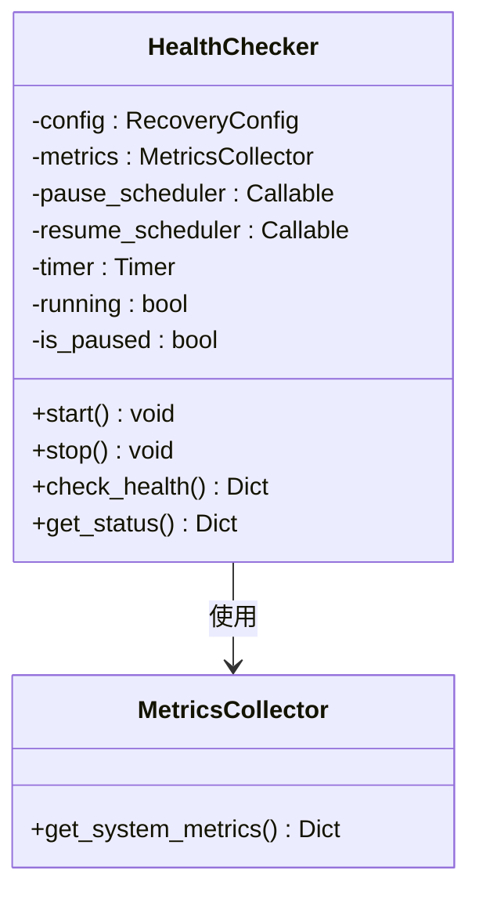
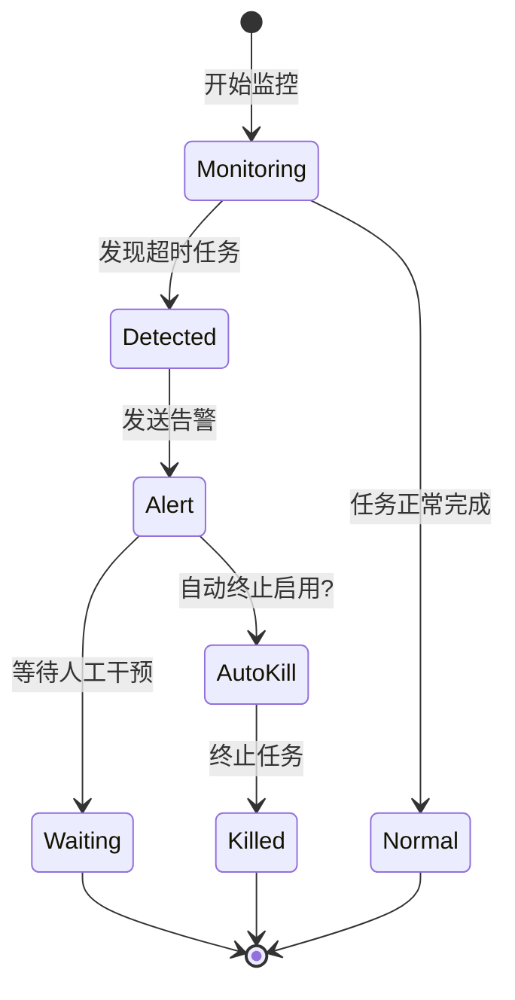
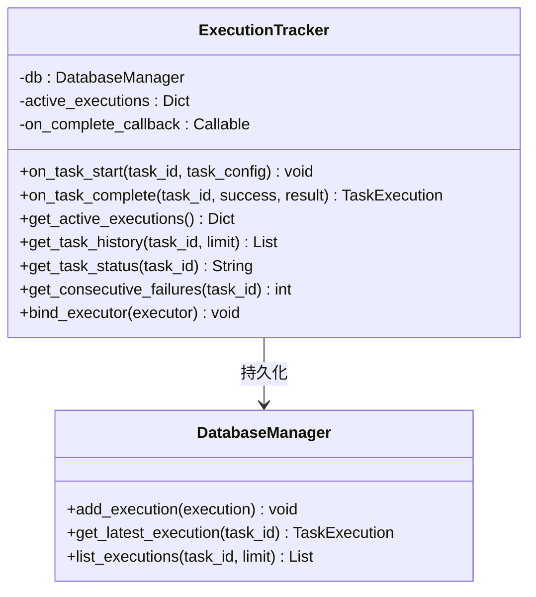
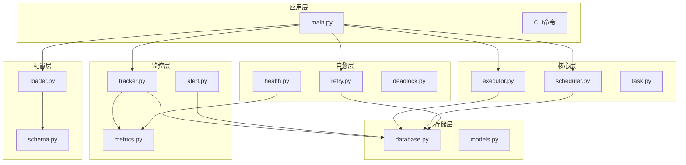

# 异常自愈系统

<cite>
**本文档引用的文件**
- [README.md](file://README.md)
- [main.py](file://src/pycronguard/main.py)
- [executor.py](file://src/pycronguard/core/executor.py)
- [scheduler.py](file://src/pycronguard/core/scheduler.py)
- [task.py](file://src/pycronguard/core/task.py)
- [retry.py](file://src/pycronguard/recovery/retry.py)
- [health.py](file://src/pycronguard/recovery/health.py)
- [deadlock.py](file://src/pycronguard/recovery/deadlock.py)
- [tracker.py](file://src/pycronguard/monitor/tracker.py)
- [alert.py](file://src/pycronguard/monitor/alert.py)
- [database.py](file://src/pycronguard/storage/database.py)
- [models.py](file://src/pycronguard/storage/models.py)
- [loader.py](file://src/pycronguard/config/loader.py)
- [schema.py](file://src/pycronguard/config/schema.py)
- [default_config.yaml](file://config/default_config.yaml)
- [pyproject.toml](file://pyproject.toml)
</cite>

## 目录
1. [简介](#简介)
2. [项目结构](#项目结构)
3. [核心组件](#核心组件)
4. [架构概览](#架构概览)
5. [详细组件分析](#详细组件分析)
6. [依赖关系分析](#依赖关系分析)
7. [性能考虑](#性能考虑)
8. [故障排除指南](#故障排除指南)
9. [结论](#结论)

## 简介

PyCronGuard是一个功能完备的Python定时任务管理与监控系统，专为实现异常自愈而设计。该系统提供了完整的任务调度、脚本管理、运行监控、告警通知和异常自愈等能力，确保系统在面对各种异常情况时能够自动恢复和继续运行。

系统的核心优势在于其多层次的异常自愈机制，包括自动重试（指数退避）、健康检查、死锁检测与自动终止等功能，能够在任务执行失败、系统资源过载或任务卡死等情况下自动采取相应的恢复措施。

## 项目结构

PyCronGuard采用模块化的架构设计，主要包含以下核心模块：

**图表来源**
- [main.py:1-800](file://src/pycronguard/main.py#L1-L800)
- [executor.py:1-465](file://src/pycronguard/core/executor.py#L1-L465)
- [scheduler.py:1-375](file://src/pycronguard/core/scheduler.py#L1-L375)

**章节来源**
- [README.md:1-287](file://README.md#L1-L287)
- [pyproject.toml:1-34](file://pyproject.toml#L1-L34)

## 核心组件

### 任务执行器 (TaskExecutor)

TaskExecutor是系统的核心执行组件，负责管理线程池、优先级队列和子进程执行。它实现了以下关键功能：

- **并发控制**：通过线程池和信号量控制最大并发执行数量
- **优先级调度**：使用堆结构维护任务优先级队列
- **依赖检查**：确保依赖任务完成后才执行当前任务
- **超时管理**：支持任务执行超时检测和自动终止
- **回调机制**：提供任务开始和完成的回调钩子

### 调度管理器 (SchedulerManager)

SchedulerManager基于APScheduler提供高级调度功能：

- **任务生命周期管理**：支持任务的添加、删除、更新、暂停、恢复
- **触发器创建**：支持cron、daily、weekly、monthly、interval等多种调度类型
- **热重载**：支持配置文件变更后的任务重新加载
- **并发实例控制**：限制同一任务的最大并发实例数

### 异常自愈组件

系统提供了三个核心的自愈组件：

1. **RetryManager**：自动重试管理，支持指数退避算法
2. **HealthChecker**：系统健康检查，自动暂停/恢复调度器
3. **DeadlockDetector**：死锁检测，自动终止长时间运行的任务

**章节来源**
- [executor.py:50-465](file://src/pycronguard/core/executor.py#L50-L465)
- [scheduler.py:30-375](file://src/pycronguard/core/scheduler.py#L30-L375)
- [retry.py:25-326](file://src/pycronguard/recovery/retry.py#L25-L326)
- [health.py:20-228](file://src/pycronguard/recovery/health.py#L20-L228)
- [deadlock.py:22-267](file://src/pycronguard/recovery/deadlock.py#L22-L267)

## 架构概览

PyCronGuard采用事件驱动的架构模式，通过回调链实现组件间的松耦合集成：

**图表来源**
- [main.py:253-340](file://src/pycronguard/main.py#L253-L340)
- [tracker.py:38-240](file://src/pycronguard/monitor/tracker.py#L38-L240)
- [retry.py:253-326](file://src/pycronguard/recovery/retry.py#L253-L326)

系统的核心执行流程如下：

1. **初始化阶段**：加载配置、建立数据库连接、创建各组件实例
2. **绑定阶段**：将监控、告警、重试等组件绑定到执行器
3. **运行阶段**：启动调度器、健康检查器、死锁检测器
4. **监控阶段**：持续监控系统状态，自动处理异常情况

**章节来源**
- [main.py:53-145](file://src/pycronguard/main.py#L53-L145)
- [main.py:274-340](file://src/pycronguard/main.py#L274-L340)

## 详细组件分析

### 重试管理器 (RetryManager)

RetryManager实现了智能的自动重试机制，支持指数退避算法：

**图表来源**
- [retry.py:88-150](file://src/pycronguard/recovery/retry.py#L88-L150)

重试管理的关键特性：

- **指数退避**：每次重试延迟按公式 `delay * backoff_factor^attempt` 增长
- **任务级别优先**：任务级别的重试配置优先于全局配置
- **回滚支持**：重试耗尽后可执行预定义的回滚操作
- **线程安全**：使用锁机制确保并发安全性

### 健康检查器 (HealthChecker)

HealthChecker提供系统资源监控和自动调节功能：

**图表来源**
- [health.py:20-228](file://src/pycronguard/recovery/health.py#L20-L228)

健康检查的工作流程：

1. **周期性检查**：按照配置的时间间隔执行系统资源检查
2. **阈值比较**：将CPU、内存、磁盘使用率与阈值进行比较
3. **状态判断**：根据检查结果判断系统健康状态
4. **自动调节**：健康状态变化时自动暂停/恢复调度器

### 死锁检测器 (DeadlockDetector)

DeadlockDetector专门负责检测长时间运行的任务并提供自动终止功能：

**图表来源**
- [deadlock.py:113-196](file://src/pycronguard/recovery/deadlock.py#L113-L196)

死锁检测的核心功能：

- **超时检测**：比较任务运行时间和配置的超时阈值
- **首次检测策略**：对新发现的超时任务发送告警
- **自动终止**：可选的自动终止功能防止系统资源被长期占用
- **状态跟踪**：维护检测到的任务列表和首次检测时间

### 执行跟踪器 (ExecutionTracker)

ExecutionTracker负责记录任务执行状态和历史：

**图表来源**
- [tracker.py:21-240](file://src/pycronguard/monitor/tracker.py#L21-L240)

执行跟踪的主要职责：

- **状态记录**：实时记录任务的开始和完成状态
- **历史查询**：提供任务执行历史的查询接口
- **并发控制**：跟踪当前正在运行的任务
- **回调集成**：与其他组件（如告警管理器）集成

**章节来源**
- [retry.py:1-326](file://src/pycronguard/recovery/retry.py#L1-L326)
- [health.py:1-228](file://src/pycronguard/recovery/health.py#L1-L228)
- [deadlock.py:1-267](file://src/pycronguard/recovery/deadlock.py#L1-L267)
- [tracker.py:1-240](file://src/pycronguard/monitor/tracker.py#L1-L240)

## 依赖关系分析

PyCronGuard的依赖关系体现了清晰的分层架构：

**图表来源**
- [main.py:53-145](file://src/pycronguard/main.py#L53-L145)
- [loader.py:83-204](file://src/pycronguard/config/loader.py#L83-L204)

依赖关系特点：

- **低耦合高内聚**：各模块职责明确，依赖关系清晰
- **向上依赖**：底层模块不依赖上层模块
- **回调机制**：通过回调实现松耦合集成
- **配置驱动**：通过配置文件控制行为和参数

**章节来源**
- [database.py:29-271](file://src/pycronguard/storage/database.py#L29-L271)
- [models.py:19-131](file://src/pycronguard/storage/models.py#L19-L131)

## 性能考虑

### 并发性能优化

系统在多个层面实现了性能优化：

- **线程池管理**：通过`max_workers`参数控制最大并发数
- **信号量控制**：防止超过`max_instances`的并发实例
- **优先级队列**：使用堆结构实现O(log n)的插入和删除操作
- **异步监控**：健康检查和死锁检测使用独立线程

### 内存管理

- **任务状态缓存**：只缓存必要的任务配置信息
- **数据库连接池**：使用SQLAlchemy的连接池机制
- **日志轮转**：自动清理过期日志文件
- **资源清理**：及时释放已完成任务的资源

### 存储优化

- **索引设计**：为常用查询字段建立索引
- **批量操作**：减少数据库交互次数
- **数据压缩**：对大文本内容进行截断存储
- **事务管理**：使用事务确保数据一致性

## 故障排除指南

### 常见问题诊断

1. **任务无法启动**
   - 检查脚本路径是否正确
   - 验证Python解释器可用性
   - 确认依赖任务已完成

2. **重试机制不生效**
   - 检查`max_retries`配置
   - 验证指数退避参数设置
   - 确认回滚处理器注册

3. **健康检查误报**
   - 调整CPU、内存、磁盘阈值
   - 检查系统资源监控准确性
   - 验证时间同步状态

4. **死锁检测误判**
   - 调整任务超时阈值
   - 检查任务的实际执行需求
   - 验证自动终止功能配置

### 调试技巧

- **启用详细日志**：使用`-v`参数增加日志详细程度
- **检查数据库状态**：验证任务执行记录的完整性
- **监控系统资源**：使用系统工具检查实际资源使用情况
- **测试重试逻辑**：通过模拟失败测试重试机制

**章节来源**
- [main.py:341-423](file://src/pycronguard/main.py#L341-L423)
- [health.py:110-210](file://src/pycronguard/recovery/health.py#L110-L210)
- [deadlock.py:113-196](file://src/pycronguard/recovery/deadlock.py#L113-L196)

## 结论

PyCronGuard的异常自愈系统通过多层次的设计实现了高度可靠的自动化运维能力。系统的核心优势包括：

1. **全面的自愈机制**：从简单的重试到复杂的健康管理和死锁检测
2. **灵活的配置系统**：支持运行时配置热重载和细粒度参数控制
3. **强大的监控集成**：完整的执行跟踪、告警通知和性能监控
4. **优秀的扩展性**：模块化设计便于功能扩展和定制

该系统特别适合需要高可用性和自动恢复能力的企业级应用场景，能够显著减少运维工作量并提高系统稳定性。通过合理的配置和监控，可以实现几乎零人工干预的自动化运维。