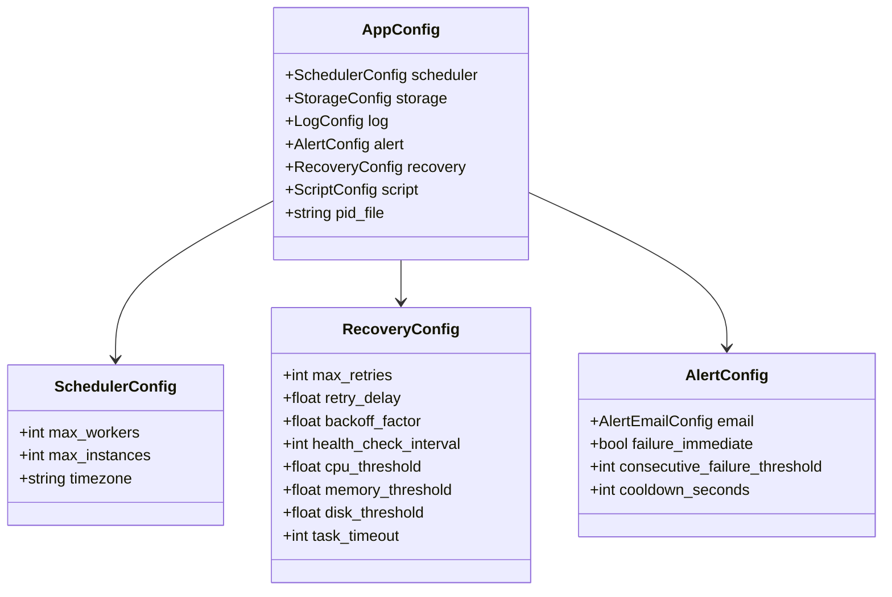
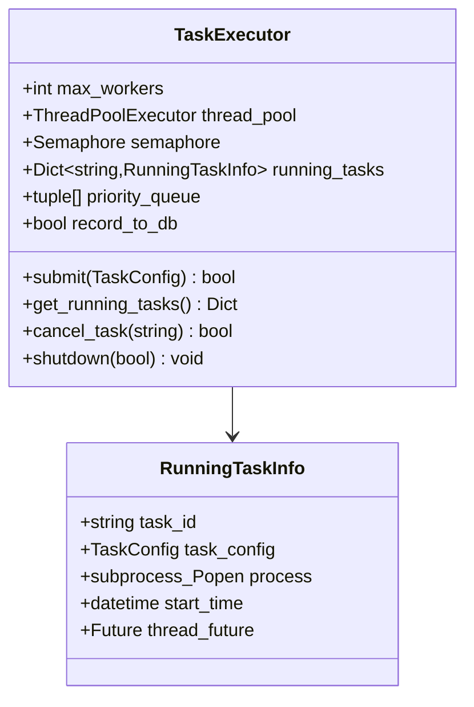
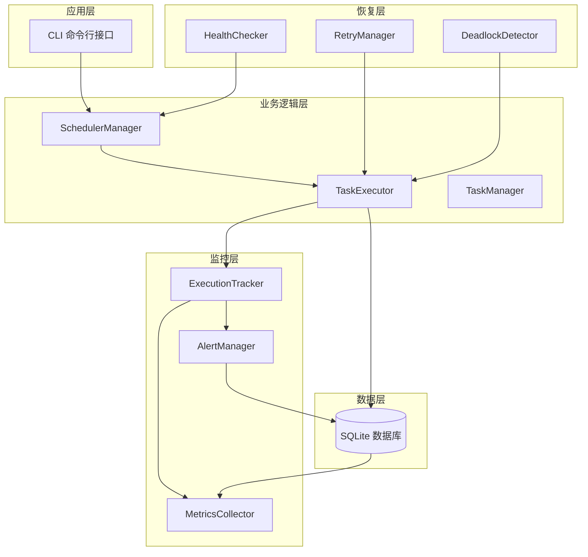
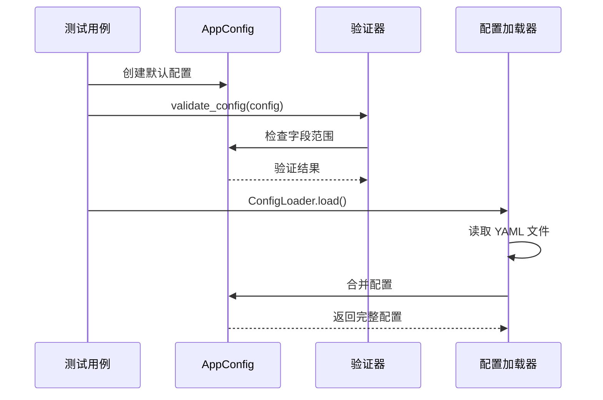
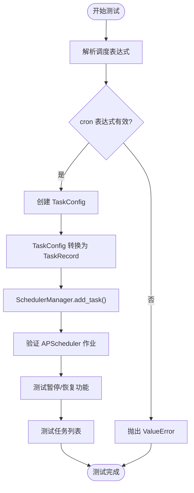
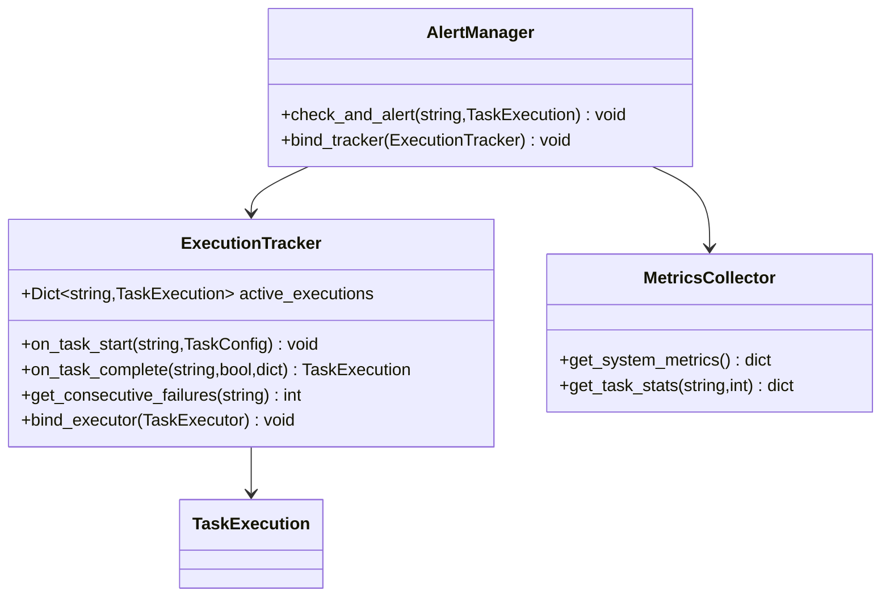
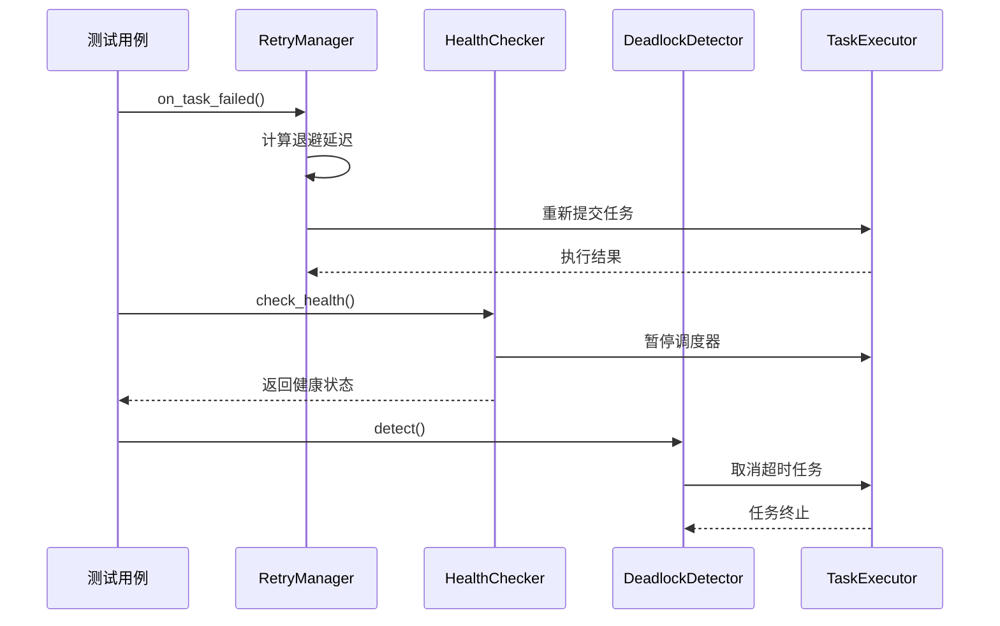

# 测试框架

<cite>
**本文档引用的文件**
- [README.md](file://README.md)
- [pyproject.toml](file://pyproject.toml)
- [conftest.py](file://tests/conftest.py)
- [test_config.py](file://tests/test_config.py)
- [test_executor.py](file://tests/test_executor.py)
- [test_scheduler.py](file://tests/test_scheduler.py)
- [test_monitor.py](file://tests/test_monitor.py)
- [test_recovery.py](file://tests/test_recovery.py)
- [schema.py](file://src/pycronguard/config/schema.py)
- [executor.py](file://src/pycronguard/core/executor.py)
- [scheduler.py](file://src/pycronguard/core/scheduler.py)
- [database.py](file://src/pycronguard/storage/database.py)
- [tracker.py](file://src/pycronguard/monitor/tracker.py)
</cite>

## 目录
1. [简介](#简介)
2. [项目结构](#项目结构)
3. [核心组件](#核心组件)
4. [架构概览](#架构概览)
5. [详细组件分析](#详细组件分析)
6. [依赖关系分析](#依赖关系分析)
7. [性能考虑](#性能考虑)
8. [故障排除指南](#故障排除指南)
9. [结论](#结论)

## 简介

PyCronGuard 是一个功能完备的 Python 定时任务管理与监控系统，提供任务调度、脚本管理、运行监控、告警通知和异常自愈等能力。该项目采用完整的测试框架，包括单元测试、集成测试和端到端测试，确保系统的稳定性和可靠性。

## 项目结构

项目采用模块化的架构设计，主要包含以下核心模块：

```mermaid
graph TB
subgraph "核心模块"
A[config/] 配置管理
B[core/] 核心调度
C[storage/] 数据持久化
D[monitor/] 运行监控
E[recovery/] 异常自愈
end
subgraph "辅助模块"
F[scripts/] 脚本管理
G[deploy/] 部署工具
H[logging/] 日志系统
end
subgraph "测试模块"
I[tests/] 测试套件
J[conftest.py] 测试夹具
end
A --> I
B --> I
C --> I
D --> I
E --> I
F --> I
G --> I
H --> I
```

**图表来源**
- [README.md:240-262](file://README.md#L240-L262)

**章节来源**
- [README.md:1-287](file://README.md#L1-L287)

## 核心组件

### 配置系统测试

配置系统采用数据类定义，提供完整的配置验证和加载机制：



**图表来源**
- [schema.py:86-151](file://src/pycronguard/config/schema.py#L86-L151)

### 执行器测试

执行器负责任务的并发执行和生命周期管理：



**图表来源**
- [executor.py:50-465](file://src/pycronguard/core/executor.py#L50-L465)

**章节来源**
- [test_executor.py:1-251](file://tests/test_executor.py#L1-L251)

## 架构概览

系统采用分层架构，各组件通过清晰的接口进行交互：



**图表来源**
- [main.py:53-145](file://src/pycronguard/main.py#L53-L145)

## 详细组件分析

### 配置模块测试

配置模块测试涵盖了默认配置、配置验证和配置加载器的功能：



**图表来源**
- [test_config.py:21-140](file://tests/test_config.py#L21-L140)

**章节来源**
- [test_config.py:1-140](file://tests/test_config.py#L1-L140)

### 调度器测试

调度器测试验证了任务调度的核心功能：



**图表来源**
- [test_scheduler.py:15-186](file://tests/test_scheduler.py#L15-L186)

**章节来源**
- [test_scheduler.py:1-186](file://tests/test_scheduler.py#L1-L186)

### 监控模块测试

监控模块测试包括执行跟踪、指标收集和告警管理：



**图表来源**
- [test_monitor.py:22-306](file://tests/test_monitor.py#L22-L306)

**章节来源**
- [test_monitor.py:1-306](file://tests/test_monitor.py#L1-L306)

### 恢复模块测试

恢复模块测试涵盖自动重试、健康检查和死锁检测：



**图表来源**
- [test_recovery.py:20-346](file://tests/test_recovery.py#L20-L346)

**章节来源**
- [test_recovery.py:1-346](file://tests/test_recovery.py#L1-L346)

## 依赖关系分析

测试框架采用 pytest 作为测试运行器，具有良好的依赖管理和测试组织：

```mermaid
graph TB
subgraph "测试依赖"
A[pytest] 主测试框架
B[pytest-cov] 代码覆盖率
C[tempfile] 临时文件管理
D[unittest.mock] 模拟对象
end
subgraph "项目依赖"
E[apscheduler] 调度器
F[sqlalchemy] ORM 框架
G[click] 命令行接口
H[psutil] 系统监控
end
subgraph "测试夹具"
I[tmp_dir] 临时目录
J[tmp_db] 临时数据库
K[sample_task_config] 示例任务
L[sample_script] 测试脚本
end
A --> E
A --> F
A --> G
A --> H
I --> J
J --> K
K --> L
```

**图表来源**
- [pyproject.toml:20-24](file://pyproject.toml#L20-L24)
- [conftest.py:6-71](file://tests/conftest.py#L6-L71)

**章节来源**
- [pyproject.toml:1-34](file://pyproject.toml#L1-L34)
- [conftest.py:1-71](file://tests/conftest.py#L1-L71)

## 性能考虑

测试框架在设计时充分考虑了性能因素：

1. **并发测试优化**：使用线程安全的数据结构和同步机制
2. **数据库测试隔离**：每个测试使用独立的临时数据库连接
3. **模拟对象使用**：减少对外部依赖的测试开销
4. **资源清理**：确保测试完成后正确释放系统资源

## 故障排除指南

### 常见测试问题

1. **数据库连接问题**：确保测试前正确初始化临时数据库
2. **文件权限问题**：检查测试脚本的执行权限
3. **网络依赖问题**：某些测试可能需要网络访问权限
4. **系统资源限制**：注意并发测试对系统资源的影响

### 调试技巧

1. **使用详细输出**：运行 `pytest -v` 获取更详细的测试信息
2. **覆盖率分析**：使用 `pytest --cov` 分析测试覆盖率
3. **单测调试**：使用 `pytest --pdb` 在失败时进入调试模式
4. **性能分析**：使用 `pytest --benchmark` 分析测试性能

**章节来源**
- [README.md:87-148](file://README.md#L87-L148)

## 结论

PyCronGuard 的测试框架设计完善，涵盖了配置、执行器、调度器、监控和恢复等核心模块。通过全面的单元测试和集成测试，确保了系统的稳定性和可靠性。测试框架采用现代化的测试实践，包括依赖注入、模拟对象和测试夹具，提供了良好的可维护性和扩展性。