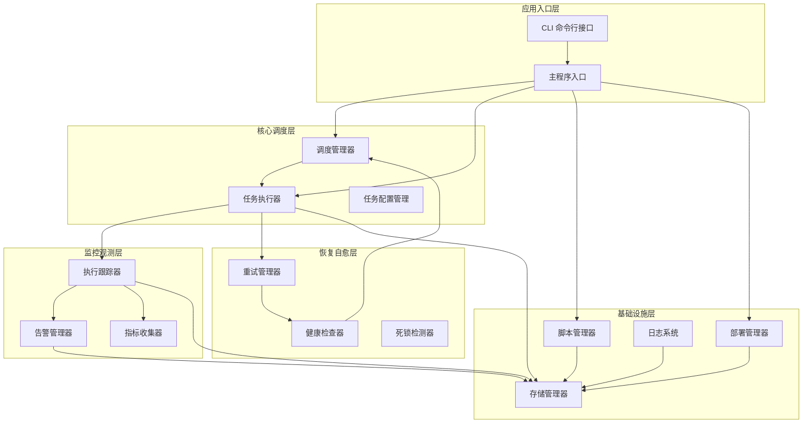

# 项目概述

<cite>
**本文引用的文件**
- [pyproject.toml](file://pyproject.toml)
- [README.md](file://README.md)
- [default_config.yaml](file://config/default_config.yaml)
- [main.py](file://src/pycronguard/main.py)
- [scheduler.py](file://src/pycronguard/core/scheduler.py)
- [executor.py](file://src/pycronguard/core/executor.py)
- [task.py](file://src/pycronguard/core/task.py)
- [tracker.py](file://src/pycronguard/monitor/tracker.py)
- [alert.py](file://src/pycronguard/monitor/alert.py)
- [retry.py](file://src/pycronguard/recovery/retry.py)
- [health.py](file://src/pycronguard/recovery/health.py)
- [manager.py](file://src/pycronguard/scripts/manager.py)
- [daemon.py](file://src/pycronguard/deploy/daemon.py)
- [database.py](file://src/pycronguard/storage/database.py)
- [__init__.py](file://src/pycronguard/__init__.py)
</cite>

## 目录
1. [引言](#引言)
2. [项目架构总览](#项目架构总览)
3. [核心功能模块](#核心功能模块)
4. [技术架构详解](#技术架构详解)
5. [模块化设计分析](#模块化设计分析)
6. [部署与运维特性](#部署与运维特性)
7. [配置管理机制](#配置管理机制)
8. [监控告警体系](#监控告警体系)
9. [智能恢复机制](#智能恢复机制)
10. [脚本管理功能](#脚本管理功能)
11. [日志系统设计](#日志系统设计)
12. [性能与可靠性](#性能与可靠性)
13. [企业级应用场景](#企业级应用场景)
14. [总结](#总结)

## 引言

PyCronGuard 是一个功能完备的 Python 定时任务管理与监控系统，专为企业级运维场景设计。该项目通过集成调度、监控、恢复、部署等多个核心功能模块，提供了一套完整的定时任务生命周期管理体系。系统基于 APScheduler 任务调度内核，结合 SQLAlchemy 数据持久化、Click 命令行接口、psutil 系统监控等核心技术，为企业提供了稳定可靠的定时任务管理解决方案。

项目采用模块化架构设计，围绕配置驱动、数据持久化与可观测性构建，支持任务优先级队列、依赖管理、自动重试、健康检查、告警通知等高级功能。无论是中小企业的日常运维需求，还是大型企业的复杂批处理场景，PyCronGuard 都能提供强有力的支持。

## 项目架构总览

PyCronGuard 采用分层模块化架构，将系统功能划分为多个独立但相互协作的模块：

**图表来源**
- [main.py:53-145](file://src/pycronguard/main.py#L53-L145)
- [scheduler.py:30-375](file://src/pycronguard/core/scheduler.py#L30-L375)
- [executor.py:50-465](file://src/pycronguard/core/executor.py#L50-L465)

## 核心功能模块

### 调度管理模块
调度管理模块是系统的核心调度引擎，基于 APScheduler 提供强大的任务调度能力。该模块支持多种调度方式，包括 cron 表达式、每日/每周/每月定期执行、间隔执行等。通过优先级队列和依赖管理，确保任务按照预期顺序和条件执行。

### 任务执行模块  
任务执行模块负责实际的任务执行，提供并发控制、超时管理、进程监控等功能。支持虚拟环境隔离、依赖检查、执行结果记录等特性，确保任务执行的可靠性和可追溯性。

### 监控观测模块
监控观测模块提供全方位的任务执行监控，包括执行状态跟踪、性能指标收集、告警通知等功能。通过回调机制与执行器深度集成，实现实时监控和快速响应。

### 恢复自愈模块
恢复自愈模块包含自动重试、健康检查、死锁检测等机制，提供系统的自我修复能力。当任务执行失败或系统出现异常时，能够自动采取相应的恢复措施。

### 脚本管理模块
脚本管理模块提供脚本的注册、版本控制、语法验证、自动备份等功能。支持脚本的生命周期管理，确保脚本变更的可控性和可追溯性。

### 部署管理模块
部署管理模块提供守护进程管理、系统服务生成、进程信号处理等功能，支持多种操作系统的部署需求。

## 技术架构详解

### 核心依赖技术栈
- **APScheduler**: 任务调度内核，提供多种触发器和执行策略
- **SQLAlchemy**: ORM 框架，支持 SQLite 数据库的完整功能
- **Click**: 命令行接口框架，提供丰富的 CLI 功能
- **psutil**: 系统资源监控，支持 CPU、内存、磁盘使用率检测
- **PyYAML**: 配置文件解析，支持 YAML 格式的配置管理
- **Watchdog**: 文件监控，支持配置文件的热重载功能

### 数据持久化架构
系统采用 SQLite 作为主要存储介质，通过 SQLAlchemy ORM 提供数据访问层。核心数据模型包括任务记录、执行记录、脚本元数据、告警日志等，实现了完整的数据生命周期管理。

### 异步处理机制
系统采用多线程和回调机制实现异步处理。任务执行器使用线程池管理并发执行，通过回调函数实现监控、告警、恢复等模块的解耦集成。

## 模块化设计分析

### 分层架构设计
系统采用清晰的分层架构，每一层都有明确的职责边界：

**表现层**: CLI 命令行接口，提供用户交互入口
**业务层**: 核心调度、执行、监控、恢复等业务逻辑
**数据层**: 数据持久化和缓存管理
**基础设施层**: 系统服务、日志、配置等基础功能

### 依赖注入与解耦
通过依赖注入模式，各个模块之间保持松耦合。核心模块通过接口定义进行交互，避免了紧耦合导致的维护困难。

### 扩展性设计
系统预留了丰富的扩展点，支持插件化开发。新的功能模块可以通过标准接口无缝集成到现有架构中。

## 部署与运维特性

### 多平台支持
系统支持 Linux、macOS、Windows 等多个操作系统，提供相应的系统服务配置和守护进程管理。

### 守护进程管理
内置守护进程管理功能，支持前台/后台运行模式，提供 PID 文件管理和优雅关闭机制。

### 配置热重载
支持配置文件的动态监控和热重载，无需重启服务即可应用配置变更。

### 健康检查
提供系统健康检查功能，自动监控资源使用情况，在系统过载时自动暂停调度以保护系统稳定。

## 配置管理机制

### 配置文件结构
系统使用 YAML 格式的配置文件，支持调度器、存储、日志、告警、恢复、脚本管理等各个方面的配置。

### 配置验证与默认值
提供配置验证机制，确保配置的有效性和完整性。支持默认值合并，简化配置文件的编写。

### 环境变量支持
支持环境变量配置，便于在不同环境中灵活调整系统行为。

## 监控告警体系

### 多维度监控
系统提供多维度的任务执行监控，包括执行状态、性能指标、资源使用等各个方面。

### 告警策略
支持多种告警策略，包括即时失败告警、连续失败告警、性能阈值告警等，满足不同的监控需求。

### 通知渠道
提供多种通知渠道，当前支持邮件通知，未来可以扩展短信、微信等多种通知方式。

### 告警去重
通过冷却时间机制避免告警风暴，确保告警信息的有效性和可读性。

## 智能恢复机制

### 自动重试
提供智能的自动重试机制，支持指数退避算法，避免对系统造成额外压力。

### 健康检查
定期进行系统健康检查，当检测到异常时自动暂停调度，待系统恢复正常后再继续执行。

### 死锁检测
监控长时间运行的任务，及时发现和处理死锁情况，防止系统资源被占用。

### 回滚机制
支持任务执行失败时的回滚操作，确保系统状态的一致性。

## 脚本管理功能

### 脚本注册与管理
提供脚本的注册、更新、删除等功能，支持脚本的生命周期管理。

### 版本控制
内置版本控制系统，自动备份脚本变更，支持版本回滚和历史查看。

### 语法验证
提供脚本语法验证功能，确保脚本的正确性和可执行性。

### 虚拟环境支持
支持脚本在独立的虚拟环境中执行，避免依赖冲突问题。

## 日志系统设计

### 结构化日志
采用 JSON 格式的结构化日志输出，便于日志收集和分析系统的集成。

### 多级日志
支持多种日志级别，包括调试、信息、警告、错误等，满足不同场景的记录需求。

### 日志轮转
提供日志轮转和归档功能，自动管理日志文件大小和数量。

### 实时监控
日志系统与监控模块集成，支持实时日志监控和告警。

## 性能与可靠性

### 并发控制
通过线程池和信号量机制控制任务并发执行，避免系统过载。

### 资源监控
实时监控系统资源使用情况，包括 CPU、内存、磁盘等关键指标。

### 超时管理
为每个任务设置合理的超时时间，防止长时间阻塞影响系统稳定性。

### 错误处理
完善的错误处理机制，确保系统在异常情况下能够正常运行。

## 企业级应用场景

### 批处理作业
适用于各种批处理作业的调度和管理，包括数据处理、报表生成、备份等任务。

### 微服务监控
作为微服务架构中的定时任务调度中心，协调各个服务的定时任务执行。

### 数据管道
构建数据处理管道，自动化数据采集、清洗、转换和加载过程。

### 系统维护
自动化系统维护任务，包括日志清理、缓存刷新、数据库优化等。

### 业务流程
支持复杂的业务流程自动化，包括订单处理、库存管理、财务结算等。

## 总结

PyCronGuard 作为一个完整的 Python 定时任务管理系统，通过精心设计的模块化架构和丰富的功能特性，为企业提供了强大而可靠的定时任务管理解决方案。系统不仅具备传统任务调度的基本功能，更重要的是集成了监控、告警、恢复、部署等企业级所需的高级特性。

通过采用现代化的技术栈和最佳实践，PyCronGuard 在保证功能完整性的同时，也注重了系统的可扩展性、可维护性和可靠性。无论是小型企业还是大型组织，都能根据自身需求选择合适的模块组合，构建符合业务特点的定时任务管理平台。

随着项目的持续发展，PyCronGuard 将继续完善功能特性，优化性能表现，为企业数字化转型提供更加有力的技术支撑。